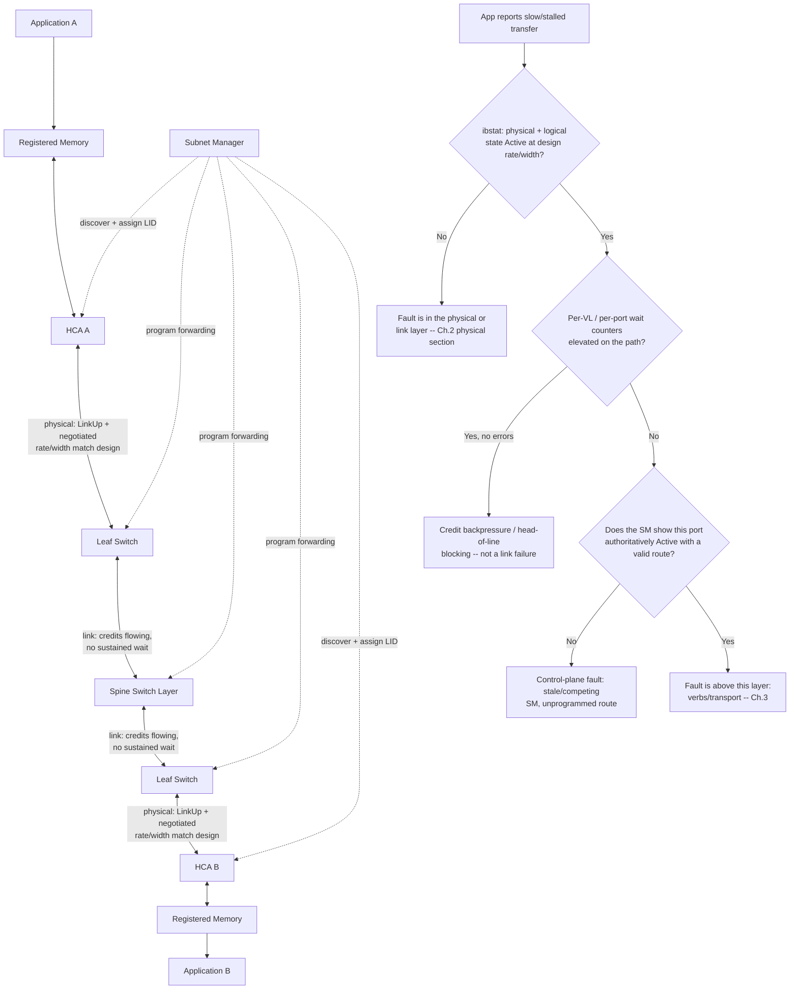
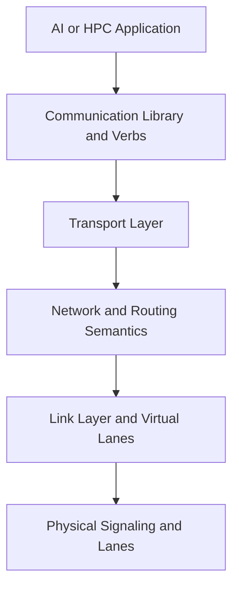
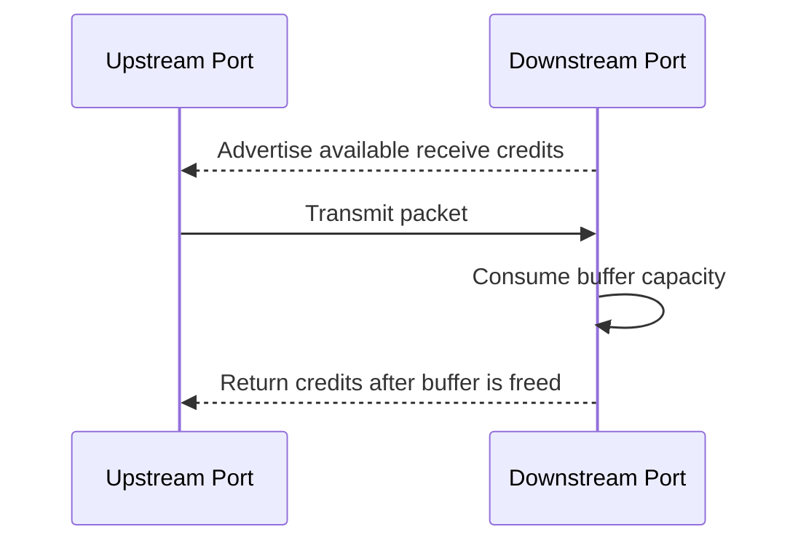
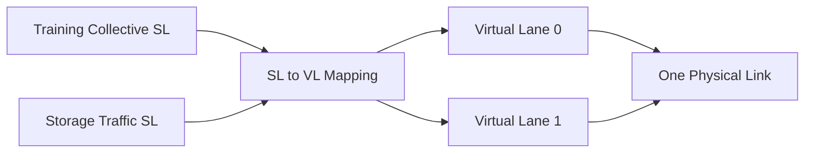
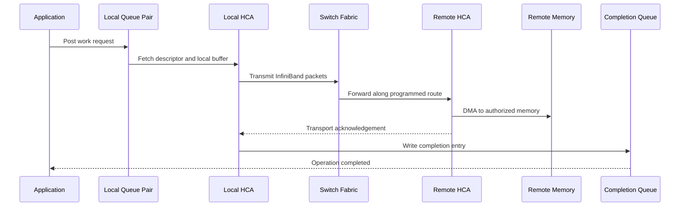
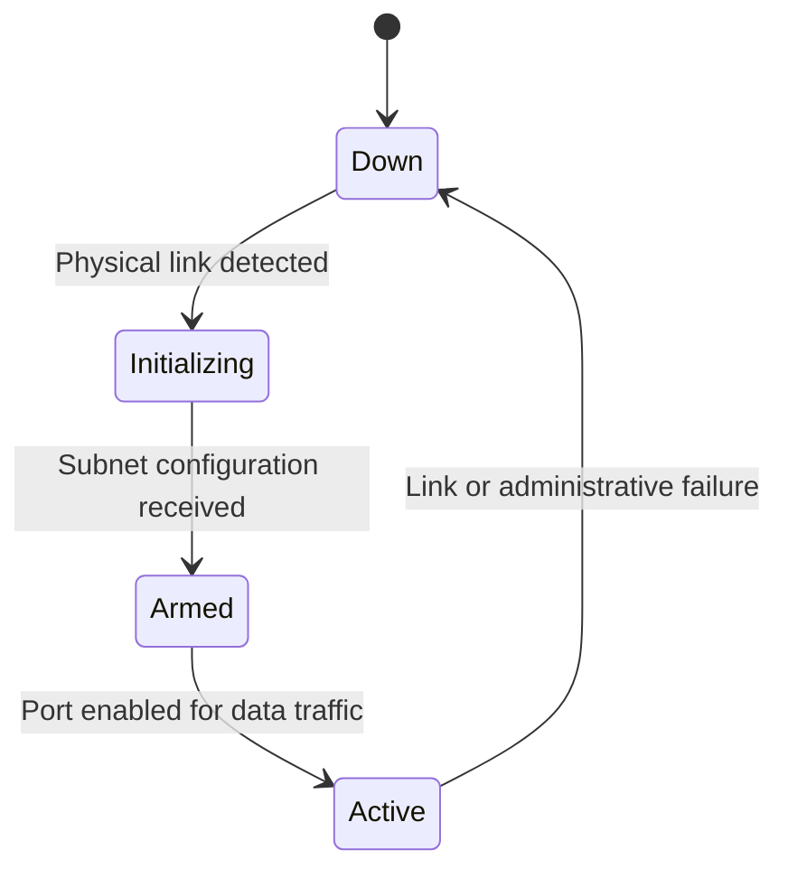

# InfiniBand Architecture and Link Layers

## Introduction

A cable can be connected, a port LED can be green, and an operating system can list an InfiniBand device—yet a distributed training job may still be unable to communicate.

This happens because InfiniBand is not merely a fast physical link. It is a managed switched fabric with multiple cooperating layers. The physical layer carries symbols. The link layer establishes local delivery, flow control, and virtual-lane behavior. The transport layer gives queue pairs their reliability and ordering semantics. The subnet manager discovers the topology, assigns local identifiers, and programs forwarding state.

Understanding these boundaries is essential. A failure at one layer often appears as a symptom at another.

| Chapter field | Value |
|---|---|
| Volume | 08 — InfiniBand |
| Difficulty | Advanced |
| Estimated reading time | 55–75 minutes |
| Primary focus | Fabric components and layered behavior |
| Previous | Why InfiniBand Exists |
| Next | Verbs, Queue Pairs, and Completion Queues |

## Story: The Green Link That Was Not Part of the Fabric

A new rack is connected to an existing training cluster. Every cable is installed according to the rack diagram. The adapter ports report physical link. Switch LEDs are green.

The first distributed job hangs before completing initialization.

The infrastructure team initially assumes that the application is misconfigured. A node-to-node IP test works over the management network, reinforcing that belief. Closer inspection shows that the affected InfiniBand ports are in a physical state that proves signal and lane negotiation, but they never reached the operational fabric state expected by the workload. The subnet manager had not incorporated the new links into the active subnet because of a configuration and topology-policy mismatch.

The lesson is foundational:

> Physical connectivity is necessary, but InfiniBand becomes usable only when every required layer agrees on the link, identity, route, and transport state.

## Learning Objectives

After completing this chapter, you will be able to:

- identify the major InfiniBand components;
- separate the physical, link, network, transport, and verbs responsibilities;
- trace a payload from an application queue to remote memory;
- explain port physical state versus logical state;
- describe credit-based flow control;
- explain service levels and virtual lanes;
- identify how congestion and backpressure propagate;
- design a production inventory for adapters, switches, cables, and ports;
- troubleshoot degraded width, speed, and state transitions.

## Big Picture



**Figure 8.2.1 — InfiniBand is an end-to-end managed fabric, and each hop's edge label is the specific evidence that proves that hop is healthy — not just that it exists.** The decision tree under the data path is the actual triage sequence: an `Active` port with clean physical counters can still stall on backpressure, and backpressure can still exist with a perfectly correct SM-programmed route. Each branch points to a different chapter section because each is a genuinely different fault class with a different fix.

## Core Components

### Host Channel Adapter

A Host Channel Adapter (HCA) connects a server to the InfiniBand fabric. It is not merely a conventional network interface with a faster link.

The HCA can:

- expose one or more physical ports;
- create queue pairs and completion queues;
- translate work requests into transport operations;
- access registered host or accelerator memory through DMA;
- enforce protection keys and memory keys;
- maintain retry, ordering, and transport state;
- report port, link, and device counters.

In a GPU server, HCA placement matters. A topologically local GPU-to-HCA path may remain within one PCIe or NUMA locality domain. A remote path may cross CPU sockets, host bridges, or additional PCIe switches before reaching the fabric.

### InfiniBand switch

An InfiniBand switch forwards packets between ports according to forwarding state programmed for the subnet.

A switch participates in:

- local-identifier forwarding;
- service-level to virtual-lane mapping;
- flow-control credit exchange;
- multicast replication;
- congestion handling;
- management traffic;
- counters and health telemetry.

Switches do not replace the subnet manager. They depend on the control plane for topology discovery, identifier assignment, and forwarding configuration.

### Subnet manager

The subnet manager is the authority that turns connected links into a managed subnet.

Its responsibilities include:

- discovering nodes, ports, and switches;
- assigning Local Identifiers (LIDs);
- calculating and installing routes;
- establishing partition membership;
- configuring service-level and quality-of-service behavior;
- responding to topology changes;
- providing subnet-administration records.

A production fabric generally needs an intentional high-availability model for subnet management. Multiple candidates may exist, but only one should act as the authoritative master for a subnet at a time.

### Cable and transceiver path

The physical path may include:

- copper direct-attach cables;
- active electrical cables;
- optical modules and fiber;
- adapter cages;
- switch cages;
- patch panels or structured cabling.

Every additional physical boundary creates another possible failure point. Cable identity and port mapping are therefore operational data, not rack-installation trivia.

## The Layered Model



**Figure 8.2.2 — The InfiniBand layers answer different questions.** Troubleshooting becomes faster when the failing responsibility is identified before changing configuration.

| Layer | Primary responsibility | Typical evidence |
|---|---|---|
| Application | Collective or message behavior | Framework logs, job timing |
| Verbs/API | Resource creation and work submission | Verbs errors, queue state |
| Transport | Reliability, ordering, retries, operation type | Completion status, QP state |
| Network | Path selection across addressing domains | Path records, routing state |
| Link | Local forwarding, flow control, virtual lanes | Port state, VL counters |
| Physical | Signal, width, speed, cable health | Link negotiation, symbol errors |

## Physical Layer

The physical layer defines how bits are encoded and transmitted over lanes. Operationally, engineers care about:

- expected link generation;
- expected lane width;
- negotiated speed;
- negotiated width;
- signal quality;
- cable and transceiver qualification;
- error and recovery counters.

A link can be operational at a lower-than-designed width or rate. This is dangerous because basic tests may pass while application performance degrades.

### Width and speed are separate

A port may negotiate the expected signaling generation but fewer lanes than intended. It may also retain full width at a lower speed.

Therefore, a health check must not record only `Active`. It should record:

1. physical state;
2. logical state;
3. negotiated rate;
4. negotiated width;
5. expected design value;
6. error-counter trend.

### Annotated `ibstat`: the six fields above, field by field

```text
$ ibstat mlx5_0
CA 'mlx5_0'
    CA type: MT4129
    Number of ports: 1
    Port 1:
        State: Active
        Physical state: LinkUp
        Rate: 400
        Base lid: 12
        LMC: 0
        SM lid: 1
        Capability mask: 0x2651e848
        Port GUID: 0x08c0eb0300f1a2c3
        Link layer: InfiniBand
```

- **`Physical state: LinkUp`** — signal and lane negotiation succeeded (item 1). This is what a green cable LED reflects.
- **`State: Active`** — the port completed subnet-manager admission and is enabled for application traffic (item 2). `Initializing` here with `LinkUp` above is exactly the "green LED, dead port" gap from Chapter 1.
- **`Rate: 400`** — the negotiated signaling rate in Gb/s (item 3). Compare this to the design value for the adapter generation (item 5) — a 400Gb/s-class HCA reporting `Rate: 100` has negotiated at a quarter of its designed rate, most often from a lane failing to qualify.
- **`Base lid: 12`, `SM lid: 1`** — proof this port has an assigned identity and knows which SM is authoritative; `Base lid: 0` means no usable LID exists yet regardless of what `State` claims.
- **What `ibstat` does *not* show:** negotiated *width* (lane count) is not printed by default on every platform/tool version — cross-check with `iblinkinfo` or the vendor equivalent, and track item 6 (error-counter trend) separately with `ibqueryerrors`, since a link can be `Active` at full rate and width while accumulating physical errors that will eventually force a recovery event.

## Link Layer

The link layer provides local hop behavior between directly connected ports.

Its responsibilities include:

- packet framing;
- local link integrity;
- flow-control credits;
- virtual lanes;
- service-level mapping;
- link-level error behavior;
- forwarding to the next hop.

### Credit-based flow control

InfiniBand commonly uses receiver-advertised credits. A sender transmits only when the downstream receiver has buffer capacity for the selected virtual lane.



**Figure 8.2.3 — Credit flow control prevents buffer overrun.** It avoids ordinary packet loss from buffer exhaustion, but it can propagate backpressure upstream.

### Lossless does not mean congestion-free

When a receiver, link, or downstream path becomes constrained, credits stop returning quickly. The upstream sender slows. That slowdown may affect another sender sharing the same link or virtual lane.

The result can be:

- head-of-line blocking;
- congestion spreading across several switches;
- unrelated flows slowing behind one hot destination;
- tail latency increasing without packet loss;
- collective performance collapsing around one congested path.

A lossless fabric changes the failure expression. Instead of obvious packet drops, the fabric may exhibit backpressure and queueing.

## Virtual Lanes and Service Levels

A physical InfiniBand link can support multiple Virtual Lanes (VLs). Virtual lanes provide separate buffering and flow-control domains over one link.

A Service Level (SL) is carried as a traffic classification. Fabric configuration maps service levels to virtual lanes on each hop.



**Figure 8.2.4 — Service levels classify traffic; virtual lanes provide link-level separation.** The mapping must be designed consistently across the path.

Virtual lanes can support:

- traffic separation;
- quality-of-service policy;
- deadlock avoidance strategies;
- management traffic isolation;
- reduced head-of-line interference.

They do not create bandwidth. Two virtual lanes still share the same physical link capacity.

## Management Traffic

InfiniBand includes management traffic used for discovery and configuration. The subnet manager communicates with fabric devices through management mechanisms distinct from ordinary application queue-pair traffic.

This distinction matters during incidents. A data transport may fail while management queries still work, or management reachability may be broken while a previously programmed data path remains partially functional.

A runbook should identify which command exercises which plane.

## Packet Journey

The following sequence shows a simplified reliable RDMA operation.



**Figure 8.2.5 — The path combines software, transport, switching, and memory access.** A completion depends on more than the physical link.

## Port State Model

Port state should be interpreted as a progression rather than one Boolean value.

A simplified operational journey is:



**Figure 8.2.6 — Physical and logical readiness are separate.** Exact state names and transitions should be interpreted with the platform tooling and specification.

Common interpretations:

- **Down:** no usable physical link or port disabled;
- **Initializing:** link exists, but subnet configuration is incomplete;
- **Armed:** port has configuration but is not yet forwarding normal traffic;
- **Active:** port is enabled for normal fabric traffic.

An active state still does not prove expected width, rate, route balance, or error-free operation.

## Production Architecture Considerations

### Performance

Performance depends on the complete path:

- GPU-to-HCA locality;
- PCIe state;
- HCA port rate and width;
- switch topology;
- route choice;
- virtual-lane mapping;
- congestion;
- remote endpoint behavior.

The slowest required segment limits delivered throughput.

### Scalability

As the fabric grows, engineers must manage:

- switch radix;
- number of tiers;
- cable count;
- path diversity;
- subnet-manager convergence;
- routing-table scale;
- monitoring cardinality;
- operational blast radius.

### Availability

Design for:

- redundant fabric paths where justified;
- redundant subnet-manager candidates;
- defined master-election behavior;
- cable and port replacement;
- firmware maintenance;
- partial-rack isolation;
- topology changes without uncontrolled rerouting.

### Security

Security considerations include:

- management-plane access;
- partition policy;
- M_Key and administrative controls;
- host access to RDMA devices;
- memory-registration boundaries;
- tenant-aware scheduling;
- physical cable and switch access.

### Observability

At minimum, collect:

- physical and logical port state;
- negotiated width and speed;
- symbol and link-recovery counters;
- transmit and receive volume;
- credit or congestion indicators;
- topology and route changes;
- subnet-manager role and health;
- HCA firmware and driver versions.

## Production Deployment Pattern

A repeatable deployment should follow a gated sequence.

1. Validate bill of materials and supported firmware.
2. Label cables and ports before installation.
3. Record adapter, switch, port, and cable identities.
4. Establish out-of-band management.
5. Bring up the subnet manager deliberately.
6. Verify every port’s state, width, and speed.
7. Compare discovered topology with the design.
8. Validate routes and path diversity.
9. Run host-memory RDMA tests.
10. Run GPU-aware communication tests.
11. Save the healthy baseline.
12. Admit production workloads only after acceptance criteria pass.

## Production Troubleshooting

### Scenario 1 — Port is physically up but not active

**Symptoms**

- cable LEDs are present;
- the adapter is detected;
- the port remains in an initialization state;
- application traffic cannot start.

**Diagnosis**

Check:

- subnet-manager availability and role;
- management reachability to the port;
- partition and policy configuration;
- topology-policy rejection;
- port administrative state;
- switch and HCA logs.

**Root cause**

The physical layer is working, but control-plane configuration has not completed.

**Evidence.** `ibstat` shows `Physical state: LinkUp` with `State: Initializing`, `Base lid: 0` — see the annotated example above. Pairing it with the SM's own view (from Chapter 5's tooling) that shows this port absent from the last completed sweep confirms the fault is on the SM side, not the cable: the port is discoverable but not yet admitted.

**Resolution**

Restore authoritative subnet management and correct the rejected policy or discovery condition. Confirm the port progresses to active state.

### Scenario 2 — Link is active at reduced width

**Symptoms**

- reachability works;
- bandwidth is below baseline;
- negotiated width is lower than design;
- errors may increase under load.

**Diagnosis**

Compare the affected path with a known-good path. Check cable identity, seating, switch port, HCA port, transceiver health, and physical counters.

**Resolution**

Replace or reseat one component at a time. Verify that the fault follows the component before declaring root cause.

### Scenario 3 — No packet loss, but severe slowdown

**Symptoms**

- links remain active;
- drop counters are not alarming;
- latency grows under concurrent jobs;
- several unrelated flows slow together.

**Likely cause**

Credit backpressure, head-of-line blocking, routing concentration, or a stalled receiver.

**Resolution**

Inspect per-port and per-VL behavior, destination hot spots, route distribution, and receiving endpoint health. Do not assume a lossless fabric is uncongested.

**Evidence.** `ibqueryerrors` on the suspect switch, filtered to wait/congestion fields, before and after a load window:

```text
$ ibqueryerrors -s XmtWait -k <switch-lid>
GUID 0x506b4b0300a1c210 port 3: [XmtWait == 184320]
GUID 0x506b4b0300a1c210 port 7: [XmtWait == 41]
```

`XmtWait` counts cycles the port had data queued to transmit but was blocked on downstream credit — it is a congestion signal, distinct from `SymbolErrorCounter` or `LinkDownedCounter`, which indicate physical faults. Port 3 accumulating 184,320 wait-cycles against port 7's 41 (same switch, same sampling window, both physically clean) pinpoints port 3's downstream path as the actual bottleneck without any packet loss ever occurring — exactly the "no drops, still slow" pattern this scenario describes.

### Scenario 4 — One traffic class affects another

**Symptoms**

- storage traffic degrades training collectives;
- service levels are configured, but isolation is ineffective;
- both classes use the same congested virtual lane.

**Resolution**

Validate the complete SL-to-VL mapping across every hop. Ensure the design provides the intended separation and that physical capacity remains sufficient.

## Customer Scenario

A customer asks whether buying the highest link generation guarantees linear training scale.

The architect explains that link generation is only one term in the system equation. Delivered scale also depends on:

- topology and bisection bandwidth;
- oversubscription;
- GPU-to-HCA locality;
- route balance;
- collective algorithm;
- message size;
- congestion behavior;
- software and firmware compatibility;
- operational health.

The recommendation therefore includes an acceptance test and observability plan, not only a switch and adapter bill of materials.

## Interview Preparation

### Knowledge Questions

1. What is the difference between physical state and logical port state?
   **Model answer:** "Physical state is purely electrical — did the two ends negotiate signaling and lane count, shown as `LinkUp` in `ibstat`. Logical state is whether the subnet manager has admitted that port into the operational subnet, shown as the port's `State` field — `Active` versus `Initializing`. A port can sit at `LinkUp`/`Initializing` indefinitely: physically fine, logically invisible to the fabric."

2. Why does InfiniBand use credit-based flow control?
   **Model answer:** "It's how the fabric stays lossless without dropping packets under normal operation — a receiver advertises exactly how much buffer space it has, and the sender only transmits that much. The trade-off is that it converts what would be packet loss on a lossy network into queueing and backpressure instead, which is why a lossless fabric can still be slow — the cost of avoiding drops is that congestion becomes latency and stalls rather than something you can see as an error counter."

3. What is a virtual lane?
   **Model answer:** "A separate buffering and flow-control context multiplexed onto one physical link. It doesn't add bandwidth — two VLs on one link still share that link's total capacity — but it does give you separate credit accounting per lane, which is what lets you isolate one traffic class's backpressure from another's on the same wire."

4. How is a service level different from a virtual lane?
   **Model answer:** "Service level is a classification carried in the packet — think of it as the traffic's declared class. Virtual lane is the actual link-level resource — separate buffers and credits. The fabric configuration maps SL to VL at each hop, and that mapping has to be consistent end-to-end, or you can get inconsistent isolation depending on which switch you're crossing."

5. Why can a lossless fabric still perform poorly?
   **Model answer:** "Because losslessness only guarantees delivery, not fairness or low latency. If credits stop returning fast enough on one path, that pressure propagates upstream through the switches feeding it — a congestion tree — and can delay flows that have nothing to do with the original bottleneck, all without a single dropped packet or physical error."

### Architecture Questions

1. Draw the full path from a GPU buffer to a remote GPU buffer.
   **Model answer:** "GPU HBM to the local HCA via DMA — no CPU copy of the payload — through the HCA's queue pair execution, onto the wire at the negotiated physical rate, through however many leaf and spine hops the SM's programmed route uses, into the remote HCA, and DMA'd directly into the remote GPU's HBM. I'd point out that the CPU is involved at both ends only in setup — posting the work request and consuming the completion — not in the data path itself, which is the entire point of RDMA."

2. Explain which responsibilities belong to the HCA, switch, and subnet manager.
   **Model answer:** "HCA: owns queue pairs, does the actual DMA, executes work requests, reports completions. Switch: forwards packets according to tables it did not compute — pure data-plane execution. Subnet manager: computes those tables, assigns LIDs, discovers topology, and pushes configuration into both HCAs and switches. If I had to summarize the split: the SM decides, the switch executes, the HCA is where the application's work actually starts and ends."

3. Design observability for a two-tier InfiniBand fabric.
   **Model answer:** "Three layers: per-port state/rate/width against a documented baseline, per-port error and wait counters with rate-of-change alerting rather than static thresholds, and a topology-aware view that maps every counter back to leaf/spine/rack so a 'port 3 errors' alert doesn't require manual lookup during an incident. I'd specifically alert on negotiated width dropping below design — that's the failure mode that a naive up/down check completely misses."

### Scenario Questions

1. A port is active but at half the expected width. What do you inspect?
   **Model answer:** "First confirm it with `ibstat` or `iblinkinfo` against the documented design value — 'half' has to be a comparison to something. Then I'd suspect a lane-level cable or connector fault, since width reduction usually means some lanes failed to qualify while others didn't. I'd substitute the cable first since that's the cheapest, fastest isolation step, and compare error counters before and after."

2. Several unrelated flows slow behind one destination. What mechanism could explain this?
   **Model answer:** "Head-of-line blocking from a congestion tree — one destination can't drain fast enough, its port's credits run out, that backpressure propagates to the upstream switch, and anything sharing that switch's buffers or virtual lane gets delayed even though it was never headed to the congested destination. I'd confirm with per-port wait counters showing elevated values upstream of the actual bottleneck, not at it."

3. A new rack has physical link but never becomes usable. Which layer do you investigate first?
   **Model answer:** "Control plane, immediately — `LinkUp` with `State: Initializing` and `Base lid: 0` is the signature. I wouldn't touch cables or firmware first; I'd check whether the SM has actually swept this rack into its topology and whether partition/policy configuration was updated to include the new ports."

### Customer Questions

1. Does lossless mean congestion-free?
   **Model answer:** "No, and that's one of the more important things to get right early. Lossless means the fabric won't drop packets from buffer exhaustion — it achieves that with credit-based backpressure, which trades drops for queueing delay. Under real contention you can see zero errors and still see performance collapse."

2. Why do we need a subnet manager if switches already forward packets?
   **Model answer:** "Switches forward using tables — they don't compute those tables themselves. Without an SM, nothing has discovered the topology, assigned addresses, or decided which egress port serves which destination. The switches are capable hardware sitting idle until something programs them."

3. What evidence proves a fabric is ready for production?
   **Model answer:** "Not 'every port shows Active' — that's necessary but not sufficient. I want every port at documented rate and width, clean and stable error counters, a completed SM sweep with the expected object count, and pairwise RDMA bandwidth/latency results that match the baseline across representative node pairs, including cross-rack. Reachability is the first checkpoint, not the last."

### Whiteboard Question

Draw two GPU nodes connected through a leaf-spine InfiniBand fabric. Label the physical, link, transport, control, and memory-access responsibilities.

**What I'd actually say while drawing:** "GPU memory on both ends, connected to their local HCA — that link is memory-access, pure DMA, no protocol overhead I need to draw in detail. HCA to leaf switch, leaf to spine, spine to the far leaf — that whole horizontal chain is physical plus link layer, and I'd label it with 'negotiated rate/width' and 'credits' respectively. Above that chain, off to the side, the subnet manager with dotted lines into every switch and HCA — that's the control plane, and I'd say explicitly: it configures this picture, it doesn't sit in the data path. And inside each HCA I'd draw a small queue-pair box — that's the transport layer, where reliability and ordering live, and it's the layer that actually knows whether an operation succeeded, which none of the layers below it can tell you."

## Summary

InfiniBand performance comes from an integrated architecture rather than one fast wire. HCAs execute queue-based operations and DMA. Switches forward traffic. The link layer provides flow control and virtual lanes. The subnet manager discovers and configures the fabric.

Healthy operations require evidence from every layer. An active port is only one checkpoint. Engineers must also validate negotiated capability, topology, route state, congestion behavior, and end-to-end application performance.

## Key Takeaways

- InfiniBand is a managed switched fabric.
- Physical connectivity and logical readiness are different states.
- Credit flow control prevents buffer overrun but can propagate congestion.
- Service levels classify traffic; virtual lanes provide link-level buffering domains.
- Link width and speed must be compared with the intended design.
- The complete GPU-to-memory path determines delivered performance.

## Quick Revision Sheet

| Concept | Remember |
|---|---|
| HCA | Executes queue work and DMA at the host edge |
| Switch | Forwards according to programmed fabric state |
| Subnet manager | Discovers, assigns, routes, and configures |
| Physical layer | Signaling, lanes, width, and speed |
| Link layer | Local delivery, credits, and virtual lanes |
| Service level | Traffic classification carried in the fabric |
| Virtual lane | Separate flow-control and buffering context |
| Active port | Usable state, not proof of full health |

## Lab Checklist

Before moving on, confirm that you can:

- identify each HCA and switch port in a path;
- distinguish physical and logical state;
- record expected and negotiated width and speed;
- explain credit backpressure;
- trace service-level to virtual-lane behavior;
- build a support-ready cable and port inventory.

## Cross References

- Previous: [Why InfiniBand Exists](./chapter-01-why-infiniband-exists)
- Next: [Verbs, Queue Pairs, and Completion Queues](./chapter-03-verbs-queue-pairs-and-completion-queues)
- Related volume: [Volume 07 — GPU Networking](pathname://../volume-07/index)
- Related lab: [Inventory an InfiniBand Fabric](./labs/lab-01-inventory-an-infiniband-fabric)

## Further Reading

Consult the current NVIDIA networking documentation for the selected adapter, switch, firmware, operating system, subnet manager, and management platform. Exact counters and supported features vary by release and platform.