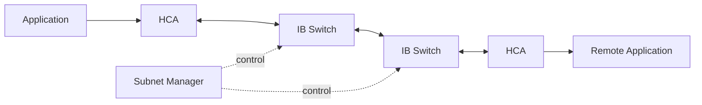

# InfiniBand Architecture and Link Layers

InfiniBand is a switched fabric designed for low-latency, high-throughput communication and RDMA. Its value comes from the complete architecture: host channel adapters, switches, subnet management, queue-based transports, routing, flow control, and telemetry.

## Learning Objectives

Identify fabric components, explain link and network responsibilities, and trace a packet from an application queue to a remote memory region.

## Big Picture

An HCA exposes queue pairs and performs DMA. Switches forward traffic using the fabric’s addressing and routing state. The Subnet Manager discovers the topology, assigns local identifiers, and programs paths.

## Layered Model

| Layer | Responsibility |
|---|---|
| Physical | Signaling, lanes, cables, link speed |
| Link | Framing, virtual lanes, flow control, local delivery |
| Network | Routing across subnets where applicable |
| Transport | Reliable/unreliable and connected/datagram services |
| Verbs | Software interface to queues, memory, and completions |

InfiniBand commonly uses credit-based link flow control. A transmitter sends only when the receiver advertises available buffering. This reduces packet loss but can propagate backpressure when congestion or a stalled receiver blocks a path.

## Ports and Links

A port negotiates width and speed. Healthy state requires more than `Active`: the link should operate at the expected rate, remain free from growing physical-error counters, and map to the intended switch port and fabric role.

Virtual lanes separate traffic classes within a physical link. Service levels can map to virtual lanes, enabling isolation and deadlock avoidance when designed correctly. Misconfiguration can create head-of-line blocking or ineffective prioritization.

## Production Design

Document cable identity, port GUIDs, switch names, link width, expected rate, and ownership. Standardize firmware and verify that replacement components preserve the intended topology. Separate management reachability from data-plane validation so a broken compute link does not prevent diagnosis.

## Troubleshooting

**Symptoms:** port active at reduced width, intermittent link recovery, rising symbol errors, or uneven path performance.

Use `ibstat`, `iblinkinfo`, `ibqueryerrors`, switch telemetry, and cable records. Compare negotiated state with the bill of materials. Isolate whether the defect follows the cable, transceiver, port, adapter, or switch.

## Customer Perspective

A customer choosing InfiniBand is choosing an operational fabric, not only a bandwidth number. Discuss subnet management, routing, congestion controls, firmware lifecycle, telemetry, cable serviceability, and staff skills.

## Interview Preparation

**Question:** Why can a lossless fabric still experience poor performance?

Backpressure, congestion trees, oversubscription, routing imbalance, receiver stalls, or head-of-line blocking can reduce throughput without packet loss.

## Key Takeaways

- InfiniBand combines RDMA endpoints, switches, and centralized subnet control.
- Active link state does not prove expected speed or health.
- Credit flow control avoids loss but does not eliminate congestion.
- Operations and telemetry are part of the architecture.

## Cross References

- [Volume 08 Introduction](./index)
- [Next: Verbs and Queue Pairs](./chapter-03-verbs-queue-pairs-and-completion-queues)
