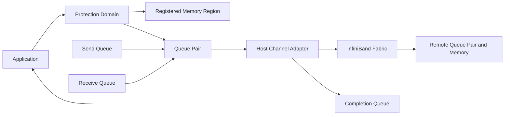
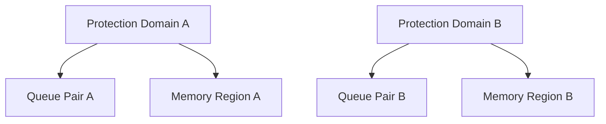
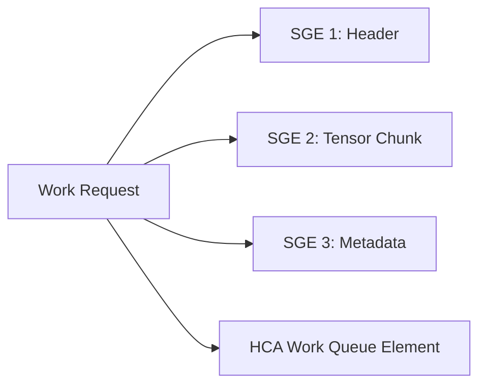
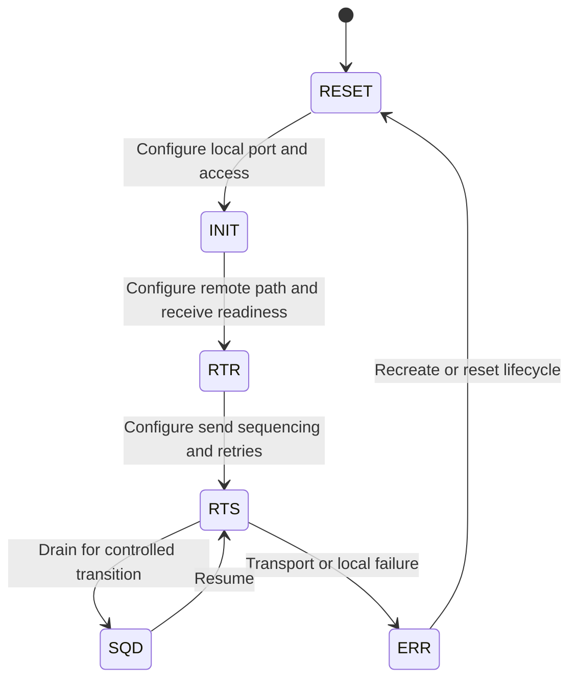
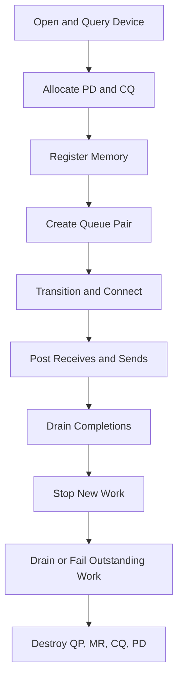

# Verbs, Queue Pairs, and Completion Queues

## Introduction

Traditional socket programming hides much of the network device behind the operating system. An application writes bytes to a socket, the kernel processes them, and the network stack decides how the adapter should transmit them.

RDMA applications use a different model. They create explicit device resources, register memory, post operations to queues, and consume completion records. The application gains a shorter and more predictable data path, but it also becomes responsible for resource lifecycles, ordering, queue depth, memory protection, and error handling.

This chapter explains that execution model from first principles.

| Chapter field | Value |
|---|---|
| Volume | 08 — InfiniBand |
| Difficulty | Advanced |
| Estimated reading time | 60–80 minutes |
| Primary focus | RDMA resource and queue execution model |
| Previous | InfiniBand Architecture and Link Layers |
| Next | LIDs, GIDs, P_Keys, and Addressing |

## Story: The Network Was Healthy, but Every Queue Pair Failed

A distributed training environment passes physical fabric checks. All ports are active at expected speed and width. Host-memory bandwidth tests work between selected nodes.

A new service still fails during startup. The application logs show generic timeouts. The network team sees no significant errors on the switches.

The problem is eventually found inside the endpoint execution model. The application created queue pairs but did not transition them through the required states with consistent peer addressing. Several receive queues were never populated. Under load, completion entries reported receiver-not-ready and protection failures, but the application discarded the detailed status and printed only “network timeout.”

The incident illustrates a critical principle:

> A healthy fabric cannot compensate for an invalid queue, memory, or transport lifecycle.

## Learning Objectives

After completing this chapter, you will be able to:

- explain the purpose of the verbs interface;
- identify device contexts, protection domains, memory regions, queue pairs, and completion queues;
- describe send and receive queues;
- explain work requests, work queue elements, and scatter-gather entries;
- distinguish send/receive, RDMA write, RDMA read, and atomic operations;
- describe common queue-pair states;
- compare polling and event-driven completion;
- interpret common completion failures;
- design queue and memory lifecycles for production services;
- troubleshoot endpoint errors before blaming the fabric.

## Big Picture

**Figure 8.3.1 — Verbs exposes explicit resources.** Memory, queues, protection, and completions are separate objects that must be created and coordinated correctly.

## Why the Queue Model Exists

A high-performance adapter should not require a system call for every packet. Instead, the application prepares descriptors in memory that the HCA can consume.

The general pattern is:

1. allocate and register buffers;
2. create queue and protection resources;
3. connect or address a peer;
4. post work requests;
5. let the HCA execute them asynchronously;
6. consume completion entries;
7. reuse or release resources only after ownership is clear.

This separates the control path from payload movement.

## The Verbs Interface

“Verbs” refers to the programming interface used to create RDMA resources and submit operations.

The interface exposes actions such as:

- open a device context;
- query adapter and port capabilities;
- allocate a protection domain;
- register memory;
- create a completion queue;
- create and modify a queue pair;
- post send or receive work;
- poll or wait for completions;
- destroy resources.

Different software layers may wrap these operations. Communication libraries, MPI implementations, NCCL transports, storage software, and application frameworks often use verbs indirectly.

## Core Resource Objects

### Device context

A device context represents access to an RDMA-capable adapter. It is the starting point for querying capabilities and creating resources.

Important capability questions include:

- maximum queue depth;
- maximum scatter-gather entries;
- supported transport types;
- atomic capability;
- maximum registered-memory resources;
- port state and link-layer mode;
- completion and event capabilities.

Production software should query capabilities rather than assuming one adapter profile.

### Protection domain

A Protection Domain (PD) groups resources that are permitted to interact.

A memory region registered under one protection domain should not automatically be usable by a queue pair in another. This boundary helps prevent accidental or unauthorized DMA.

**Figure 8.3.2 — Protection domains bind compatible resources.** They are part of the memory-protection model, not merely object organization.

### Memory region

An application buffer must be registered before the HCA can access it through ordinary verbs operations.

Registration establishes:

- stable backing pages or device-memory mapping;
- DMA mappings;
- access permissions;
- a local key;
- optionally, remote-access permissions and a remote key.

The memory region includes an address range and length. Access outside that range or with an invalid key should fail.

### Completion queue

A Completion Queue (CQ) receives completion queue entries generated by completed or failed operations.

A completion entry can contain information such as:

- operation identifier;
- status;
- operation type;
- transferred length;
- immediate data;
- source information for datagram operations;
- error syndrome or vendor-specific detail.

A completion is evidence. Discarding its status removes the best endpoint-level clue during a failure.

### Queue pair

A Queue Pair (QP) consists conceptually of:

- a Send Queue (SQ);
- a Receive Queue (RQ).

The send queue accepts outbound work requests, including operations that may not be conventional “send” messages. The receive queue holds posted receive buffers for operations that require remote send/receive semantics.

## Work Requests and Work Queue Elements

An application posts a Work Request (WR). The provider translates or links it into a Work Queue Element (WQE) that the HCA processes.

A work request commonly describes:

- operation type;
- local buffer list;
- remote address and key where applicable;
- destination or connected peer;
- completion signaling behavior;
- inline data options;
- ordering or fencing flags;
- application-defined work identifier.

### Scatter-gather entries

A Scatter-Gather Entry (SGE) describes a local buffer segment.

Multiple SGEs allow one operation to reference data stored in several memory regions or discontiguous buffers.

**Figure 8.3.3 — One work request may reference several local segments.** Capability limits determine how many segments are supported efficiently.

## Operation Types

### Send and receive

A send operation delivers a message to a peer’s receive queue. The receiver must generally have a suitable receive work request posted before the message arrives.

This model is useful when the receiver owns buffer placement and message boundaries matter.

Operational risk includes receive-queue starvation. If receive buffers are not replenished, the sender may encounter receiver-not-ready behavior, retries, or failure depending on the transport.

### RDMA write

RDMA write places local data into an authorized remote memory region.

The initiator supplies:

- remote virtual address;
- remote key;
- local source buffers;
- operation length.

The remote CPU does not need to post a matching receive for the payload placement itself. The application still needs a protocol for ownership, readiness, and notification.

### RDMA read

RDMA read retrieves data from an authorized remote memory region into local registered memory.

Read can be useful when the consumer decides when to pull data. It also creates different load and scaling behavior at the remote adapter and fabric.

### Atomic operations

Supported atomic operations can update or compare remote memory values under defined semantics.

They are useful for narrow synchronization problems, but they do not replace complete distributed coordination. Capability, alignment, transport, and memory constraints must be validated.

## Transport Types

Queue pairs can use different transport services.

A simplified comparison is:

| Transport style | Connection model | Reliability | Typical use |
|---|---|---|---|
| Reliable Connected | One logical peer per QP | Reliable, ordered | RDMA read/write and reliable messaging |
| Unreliable Connected | Connected peer | Unreliable | Specialized low-overhead cases |
| Unreliable Datagram | Addressed per message | Unreliable | Datagram and discovery patterns |
| Other specialized transports | Varies | Varies | Platform- or workload-specific behavior |

The exact operation support differs by transport. Software must not assume that every queue pair supports every verb.

## Queue-Pair State Machine

A queue pair is not ready immediately after creation. It progresses through states as local and remote transport attributes are configured.

**Figure 8.3.4 — Queue pairs require valid state transitions.** The exact required attributes depend on transport and provider.

Common conceptual states include:

- **RESET:** newly created or reset;
- **INIT:** local attributes established;
- **RTR (Ready to Receive):** remote path information and receive-side state established;
- **RTS (Ready to Send):** outbound sequencing and retry parameters established;
- **SQD (Send Queue Drained):** controlled pause after outstanding sends drain;
- **ERR:** queue entered an error condition.

A queue pair in the wrong state may exist successfully but reject work or fail every operation.

## Completion Semantics

A completion must be interpreted in context.

Questions to ask include:

- Was the completion successful?
- Was it local or remote in significance?
- Does it mean the local buffer can be reused?
- Has the remote application observed the data?
- Was the operation signaled?
- Were earlier operations ordered before it?
- Did a queue error flush later work?

### Signaled and unsignaled work

Generating a completion for every work request can create overhead. Some applications signal only selected operations and use ordering guarantees to infer progress for earlier work.

This optimization requires careful queue-depth management. If too few operations are signaled, the application may not reclaim resources or detect errors promptly.

## Polling Versus Events

### Busy polling

The application repeatedly checks the completion queue.

Advantages:

- low wake-up latency;
- predictable progress under load;
- simple high-performance loops.

Costs:

- consumes CPU continuously;
- can interfere with preprocessing or control work;
- requires NUMA-aware CPU placement.

### Event-driven completion

The application arms notification and sleeps until an event indicates completions may be available.

Advantages:

- lower idle CPU consumption;
- appropriate for intermittent traffic.

Costs:

- wake-up and interrupt latency;
- more complex re-arming logic;
- risk of missed-progress bugs when the sequence is incorrect.

Hybrid designs often poll briefly and then sleep.

## Queue Depth and Backpressure

Queue depth is a capacity decision.

Too shallow:

- insufficient work is in flight;
- throughput is limited by round trips;
- receive queues exhaust quickly.

Too deep:

- memory usage grows;
- failures flush many operations;
- latency and recovery time increase;
- resource accounting becomes difficult.

Queue depth should be derived from message rate, latency, batching, completion strategy, and adapter limits.

## Resource Lifecycle

A safe lifecycle is:

**Figure 8.3.5 — Teardown is part of correctness.** Memory must not be deregistered while in-flight work can still reference it.

## Production Architecture Considerations

### Performance

Key variables include:

- registration strategy;
- queue depth;
- batching;
- inline-data threshold;
- scatter-gather count;
- completion signaling rate;
- polling CPU locality;
- HCA and NUMA placement.

### Scalability

At large scale, resources multiply by process, peer, rail, and queue.

Capacity planning should include:

- queue-pair count;
- completion-queue entries;
- memory-region count;
- pinned or registered memory;
- adapter contexts;
- receive buffers;
- CPU threads for progress.

### Availability

A peer can disappear with operations in flight. Production software needs:

- timeouts;
- retry policy;
- queue error handling;
- connection teardown;
- memory cleanup;
- partial-job failure strategy;
- observability for flushed work.

### Security

The resource model protects memory through:

- protection domains;
- local and remote keys;
- address ranges;
- access flags;
- process and container device permissions;
- scheduler and tenant boundaries.

A leaked remote key or incorrectly shared memory region can create serious risk.

## Production Troubleshooting

### Scenario 1 — Queue pair never reaches ready-to-send

**Symptoms**

- resource creation succeeds;
- first work request fails or is rejected;
- peer connection establishment times out.

**Diagnosis**

Compare both endpoints:

- QP number;
- transport type;
- port and path attributes;
- LID or GID selection;
- packet sequence configuration;
- MTU;
- service level;
- retry and timeout values.

**Root cause**

One endpoint was configured with inconsistent peer or path attributes.

### Scenario 2 — Receiver-not-ready or missing receives

**Symptoms**

- send/receive traffic stalls under bursts;
- retry counters increase;
- completions report receiver-side readiness problems.

**Diagnosis**

Inspect receive-queue occupancy and replenishment logic. Confirm buffer ownership and application processing rate.

**Resolution**

Pre-post enough receives, replenish before the low-water mark, and monitor receive-queue pressure.

### Scenario 3 — Protection error

**Symptoms**

- local protection error;
- remote access error;
- invalid key or address completion;
- one buffer works while another fails.

**Diagnosis**

Check:

- memory-region address and length;
- local and remote keys;
- access flags;
- protection-domain membership;
- buffer lifetime;
- whether memory was deregistered or reused.

### Scenario 4 — Queue enters error and later work is flushed

**Symptoms**

- one operation reports the original error;
- many later completions report flushed work;
- application logs hundreds of secondary failures.

**Resolution**

Find the first failing completion. Treat flushed completions as consequences. Quiesce the queue, rebuild transport state, and verify peer health before resuming.

### Scenario 5 — High CPU despite RDMA

**Diagnosis**

Separate:

- busy polling;
- application serialization;
- memory registration;
- progress threads;
- interrupt processing;
- payload copying.

High CPU can be an intentional latency trade-off rather than proof of failed RDMA.

## Customer Scenario

A customer wants one queue pair per GPU-to-GPU peer across a very large cluster.

The architect asks:

- how many processes and peers exist;
- whether the communication library shares transports;
- how many rails are used;
- what the HCA resource limits are;
- how failures are recovered;
- how much registered memory is required;
- whether the connection model will scale operationally.

The design may use shared endpoints, connection management, hierarchical communication, or library-managed transports rather than multiplying one dedicated queue pair for every theoretical peer.

## Interview Preparation

### Knowledge Questions

1. What is a protection domain?
2. Why must memory be registered?
3. What is the difference between a queue pair and a completion queue?
4. Why are receive buffers pre-posted?
5. What does an RDMA-write completion prove?

### Architecture Questions

1. Draw the objects required for one reliable-connected RDMA path.
2. Explain how a work request becomes a completion entry.
3. Design a reusable registered-buffer pool.

### Scenario Questions

1. A QP reaches INIT but not RTR. What information is probably missing?
2. Completions show protection errors. What do you inspect?
3. One error causes hundreds of flushed completions. Which completion matters most?

### Customer Questions

1. Does RDMA eliminate the operating system?
2. Should every operation generate a completion?
3. How do queue-pair counts affect architecture at scale?

### Whiteboard Question

Draw a queue pair with send and receive queues, registered memory, an HCA, a remote queue pair, and a completion queue. Mark ownership changes for a send and an RDMA write.

## Summary

The verbs model exposes explicit resources so the HCA can execute communication asynchronously with less kernel involvement in the payload path. This efficiency depends on correct memory registration, protection domains, queue state, work submission, completion handling, and teardown.

Endpoint evidence is often more useful than switch counters when the failure is inside the queue lifecycle. Always inspect the first meaningful completion status before concluding that the fabric is at fault.

## Key Takeaways

- Verbs exposes explicit adapter resources.
- Queue pairs contain send and receive work queues.
- Completion queues report success and failure.
- Memory keys and protection domains enforce DMA boundaries.
- QPs must transition through valid states.
- Receive queues and completion queues are finite resources.
- Teardown must wait for in-flight work or force it into a known error path.

## Quick Revision Sheet

| Object | Purpose |
|---|---|
| Device context | Access and query an RDMA adapter |
| Protection domain | Groups compatible protected resources |
| Memory region | Authorizes HCA access to a buffer range |
| Queue pair | Holds send and receive work queues |
| Work request | Describes one requested operation |
| SGE | Describes one local buffer segment |
| Completion queue | Reports completed or failed work |
| Local key | Authorizes local HCA access |
| Remote key | Authorizes permitted remote access |

## Lab Checklist

Before moving on, confirm that you can:

- identify all verbs objects in a test application;
- explain QP state transitions;
- interpret completion status;
- recognize receive-queue starvation;
- calculate approximate queue resource requirements;
- describe safe memory deregistration and teardown.

## Cross References

- Previous: [InfiniBand Architecture and Link Layers](./chapter-02-infiniband-architecture-and-link-layers)
- Next: [LIDs, GIDs, P_Keys, and Addressing](./chapter-04-lids-gids-pkeys-and-addressing)
- Related chapter: [DMA, RDMA, and Peer-to-Peer](pathname://../volume-07/chapter-04-dma-rdma-and-peer-to-peer)
- Related lab: [Benchmark InfiniBand Bandwidth and Latency](./labs/lab-02-benchmark-infiniband-bandwidth-and-latency)

## Further Reading

Use the current rdma-core and NVIDIA networking documentation for the exact verbs API, provider capabilities, queue-pair attributes, completion status values, and adapter limits used in your environment.