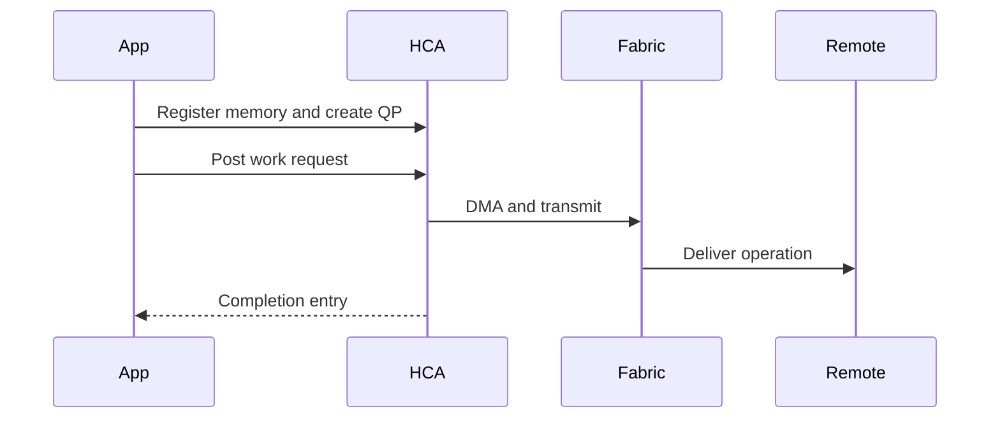

# Verbs, Queue Pairs, and Completion Queues

InfiniBand applications do not ask the kernel to copy every message. They register memory, create queues, post work requests, and later consume completion events. This queue-driven model is the foundation of low-overhead RDMA.

## Learning Objectives

Explain protection domains, memory regions, queue pairs, work requests, scatter-gather lists, and completion queues; distinguish send/receive from RDMA read/write; and diagnose queue-level failures.

## Execution Model

A queue pair contains a send queue and receive queue. Work queue elements describe operations and buffers. The HCA executes them and writes completion queue entries when requested or required.

## Core Objects

| Object | Purpose |
|---|---|
| Context | Access to an RDMA device |
| Protection domain | Groups resources that may interact |
| Memory region | Registered buffer with local and remote keys |
| Queue pair | Send and receive work queues |
| Completion queue | Reports completed or failed work |
| Address handle | Describes a destination for datagram-style transport |

Memory registration pins or otherwise prepares pages for DMA and returns keys. The local key authorizes local device access; the remote key can authorize a peer operation. Poor key handling is both a correctness and security problem.

## Operations

Send/receive requires the remote side to post receives. RDMA write places data into authorized remote memory. RDMA read retrieves from it. Atomics provide limited remote synchronization operations. Not every transport supports every operation.

Applications choose between polling and event-driven completion. Busy polling minimizes latency but consumes CPU. Event-driven processing saves CPU but may add wake-up latency. Production design balances both.

## Failure Modes

Queue pairs transition through states. Incorrect state transitions, missing receives, invalid keys, exhausted queue depth, unreachable destinations, or protection errors produce failed completions. A timeout is a symptom; inspect the completion status and transport state before blaming the switch.

## Production Considerations

Reuse registered buffers, cap queue depth, monitor pinned memory, and design cleanup for crashed processes. Container and multi-tenant environments require careful device exposure and memory-protection boundaries.

## Troubleshooting

Capture QP state, completion status, memory-registration errors, device counters, and peer addressing. Reproduce with a minimal verbs or `perftest` workload before debugging a complex framework.

## Interview Preparation

**Question:** Why are receive buffers commonly pre-posted?

Because send/receive transports need available receive work requests before packets arrive. Exhaustion can cause receiver-not-ready behavior or stalls depending on transport and retry settings.

## Key Takeaways

- Verbs expose registered memory and queue-based operations.
- Queue pairs describe work; completion queues report outcomes.
- Direct memory access still requires protection, ordering, and lifecycle management.
- Completion status is essential troubleshooting evidence.

## Cross References

- [InfiniBand Architecture](./chapter-02-infiniband-architecture-and-link-layers)
- [Next: Addressing](./chapter-04-lids-gids-pkeys-and-addressing)
