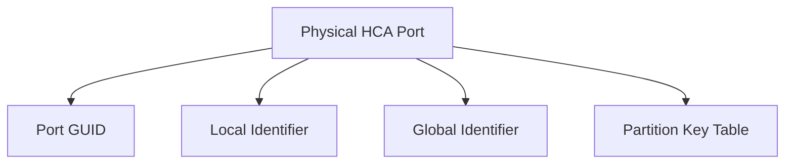

# LIDs, GIDs, P_Keys, and Addressing

An InfiniBand endpoint can expose several identities. GUIDs identify hardware objects, LIDs support local subnet forwarding, GIDs provide globally structured identities, and P_Keys define partition membership. Confusing these layers leads to failed diagnostics and insecure designs.

## Learning Objectives

Distinguish GUID, LID, GID, and P_Key; explain path records; and troubleshoot identity or partition mismatches.

## Identity Model

A GUID is a persistent identifier associated with an HCA, node, switch, or port. The Subnet Manager assigns LIDs used for forwarding within a subnet. GIDs are 128-bit identifiers used by protocols and paths requiring a global-style identity. A port can have multiple GIDs.

P_Keys create logical partitions. Endpoints must have compatible membership to communicate under a partition. They are not a substitute for every security control, but they provide fabric-level isolation.

## Path Resolution

Applications and libraries frequently rely on subnet services to obtain path information: destination LID/GID, service level, MTU, rate, packet lifetime, and other attributes. A valid route requires consistent state across endpoint tables, subnet manager records, and switch forwarding.

| Symptom | Likely area |
|---|---|
| Port active but no communication | P_Key, path record, or transport configuration |
| Wrong destination after change | stale subnet state or identity assumption |
| One interface works, another fails | GID index, partition, or port selection |
| Cross-subnet failure | routing or global addressing design |

## Production Design

Maintain a source of truth for GUID-to-host and switch-port mappings. Avoid operational procedures based only on mutable LIDs. Document partition ownership and automate P_Key deployment where possible.

In mixed InfiniBand and RoCE environments, GID tables can include several address types. Applications may select an unintended GID index. Capture the selected identity in support bundles.

## Troubleshooting

Use tools that display HCA GUIDs, LIDs, GIDs, P_Keys, and path records. Compare both endpoints and the subnet manager view. If a partition change was made, verify propagation and membership before restarting applications.

## Customer Perspective

A customer requesting tenant isolation should understand the boundary: partitions restrict fabric membership, while identity, host security, scheduler policy, and application authorization remain necessary.

## Interview Preparation

**Question:** Why should inventory use GUIDs rather than LIDs?

Because LIDs are assigned by subnet management and may change; GUIDs are more stable hardware identities.

## Key Takeaways

- GUIDs identify objects; LIDs enable local forwarding.
- GIDs represent globally structured port identities.
- P_Keys create logical communication partitions.
- Troubleshooting must compare endpoint and subnet-manager state.

## Cross References

- [Verbs and Queue Pairs](./chapter-03-verbs-queue-pairs-and-completion-queues)
- [Next: Subnet Management](./chapter-05-subnet-management-and-opensm)
