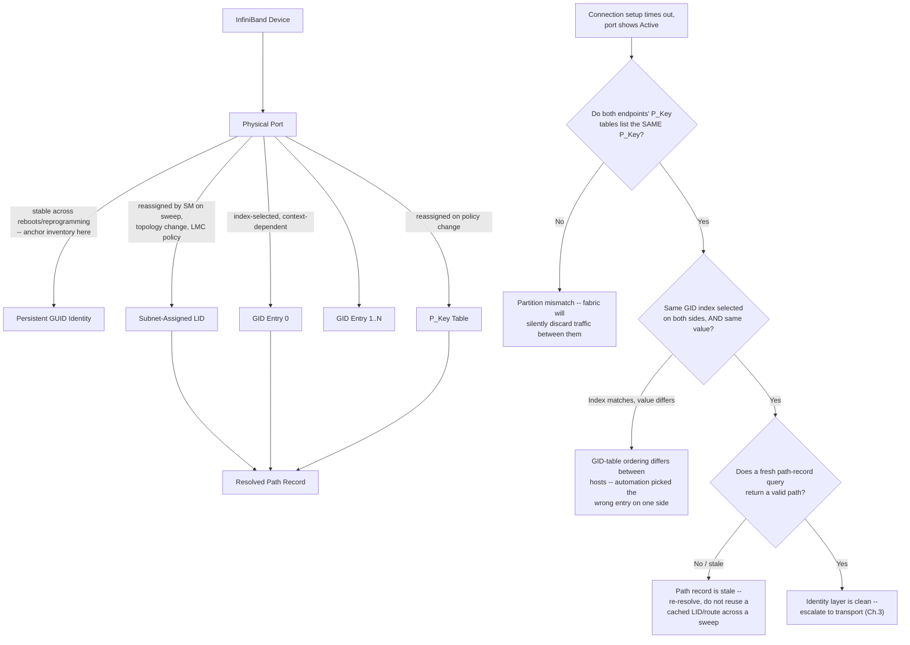
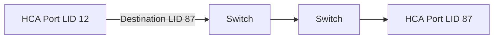
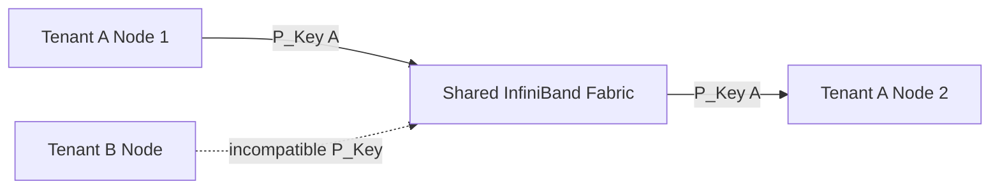
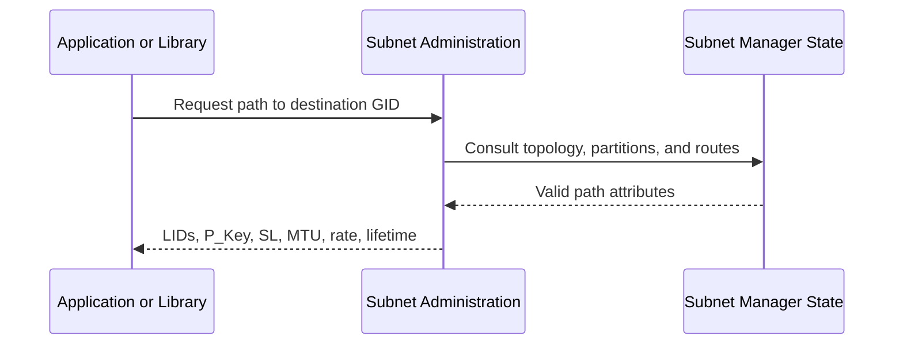

# LIDs, GIDs, P_Keys, and Addressing

## Introduction

An InfiniBand port can have several identities at the same time. A hardware GUID identifies an object. A Local Identifier (LID) supports forwarding within a subnet. A Global Identifier (GID) represents a port in a globally structured address space. A Partition Key (P_Key) determines which logical fabric partition an endpoint may use.

These values solve different problems. Treating them as interchangeable creates fragile inventories, failed path resolution, and weak isolation.

| Chapter field | Value |
|---|---|
| Volume | 08 — InfiniBand |
| Difficulty | Advanced |
| Estimated reading time | 55–75 minutes |
| Primary focus | Identity, path resolution, and partitioning |
| Previous | Verbs, Queue Pairs, and Completion Queues |
| Next | Subnet Management and OpenSM |

## Story: The Node That Changed Identity After Maintenance

A cluster node is serviced and its HCA firmware is updated. After the maintenance window, the port becomes active and receives a different LID from the subnet manager.

An operations script still assumes that the old LID permanently identifies the node. The script updates the wrong inventory record, and a troubleshooting engineer spends hours investigating an apparent duplicate endpoint.

At the same time, one application selects a different GID index than before. It now uses an identity associated with another address context. Another tenant loses connectivity because a partition update was applied to only one side of a path.

Nothing is wrong with InfiniBand addressing. The design confused stable identity, assigned forwarding identity, global identity, and partition membership.

The operational lesson is:

> Inventory should anchor on stable identities, while runtime diagnostics must capture the exact LID, GID, P_Key, port, and path selected for the current session.

## Learning Objectives

After completing this chapter, you will be able to:

- distinguish node, system-image, and port GUID concepts;
- explain how LIDs support local subnet forwarding;
- explain why LIDs may change;
- describe the structure and purpose of GIDs;
- explain why one port can expose multiple GIDs;
- describe P_Key membership and limited versus full membership;
- explain path records and the attributes they carry;
- identify common address-selection failures;
- design a source of truth for fabric identity;
- troubleshoot partition and path mismatches.

## Big Picture



**Figure 8.4.1 — One port participates in several identity systems, and the diagram's real value is the failure order: P_Key membership is checked before GID selection matters, and GID selection is checked before a stale path record is even relevant.** A support engineer who starts by re-querying path records before confirming P_Key membership on both sides is checking evidence in the wrong order — this is precisely why the chapter's opening incident took hours: the LID-inventory bug and the GID-index bug were investigated as one problem when they were two unrelated identity-layer failures.

## Why Multiple Identity Types Exist

A single address cannot efficiently answer every question.

The fabric needs to answer:

- Which physical object is this?
- How should packets be forwarded inside this subnet?
- How should a port be represented in a globally structured namespace?
- Which logical communication partition may the endpoint use?
- Which MTU, service level, rate, and lifetime should a path use?

InfiniBand separates these concerns.

## GUIDs: Stable Object Identity

A Globally Unique Identifier (GUID) is used to identify InfiniBand objects such as nodes, ports, and system images.

Conceptually, operators may encounter:

- **node GUID:** identifies an InfiniBand node object;
- **port GUID:** identifies a particular port;
- **system-image GUID:** associates related ports or functions within a system image.

The exact values and exposure depend on the adapter and platform.

### Why GUIDs matter operationally

GUIDs are more suitable than LIDs for durable inventory because they are intended to remain associated with hardware objects.

A production source of truth should map:

- server name;
- rack and unit;
- HCA PCI address;
- HCA device name;
- port number;
- port GUID;
- connected switch and switch port;
- cable identifier;
- intended fabric and rail;
- firmware and driver versions.

A GUID is not a complete security identity. It is an object identifier used within the fabric architecture.

## LIDs: Local Subnet Forwarding

A Local Identifier (LID) is assigned by subnet management and used for forwarding within an InfiniBand subnet.



**Figure 8.4.2 — LIDs are forwarding identities within a subnet.** Switch forwarding tables direct packets toward the destination LID.

The subnet manager:

- discovers ports;
- assigns LIDs;
- calculates routes;
- programs switch forwarding tables;
- updates state after topology changes.

### Why LIDs can change

LIDs are assigned operational state, not immutable hardware identity.

They may change after:

- subnet-manager restart or policy change;
- topology modification;
- device replacement;
- fabric reconfiguration;
- LID-mask-control changes;
- recovery from stale state.

Scripts should not assume that a LID permanently identifies one server.

### LID Mask Control

A port may be assigned a range of LIDs depending on LID Mask Control (LMC). Multiple LIDs can provide path diversity by allowing routes to distribute traffic toward one port identity range.

This is a routing and scale design topic, not merely an addressing curiosity. Operations should record the current assigned range and the policy that produced it.

## GIDs: Globally Structured Port Identity

A Global Identifier (GID) is a 128-bit identity associated with a port and address context.

A GID combines a subnet prefix with an interface-identifier portion.

Conceptually:

```text
GID = Subnet Prefix + Interface Identifier
```

A port can expose multiple GID-table entries because it may participate in multiple address contexts, protocols, virtual functions, or network configurations.

### Why GID index matters

Applications and communication libraries may select a GID by table index. Choosing the wrong entry can produce:

- path-resolution failure;
- use of an unintended interface or address family;
- inability to communicate with a peer;
- unexpected routing behavior;
- inconsistent behavior across nodes with different table ordering.

Support bundles should capture the selected GID value and index, not only the adapter name.

### Annotated `show_gids`: why "index 3" is not a portable statement

```text
$ show_gids
DEV     PORT    INDEX   GID                                     IPv4            VER     DEV
---     ----    -----   ---                                     ------------    ---     ---
mlx5_0  1       0       fe80:0000:0000:0000:08c0:ebff:fe03:00f1                 v1      mlx5_0
mlx5_0  1       1       fe80:0000:0000:0000:08c0:ebff:fe03:00f1                 v2      mlx5_0
mlx5_0  1       2       0000:0000:0000:0000:0000:ffff:0a01:0203  10.1.2.3       v1      mlx5_0
mlx5_0  1       3       0000:0000:0000:0000:0000:ffff:0a01:0203  10.1.2.3       v2      mlx5_0
```

Four entries for one physical port: indices 0-1 are link-local IB addressing under RoCE v1/v2 framing conventions carried in the table format, and indices 2-3 are the same host's RoCE-style IPv4-mapped address under v1 and v2. On a pure InfiniBand link-layer deployment the table is simpler, but the moment IP-over-IB, container networking, or a second protocol context is configured, table length and ordering can differ between two otherwise-identical hosts depending on boot order and driver version — which is exactly the "GID index 3 works on half the nodes" scenario below. Automation must select by matching value or explicit policy (for example, "the v2 RoCE entry whose IPv4 matches this host's management subnet"), never by a hardcoded index.

## P_Keys: Partition Membership

A Partition Key (P_Key) provides logical partitioning inside an InfiniBand fabric.

The subnet manager or partition manager distributes partition membership to endpoint and switch tables. Packets with invalid partition context can be discarded by the fabric.



**Figure 8.4.3 — P_Keys create logical communication groups.** Shared physical infrastructure can enforce partition membership at the fabric layer.

### Full and limited membership

Partition membership can distinguish full and limited members.

A simplified interpretation is:

- **full members** can communicate with full and limited members of the same partition;
- **limited members** can communicate with full members but not necessarily directly with other limited members.

Exact policy should be verified against the active subnet-manager configuration and architecture.

### What P_Keys do not replace

P_Keys are not a complete tenant-security architecture. They should be combined with:

- host authentication and authorization;
- scheduler and namespace isolation;
- container or VM device boundaries;
- memory-registration protection;
- secrets management;
- management-plane access control;
- monitoring and audit.

## Address and Path Resolution

An application needs more than a destination identity. It needs a path with compatible attributes.

A path record can include information such as:

- source and destination identifiers;
- source and destination LIDs;
- P_Key;
- service level;
- MTU;
- rate;
- packet lifetime;
- reversible-path indication;
- preference or path information.



**Figure 8.4.4 — Path resolution joins identity with transport-ready attributes.** A reachable destination identity is insufficient when path parameters are incompatible.

## Service IDs and Communication Managers

Connection-management mechanisms can use service identifiers and path information to establish communication between peers.

Operationally, failed connection setup may result from:

- destination identity mismatch;
- incorrect GID selection;
- missing partition membership;
- incompatible MTU;
- stale path record;
- service not listening;
- route or subnet-manager inconsistency.

The error may appear as a connection timeout even when the physical fabric is healthy.

## Identity Relationships

| Identity or attribute | Assigned by | Stability | Scope | Best operational use |
|---|---|---|---|---|
| Port GUID | Hardware/platform | Relatively stable | Object identity | Inventory and port mapping |
| LID | Subnet manager | Runtime-assigned | One subnet | Local forwarding and diagnostics |
| GID | Port/address configuration | Context-dependent | Global-style identity | Path and protocol selection |
| P_Key | Partition policy | Configuration-dependent | Logical partition | Fabric membership and isolation |
| Path record | Subnet administration | Runtime-derived | One source-destination path | Transport setup and validation |

## Mixed Environments and Multiple GIDs

Modern adapters may support multiple link or protocol modes depending on platform configuration. Virtual functions, container networking, IP over InfiniBand, and other address contexts can expand GID tables.

Two nodes that look identical at the hardware level may have different GID-index ordering because of:

- interface configuration;
- virtualization;
- driver version;
- address assignment;
- port mode;
- boot order;
- network-namespace behavior.

Automation should select by semantic value or verified policy rather than assuming “GID index 3” means the same thing everywhere.

## Production Architecture Considerations

### Scalability

Large fabrics require scalable identity management.

Avoid spreadsheets that manually map mutable LIDs. Maintain machine-readable inventory keyed by stable GUIDs and enrich it with current runtime state.

### Availability

Topology changes and subnet-manager failover can update forwarding state. Applications and libraries need to tolerate path refresh, reconnect, or job restart according to service objectives.

### Security

Protect:

- partition-policy files;
- subnet-manager administrative access;
- management keys;
- host access to RDMA devices;
- remote keys and registered-memory lifetimes;
- inventory data that maps tenants to fabric identities.

### Operations

A support bundle should capture:

- server and process identity;
- HCA and port;
- port GUID;
- current LID and LID range;
- selected GID and index;
- P_Key membership;
- path attributes;
- queue-pair transport;
- peer identity;
- subnet-manager view;
- timestamp and topology generation.

## Production Deployment Pattern

1. Establish a GUID-based source of truth.
2. Define partition ownership and membership.
3. Generate subnet-manager partition configuration from controlled data.
4. Validate P_Key tables after deployment.
5. Record current LIDs without treating them as permanent.
6. Validate GID-table consistency where applications depend on a selection policy.
7. Query representative path records.
8. Test communication within and across intended partitions.
9. Prove denied communication where isolation is required.
10. Monitor for unexpected identity or partition drift.

## Production Troubleshooting

### Scenario 1 — Port is active, but peers cannot communicate

**Symptoms**

- physical and logical port state are healthy;
- one pair cannot establish transport;
- another pair on the same switch works.

**Diagnosis**

Compare both endpoints:

- selected P_Key;
- P_Key-table membership;
- selected GID and index;
- path-record response;
- MTU and service level;
- destination LID and route;
- queue-pair attributes.

**Root cause examples**

- partition mismatch;
- wrong GID index;
- stale path information;
- incompatible path attributes.

**Evidence.** P_Key tables from both endpoints, queried directly, resolve this fastest:

```text
# Host A
$ smpquery pkeys -C mlx5_0 -P 1 12
Pkey table of switch/node LID 12
  PKey[0]: 0xffff
  PKey[1]: 0x8021

# Host B
$ smpquery pkeys -C mlx5_0 -P 1 87
Pkey table of switch/node LID 87
  PKey[0]: 0xffff
  PKey[1]: 0x8035
```

`0xffff` is the default/management partition present on both — that's why basic reachability and management traffic work. But Host A's second membership is `0x8021` and Host B's is `0x8035` — different partitions entirely. Any application-level QP that tries to communicate using a non-default P_Key will fail here even though physical and logical port state are both healthy, because the fabric enforces partition membership at the transport layer, silently discarding out-of-partition traffic rather than surfacing a link-level error.

### Scenario 2 — Inventory maps the wrong host after a restart

**Symptoms**

- automation associates a LID with the wrong server;
- duplicate or missing-node alerts appear;
- port GUID data is correct.

**Root cause**

The inventory treated a mutable LID as a permanent identity.

**Resolution**

Key durable records by GUID and update LID as observed runtime state.

### Scenario 3 — One application works, another fails on the same nodes

**Diagnosis**

Capture each application’s:

- device and port selection;
- GID index and GID value;
- P_Key;
- service level;
- transport type;
- connection-management behavior.

Different libraries may choose different address contexts.

### Scenario 4 — Tenant isolation is inconsistent

**Symptoms**

- some endpoints can communicate across an intended boundary;
- others are unexpectedly blocked;
- partition configuration changed recently.

**Diagnosis**

Compare the authoritative partition policy with endpoint and switch P_Key tables. Verify full versus limited membership and confirm the subnet manager applied the update everywhere.

**Resolution**

Correct the source policy, redeploy through the supported subnet-manager workflow, and test both allowed and denied paths.

**Evidence.** Diffing the intended partition policy against what the SM actually programmed on each side catches drift that "it was applied" claims miss:

```text
$ diff <(sort intended-pkey-policy.txt) <(smpquery pkeys -C mlx5_0 -P 1 12 | sort)
< PKey[1]: 0x8021 (full)
---
> PKey[1]: 0x8021 (limited)
```

The value matches, but the membership bit does not — the source policy declared full membership, the programmed table shows limited. A limited member can reach full members of the partition but not other limited members, which explains a specific, asymmetric failure pattern: node A (limited) can talk to the partition's full-member nodes but not to node C (also limited) — a symptom that looks like random flakiness until the membership bit, not just the P_Key value, is checked.

### Scenario 5 — GID tables differ across nominally identical nodes

**Likely causes**

- different interface configuration;
- virtualization differences;
- driver or firmware drift;
- inconsistent address assignment;
- namespace or boot-order differences.

**Resolution**

Standardize the software and network configuration, then select GIDs using an explicit validated rule.

## Customer Scenario

A financial-services customer wants strong isolation between research teams while sharing one InfiniBand fabric.

The architect proposes P_Key partitions as one control but explains their boundary. The complete design also includes:

- scheduler queues and quotas;
- separate Kubernetes namespaces or workload domains;
- host and container device access policy;
- identity and authorization;
- management-plane separation;
- telemetry tagged by tenant;
- testing of allowed and denied communication;
- controlled change management for partition policy.

The value of P_Keys is presented accurately: they provide fabric-level membership, not an entire security program.

## Interview Preparation

### Knowledge Questions

1. Why should inventory use GUIDs instead of LIDs?
   **Model answer:** "Because LIDs are assigned operational state — they can and do change after an SM restart, a topology change, or even a policy update — while GUIDs are meant to stay associated with the hardware object across those events. If I key my inventory on LID, a routine SM sweep can silently make my inventory wrong; keying on GUID and treating LID as observed runtime state avoids that entirely."

2. What does a LID represent?
   **Model answer:** "A local, subnet-scoped forwarding address the SM assigns so switches know which egress port to use for a destination. It's purely about routing within this one subnet — it says nothing about the port's stable identity, and it's not guaranteed to survive a resweep."

3. Why can one port have multiple GIDs?
   **Model answer:** "A single port can participate in more than one address context — different link-layer protocol framings, IP-over-IB, virtualization, or container networking configurations each add table entries. The GID table isn't 'the port's address,' it's a list of addresses the port answers to, and which one an application should use depends on what it's trying to do."

4. What does a P_Key enforce?
   **Model answer:** "Partition membership — which endpoints are allowed to communicate within a logical group carved out of the shared physical fabric. Traffic between endpoints without compatible P_Key membership gets dropped at the fabric layer. What it does not enforce is bandwidth guarantees or anything resembling full tenant isolation — it's membership control, not QoS."

5. What information can a path record provide?
   **Model answer:** "Everything a transport needs beyond just 'can I reach this identity' — source and destination LIDs, the P_Key to use, MTU, service level, rate, and packet lifetime. It's the difference between knowing an address exists and having a usable, policy-compliant route to it."

### Architecture Questions

1. Design a GUID-based source of truth for a 1,000-node fabric.
   **Model answer:** "Machine-readable records keyed by port GUID, mapping to server, rack, HCA PCI address, connected switch/port, cable ID, and intended rail — all relatively stable fields. LID, current GID selection, and P_Key membership get enriched as observed runtime state on top of that, refreshed from discovery snapshots, not treated as part of the stable record itself. That split is what survives an SM resweep without triggering false 'missing node' alerts."

2. Explain how P_Key partitions support shared infrastructure.
   **Model answer:** "They let multiple logical tenant groups run over one physical fabric by having the fabric itself refuse to deliver traffic between endpoints that don't share partition membership — so a misconfigured or compromised tenant can't simply address another tenant's nodes directly. I'd immediately add the caveat in an interview: this is membership enforcement, not bandwidth isolation, so it has to be paired with scheduler and capacity controls if noisy-neighbor bandwidth contention is also a requirement."

3. Draw the relationship between GID selection and path resolution.
   **Model answer:** "Application picks a GID index, that resolves to a GID value, and the GID plus the destination identity go into a path-record request to subnet administration. What comes back — LIDs, P_Key, SL, MTU, rate — is what the transport actually uses to connect. I'd emphasize the failure mode in the drawing: picking the wrong GID index doesn't fail loudly, it just resolves a path to the wrong address context, which can look like a mysterious unreachable peer."

### Scenario Questions

1. A port is active but connection setup times out. Which identity fields do you compare?
   **Model answer:** "P_Key membership on both sides first, since a mismatch there produces exactly this symptom — active port, silent drop. Then GID index and value, then a fresh path-record query rather than trusting a cached one. I'd deliberately check them in that order because P_Key mismatches are both common and completely invisible at the physical and logical link-state level."

2. GID index 3 works on half the nodes and fails on the rest. What is wrong with the automation assumption?
   **Model answer:** "The assumption that 'GID index 3' means the same address context on every host. Table ordering depends on driver version, boot order, and which protocol contexts are configured — two nominally identical nodes can have different entries at the same index. The fix is to select by matching semantic value or documented policy, never a hardcoded index."

3. LIDs changed after maintenance. How should monitoring adapt?
   **Model answer:** "Monitoring keyed on LID should be treated as inherently stale after any maintenance window — dashboards and alert rules need to resolve current LID from GUID at query time, not cache it. If an alerting system fires 'node X unreachable' purely because a LID changed, that's a monitoring design bug, not a fabric incident."

### Customer Questions

1. Are P_Keys equivalent to VLANs?
   **Model answer:** "Conceptually similar — both create logical separation over shared physical infrastructure — but I'd be careful not to imply feature parity. VLANs come with a mature ecosystem of ACLs, QoS integration, and tooling that P_Keys' fabric-native equivalents don't map onto one-for-one. Treat the analogy as a starting mental model, not a spec comparison."

2. Do P_Keys fully isolate tenants?
   **Model answer:** "No, and I'd say that clearly rather than let the customer assume it. P_Keys control who can address whom at the fabric layer. They don't protect host memory, don't guarantee bandwidth, and don't replace scheduler-level or container-level isolation. A real multi-tenant design layers P_Keys with host security, namespace isolation, and admission control."

3. Why do we need both GUIDs and LIDs?
   **Model answer:** "They answer different questions on different timescales. GUID answers 'what physical object is this' and needs to stay stable for inventory and support to work at all. LID answers 'how do I forward to it right now' and needs to be cheap to reassign so the SM can reconfigure the fabric after any topology change without renumbering hardware identities."

### Whiteboard Question

Draw two HCA ports in one subnet. Label each port's GUID, LID, two GID entries, P_Key table, and the path record used to establish a reliable-connected queue pair.

**What I'd actually say while drawing:** "Port A: GUID here — that's permanent, I'll box it separately to show it's not runtime state. LID here, with a note that this came from the last SM sweep and could change. Two GID entries — say, a link-local and an IP-mapped one — with the index numbers labeled, because the index is what software actually selects by. P_Key table listing the partitions this port belongs to. Same for Port B. Then in the middle, the path record: it's not a property of either port, it's a resolved object that takes both ports' LIDs, the chosen P_Key, and compatible attributes like MTU and service level, and hands the QP everything it needs to actually connect. The point I want to make with this drawing: three of these five things can be wrong independently, and each wrong one produces a different symptom."

## Summary

InfiniBand uses several identity systems because hardware identity, local forwarding, global addressing, partition membership, and path establishment are different concerns.

GUIDs are appropriate anchors for durable inventory. LIDs are runtime forwarding identities assigned by subnet management. GIDs represent port address contexts and may have multiple table entries. P_Keys define logical partition membership. Path records combine these identities with transport-ready attributes.

## Key Takeaways

- GUIDs identify fabric objects and are relatively stable.
- LIDs are assigned for forwarding within a subnet.
- GIDs are 128-bit port identities and can exist in multiple entries.
- P_Keys enforce logical partition membership.
- Path resolution includes more than destination identity.
- Support bundles must capture the exact GID index, P_Key, LID, and path selected.
- Partitioning must be combined with host, scheduler, and application security.

## Quick Revision Sheet

| Concept | Remember |
|---|---|
| GUID | Stable identity for a node, port, or system image |
| LID | Subnet-assigned forwarding identifier |
| LMC | Allows a port to receive a range of LIDs |
| GID | 128-bit identity for a port address context |
| GID index | Position of one GID in the port table |
| P_Key | Partition membership value |
| Path record | Source-to-destination path attributes |
| Service level | Traffic class used along the path |

## Lab Checklist

Before moving on, confirm that you can:

- map a host to a port GUID;
- record the current LID without treating it as permanent;
- display and interpret the GID table;
- verify P_Key membership;
- query or inspect path information;
- explain full versus limited partition membership;
- diagnose a GID-index or partition mismatch.

## Cross References

- Previous: [Verbs, Queue Pairs, and Completion Queues](./chapter-03-verbs-queue-pairs-and-completion-queues)
- Next: [Subnet Management and OpenSM](./chapter-05-subnet-management-and-opensm)
- Related chapter: [Topology-Aware Placement](pathname://../volume-07/chapter-08-topology-aware-placement)
- Related lab: [Inspect Subnet Routing and Counters](./labs/lab-03-inspect-subnet-routing-and-counters)

## Further Reading

Use current NVIDIA networking and subnet-manager documentation for GUID and LID behavior, partition configuration, GID tables, path records, and the exact commands supported by your deployed software stack.