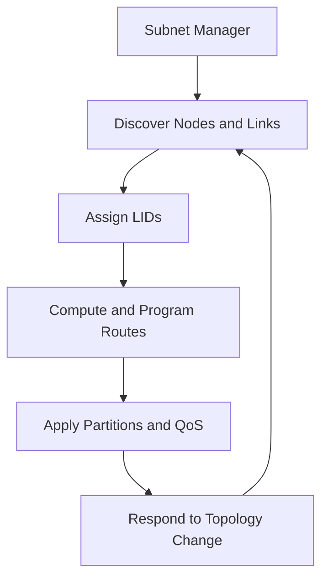

# Subnet Management and OpenSM

An InfiniBand fabric does not become usable merely because links are cabled. A Subnet Manager discovers the topology, assigns LIDs, programs forwarding tables, configures partitions and quality-of-service attributes, and reacts to change. OpenSM is a widely used implementation.

## Learning Objectives

Explain subnet-manager responsibilities, master/standby behavior, sweeps, routing-engine selection, and operational failure modes.

## Control Flow

Only one manager acts as master for a subnet, while additional managers can remain standby. Priority and election behavior must be planned so a maintenance event does not leave two uncontrolled instances or no active manager.

## Sweeps and State

The manager performs sweeps to discover changes and refresh state. Heavy or unstable topology change can increase control activity. Logs should be retained because forwarding and partition decisions may otherwise disappear after a restart.

Routing-engine choice affects path distribution, fault behavior, and congestion. The correct engine depends on topology and workload. Changing it without a benchmark and rollback plan can alter application performance even though all ports remain active.

## Production Architecture

Place redundant managers on reliable infrastructure with independent power and management reachability. Preserve configuration in version control. Define ownership for routing, partitions, service levels, and upgrades.

| Operational requirement | Design response |
|---|---|
| Manager failure | Tested standby election |
| Configuration drift | Git-managed configuration and checksums |
| Fabric expansion | Prevalidated routing and capacity model |
| Incident forensics | Persistent logs and topology snapshots |
| Maintenance | Change windows and rollback procedure |

## Troubleshooting

**Symptoms:** ports remain in Initializing, duplicate or missing LIDs, paths disappear after a manager restart, or performance changes after a fabric update.

Check master election, manager logs, topology discovery, forwarding programming, partition configuration, and routing-engine state. Compare a pre-change topology snapshot with current state.

A common mistake is restarting OpenSM repeatedly without preserving the first error. Collect evidence before intervention.

## Customer Scenario

A customer runs a single subnet manager on an administrator laptop. The fabric works during testing but becomes unavailable when the laptop is disconnected. Production design moves management to redundant controlled hosts, validates election, and monitors master identity.

## Interview Preparation

**Question:** Is the Subnet Manager in the application data path?

No. It is a control-plane component that discovers and programs the fabric. Existing forwarding can continue during some manager outages, but topology changes and recovery require healthy control-plane operation.

## Key Takeaways

- InfiniBand requires active subnet management.
- Redundancy must be tested, not assumed.
- Routing and partition changes are performance and security changes.
- Logs and topology snapshots are essential operational evidence.

## Cross References

- [Addressing](./chapter-04-lids-gids-pkeys-and-addressing)
- [Next: Routing and Topologies](./chapter-06-routing-topologies-and-oversubscription)
