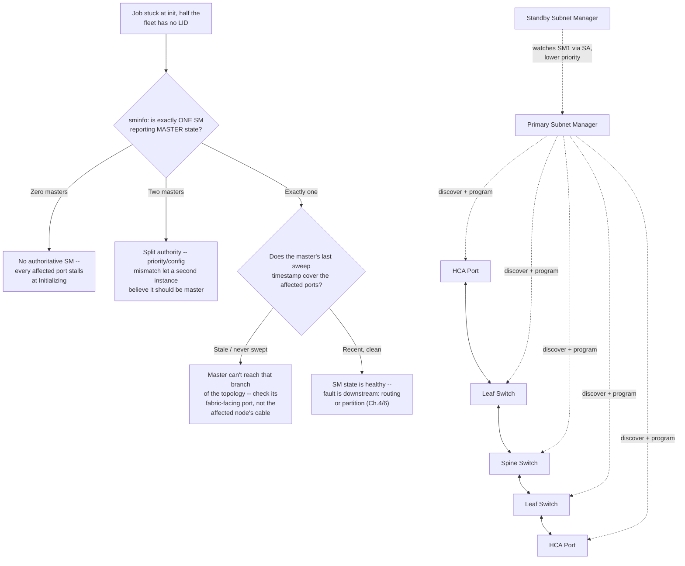
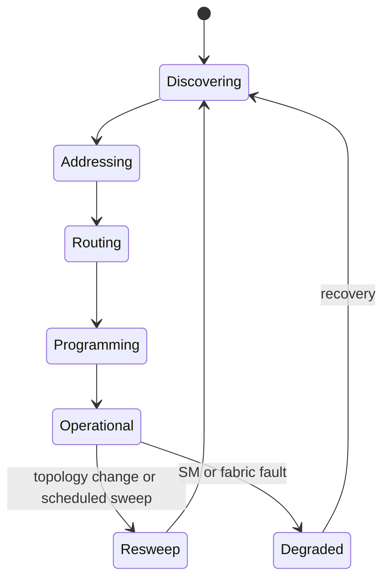
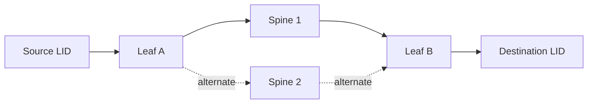
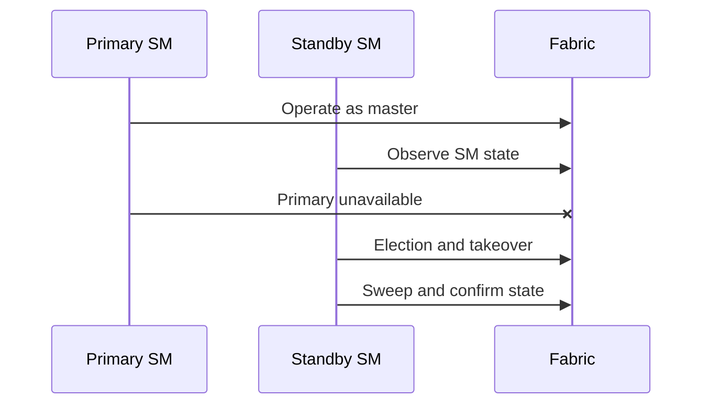

# Subnet Management and OpenSM

## Introduction

An InfiniBand cable can be connected, the port LEDs can be green, and the physical link can report `LinkUp`—yet applications may still be unable to communicate. Physical connectivity only proves that two ports can exchange link-level symbols. It does not prove that the fabric has been discovered, addressed, routed, partitioned, or placed into an operational state.

That work belongs to the **Subnet Manager (SM)**.

The Subnet Manager is the control-plane authority for an InfiniBand subnet. It discovers nodes and switches, assigns Local Identifiers (LIDs), computes forwarding paths, programs switch forwarding tables, applies partition policy, and reacts when the topology changes. OpenSM is a widely used implementation of that role.

| Chapter field | Value |
|---|---|
| Volume | 08 — InfiniBand |
| Difficulty | Advanced |
| Estimated reading time | 60–75 minutes |
| Primary focus | Fabric control plane and lifecycle |
| Previous | LIDs, GIDs, P_Keys, and Addressing |
| Next | Routing, Topologies, and Oversubscription |

## Story: Every Port Was Active, but the Cluster Was Down

A maintenance team replaces a failed fabric switch. The new switch powers on, all cables are restored, and every connected port negotiates the expected speed and width. The hardware team declares the replacement successful.

Distributed jobs still fail.

`ibstat` shows several HCA ports in `Initializing`, while others are `Active`. LIDs are missing on affected nodes. The fabric-management host can see the new switch over its out-of-band interface, but the active Subnet Manager has not integrated the new topology correctly.

The incident is eventually traced to a stale configuration and a competing standby SM with an unintended priority. Once the authoritative SM state is corrected and a controlled sweep completes, the ports transition to `Active`, LIDs are assigned, forwarding tables are rebuilt, and application traffic resumes.

The lesson is important:

> InfiniBand is not operational merely because the links are electrically healthy. The subnet must also be coherently managed.

## Learning Objectives

After completing this chapter, you will be able to:

- explain why InfiniBand requires a Subnet Manager;
- describe discovery, LID assignment, path computation, and forwarding-table programming;
- distinguish a fabric sweep from ordinary packet forwarding;
- explain SM priority, master election, and standby behavior;
- describe partition and quality-of-service policy distribution;
- identify failure modes caused by missing, competing, or stale SM state;
- design high availability for the subnet-management plane;
- build a production troubleshooting evidence set for OpenSM or another SM implementation.

## Big Picture



**Figure 8.5.1 — The Subnet Manager creates the logical fabric over the physical links, and "one authoritative master" is a specific, queryable fact, not an assumption.** Data packets do not pass through the SM in normal operation, but the diagram's decision tree makes explicit what this chapter's opening story took a full incident to discover: zero masters and two competing masters produce different symptom shapes, and both are distinguishable from a healthy SM that simply hasn't reached one branch of the topology yet.

## Why Centralized Subnet Management Exists

A switched fabric needs consistent answers to several questions:

- Which nodes, ports, and switches exist?
- Which physical links connect them?
- Which LIDs should be assigned?
- Which egress port should each switch use for each destination?
- Which endpoints belong to which partitions?
- Which service-level and virtual-lane policies apply?
- What should change when a link or switch fails?

InfiniBand places these responsibilities in a managed control plane. The central authority has a topology-wide view and can compute coherent paths rather than relying on each switch to independently discover and converge on all state.

This model provides strong control and observability, but it also makes SM design and availability part of the production architecture.

## The Subnet-Management Lifecycle

A simplified lifecycle is:

1. **Bind to a local management port.**
2. **Discover the topology.**
3. **Identify nodes, ports, switches, and links.**
4. **Assign or confirm LIDs.**
5. **Calculate routes.**
6. **Program switch forwarding tables.**
7. **Apply partition, service-level, and related policy.**
8. **Move eligible ports into operational state.**
9. **Monitor for traps, changes, and periodic sweep conditions.**
10. **Recalculate affected state when the topology changes.**



**Figure 8.5.2 — Subnet state is continuously maintained.** A sweep is not only a startup event; it is part of topology-change handling and operational recovery.

## Discovery

The SM traverses the fabric through management operations and builds a graph of:

- node GUIDs;
- port GUIDs;
- switch GUIDs;
- port numbers;
- link relationships;
- link state, speed, and width;
- switch capabilities;
- endpoint capabilities.

Discovery data should be exportable into an inventory that operations teams can compare with the intended cable plan. A topology mismatch may indicate:

- incorrect cabling;
- swapped switch ports;
- missing devices;
- duplicate inventory records;
- a failed or isolated link;
- an unintended fabric merge.

## LID Assignment

The SM assigns Local Identifiers used for forwarding within the subnet. LID assignment must remain consistent with the programmed forwarding state.

Operational implications include:

- LIDs can change after fabric events or policy changes;
- automation should inventory stable GUIDs as well as current LIDs;
- troubleshooting must compare endpoint and SM views;
- stale assumptions about LIDs can misidentify devices.

A port with no usable LID cannot participate normally in local-subnet forwarding even if its physical link is healthy.

## Path Computation and Forwarding Tables

InfiniBand switches forward using tables programmed by the SM. For each destination LID, a switch must know the correct output port.



**Figure 8.5.3 — Routing policy decides how available paths are used.** The SM can distribute destinations across multiple paths, but the algorithm must match topology and workload behavior.

Forwarding-table programming must be treated as a controlled change. An incorrect routing policy can create:

- hot links;
- unreachable destinations;
- asymmetric path concentration;
- poor rail balance;
- deadlock risk when combined with virtual-lane policy;
- unpredictable collective performance.

## Sweeps

A **sweep** is the process through which the SM discovers or revalidates topology and programs fabric state.

Common sweep triggers include:

- SM startup;
- periodic validation;
- link-state change;
- switch insertion or removal;
- trap or event notification;
- operator request;
- configuration change.

A full sweep may inspect the entire fabric. A lighter or targeted process may be used depending on implementation and event type. Large fabrics must balance convergence speed against management load and operational disruption.

### Sweep storms

Repeated topology flaps can cause repeated sweeps. Symptoms may include:

- elevated management traffic;
- unstable LIDs or routes;
- frequent application interruptions;
- high SM CPU use;
- noisy logs;
- delayed convergence.

The correct response is usually to identify the unstable link or component, not merely to suppress sweeping.

## OpenSM Architecture

OpenSM typically includes responsibilities such as:

- binding to an InfiniBand management port;
- discovering topology;
- maintaining the subnet database;
- selecting routing algorithms;
- assigning LIDs;
- programming forwarding tables;
- applying partition configuration;
- processing traps and events;
- writing logs and optional topology outputs.

OpenSM configuration is platform- and version-dependent. Production deployments should manage it as code, review changes, and retain the exact configuration used for each fabric generation.

## Master and Standby Subnet Managers

A subnet can contain more than one SM instance. One becomes **master**; others remain in standby or lower-priority roles.



**Figure 8.5.4 — SM high availability depends on election and takeover, not two independent masters.** Priority and identity must be deliberate.

### Design considerations

- Define the preferred master explicitly.
- Place standby SMs in different failure domains.
- Ensure all SMs use compatible configuration and routing policy.
- Monitor state transitions and master identity.
- Test takeover during a maintenance window.
- Avoid accidental SM instances embedded in hosts or switches unless intentionally managed.

### Split-authority risk

The fabric should not be subject to conflicting policy from unmanaged SM instances. Even when election prevents simultaneous master operation, inconsistent configurations can cause different behavior after failover.

### Annotated `sminfo`: proving there is exactly one master

```text
$ sminfo
sminfo: sm lid 1 sm guid 0x0002c903004a1b20, activity count 184223 priority 15 state 3 SMINFO_MASTER
```

Read this field by field: `state 3` decodes to `SMINFO_MASTER` — this SM believes it is authoritative. `priority 15` is its configured priority (higher wins an election). `activity count` increments on real subnet-management work and should be climbing over successive queries, not frozen — a frozen activity count on a self-declared master is a sign it has stopped actually managing the subnet while still holding the role. Querying `sminfo` against every known SM host and confirming exactly one reports `SMINFO_MASTER`, with the rest reporting `SMINFO_STANDBY` at lower priority, is the single fastest way to rule out the split-authority failure mode above — and it is a read-only query, safe to run mid-incident.

## Partition Management

The SM distributes P_Key membership and partition policy. A partition configuration should define:

- partition identity;
- full and limited membership;
- member GUIDs or selectors;
- service-level mappings where applicable;
- ownership and change process.

Partition policy must be coordinated with:

- host security;
- scheduler placement;
- tenant identity;
- application authorization;
- monitoring and audit.

P_Keys are one control in a multi-layer isolation design, not the entire security boundary.

## Quality of Service and Service Levels

The control plane can influence service-level and virtual-lane mappings. These policies may be used to:

- separate traffic classes;
- reduce interference;
- support deadlock-free routing;
- prioritize management or storage traffic;
- implement workload-specific behavior.

Incorrect policy can produce head-of-line blocking, starvation, or ineffective isolation. QoS should be validated under simultaneous traffic, not only by reading configuration.

## High-Availability Architecture

A production SM design should address:

| Concern | Design question |
|---|---|
| Failure domain | Are primary and standby SMs on independent hosts, power, and management paths? |
| Configuration | Are routing, partitions, and QoS policies identical and version controlled? |
| Election | Is priority intentional and documented? |
| Monitoring | Can operators see current master, standby state, sweep health, and recent transitions? |
| Recovery | Has failover been tested with active traffic? |
| Upgrade | Can one SM be upgraded while another remains authoritative? |
| Rollback | Can the previous binary and configuration be restored quickly? |

HA is not proved by merely running two processes. It is proved by controlled takeover and stable post-failover behavior.

## Production Deployment Pattern

A robust deployment commonly separates:

- **fabric data plane** — HCAs, switches, and links;
- **subnet-management plane** — SM processes and their fabric-facing ports;
- **out-of-band management plane** — SSH, APIs, switch management, logs, and monitoring;
- **configuration source of truth** — routing, partitions, QoS, and inventory;
- **observability pipeline** — logs, alerts, topology snapshots, and event history.

Do not make the SM host reachable only through the fabric it manages. Operators need an independent path during fabric failure.

## Observability

Monitor at least:

- current master SM identity;
- standby SM state;
- last successful sweep;
- sweep duration;
- topology-change frequency;
- number of discovered nodes, ports, and switches;
- duplicate or unexpected GUIDs;
- ports not reaching expected state;
- routing or partition programming errors;
- SM CPU, memory, and process health;
- configuration checksum or version.

Store periodic topology snapshots. They provide valuable before-and-after evidence during incidents.

## Production Troubleshooting

### Scenario 1 — Ports remain in `Initializing`

**Symptoms**

- physical link is up;
- port state does not reach `Active`;
- LID is absent or invalid;
- applications cannot communicate.

**Diagnosis**

1. Verify an SM is running and bound to the intended fabric.
2. Confirm the SM can reach the affected branch of the topology.
3. Inspect SM logs for discovery or programming errors.
4. Check whether another SM has unexpectedly become master.
5. Compare GUID and partition state.

**Root causes**

- no active SM;
- SM bound to the wrong port;
- isolated topology segment;
- incompatible or stale configuration;
- duplicate or conflicting management state.

**Resolution**

Restore one authoritative, correctly configured SM and confirm a successful sweep.

**Evidence.** `sminfo` (above) against every candidate host is the first read. If it returns zero masters:

```text
$ sminfo
sminfo: iberror: failed: query resp was not SMINFO
```

This specific failure — a query error rather than a standby response — means no SM on the local management port is responding as authoritative at all, consistent with "no active SM" in the root-cause list. Pair it with `ibstat`'s `SM lid: 0` on affected ports (Chapter 2's annotated output) to confirm the two symptoms are the same root cause observed from two different vantage points, not two separate problems.

### Scenario 2 — Fabric behavior changes after SM failover

**Symptoms**

- reachability remains;
- path distribution changes;
- congestion or performance worsens;
- partitions behave differently.

**Likely cause**

The standby SM uses a different routing, partition, or QoS configuration.

**Resolution**

Standardize configuration artifacts, validate checksums before activation, and test failover as part of change management.

### Scenario 3 — Repeated sweeps and unstable applications

**Symptoms**

- frequent topology-change logs;
- ports repeatedly transition;
- jobs encounter intermittent communication errors.

**Diagnosis**

Correlate sweep timestamps with port traps, physical counters, switch logs, and cable inventory.

**Root cause**

A flapping link, failing cable, unstable port, or power event repeatedly changes topology.

**Resolution**

Quarantine or replace the unstable component, then verify sweep frequency returns to baseline.

**Evidence.** OpenSM's log at heavy-sweep volume names the trigger explicitly rather than requiring inference:

```text
Aug 06 14:02:11 [opensm] osm_state_mgr.c:812: OSM_LOG: Received a heavy sweep flag
Aug 06 14:02:11 [opensm] osm_trap_rcv.c:349: OSM_LOG: Trap 128 received (link state change): LID 44 port 3
Aug 06 14:02:14 [opensm] osm_state_mgr.c:812: OSM_LOG: Received a heavy sweep flag
Aug 06 14:02:14 [opensm] osm_trap_rcv.c:349: OSM_LOG: Trap 128 received (link state change): LID 44 port 3
Aug 06 14:02:18 [opensm] osm_state_mgr.c:812: OSM_LOG: Received a heavy sweep flag
Aug 06 14:02:18 [opensm] osm_trap_rcv.c:349: OSM_LOG: Trap 128 received (link state change): LID 44 port 3
```

The repeated `Trap 128` (link state change) against the same `LID 44 port 3` every few seconds is the unstable component identifying itself in the log — this is a flapping link, not a fabric-wide instability. `grep`-ing OpenSM's log for `Trap 128` and counting occurrences by LID/port turns "the fabric feels unstable" into a ranked list of exactly which port to physically inspect first.

### Scenario 4 — New node is visible but cannot join the intended tenant

**Symptoms**

- port is active;
- LID exists;
- general diagnostics pass;
- tenant application communication fails.

**Likely cause**

P_Key membership or policy was not updated for the new port GUID.

**Resolution**

Correct the partition source of truth, apply the change through the SM, and verify endpoint membership from both sides.

## Customer Scenario

A customer asks whether placing the SM on one management VM is sufficient for a 1,024-GPU production cluster.

The architect does not answer only with a yes or no. The discussion covers:

- fabric size and sweep duration;
- management-host failure domain;
- out-of-band reachability;
- standby placement;
- configuration consistency;
- upgrade and rollback procedures;
- monitoring and operational ownership;
- recovery objectives.

The recommendation may still use a VM, but the VM becomes part of a tested HA architecture rather than an undocumented singleton.

## Interview Preparation

### Knowledge Questions

1. Why can an InfiniBand port be physically up but not operational?
   **Model answer:** "Because physical link-up only proves signal and lane negotiation succeeded between two directly connected ports — it says nothing about whether the subnet manager has discovered that port, assigned it a LID, and programmed the switches around it into the forwarding tables. Until that happens, the port is electrically fine and logically invisible."

2. What does the Subnet Manager assign and program?
   **Model answer:** "It assigns Local Identifiers to every port, computes forwarding paths across the topology it discovered, and programs those paths into every switch's forwarding table. It also distributes partition and QoS policy. Switches don't compute any of this themselves — they're pure execution engines for state the SM pushes down."

3. Why are GUIDs more useful than LIDs for inventory?
   **Model answer:** "LIDs are runtime-assigned and can change on a resweep, a topology event, or a policy change. GUIDs are meant to track the hardware object itself. If your source of truth is keyed on LID, a routine SM operation can silently invalidate your inventory; keyed on GUID, it stays correct and you just refresh the LID field as observed state."

4. What triggers a sweep?
   **Model answer:** "Startup, periodic revalidation on a timer, a link-state change trap, a switch being added or removed, or an operator-requested configuration change. The important operational point is that a sweep isn't just a startup-time event — it's the ongoing mechanism the SM uses to keep programmed state matching actual topology, which is why repeated sweeps are a symptom worth investigating, not just background noise."

5. How do partitions relate to the SM?
   **Model answer:** "The SM is the thing that actually distributes P_Key membership into endpoint and switch tables — the partition policy is a configuration input, but it only becomes real fabric behavior once the SM pushes it out. That's why a partition-policy change that 'was applied' still needs verification against the SM's programmed state, not just the source config file."

### Architecture Questions

1. Design SM high availability for a multi-rack fabric.
   **Model answer:** "One primary with explicit, documented priority, at least one standby in a genuinely separate failure domain — different power, different management path — running identical, version-controlled routing and partition configuration. I'd insist on testing takeover under real traffic before calling it done, because a standby with drifted config can 'successfully' take over and still reroute the fabric differently, which shows up later as an unexplained performance regression."

2. Explain how routing configuration reaches switches.
   **Model answer:** "It doesn't get typed into each switch — the SM computes the forwarding tables centrally, based on discovered topology and the selected routing engine's algorithm, then pushes that state into every switch as part of the sweep. Switches are consumers of this state, not participants in computing it, which is exactly why one authoritative SM matters so much: two SMs with different routing policy would push contradictory tables."

3. Design an out-of-band management path for the SM environment.
   **Model answer:** "The SM management host needs to be reachable through a path that doesn't depend on the InfiniBand fabric it's managing — otherwise a fabric-wide failure also removes your ability to fix it. I'd put SM hosts on a dedicated management network with its own switching, independent of production data-plane connectivity, and make sure that's true for both primary and standby, not just primary."

### Scenario Questions

1. All links show `LinkUp`, but half the nodes have no LID. What do you inspect?
   **Model answer:** "SM state first — `sminfo` to confirm exactly one authoritative master exists and is actively sweeping, not zero and not two. `LinkUp` with no LID is the textbook signature of a control-plane gap, not a physical one, so I wouldn't touch cables."

2. Performance changes after failover to a standby SM. What is your hypothesis?
   **Model answer:** "My first hypothesis is configuration drift — the standby likely has a different routing engine setting, partition policy, or QoS mapping than the primary had, even though both are 'running fine' individually. I'd diff the two configurations directly rather than assume the standby is simply worse hardware."

3. A new rack causes frequent sweeps. How do you isolate the cause?
   **Model answer:** "Grep the SM log for repeated trap events and see if they cluster on one LID/port — that's almost always a flapping link from a new rack's fresh cabling, not a fabric-wide problem. I'd rank ports by trap frequency and go straight to the top of that list rather than inspecting the whole rack."

### Customer Questions

1. Can the subnet manager run on a compute node?
   **Model answer:** "Technically often yes, but I'd advise against it for anything production-scale — you don't want SM availability coupled to whatever else that node is doing, including being rebooted or drained for maintenance as a compute resource. A dedicated management host, or at minimum a clearly protected role, keeps the control plane's failure domain independent of workload scheduling."

2. How many SM instances should we deploy?
   **Model answer:** "At minimum two — one master, one standby, in separate failure domains — for anything beyond a small lab. The number isn't really the design question though; the design question is whether you've tested that the standby actually takes over cleanly with identical behavior, because two SM processes with drifted config is arguably worse than one, since it creates a false sense of redundancy."

3. What evidence proves SM failover is safe?
   **Model answer:** "A documented takeover test under real or representative traffic, not just confirming the standby process starts. I want to see: takeover completes within an acceptable time, forwarding state after takeover matches the pre-failover state, and application traffic doesn't observe a correctness issue — only a bounded pause, if any."

### Whiteboard Question

Draw primary and standby SMs, the fabric-facing management path, the out-of-band management path, and the configuration source of truth. Mark the failure domains.

**What I'd actually say while drawing:** "Primary SM here with a solid line into the fabric — that's its fabric-facing management path, how it discovers and programs switches. Standby SM over here, physically separate power and management infrastructure — I'd circle that separation and label it 'failure domain boundary,' because that's the whole point of having a standby. Both SMs pull from the same configuration source of truth — I'd draw that as a shared box feeding both, version-controlled, because if it feeds them different configs, the standby isn't actually redundant, it's just a second opinion. And critically, I'd draw the out-of-band path — SSH, management API — reaching both SM hosts through a network that doesn't route through the InfiniBand fabric itself, with a note: 'if this depends on the fabric being healthy, I can't fix the fabric when it's unhealthy.'"

## Summary

The Subnet Manager turns physical InfiniBand links into an addressed, routed, partitioned, and operational subnet. OpenSM implements this control-plane role through discovery, LID assignment, route computation, forwarding-table programming, policy distribution, and topology-change handling.

Production reliability depends on authoritative configuration, deliberate master election, tested standby takeover, independent management access, and strong observability.

## Key Takeaways

- Link health and subnet health are different.
- One authoritative SM controls addressing and forwarding state.
- Standby SMs require consistent configuration and tested takeover.
- Sweeps are normal, but repeated sweeps often indicate instability.
- Partition and QoS policy are part of the control-plane lifecycle.
- Topology snapshots and SM logs are essential incident evidence.

## Quick Revision Sheet

| Concept | Remember |
|---|---|
| Subnet Manager | Discovers and programs the subnet |
| Sweep | Reconciles topology and fabric state |
| Master SM | Current control-plane authority |
| Standby SM | Candidate for controlled takeover |
| LID assignment | Enables local-subnet forwarding |
| Routing engine | Computes switch forwarding state |
| Partition configuration | Distributes P_Key membership |

## Lab Checklist

Before moving on, confirm that you can:

- identify the current master SM;
- explain why a port may remain `Initializing`;
- collect a topology snapshot;
- compare primary and standby configuration;
- correlate a sweep with a topology event;
- verify partition membership.

## Cross References

- Previous: [LIDs, GIDs, P_Keys, and Addressing](./chapter-04-lids-gids-pkeys-and-addressing)
- Next: [Routing, Topologies, and Oversubscription](./chapter-06-routing-topologies-and-oversubscription)
- Related lab: [Inspect Subnet Routing and Counters](./labs/lab-03-inspect-subnet-routing-and-counters)

## Further Reading

Use the documentation for the exact OpenSM, switch, firmware, and fabric-management release deployed in your environment. Routing engines, configuration syntax, telemetry, and HA behavior are version-sensitive.