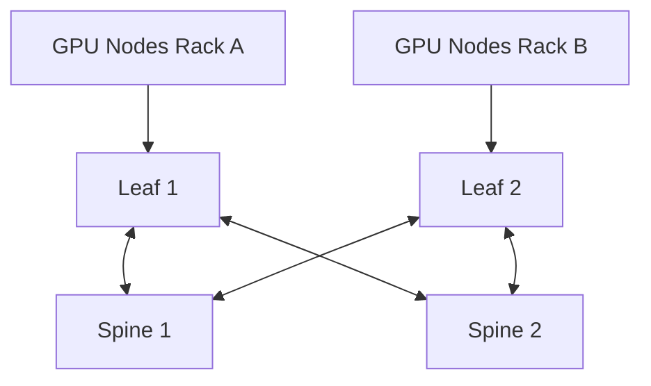
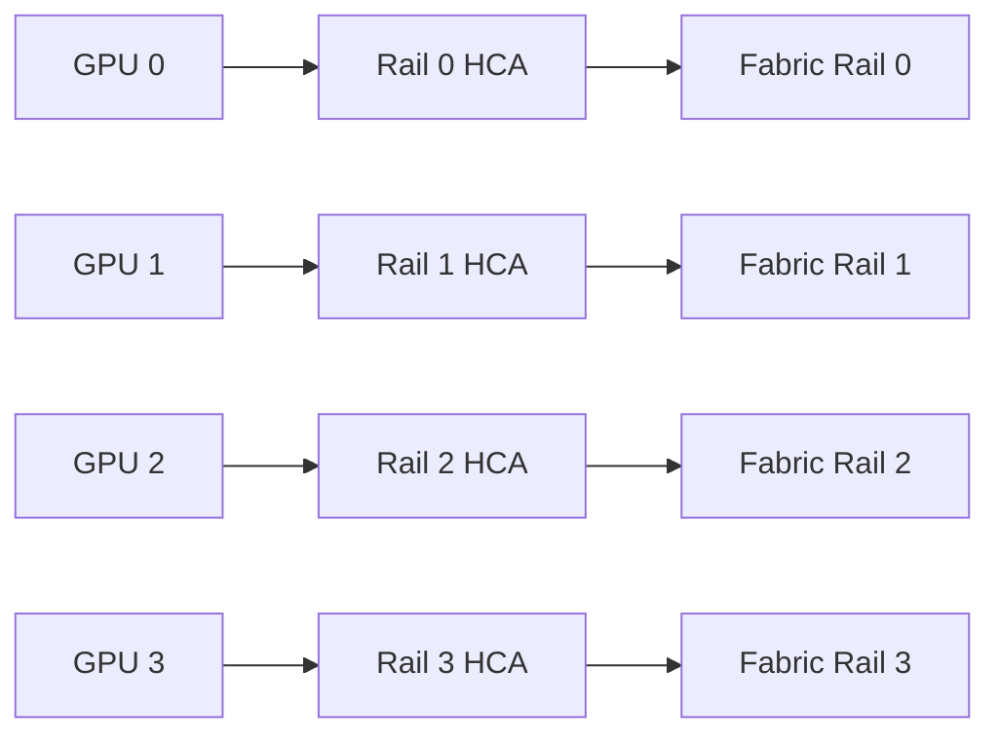
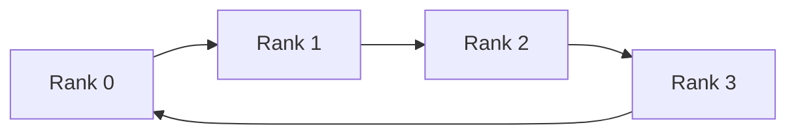

# Routing, Topologies, and Oversubscription

## Introduction

A cluster may contain identical switches, identical cables, and identical HCAs, yet two jobs can experience very different communication performance. The difference is often the path traffic takes through the fabric.

InfiniBand routing is not an implementation detail. It determines which links carry each destination flow, how evenly traffic is distributed, where oversubscription appears, and how failures reshape available capacity.

| Chapter field | Value |
|---|---|
| Volume | 08 — InfiniBand |
| Difficulty | Expert |
| Estimated reading time | 60–75 minutes |
| Primary focus | Topology and route design |
| Previous | Subnet Management and OpenSM |
| Next | Adaptive Routing and Congestion Control |

## Story: The Fabric Had Enough Bandwidth—But Not on the Used Paths

A 256-GPU cluster is built with sufficient aggregate switch bandwidth. Point-to-point tests between selected nodes look healthy. Large distributed jobs still underperform.

The routing review shows that many rank pairs traverse the same small set of uplinks. Other links remain lightly used. The fabric is not short of total bandwidth; its routing policy and workload placement concentrate communication onto a subset of paths.

After the team aligns routing, rail selection, and rank placement with the physical topology, collective throughput improves without replacing hardware.

> Aggregate capacity matters only when the routing and workload can use it.

## Learning Objectives

After completing this chapter, you will be able to:

- explain destination-based forwarding in an InfiniBand subnet;
- compare leaf-spine, fat-tree, rail-optimized, and torus-style designs;
- calculate and interpret oversubscription;
- distinguish path diversity from actual load distribution;
- explain how routing interacts with collectives and job placement;
- identify failure-domain and convergence trade-offs;
- troubleshoot hot links and asymmetric paths;
- communicate topology choices to customers.

## Big Picture



**Figure 8.6.1 — A folded Clos provides multiple equal-length paths.** The routing engine decides how destination traffic is assigned across them.

## Topology Is a Graph

Treat the fabric as a graph:

- ports and switches are vertices or attachment points;
- links are edges;
- bandwidth and failure state are edge properties;
- endpoint placement determines source and destination location;
- routing selects a path through the graph.

A topology drawing should include:

- endpoint count per leaf;
- link width and speed;
- uplink count;
- rail membership;
- switch tier;
- expected failure domains;
- storage or management traffic sharing;
- cable and port identifiers.

## Destination-Based Forwarding

Within a subnet, switches forward traffic according to programmed destination state. The Subnet Manager computes paths and writes forwarding tables.

A route must answer:

1. which egress port should be used for a destination LID;
2. whether multiple LIDs or path variants distribute traffic;
3. how failures change the selected path;
4. whether the path violates policy or partition constraints.

Routing is therefore coupled to LID strategy, topology, and the selected routing engine.

## Common Topologies

### Leaf-spine or folded Clos

A folded Clos connects endpoint-facing leaf switches to a spine layer. It offers:

- predictable hop count;
- path diversity;
- modular expansion;
- clear failure domains;
- straightforward cabling patterns.

Its cost depends on the number of uplinks required to maintain desired bisection bandwidth.

### Fat-tree

A fat-tree increases aggregate capacity toward upper tiers so that communication between branches does not collapse onto narrow links. In practice, many AI fabrics use Clos-style implementations described as fat-tree designs.

### Rail-optimized design

Multi-rail GPU systems may connect each GPU or GPU group to a corresponding network rail. The goal is to preserve parallel network paths and reduce adapter contention.



**Figure 8.6.2 — Rail-optimized designs align local GPU-to-HCA paths with independent fabric capacity.** Software must preserve that alignment.

### Torus and mesh designs

Torus or mesh topologies may reduce switch count or exploit nearest-neighbor communication patterns, but routing, failure handling, and application mapping become more specialized. They are less common for general-purpose AI clusters than Clos-derived designs.

## Oversubscription

Oversubscription compares offered edge capacity with upstream capacity.

A simplified ratio is:

```text
oversubscription = total downlink bandwidth / total uplink bandwidth
```

A leaf with 16 endpoint links and 8 same-speed uplinks has a nominal 2:1 oversubscription ratio.

This ratio is only a starting point. Real behavior depends on:

- whether all endpoints communicate simultaneously;
- destination distribution;
- message sizes;
- collective algorithm;
- route balance;
- rail usage;
- storage traffic;
- failure state.

### When oversubscription is acceptable

Oversubscription can be reasonable when:

- workloads are mostly local;
- jobs rarely use all nodes simultaneously;
- inference traffic is bursty and independent;
- budget or port availability is constrained;
- measurement proves service objectives are met.

It is risky for tightly synchronized all-to-all or AllReduce-heavy workloads because many endpoints can demand upstream capacity at once.

## Bisection Bandwidth

Bisection bandwidth asks how much capacity remains when the fabric is divided into two large endpoint groups that communicate across the cut.

For distributed AI, bisection behavior often matters more than aggregate port bandwidth. A fabric can advertise enormous total bandwidth while a particular rack-to-rack cut remains narrow.

## Path Diversity Versus Load Distribution

Multiple physical paths do not guarantee that traffic uses them evenly.

Possible reasons include:

- destination-based hashing or table assignment;
- too few independent flows;
- static LID mapping;
- rank placement concentrating peers;
- one rail selected by software;
- failed or degraded links;
- routing policy optimized for a different communication pattern.

Measure per-link utilization during representative collectives. A topology diagram alone cannot prove balance.

## Routing Engines

Routing engines may optimize for different objectives, such as:

- shortest path;
- balanced destination distribution;
- fat-tree awareness;
- up/down constraints;
- deadlock avoidance;
- topology-specific behavior;
- rail preservation.

The selected algorithm should be documented with:

- intended topology;
- assumptions;
- failure behavior;
- partition and QoS interaction;
- validation method;
- rollback plan.

## Collectives and Routing

Collective libraries construct communication schedules such as rings, trees, or hierarchical combinations. Fabric routing then carries each point-to-point segment.



A ring that repeatedly crosses an oversubscribed cut can underperform even when each link is healthy. Hierarchical collectives can reduce inter-rack traffic by aggregating locally before crossing the fabric.

Architecture should therefore consider:

- rank ordering;
- node and rack placement;
- collective algorithm;
- GPU-to-HCA locality;
- route distribution;
- concurrent jobs.

## Failure Behavior

When a link fails, the fabric may have an alternate physical path. The SM must detect the change and program a usable route. Capacity after failover may be lower even if reachability is restored.

A good design defines:

- single-link failure capacity;
- single-switch failure blast radius;
- convergence expectations;
- workload interruption behavior;
- degraded-mode alert thresholds;
- maintenance procedures.

## Production Design Framework

Evaluate topology in this order:

1. workload communication pattern;
2. node and GPU count;
3. required per-node injection bandwidth;
4. rack size and power constraints;
5. oversubscription target;
6. failure-domain requirements;
7. routing algorithm;
8. growth model;
9. cable and operational complexity;
10. cost.

Avoid selecting switch count before calculating communication requirements.

## Observability

Monitor:

- link utilization by port;
- route distribution;
- congestion indicators;
- failed or degraded links;
- path changes after sweeps;
- rail balance;
- rack-to-rack benchmark results;
- collective performance by placement;
- topology drift from source of truth.

Create heat maps that reveal persistent hot links and unused capacity.

## Production Troubleshooting

### Scenario 1 — Hot uplinks with idle alternatives

**Symptoms**

- a few uplinks saturate;
- other equal-speed links remain lightly used;
- collective performance varies by node set.

**Diagnosis**

Compare routing tables, destination distribution, rank placement, and per-port counters.

**Root cause**

Static routing or placement concentrates flows on a subset of paths.

**Resolution**

Adjust routing policy, LID distribution, or workload placement, then validate under concurrent collective traffic.

### Scenario 2 — Performance collapses after one link failure

**Symptoms**

- reachability remains;
- throughput drops more than expected;
- one fabric tier becomes congested.

**Root cause**

The alternate path exists but creates a severe capacity bottleneck.

**Resolution**

Restore the failed link and update failure-capacity planning. Consider additional path diversity if the degraded mode does not meet objectives.

### Scenario 3 — Same-rack jobs are fast; cross-rack jobs are slow

**Diagnosis**

Measure leaf-local versus spine-crossing traffic, uplink capacity, route balance, and oversubscription.

**Likely cause**

An oversubscribed or poorly balanced inter-rack tier.

### Scenario 4 — One rail carries most traffic

**Diagnosis**

Check GPU-to-HCA topology, interface selection, collective-library logs, environment variables, and rail health.

**Resolution**

Restore topology-aware multi-rail selection and verify symmetric load.

## Customer Scenario

A customer asks whether a 2:1 oversubscribed fabric is “good enough” for a 512-GPU training environment.

The architect asks:

- Which collective patterns dominate?
- How many GPUs participate per job?
- Are jobs confined to racks or spread globally?
- What is the target scaling efficiency?
- What happens during one uplink failure?
- Is future expansion planned?

The answer is based on workload and failure measurements, not a universal rule.

## Interview Preparation

### Knowledge Questions

1. What is oversubscription?
2. Why does bisection bandwidth matter?
3. How can multiple physical paths remain underused?
4. What is a rail-optimized design?
5. Why can reachability survive while performance collapses?

### Architecture Questions

1. Design a nonblocking fabric for 256 GPU nodes.
2. Compare a single large fabric with multiple rails.
3. Explain how routing and rank placement interact.

### Scenario Questions

1. Only cross-rack collectives are slow. What evidence do you collect?
2. One spine link fails and performance halves. Is that expected?
3. Per-port counters show persistent imbalance. What do you inspect?

### Whiteboard Question

Draw a two-tier folded Clos, label endpoint and uplink capacity, calculate oversubscription, and show the effect of one failed spine link.

## Summary

InfiniBand routing converts topology into usable communication paths. The design must align physical capacity, route distribution, collective behavior, placement, and failure objectives.

Oversubscription is not automatically wrong, but it must be explicit, measured, and justified. Path diversity has value only when software and routing distribute traffic across it.

## Key Takeaways

- Aggregate bandwidth does not guarantee usable bandwidth.
- Oversubscription must be evaluated against workload concurrency.
- Routing and placement jointly determine hot spots.
- Collectives can amplify weak cuts in the topology.
- Failure recovery must consider capacity, not only reachability.
- Per-link telemetry is required to prove route balance.

## Quick Revision Sheet

| Concept | Remember |
|---|---|
| Folded Clos | Multi-path leaf-spine topology |
| Fat-tree | Capacity increases toward upper tiers |
| Oversubscription | Downlink demand exceeds uplink capacity |
| Bisection bandwidth | Capacity across a major topology cut |
| Rail | Independent local and fabric path |
| Routing engine | Computes forwarding-table policy |
| Hot link | Path concentration or capacity bottleneck |

## Cross References

- Previous: [Subnet Management and OpenSM](./chapter-05-subnet-management-and-opensm)
- Next: [Adaptive Routing and Congestion Control](./chapter-07-adaptive-routing-and-congestion-control)
- Related lab: [Inspect Subnet Routing and Counters](./labs/lab-03-inspect-subnet-routing-and-counters)

## Further Reading

Consult the routing-engine and topology guidance for the exact fabric-management release and switch generation in use. Validate every design with representative collective traffic and failure testing.