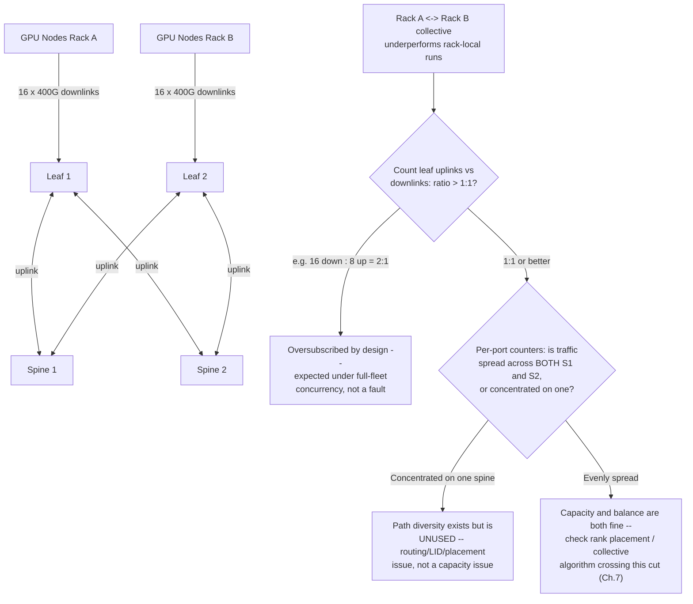
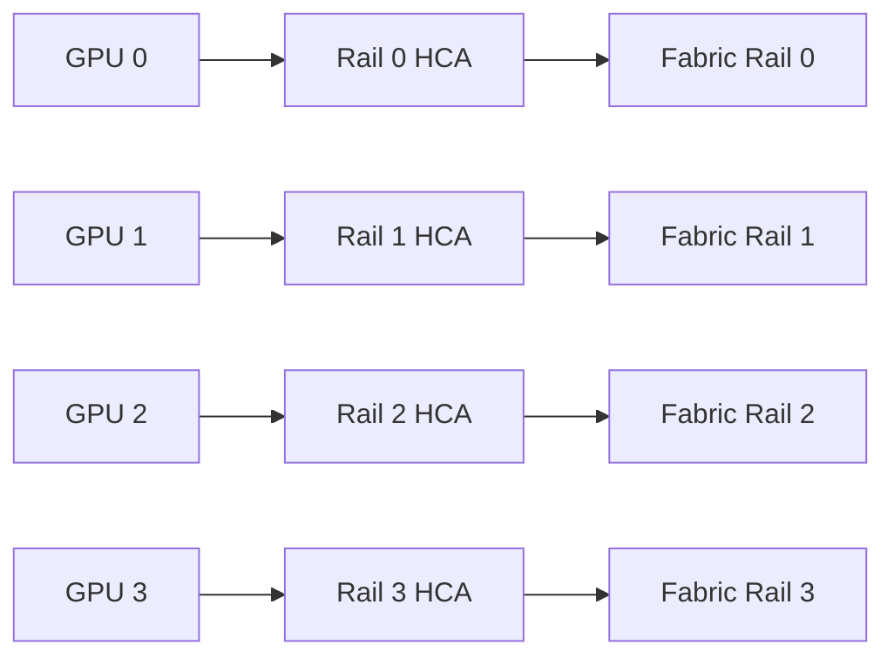
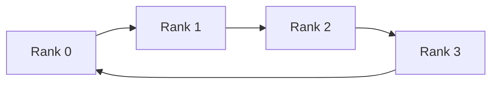

# Routing, Topologies, and Oversubscription

## Introduction

A cluster may contain identical switches, identical cables, and identical HCAs, yet two jobs can experience very different communication performance. The difference is often the path traffic takes through the fabric.

InfiniBand routing is not an implementation detail. It determines which links carry each destination flow, how evenly traffic is distributed, where oversubscription appears, and how failures reshape available capacity.

| Chapter field | Value |
|---|---|
| Volume | 08 — InfiniBand |
| Difficulty | Expert |
| Estimated reading time | 60–75 minutes |
| Primary focus | Topology and route design |
| Previous | Subnet Management and OpenSM |
| Next | Adaptive Routing and Congestion Control |

## Story: The Fabric Had Enough Bandwidth—But Not on the Used Paths

A 256-GPU cluster is built with sufficient aggregate switch bandwidth. Point-to-point tests between selected nodes look healthy. Large distributed jobs still underperform.

The routing review shows that many rank pairs traverse the same small set of uplinks. Other links remain lightly used. The fabric is not short of total bandwidth; its routing policy and workload placement concentrate communication onto a subset of paths.

After the team aligns routing, rail selection, and rank placement with the physical topology, collective throughput improves without replacing hardware.

> Aggregate capacity matters only when the routing and workload can use it.

## Learning Objectives

After completing this chapter, you will be able to:

- explain destination-based forwarding in an InfiniBand subnet;
- compare leaf-spine, fat-tree, rail-optimized, and torus-style designs;
- calculate and interpret oversubscription;
- distinguish path diversity from actual load distribution;
- explain how routing interacts with collectives and job placement;
- identify failure-domain and convergence trade-offs;
- troubleshoot hot links and asymmetric paths;
- communicate topology choices to customers.

## Big Picture



**Figure 8.6.1 — A folded Clos provides multiple equal-length paths, but the diagram's real question is whether the fabric's nonblocking claim survives the arithmetic and whether the paths it provides are actually used.** Two racks can show identical topology drawings and completely different delivered bandwidth depending on the downlink:uplink ratio (a design fact) and route balance (an operational fact) — Scenario 1 below is exactly the second branch.

## Topology Is a Graph

Treat the fabric as a graph:

- ports and switches are vertices or attachment points;
- links are edges;
- bandwidth and failure state are edge properties;
- endpoint placement determines source and destination location;
- routing selects a path through the graph.

A topology drawing should include:

- endpoint count per leaf;
- link width and speed;
- uplink count;
- rail membership;
- switch tier;
- expected failure domains;
- storage or management traffic sharing;
- cable and port identifiers.

## Destination-Based Forwarding

Within a subnet, switches forward traffic according to programmed destination state. The Subnet Manager computes paths and writes forwarding tables.

A route must answer:

1. which egress port should be used for a destination LID;
2. whether multiple LIDs or path variants distribute traffic;
3. how failures change the selected path;
4. whether the path violates policy or partition constraints.

Routing is therefore coupled to LID strategy, topology, and the selected routing engine.

## Common Topologies

### Leaf-spine or folded Clos

A folded Clos connects endpoint-facing leaf switches to a spine layer. It offers:

- predictable hop count;
- path diversity;
- modular expansion;
- clear failure domains;
- straightforward cabling patterns.

Its cost depends on the number of uplinks required to maintain desired bisection bandwidth.

### Fat-tree

A fat-tree increases aggregate capacity toward upper tiers so that communication between branches does not collapse onto narrow links. In practice, many AI fabrics use Clos-style implementations described as fat-tree designs.

### Rail-optimized design

Multi-rail GPU systems may connect each GPU or GPU group to a corresponding network rail. The goal is to preserve parallel network paths and reduce adapter contention.



**Figure 8.6.2 — Rail-optimized designs align local GPU-to-HCA paths with independent fabric capacity.** Software must preserve that alignment.

### Torus and mesh designs

Torus or mesh topologies may reduce switch count or exploit nearest-neighbor communication patterns, but routing, failure handling, and application mapping become more specialized. They are less common for general-purpose AI clusters than Clos-derived designs.

## Oversubscription

Oversubscription compares offered edge capacity with upstream capacity.

A simplified ratio is:

```text
oversubscription = total downlink bandwidth / total uplink bandwidth
```

A leaf with 16 endpoint links and 8 same-speed uplinks has a nominal 2:1 oversubscription ratio.

This ratio is only a starting point. Real behavior depends on:

- whether all endpoints communicate simultaneously;
- destination distribution;
- message sizes;
- collective algorithm;
- route balance;
- rail usage;
- storage traffic;
- failure state.

### When oversubscription is acceptable

Oversubscription can be reasonable when:

- workloads are mostly local;
- jobs rarely use all nodes simultaneously;
- inference traffic is bursty and independent;
- budget or port availability is constrained;
- measurement proves service objectives are met.

It is risky for tightly synchronized all-to-all or AllReduce-heavy workloads because many endpoints can demand upstream capacity at once.

### Worked example: what 2:1 oversubscription actually costs an AllReduce

Take a leaf with 16 endpoint-facing 400Gb/s downlinks and 8 uplink ports of the same 400Gb/s generation: downlink capacity is 16 × 400 = 6,400Gb/s; uplink capacity is 8 × 400 = 3,200Gb/s. That is a 2:1 oversubscription ratio by the formula above.

Now put a synchronized AllReduce on all 16 nodes under that leaf, where each node simultaneously needs to send its full share of gradient data to nodes under other leaves. If every node offered its full 400Gb/s toward the uplinks at once, aggregate demand would be 6,400Gb/s against 3,200Gb/s of available uplink capacity — each node's effective cross-leaf bandwidth collapses to roughly 3,200 / 16 ≈ 200Gb/s, half of its nominal link rate, purely from the oversubscription ratio, before any other contention is even considered. For a ring-based AllReduce moving, illustratively, 2GB of gradient data per node per step, that is the difference between roughly 2GB / 50GB/s (near-full 400Gb/s effective) ≈ 40ms and roughly 2GB / 25GB/s (oversubscription-limited) ≈ 80ms of pure communication time per step — a number that compounds across every synchronized step of a multi-day training run. This is the arithmetic behind "aggregate capacity matters only when the routing and workload can use it": the fabric's total port count never changes, only what fraction of it a synchronized burst can actually claim at once.

## Bisection Bandwidth

Bisection bandwidth asks how much capacity remains when the fabric is divided into two large endpoint groups that communicate across the cut.

For distributed AI, bisection behavior often matters more than aggregate port bandwidth. A fabric can advertise enormous total bandwidth while a particular rack-to-rack cut remains narrow.

## Path Diversity Versus Load Distribution

Multiple physical paths do not guarantee that traffic uses them evenly.

Possible reasons include:

- destination-based hashing or table assignment;
- too few independent flows;
- static LID mapping;
- rank placement concentrating peers;
- one rail selected by software;
- failed or degraded links;
- routing policy optimized for a different communication pattern.

Measure per-link utilization during representative collectives. A topology diagram alone cannot prove balance.

## Routing Engines

Routing engines may optimize for different objectives, such as:

- shortest path;
- balanced destination distribution;
- fat-tree awareness;
- up/down constraints;
- deadlock avoidance;
- topology-specific behavior;
- rail preservation.

The selected algorithm should be documented with:

- intended topology;
- assumptions;
- failure behavior;
- partition and QoS interaction;
- validation method;
- rollback plan.

## Collectives and Routing

Collective libraries construct communication schedules such as rings, trees, or hierarchical combinations. Fabric routing then carries each point-to-point segment.



A ring that repeatedly crosses an oversubscribed cut can underperform even when each link is healthy. Hierarchical collectives can reduce inter-rack traffic by aggregating locally before crossing the fabric.

Architecture should therefore consider:

- rank ordering;
- node and rack placement;
- collective algorithm;
- GPU-to-HCA locality;
- route distribution;
- concurrent jobs.

## Failure Behavior

When a link fails, the fabric may have an alternate physical path. The SM must detect the change and program a usable route. Capacity after failover may be lower even if reachability is restored.

A good design defines:

- single-link failure capacity;
- single-switch failure blast radius;
- convergence expectations;
- workload interruption behavior;
- degraded-mode alert thresholds;
- maintenance procedures.

## Production Design Framework

Evaluate topology in this order:

1. workload communication pattern;
2. node and GPU count;
3. required per-node injection bandwidth;
4. rack size and power constraints;
5. oversubscription target;
6. failure-domain requirements;
7. routing algorithm;
8. growth model;
9. cable and operational complexity;
10. cost.

Avoid selecting switch count before calculating communication requirements.

## Observability

Monitor:

- link utilization by port;
- route distribution;
- congestion indicators;
- failed or degraded links;
- path changes after sweeps;
- rail balance;
- rack-to-rack benchmark results;
- collective performance by placement;
- topology drift from source of truth.

Create heat maps that reveal persistent hot links and unused capacity.

## Production Troubleshooting

### Scenario 1 — Hot uplinks with idle alternatives

**Symptoms**

- a few uplinks saturate;
- other equal-speed links remain lightly used;
- collective performance varies by node set.

**Diagnosis**

Compare routing tables, destination distribution, rank placement, and per-port counters.

**Root cause**

Static routing or placement concentrates flows on a subset of paths.

**Resolution**

Adjust routing policy, LID distribution, or workload placement, then validate under concurrent collective traffic.

**Evidence.** Per-port transmit-byte counters across a leaf's uplinks during a running collective, sampled twice one second apart:

```text
$ ibqueryerrors -s XmtData -k <leaf-lid> | sort -t= -k2 -n
GUID 0x506b4b0300a1c210 port 5 (uplink to S1): [XmtData == 21474836480]
GUID 0x506b4b0300a1c210 port 6 (uplink to S2): [XmtData == 21489234432]
GUID 0x506b4b0300a1c210 port 7 (uplink to S3): [XmtData == 1073741824]
GUID 0x506b4b0300a1c210 port 8 (uplink to S4): [XmtData == 1081654272]
```

Four equal-speed uplinks; ports 5-6 have each moved roughly 20GB while ports 7-8 have each moved roughly 1GB in the same window — a 20:1 imbalance across paths that are architecturally identical. That ratio, not the topology diagram, is the evidence that routing or LID distribution is concentrating destination traffic onto two of four available uplinks rather than spreading it, exactly matching this scenario's symptom of "other equal-speed links remain lightly used."

### Scenario 2 — Performance collapses after one link failure

**Symptoms**

- reachability remains;
- throughput drops more than expected;
- one fabric tier becomes congested.

**Root cause**

The alternate path exists but creates a severe capacity bottleneck.

**Resolution**

Restore the failed link and update failure-capacity planning. Consider additional path diversity if the degraded mode does not meet objectives.

### Scenario 3 — Same-rack jobs are fast; cross-rack jobs are slow

**Diagnosis**

Measure leaf-local versus spine-crossing traffic, uplink capacity, route balance, and oversubscription.

**Likely cause**

An oversubscribed or poorly balanced inter-rack tier.

**Evidence.** `ib_write_bw` run twice with identical parameters — once between two nodes on the same leaf, once between two nodes on different leaves through the spine — isolates the cut directly:

```text
# Same-leaf pair
 #bytes  BW average[Gb/sec]
 2097152 397.62

# Cross-rack pair (through spine)
 #bytes  BW average[Gb/sec]
 2097152 201.18
```

The same-leaf result tracks the link's designed rate almost exactly; the cross-rack result is roughly half. Combined with the leaf uplink math above (a 2:1 downlink:uplink leaf design caps cross-leaf bandwidth at about half of local bandwidth under concurrent load), this single paired benchmark either confirms the oversubscription is behaving exactly as designed, or — if the ratio is worse than the documented design value — proves an additional fault (route imbalance, a degraded uplink) is compounding the expected oversubscription.

### Scenario 4 — One rail carries most traffic

**Diagnosis**

Check GPU-to-HCA topology, interface selection, collective-library logs, environment variables, and rail health.

**Resolution**

Restore topology-aware multi-rail selection and verify symmetric load.

## Customer Scenario

A customer asks whether a 2:1 oversubscribed fabric is “good enough” for a 512-GPU training environment.

The architect asks:

- Which collective patterns dominate?
- How many GPUs participate per job?
- Are jobs confined to racks or spread globally?
- What is the target scaling efficiency?
- What happens during one uplink failure?
- Is future expansion planned?

The answer is based on workload and failure measurements, not a universal rule.

## Interview Preparation

### Knowledge Questions

1. What is oversubscription?
   **Model answer:** "The ratio of downlink capacity — bandwidth facing endpoints — to uplink capacity leaving that tier. A leaf with 16 endpoint ports and 8 same-speed uplinks is 2:1 oversubscribed: if every endpoint tries to send cross-leaf traffic simultaneously, they collectively get half of what their individual link rates would suggest."

2. Why does bisection bandwidth matter?
   **Model answer:** "Because it measures capacity across the worst realistic cut in the topology — split the fabric into two halves and ask how much bandwidth survives between them. Aggregate port bandwidth can look enormous while one particular rack-to-rack cut is narrow, and for synchronized collectives, that narrow cut is what actually limits your job, not the headline total."

3. How can multiple physical paths remain underused?
   **Model answer:** "Path diversity is a property of the topology; load distribution is a property of routing and placement. Static LID-based forwarding, too few independent flows to hash across paths well, or rank placement that concentrates communicating peers behind the same uplinks can all leave half the available paths idle while the other half saturates. I'd never assume balance from a topology diagram — I'd measure per-link utilization during the actual collective."

4. What is a rail-optimized design?
   **Model answer:** "Each GPU or GPU group gets its own dedicated HCA mapped to an independent fabric path — a rail — so that GPU 0's traffic and GPU 1's traffic don't contend for the same adapter or uplinks. It preserves parallelism that starts at the GPU-to-HCA hop, but it only works if software actually keeps traffic on its assigned rail — a misconfigured collective library can collapse all rails onto one."

5. Why can reachability survive while performance collapses?
   **Model answer:** "Because reachability only proves a path exists, not that it has the capacity or balance the workload needs. A fabric can route around a failure and remain fully connected while the surviving path is now oversubscribed at a much worse ratio than the original design — connectivity and capacity are genuinely different properties."

### Architecture Questions

1. Design a nonblocking fabric for 256 GPU nodes.
   **Model answer:** "Start from the communication pattern, not the node count — how many nodes are in one synchronized job, and what's the injection rate per node. Size leaf uplinks to match downlink capacity 1:1 for true nonblocking, which for say 16 nodes per leaf at 400G each means 16 uplinks of the same generation, not 8. I'd explicitly flag that true nonblocking at 256 nodes gets expensive fast, and ask whether the workload actually needs it or whether a measured, bounded oversubscription is acceptable — that's a cost conversation, not just an engineering one."

2. Compare a single large fabric with multiple rails.
   **Model answer:** "A single fabric is simpler to operate and route but concentrates all GPU traffic through fewer paths per node. Multiple rails multiply the number of independent parallel paths — better aggregate injection bandwidth and fault isolation per rail — at the cost of needing rail-aware software and more adapters and cabling. I'd pick rails when the workload's per-node injection bandwidth requirement genuinely exceeds what one HCA can deliver, not by default."

3. Explain how routing and rank placement interact.
   **Model answer:** "Routing decides which physical path carries a given source-destination pair; placement decides which ranks are the source and destination in the first place. The two together determine whether a job's communication pattern lands evenly across the topology or concentrates on a few links — you can have perfect routing and still get hot links if placement puts frequently-communicating ranks behind the same oversubscribed cut, and you can have good placement undone by routing that doesn't spread traffic across the paths placement made available."

### Scenario Questions

1. Only cross-rack collectives are slow. What evidence do you collect?
   **Model answer:** "Paired `ib_write_bw` results — same-leaf versus cross-rack, identical parameters — to quantify exactly how much worse cross-rack is. Then I'd compare that ratio against the documented leaf uplink:downlink design ratio. If they match, it's expected oversubscription behaving as designed; if cross-rack is worse than the design predicts, there's an additional fault — likely route imbalance or a degraded uplink — layered on top."

2. One spine link fails and performance halves. Is that expected?
   **Model answer:** "It depends entirely on how many spine links existed before the failure. If there were only two spine paths and one fails, losing half your inter-tier capacity and seeing roughly half the cross-rack bandwidth is exactly what the topology predicts — that's the failure-domain math working as designed, not a bug. If there were eight spine links and one failure halves performance, that's disproportionate and points to poor load distribution across the remaining seven, not the failure itself."

3. Per-port counters show persistent imbalance. What do you inspect?
   **Model answer:** "Routing engine configuration and algorithm first — is it actually distributing destinations across available paths or defaulting to something simpler. Then LID assignment and distribution, and rank placement — whether the workload itself is concentrating communicating pairs behind the same uplinks regardless of what routing does. Persistent, not transient, imbalance usually means a static configuration choice, not momentary contention."

### Customer Questions

1. Is a 2:1 oversubscribed fabric acceptable for our workload?
   **Model answer:** "That depends entirely on whether your jobs commonly span racks simultaneously with high communication intensity. If most training runs fit within one rack's worth of nodes, 2:1 at the inter-rack tier may never actually bind. If you regularly run all-node synchronized AllReduce across the full cluster, I'd want to benchmark the actual delivered cross-rack bandwidth under that exact pattern before calling any ratio 'acceptable' — the number on a topology diagram and the number your workload experiences can differ."

2. Can we add spine capacity later without redesigning the fabric?
   **Model answer:** "Only if the leaf switches were speced with enough uplink ports reserved for it and the rack/cable pathways were planned with that growth in mind from day one. This is exactly the trap in Chapter 11's expansion scenario — a design that consumes every spine port on day one has no room to grow without a disruptive rebuild, so I always ask about the three-year plan before finalizing leaf uplink counts, not just the day-one node count."

### Whiteboard Question

Draw a two-tier folded Clos, label endpoint and uplink capacity, calculate oversubscription, and show the effect of one failed spine link.

**What I'd actually say while drawing:** "Two leaves, two spines, each leaf with, say, 16 downlinks to nodes and 8 uplinks split 4-and-4 to the two spines. Downlink capacity is 16 units, uplink is 8 units — that's 2:1, I'd write the ratio right on the leaf. Now if one spine fails" — crossing it out — "each leaf drops from 8 uplinks to 4, so oversubscription goes from 2:1 to 4:1 for any traffic that needs to leave that leaf. The number to say out loud here: losing one of two spines doesn't just reduce capacity by half proportionally — it doubles your oversubscription ratio, which is a much more useful way to reason about the failure than just 'we lost 50% of spine capacity.'"

## Summary

InfiniBand routing converts topology into usable communication paths. The design must align physical capacity, route distribution, collective behavior, placement, and failure objectives.

Oversubscription is not automatically wrong, but it must be explicit, measured, and justified. Path diversity has value only when software and routing distribute traffic across it.

## Key Takeaways

- Aggregate bandwidth does not guarantee usable bandwidth.
- Oversubscription must be evaluated against workload concurrency.
- Routing and placement jointly determine hot spots.
- Collectives can amplify weak cuts in the topology.
- Failure recovery must consider capacity, not only reachability.
- Per-link telemetry is required to prove route balance.

## Quick Revision Sheet

| Concept | Remember |
|---|---|
| Folded Clos | Multi-path leaf-spine topology |
| Fat-tree | Capacity increases toward upper tiers |
| Oversubscription | Downlink demand exceeds uplink capacity |
| Bisection bandwidth | Capacity across a major topology cut |
| Rail | Independent local and fabric path |
| Routing engine | Computes forwarding-table policy |
| Hot link | Path concentration or capacity bottleneck |

## Cross References

- Previous: [Subnet Management and OpenSM](./chapter-05-subnet-management-and-opensm)
- Next: [Adaptive Routing and Congestion Control](./chapter-07-adaptive-routing-and-congestion-control)
- Related lab: [Inspect Subnet Routing and Counters](./labs/lab-03-inspect-subnet-routing-and-counters)

## Further Reading

Consult the routing-engine and topology guidance for the exact fabric-management release and switch generation in use. Validate every design with representative collective traffic and failure testing.