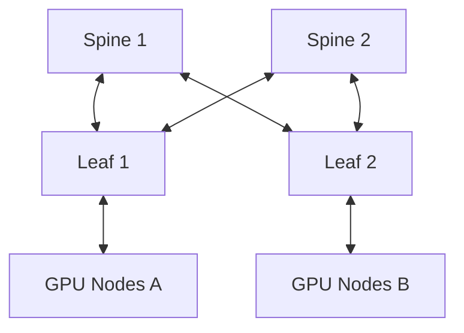

# Routing, Topologies, and Oversubscription

A fabric can have fast links and still perform poorly if too many flows converge on the same uplinks. Topology determines available path diversity; routing determines which paths traffic uses; oversubscription determines how much endpoint demand shares the core.

## Learning Objectives

Explain leaf-spine and fat-tree concepts, calculate oversubscription, distinguish blocking and nonblocking designs, and diagnose route imbalance.

## Topology

A nonblocking design provides enough uplink capacity for all endpoints to communicate at full rate under the assumed traffic model. Oversubscribed designs share uplinks and can be appropriate when workloads communicate locally or do not peak simultaneously.

Oversubscription is not a single universal ratio. Calculate it at each tier and evaluate the workload’s communication matrix. A 2:1 fabric may be acceptable for independent inference but harmful for all-to-all training.

## Routing

Routing engines map source-destination pairs to paths. Good routing balances links, avoids deadlock, respects topology, and behaves predictably during failure. Adaptive routing can react to congestion, but it does not create missing capacity and requires compatible switch and endpoint behavior.

| Design question | Evidence |
|---|---|
| Is capacity sufficient? | Endpoint demand and uplink bandwidth |
| Are routes balanced? | Forwarding tables and port counters |
| Is locality exploited? | Job placement and rack topology |
| What happens after failure? | Reroute tests and degraded capacity model |
| Can the fabric expand? | Port reserve and future tier design |

## Production Design

Place communication-heavy jobs within the smallest sufficient locality domain when possible. Maintain consistent cabling and symmetric leaf uplinks. Model maintenance states, because losing one spine or link can turn a nominally nonblocking fabric into an oversubscribed one.

## Troubleshooting

**Symptoms:** only cross-rack jobs are slow, specific leaf pairs show congestion, or a link failure creates unexpected hotspots.

Compare routing tables, path distribution, switch counters, and job placement. Run pairwise tests across several source-destination combinations rather than one convenient pair.

## Customer Perspective

When a customer asks for a nonblocking fabric, ask for the traffic model and failure assumptions. Full bisection under normal operation may not mean full bisection during maintenance.

## Interview Preparation

**Question:** Is oversubscription always bad?

No. It trades peak simultaneous bandwidth for lower cost and complexity. It is appropriate only when workload behavior and service objectives tolerate the contention.

## Key Takeaways

- Topology provides paths; routing selects them.
- Oversubscription must be evaluated against traffic patterns.
- Failure and maintenance alter effective fabric capacity.
- Pairwise tests and counters reveal route imbalance.

## Cross References

- [Subnet Management](./chapter-05-subnet-management-and-opensm)
- [Next: Adaptive Routing](./chapter-07-adaptive-routing-and-congestion-control)
