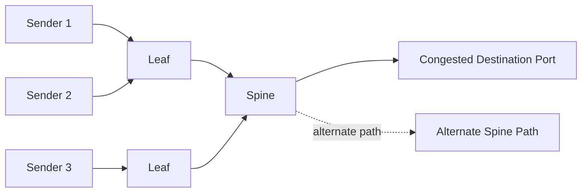
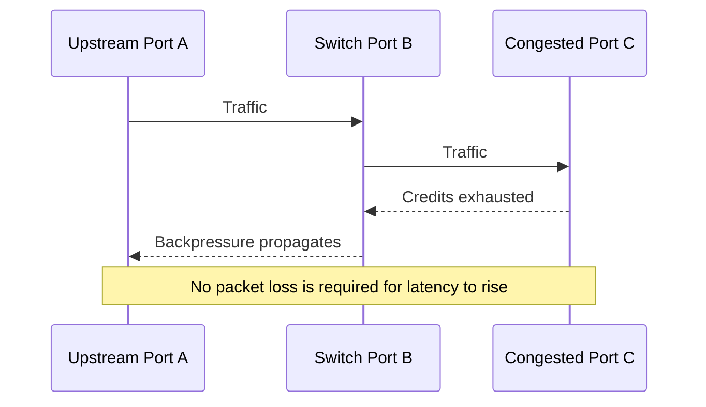

# Adaptive Routing and Congestion Control

## Introduction

A lossless fabric can still be slow.

InfiniBand link-level flow control prevents ordinary packet loss caused by buffer exhaustion, but it does not create infinite capacity. When many senders target the same output path, queues grow, credits are consumed, backpressure propagates, and unrelated traffic may be delayed behind congested flows.

Adaptive routing and congestion-control mechanisms exist to reduce these effects. They are not magic switches. Their benefit depends on topology, traffic pattern, firmware, routing policy, telemetry, and correct tuning.

| Chapter field | Value |
|---|---|
| Volume | 08 — InfiniBand |
| Difficulty | Expert |
| Estimated reading time | 55–70 minutes |
| Primary focus | Dynamic path selection and congestion response |
| Previous | Routing, Topologies, and Oversubscription |
| Next | HDR, NDR, XDR, and Link Evolution |

## Story: No Packet Loss, Yet Every Job Slowed Down

A cluster runs three large distributed jobs simultaneously. No links are down. Error counters remain low. The fabric is described as lossless.

Step time nevertheless doubles.

Per-port telemetry shows a congestion tree: several destination-facing ports are saturated, upstream switches accumulate blocked traffic, and unrelated flows sharing the same virtual lane are delayed. Static routing concentrates too many collective segments onto the same paths.

The team enables the supported adaptive-routing and congestion features only after validating topology, firmware, and workload behavior. It also changes placement to reduce destination concentration. Performance stabilizes.

> Losslessness protects delivery. It does not guarantee fairness, low latency, or freedom from backpressure.

## Learning Objectives

After completing this chapter, you will be able to:

- explain credit-based flow control and backpressure;
- distinguish congestion from physical errors;
- describe congestion trees and head-of-line blocking;
- explain the purpose of adaptive routing;
- describe congestion marking and source reaction conceptually;
- identify tuning and interoperability risks;
- design observability for congestion incidents;
- troubleshoot low performance when links remain healthy.

## Big Picture

**Figure 8.7.1 — Congestion is a path and destination problem.** Adaptive routing can use alternate healthy paths when policy and topology permit.

## Credit-Based Flow Control

InfiniBand receivers advertise available buffer credits. A sender transmits only when enough credit exists for the selected virtual lane.

This prevents buffer-overrun loss, but when a receiver or downstream link cannot drain traffic:

1. its available credits fall;
2. the upstream transmitter pauses;
3. upstream queues grow;
4. their credits become constrained;
5. backpressure can propagate through multiple switches.

**Figure 8.7.2 — Backpressure can spread away from the original bottleneck.** This creates a congestion tree.

## Congestion Versus Physical Failure

| Indicator | Congestion | Physical/link fault |
|---|---|---|
| Link state | Usually active | May flap or degrade |
| Symbol/physical errors | Often normal | Often increasing |
| Wait or congestion counters | Elevated | May be secondary |
| Throughput | Variable or unfair | Reduced, unstable, or absent |
| Scope | Traffic-pattern dependent | Often tied to component/path |
| Resolution | Routing, placement, capacity, tuning | Repair cable, port, optics, adapter, firmware |

Do not replace cables because utilization is high. Do not tune congestion control while a link is physically unhealthy.

## Head-of-Line Blocking

Head-of-line blocking occurs when one blocked flow delays other traffic queued behind it. Virtual lanes and service levels can reduce interference by separating classes, but only if mappings are deliberate and deadlock-safe.

Poor class design can create:

- priority starvation;
- wasted buffer partitions;
- ineffective isolation;
- additional operational complexity;
- new deadlock risks.

## Adaptive Routing

Static routing assigns paths based on precomputed forwarding state. Adaptive routing can choose among eligible alternatives using current or recent path conditions.

Potential benefits include:

- avoiding transient hot links;
- improving utilization of path diversity;
- reducing sensitivity to static destination concentration;
- improving behavior under concurrent jobs.

Potential risks include:

- packet reordering considerations;
- topology-specific constraints;
- inconsistent switch configuration;
- difficult troubleshooting if path decisions are invisible;
- interaction with deterministic collective schedules;
- firmware compatibility requirements.

Adaptive routing works best when the topology actually provides multiple useful paths. It cannot create capacity across a fundamentally oversubscribed cut.

## Congestion Control

Congestion-control systems generally involve three ideas:

1. **Detection** — a switch or endpoint observes congestion.
2. **Notification or marking** — the condition is communicated.
3. **Reaction** — sources reduce or reshape injection until congestion clears.

The exact mechanism depends on fabric generation and implementation. Production documentation should state:

- which ports and traffic classes participate;
- how congestion is detected;
- which endpoints react;
- timing and rate parameters;
- expected counters;
- rollback behavior.

## Adaptive Routing Versus Congestion Control

| Mechanism | Primary action | Best for | Cannot solve |
|---|---|---|---|
| Adaptive routing | Select a less congested eligible path | Imbalance with available path diversity | Insufficient total capacity |
| Congestion control | Reduce or regulate offered load | Persistent destination or path contention | Broken physical links |
| Placement | Change which endpoints communicate across cuts | Avoidable topology concentration | Fixed all-to-all demand at full scale |
| Capacity expansion | Add links or switches | Structural bottlenecks | Bad routing or faulty components |

These mechanisms complement one another.

## AI Workload Behavior

Distributed AI produces several challenging patterns:

- synchronized bursts from many ranks;
- incast toward aggregation points;
- all-to-all exchanges for expert parallelism;
- simultaneous checkpoint or storage traffic;
- repeated ring segments;
- multiple large jobs sharing the fabric.

A fabric that looks healthy under steady pairwise testing may congest under synchronized collectives. Validation must include representative concurrency.

## Multi-Tenancy

In a shared cluster, one tenant can affect another through shared links and buffers. Architecture should consider:

- admission control;
- job placement;
- bandwidth accounting;
- service-level mapping;
- rail allocation;
- maintenance and test traffic;
- tenant-specific baselines.

Do not promise strict isolation based only on logical partitions. P_Keys control membership, not guaranteed bandwidth.

## Production Design Checklist

Before enabling adaptive routing or congestion control:

- verify supported switch and HCA firmware;
- confirm topology suitability;
- standardize configuration across the fabric;
- establish healthy physical and routing baselines;
- define expected counters;
- test representative workloads;
- test multiple concurrent jobs;
- validate failure and rollback;
- document ownership and change windows.

## Observability

Collect:

- per-port transmit and receive utilization;
- transmit wait or credit-stall indicators;
- congestion marking and notification counters;
- virtual-lane utilization;
- route/path distribution;
- queue occupancy where available;
- endpoint injection rate;
- collective duration and tail behavior;
- topology and placement metadata.

Visualize congestion over time. A single counter snapshot cannot show whether the condition is transient, recurring, or propagating.

## Production Troubleshooting

### Scenario 1 — High wait counters on many upstream ports

**Symptoms**

- many links show waiting or blocked transmission;
- physical errors are low;
- one destination-facing region is highly utilized.

**Diagnosis**

Trace the counter gradient toward the likely root of the congestion tree. Correlate with destination nodes, job placement, and traffic class.

**Resolution**

Relieve the destination bottleneck, rebalance paths or placement, and verify that upstream wait counters return to baseline.

### Scenario 2 — Adaptive routing enabled, but imbalance remains

**Likely causes**

- no useful alternate paths;
- feature not enabled consistently;
- routing policy restricts eligible paths;
- telemetry threshold not reached;
- workload has too few flows;
- one destination remains the true bottleneck.

**Resolution**

Verify feature state and topology. Do not assume enablement guarantees balanced traffic.

### Scenario 3 — Latency becomes unstable after tuning

**Symptoms**

- average bandwidth improves;
- tail latency worsens;
- results vary by message size.

**Diagnosis**

Review reaction timing, rate parameters, service-level mapping, and packet-order assumptions. Compare against a controlled baseline.

**Resolution**

Rollback to the last validated policy, then retune one parameter at a time.

### Scenario 4 — One tenant slows another

**Diagnosis**

Compare tenant placement, shared uplinks, service levels, link utilization, and synchronized traffic windows.

**Resolution**

Use placement, scheduling, traffic-class policy, or capacity allocation to reduce shared bottlenecks.

## Customer Scenario

A customer asks whether enabling adaptive routing guarantees linear scaling.

The architect explains that scaling depends on compute balance, topology, bisection bandwidth, endpoint injection, collective algorithms, and application synchronization. Adaptive routing can reduce path imbalance when alternatives exist, but it does not eliminate structural oversubscription or destination bottlenecks.

## Interview Preparation

### Knowledge Questions

1. Why can a lossless fabric congest?
2. What is backpressure?
3. What is a congestion tree?
4. How does adaptive routing differ from static routing?
5. Why are P_Keys not bandwidth isolation?

### Architecture Questions

1. Design congestion observability for a 1,000-node fabric.
2. Explain how virtual lanes can reduce interference.
3. Compare adaptive routing, congestion control, and added capacity.

### Scenario Questions

1. Physical counters are clean, but collectives slow under concurrency. What do you inspect?
2. One destination causes wait counters across several tiers. How do you isolate it?
3. Adaptive routing worsens tail latency. What is your rollback plan?

### Whiteboard Question

Draw a congestion tree from three source leaves to one destination port. Show where credits disappear and where alternate paths could help.

## Summary

InfiniBand prevents ordinary buffer-overrun loss through credit-based flow control, but contention still produces queueing and backpressure. Adaptive routing uses available path diversity; congestion control reduces offered load; placement and capacity address structural causes.

The correct production approach is to distinguish physical faults from congestion, establish baselines, enable supported features deliberately, and observe behavior under representative concurrent workloads.

## Key Takeaways

- Lossless does not mean congestion-free.
- Backpressure can propagate far from the bottleneck.
- Adaptive routing needs real path diversity.
- Congestion control regulates load; it does not repair topology.
- Multi-tenant isolation requires scheduling and capacity policy.
- Tail latency and fairness matter alongside average bandwidth.

## Quick Revision Sheet

| Concept | Remember |
|---|---|
| Credit flow control | Sender waits for receiver buffer credit |
| Backpressure | Congestion propagates upstream |
| Congestion tree | Many blocked paths rooted at one bottleneck |
| Adaptive routing | Chooses among eligible alternate paths |
| Congestion control | Signals sources to reduce offered load |
| Head-of-line blocking | Blocked traffic delays unrelated queued traffic |

## Cross References

- Previous: [Routing, Topologies, and Oversubscription](./chapter-06-routing-topologies-and-oversubscription)
- Next: [HDR, NDR, XDR, and Link Evolution](./chapter-08-hdr-ndr-xdr-and-link-evolution)
- Related lab: [Inspect Subnet Routing and Counters](./labs/lab-03-inspect-subnet-routing-and-counters)

## Further Reading

Use current vendor documentation for the deployed switch ASIC, HCA, firmware, and fabric-management release. Adaptive-routing and congestion-control capabilities are generation- and topology-specific.