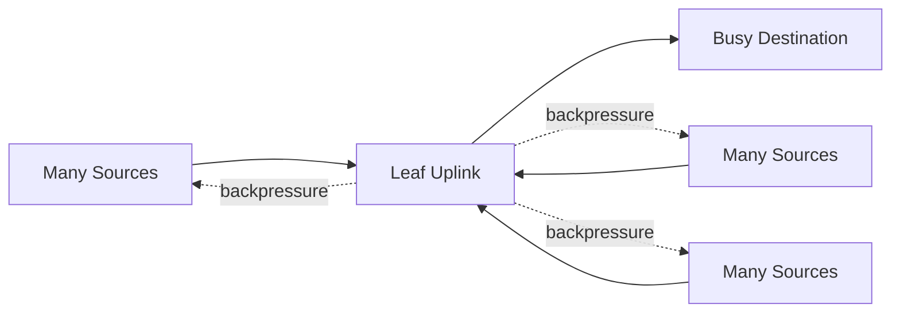

# Adaptive Routing and Congestion Control

Lossless transport prevents drops from being the normal congestion signal. When receivers or downstream links fill, credit backpressure can propagate. Without careful routing and congestion management, a local hotspot can slow unrelated flows.

## Learning Objectives

Explain congestion trees, static versus adaptive routing, service levels, and operational methods for identifying hotspots.

## Congestion Formation

A congested egress consumes buffering. Credit flow control then prevents upstream transmission, potentially creating a tree of blocked links. This is why “no packet loss” does not imply “no congestion.”

Adaptive routing allows switches or endpoints to select among eligible paths based on current conditions. It can improve utilization in topologies with path diversity, but it adds state and operational complexity. Poor thresholds or inconsistent configuration can cause instability or unexpected reordering constraints.

## Controls

| Mechanism | Purpose |
|---|---|
| Path diversity | Provides alternate routes |
| Adaptive routing | Selects less-congested eligible paths |
| Service levels and virtual lanes | Separates traffic classes |
| Congestion marking/notification | Signals sources to reduce pressure |
| Job placement | Limits unnecessary cross-fabric traffic |
| Admission control | Prevents aggregate demand from exceeding design |

## Production Design

Enable features only within a qualified switch and adapter matrix. Establish baseline counters before activation, test representative collectives, and define rollback. Congestion tuning must include the application team because message patterns and synchronization influence hotspots.

Monitor per-port utilization, wait or stall indicators, congestion signals, virtual-lane behavior, and route distribution. Aggregate fabric averages hide individual hot links.

## Troubleshooting

**Symptoms:** high variability, good pairwise bandwidth but poor all-to-all performance, or unrelated jobs slowing together.

Correlate switch counters with job placement and collective timing. Identify the first congested egress and trace backpressure upstream. Verify adaptive-routing state consistently across the fabric.

## Customer Scenario

A cluster adds more nodes without adding spine capacity. Adaptive routing improves path balance but cannot overcome the missing bisection bandwidth. The final solution combines routing improvements with capacity expansion and workload-aware scheduling.

## Interview Preparation

**Question:** Can adaptive routing fix oversubscription?

It can distribute traffic across available paths, but it cannot create capacity. Persistent offered load above aggregate capacity still causes queueing and backpressure.

## Key Takeaways

- Lossless fabrics can suffer severe congestion without drops.
- Backpressure can spread beyond the original hotspot.
- Adaptive routing requires path diversity and careful qualification.
- Capacity, routing, and workload placement must be addressed together.

## Cross References

- [Routing and Oversubscription](./chapter-06-routing-topologies-and-oversubscription)
- [Next: Generations and Link Rates](./chapter-08-hdr-ndr-xdr-and-link-evolution)
