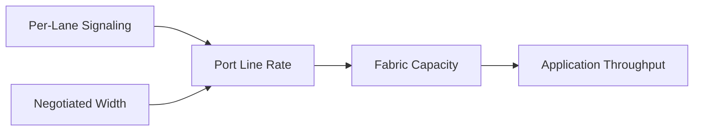

# HDR, NDR, XDR, and Link Evolution

InfiniBand generations increase lane signaling, port bandwidth, switch capacity, and adapter capabilities. Architects often focus on the generation label, but delivered performance depends on lane width, PCIe host connection, cable reach, switch radix, topology, protocol overhead, and application behavior.

## Learning Objectives

Interpret generation and width, distinguish port rate from useful payload, plan mixed-generation transitions, and avoid invalid comparisons.

## Rate Model

Generation names such as HDR, NDR, and XDR describe technology eras and target rates. Exact implementation and breakout options vary. Always consult current adapter and switch documentation for the specific SKU.

## Why Port Speed Is Not Application Speed

Useful throughput is reduced by encoding, headers, transport behavior, message size, synchronization, routing, and host limitations. A fast network adapter connected through an insufficient PCIe path cannot sustain its line rate to host or GPU memory.

| Upgrade dimension | Questions |
|---|---|
| Adapter | Does host PCIe support the intended rate? |
| Switch | Is radix sufficient for the topology? |
| Cable | Is media qualified for speed and distance? |
| Breakout | Are lanes and ports mapped correctly? |
| Software | Are firmware, drivers, and tools compatible? |
| Workload | Can message patterns use additional bandwidth? |

## Mixed-Generation Fabrics

Links negotiate to the capabilities of both endpoints and the cable path. Mixed generations can support phased migration, but slower links may become bottlenecks or alter routing balance. Inventory negotiated state rather than assuming installed labels equal operating state.

A rolling upgrade plan should define coexistence, routing, cable replacement, spare strategy, and rollback. Benchmark before and after each tier change.

## Production Operations

Monitor expected versus negotiated width and rate. Keep cable and optic qualification records. Higher-speed links often tighten signal-integrity and thermal requirements, making physical-layer hygiene more important.

## Troubleshooting

**Symptom:** a new-generation port operates below expected rate.

Check both endpoints, cable type and length, breakout configuration, firmware, port policy, and physical-error counters. Replace one component at a time and preserve the original evidence.

## Customer Perspective

A generation upgrade is justified when workload demand, growth, and topology require it—not merely because a faster standard exists. Include switch count, cabling, power, operations, and migration cost.

## Interview Preparation

**Question:** Why might upgrading adapters alone fail to improve throughput?

The bottleneck may be host PCIe, switch uplinks, routing, message size, GPU placement, or application synchronization.

## Key Takeaways

- Generation labels do not guarantee delivered application throughput.
- Width, host I/O, media, topology, and software determine the path.
- Mixed-generation operation requires explicit capacity analysis.
- Verify negotiated state and benchmark the workload.

## Cross References

- [Adaptive Routing and Congestion](./chapter-07-adaptive-routing-and-congestion-control)
- [Next: Fabric Monitoring](./chapter-09-fabric-monitoring-and-telemetry)
