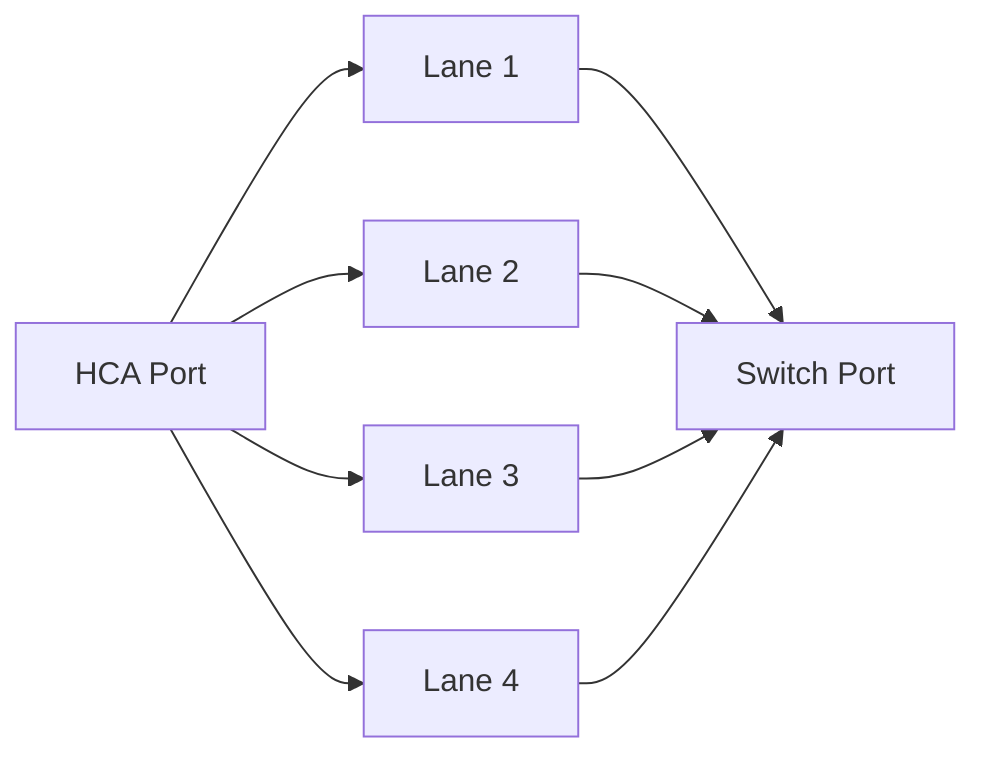
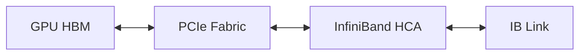

# HDR, NDR, XDR, and Link Evolution

## Introduction

Fabric generations are often reduced to a single speed label. That is dangerous. Delivered performance depends on signaling rate, encoding overhead, lane width, cable quality, adapter capability, switch capability, PCIe attachment, message size, and software behavior.

HDR, NDR, and XDR describe successive InfiniBand generations, but architecture decisions should focus on usable end-to-end bandwidth and lifecycle compatibility rather than headline numbers.

| Chapter field | Value |
|---|---|
| Volume | 08 — InfiniBand |
| Difficulty | Advanced |
| Estimated reading time | 45–60 minutes |
| Primary focus | Link generations and upgrades |
| Previous | Adaptive Routing and Congestion Control |
| Next | Fabric Monitoring and Telemetry |

## Story: The 400-Gigabit Upgrade That Delivered Half the Expected Gain

A customer replaces HCAs and switches with a newer generation. Link status reports the expected rate. Application throughput improves only modestly.

The review finds three constraints:

- the host PCIe path cannot sustain the new injection rate;
- several links negotiated reduced width after recabling;
- the collective workload is limited by a cross-rack cut that was not upgraded.

The fabric generation changed, but the bottleneck moved elsewhere.

> A faster link improves only the path segment that was limiting performance.

## Learning Objectives

After completing this chapter, you will be able to:

- distinguish signaling rate from payload throughput;
- explain lane width and negotiated link state;
- compare HDR, NDR, and XDR as architectural generations;
- identify host and topology limits that mask link upgrades;
- plan mixed-generation interoperability;
- define upgrade validation and rollback;
- troubleshoot reduced rate or width;
- explain generation choices to customers without marketing language.

## Link Rate, Width, and Effective Throughput

A physical link combines one or more lanes. Effective throughput depends on:

```text
effective payload bandwidth
≈ signaling rate × active lanes × encoding efficiency × protocol efficiency
```

This is a conceptual relationship, not a substitute for platform-specific specifications.

A port can be:

- physically connected but down;
- active at a lower speed;
- active at reduced width;
- active and error-free but limited by PCIe;
- fully negotiated but congested elsewhere.

## Generational View

| Generation | Architectural significance | Validation focus |
|---|---|---|
| HDR | Higher aggregate link capacity and mature large-cluster deployment | lane state, cable support, host injection |
| NDR | Higher per-port bandwidth and denser fabrics | PCIe generation, switch radix, thermal and cable design |
| XDR | Further bandwidth scaling and next-generation fabric design | end-to-end platform qualification and lifecycle planning |

Exact capabilities vary by product and implementation. Always verify the current platform documentation.

## Lane Width

A nominally high-speed port may use multiple lanes. If one or more lanes fail qualification, the link may negotiate a narrower width or fail to become active.



**Figure 8.8.1 — A logical link may depend on several physical lanes.** Reduced width preserves reachability in some cases while lowering capacity.

## Encoding and Protocol Overhead

Wire rate is not application payload rate. Capacity is consumed by:

- line encoding;
- link and transport headers;
- integrity checks;
- acknowledgments and control traffic;
- idle or flow-control behavior;
- message segmentation;
- software and DMA overhead.

Benchmark results should therefore be compared with realistic efficiency ranges, not the raw signaling number.

## Host Injection Limits

The HCA reaches memory through the host I/O topology. A faster fabric link can expose limitations in:

- PCIe generation and width;
- CPU root-complex placement;
- NUMA locality;
- GPU-to-HCA peer path;
- memory registration and buffer reuse;
- HCA queue configuration;
- CPU progress or polling capacity.



The end-to-end path cannot exceed its narrowest sustained segment.

## Switch Radix and Fabric Density

Higher-speed generations may also change switch radix, port density, cable choices, and rack design. Architecture trade-offs include:

- fewer switches versus larger failure domains;
- fewer cables versus higher per-port concentration;
- power and cooling density;
- serviceability;
- spare strategy;
- growth increments.

## Mixed-Generation Fabrics

Mixed generations may interoperate at a mutually supported rate, depending on product and cable support. Operational risks include:

- silent down-negotiation;
- asymmetric endpoint capability;
- inconsistent firmware;
- unexpected route preference;
- reduced-width fallback;
- confusing inventory.

Document expected negotiated state for every link class.

## Upgrade Planning

A safe upgrade plan includes:

1. baseline current application and component performance;
2. verify hardware and firmware compatibility;
3. model host and topology bottlenecks;
4. stage a representative pilot path;
5. test link negotiation and error counters;
6. run host-memory and GPU-memory benchmarks;
7. test collectives under concurrency;
8. validate failure and rollback;
9. update inventory and monitoring thresholds;
10. expand in controlled phases.

## Cabling and Signal Integrity

As link rates increase, cable and connector quality become more demanding. Track:

- cable type and supported reach;
- part number and serial number;
- bend radius and routing;
- transceiver temperature;
- port and lane error counters;
- replacement history.

A cable that worked at an older generation may not qualify at a newer rate.

## Production Troubleshooting

### Scenario 1 — Link active at lower speed

**Symptoms**

- port is active;
- negotiated rate is below design;
- application bandwidth is reduced.

**Diagnosis**

Compare both endpoints, cable support, firmware, configured rate, and physical counters.

**Resolution**

Restore a supported endpoint/cable/firmware combination and verify stable negotiation.

### Scenario 2 — Correct speed, reduced width

**Symptoms**

- speed label appears correct;
- width is narrower;
- throughput is proportionally lower.

**Likely cause**

One or more lanes failed qualification.

**Resolution**

Isolate cable, connector, port, or adapter by controlled substitution and counter comparison.

### Scenario 3 — Microbenchmark improves, application does not

**Diagnosis**

Check collective topology, PCIe, GPU locality, oversubscription, storage traffic, and synchronization.

**Root cause**

The upgraded link was not the application bottleneck.

### Scenario 4 — Mixed-generation rack behaves inconsistently

**Diagnosis**

Inventory negotiated rate and width for every link. Compare route placement and endpoint capabilities.

## Customer Scenario

A customer asks whether moving from NDR to XDR will double training throughput.

The architect explains that the answer depends on the communication fraction of step time, current link utilization, host injection, collective efficiency, and fabric cuts. A benchmark and scaling model are required before predicting business value.

## Interview Preparation

1. Why is wire rate higher than payload throughput?
2. How can a link be active but degraded?
3. What host limits can hide a fabric upgrade?
4. How would you validate a mixed-generation fabric?
5. Why should application scaling be measured before buying faster links?

## Summary

InfiniBand generations increase available link capacity, but delivered value depends on lane health, encoding efficiency, host injection, topology, and workload communication behavior.

Treat generation upgrades as end-to-end architecture changes. Baseline, pilot, validate, observe, and roll out in phases.

## Key Takeaways

- Speed and width must both be verified.
- Wire rate is not payload rate.
- Faster links can expose PCIe and topology bottlenecks.
- Mixed generations require explicit expected-state inventory.
- Cable qualification becomes more important at higher rates.
- Application improvement must be measured, not assumed.

## Cross References

- Previous: [Adaptive Routing and Congestion Control](./chapter-07-adaptive-routing-and-congestion-control)
- Next: [Fabric Monitoring and Telemetry](./chapter-09-fabric-monitoring-and-telemetry)
- Related lab: [Benchmark InfiniBand Bandwidth and Latency](./labs/lab-02-benchmark-infiniband-bandwidth-and-latency)

## Further Reading

Use current product specifications and compatibility matrices for the exact HCA, switch, cable, firmware, and platform generation under evaluation.