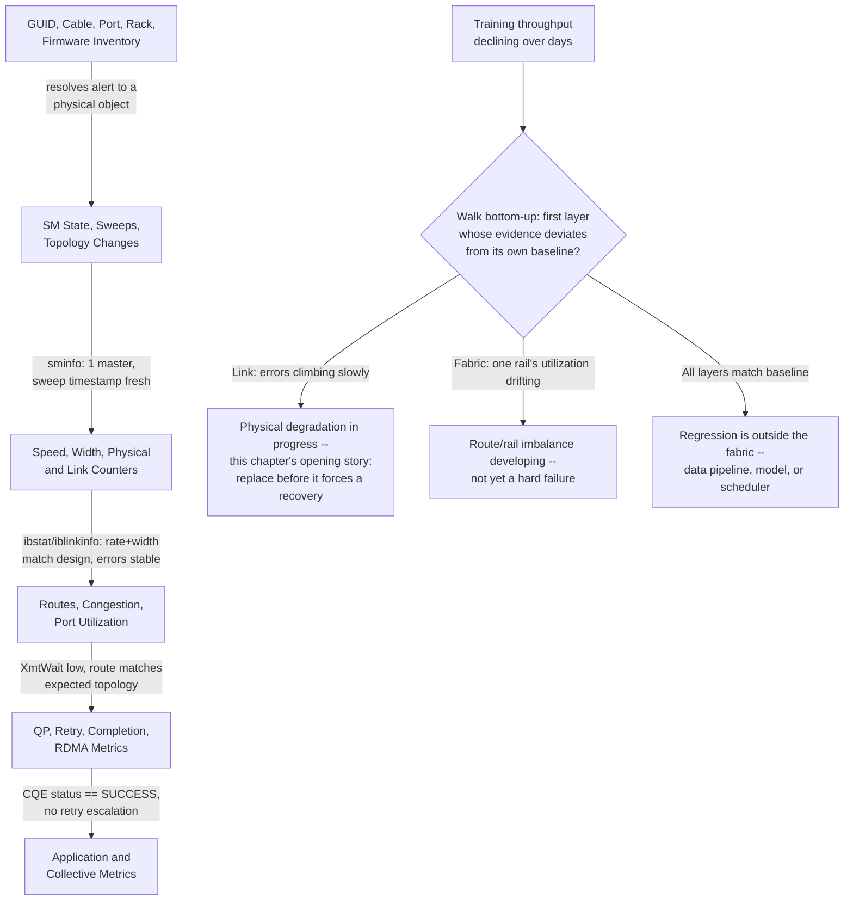
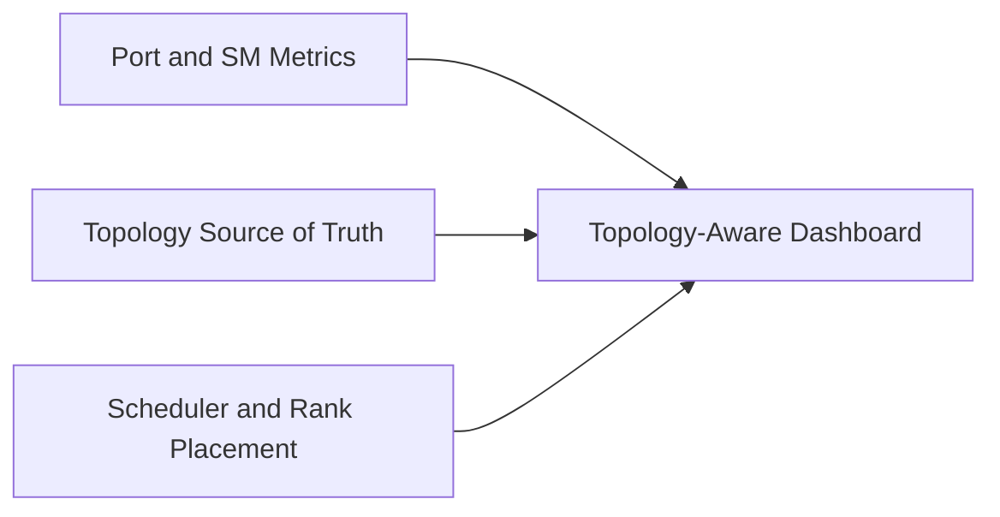

# Fabric Monitoring and Telemetry

## Introduction

An InfiniBand fabric can remain reachable while becoming progressively less useful. A link may negotiate reduced width, retries may increase, one rail may carry disproportionate load, or congestion may spread from a hot destination. None of these conditions is reliably detected by a single “up/down” metric.

Production observability must connect physical state, link counters, routing, subnet management, topology, and workload performance.

| Chapter field | Value |
|---|---|
| Volume | 08 — InfiniBand |
| Difficulty | Advanced |
| Estimated reading time | 50–65 minutes |
| Primary focus | Fabric observability and baselines |
| Previous | HDR, NDR, XDR, and Link Evolution |
| Next | Production Troubleshooting |

## Story: The Fabric Failed Slowly

Training throughput declines over several days. No ports are down. The support dashboard remains green because it checks only port state.

A deeper review reveals steadily increasing receive errors on one switch port, intermittent lane recovery, and growing transmit wait counters on adjacent links. The physical defect and the congestion it created were visible in telemetry, but no alert connected the evidence.

The team replaces the cable, restores expected width, and adds rate-of-change alerts and topology-aware dashboards.

> A healthy fabric is defined by expected behavior, not merely by reachability.

## Learning Objectives

After completing this chapter, you will be able to:

- define telemetry layers for an InfiniBand fabric;
- distinguish state, counters, rates, and derived health indicators;
- build topology-aware dashboards;
- create baselines for link, route, and application behavior;
- identify useful alert conditions;
- design evidence retention for incidents;
- correlate fabric and workload timelines;
- avoid common observability mistakes.

## Observability Layers



**Figure 8.9.1 — Useful diagnosis requires evidence from multiple layers, and each arrow names the specific baseline comparison that proves that layer is not the source of drift.** This is the mechanism behind the chapter's "the fabric failed slowly" story: no single layer ever crossed a hard alert threshold, but the *link* layer's error-rate trend, read against its own baseline instead of a static pass/fail line, was the layer that actually diverged first — days before application throughput visibly declined.

## State Versus Counters

### State

State describes a current condition:

- port physical state;
- logical port state;
- negotiated speed;
- negotiated width;
- current LID;
- SM master identity;
- route or partition state.

### Counters

Counters accumulate events:

- symbol or physical errors;
- link recovery;
- receive errors;
- transmit discards;
- retry indicators;
- transmit wait;
- congestion notifications;
- data and packet totals.

### Rates and deltas

A cumulative counter value is often less useful than its rate of increase. Alert on:

- new errors during a workload window;
- acceleration in error rate;
- deviation from baseline;
- concentration on one path;
- correlation with application slowdown.

### Annotated counter deltas: what "the fabric failed slowly" looks like in numbers

```text
# Day 1
$ ibqueryerrors -s SymbolErrorCounter,LinkDownedCounter -k <switch-lid> | grep "port 12"
GUID 0x506b... port 12: [SymbolErrorCounter == 4] [LinkDownedCounter == 0]

# Day 4
$ ibqueryerrors -s SymbolErrorCounter,LinkDownedCounter -k <switch-lid> | grep "port 12"
GUID 0x506b... port 12: [SymbolErrorCounter == 890] [LinkDownedCounter == 3]

# Day 7
$ ibqueryerrors -s SymbolErrorCounter,LinkDownedCounter -k <switch-lid> | grep "port 12"
GUID 0x506b... port 12: [SymbolErrorCounter == 41200] [LinkDownedCounter == 19]
```

None of these three snapshots alone triggers a naive "nonzero error" alert differently from the others — 4, 890, and 41,200 are all "some errors." Reading them as a *rate* changes the picture entirely: the delta from day 1 to day 4 is ~886 over 3 days (~295/day); day 4 to day 7 is ~40,310 over 3 days (~13,400/day) — a roughly 45x acceleration in error rate, with `LinkDownedCounter` (forced link recovery events) climbing in step. This is exactly the "acceleration in error rate" alert condition this section recommends, and it is the specific evidence that would have caught this chapter's opening incident on day 4, days before the cable finally forced a hard recovery and training throughput visibly collapsed.

## Inventory Is Telemetry Context

Every metric should be resolvable to:

- node and port GUID;
- host or switch name;
- rack and position;
- cable identity;
- peer port;
- rail;
- firmware and driver version;
- expected speed and width;
- tenant or workload ownership where appropriate.

Without this context, an alert such as “port 17 errors” creates manual discovery work during an incident.

## Baseline Design

Establish baselines at several levels:

| Baseline | Example evidence |
|---|---|
| Physical | expected speed, width, zero or stable error rate |
| Pairwise | latency and bandwidth by message size |
| Topology | discovered GUID and link map |
| Routing | path distribution and hot-link profile |
| Collective | AllReduce bandwidth by node count |
| Failure mode | behavior after one link or switch loss |
| Control plane | sweep duration and master failover time |

Baselines should record software, firmware, topology, and workload versions. A number without environment context is not reproducible.

## Key Metric Families

### Port health

- physical and logical state;
- speed and width;
- link recovery frequency;
- physical error rate;
- receive and transmit error changes.

### Capacity and utilization

- transmit and receive data rate;
- packets per second;
- utilization percentage;
- rail balance;
- rack-to-rack load.

### Congestion

- transmit wait;
- credit starvation;
- congestion markings or notifications;
- virtual-lane behavior;
- queue occupancy where supported.

### Subnet management

- active master identity;
- standby state;
- sweep count and duration;
- topology changes;
- programming failures;
- discovered object count.

### Application correlation

- training step time;
- collective duration;
- per-rank stragglers;
- GPU utilization;
- CPU progress-thread load;
- job placement and node set.

## Topology-Aware Dashboards

A flat list of port metrics is insufficient for a large fabric. Useful views include:

- rack and rail maps;
- leaf-spine topology overlays;
- per-link utilization heat maps;
- error-rate heat maps;
- congestion-tree views;
- route-balance summaries;
- current versus expected topology;
- job placement over physical paths.



**Figure 8.9.2 — Telemetry becomes actionable when joined with inventory and workload placement.**

## Alert Philosophy

Avoid alerts that fire merely because a counter is nonzero. Better alerts use:

- rate of change;
- sustained duration;
- expected-state comparison;
- peer or rail asymmetry;
- application impact;
- topology criticality.

Examples:

- link negotiated below expected width;
- physical error rate increases during workload;
- transmit wait remains above baseline for five minutes;
- one rail carries more than a defined share of aggregate traffic;
- active SM changes unexpectedly;
- topology object count differs from source of truth;
- collective duration degrades while fabric counters change.

## Telemetry Collection Architecture

A production pipeline may include:

1. endpoint and switch collectors;
2. fabric-management APIs or command outputs;
3. periodic topology snapshots;
4. metrics storage;
5. log storage;
6. inventory enrichment;
7. dashboards and alerts;
8. incident evidence export.

Collection must not overload the management plane. Polling frequency should match counter behavior and incident-detection goals.

## UFM: The Product Layer Above These Tools

Everything in this chapter — state, counters, baselines, topology-aware dashboards, alert philosophy, the collection pipeline — describes a *capability*, not a specific product. NVIDIA's product for delivering that capability on InfiniBand is **UFM (Unified Fabric Manager)**. It is worth naming explicitly, because interview questions and job requisitions reference it by name, and because understanding where it sits relative to the CLI tools already covered in this volume prevents a common misconception.

UFM is not a replacement for the subnet manager, `ibstat`, `iblinkinfo`, or `ibdiagnet` — it is the operational layer built on top of them. Concretely:

- it runs (or manages) the subnet manager function described in [Chapter 5](./chapter-05-subnet-management-and-opensm), giving it a supported, centralized home instead of a bare `opensm` process;
- it continuously collects the same categories of state and counters this chapter walks through by hand — link state, speed/width, error and congestion counters, SM sweep health — across the entire fabric, and persists them as the kind of topology-aware, baselined telemetry this chapter argues you need;
- it surfaces that telemetry as fabric-wide dashboards and APIs, rather than requiring an engineer to run `ibqueryerrors` or `iblinkinfo` against one switch at a time; and
- it can act on what it observes: UFM supports automated responses to detected congestion or link degradation — for example, adjusting routing away from a degrading path or triggering an alert/workflow the moment an error-rate acceleration like the one in this chapter's "Day 1 / Day 4 / Day 7" example is detected — instead of waiting for a human to notice the trend across manually pulled snapshots.

That last point is the practical difference in scale. The manual workflow this chapter teaches — pull counters, compute a delta, compare against baseline, correlate with topology — is exactly correct and is what UFM automates under the hood; the value of learning it by hand first is that it is what you fall back on when UFM (or any dashboard) is unavailable, wrong, or itself under investigation, and it is what lets you sanity-check what a dashboard is telling you rather than trust it blindly. In production, most large InfiniBand fleets run UFM (or an equivalent centralized fabric manager) as the day-to-day operational surface, with the CLI tools used for targeted investigation, verification, and any environment where the management plane itself is in question.

## Counter Semantics

Before alerting on a counter, document:

- whether it is cumulative;
- whether it resets on reboot, port reset, or query;
- units and scaling;
- whether it is per-port, per-lane, or per-virtual-lane;
- wraparound behavior;
- platform and firmware differences.

Misinterpreting counter semantics creates false incidents.

## Production Troubleshooting

### Scenario 1 — Counter is high but no longer increasing

**Interpretation**

The value may reflect an old event. Compare timestamps and deltas before declaring an active fault.

**Action**

Retain the history, verify current rate, and correlate with the last maintenance or failure window.

**Evidence.** Two queries a few minutes apart settle it without ambiguity:

```text
$ ibqueryerrors -s SymbolErrorCounter -k <lid> | grep "port 9"; sleep 300; \
  ibqueryerrors -s SymbolErrorCounter -k <lid> | grep "port 9"
GUID 0x506b... port 9: [SymbolErrorCounter == 12034]
GUID 0x506b... port 9: [SymbolErrorCounter == 12034]
```

Identical value across a 5-minute window with real traffic flowing means the delta is zero — the count reflects a past event, not an active fault. This single check is what distinguishes "old scar tissue in a cumulative counter" from "actively degrading right now," and it takes thirty seconds against a counter history that might otherwise trigger an unnecessary cable replacement.

### Scenario 2 — Application slows with clean physical counters

**Diagnosis**

Inspect utilization, congestion, routing, rail balance, QP retries, CPU progress, and placement. Clean physical telemetry does not rule out contention.

### Scenario 3 — One rail appears idle

**Diagnosis**

Verify collector coverage, interface selection, route state, GPU-to-HCA mapping, and actual job use. An idle rail may be unused, misconfigured, or simply unmonitored.

### Scenario 4 — Frequent SM sweep alerts

**Diagnosis**

Correlate sweeps with link-state traps, cable errors, switch events, and maintenance automation. Find the unstable source rather than suppressing the alert.

## Incident Evidence Bundle

Automate collection of:

- timestamp and timezone;
- affected job and node list;
- topology snapshot;
- port state, speed, and width;
- relevant counter deltas;
- SM state and recent logs;
- route/path information;
- HCA and switch firmware;
- benchmark result;
- application collective logs;
- recent changes.

A reproducible bundle shortens escalation and prevents evidence loss after resets.

## Customer Scenario

A customer asks for a “fabric health dashboard.” The architect defines health as a hierarchy:

- expected inventory present;
- links at expected state, speed, and width;
- no abnormal error growth;
- balanced utilization;
- congestion within service objectives;
- stable control plane;
- application collectives within baseline.

The dashboard is therefore designed around service outcomes rather than decorative green icons.

## Interview Preparation

1. Why are cumulative counters easy to misinterpret?
   **Model answer:** "Because a nonzero cumulative value tells you an event happened at some point in the counter's lifetime, not that it's happening now. I've directly compared two snapshots minutes apart and found zero delta on an alarming-looking counter — the fault was history, not an active condition. Reading rate of change instead of raw value is what turns a counter into evidence rather than noise."

2. Which metrics distinguish congestion from physical failure?
   **Model answer:** "Wait/credit-stall counters like `XmtWait` rising with `SymbolErrorCounter` and `LinkDownedCounter` flat means congestion — the link itself is healthy, traffic is just queueing. The reverse — errors and recovery events climbing while wait counters stay modest — points to a physical fault. I always pull both counter families together, because reading just one can point you at the wrong fix entirely."

3. How would you detect a reduced-width link?
   **Model answer:** "`iblinkinfo` reports width alongside rate explicitly — a port showing the correct rate label but fewer active lanes than its sibling ports is the signature. I wouldn't rely on `ibstat` alone for this on every platform, since width isn't always in its default output; I'd cross-check with the tool that actually prints lane count."

4. What belongs in an incident evidence bundle?
   **Model answer:** "Timestamped topology snapshot, port state/speed/width for the affected path, counter deltas — not just raw values — SM state and recent logs, route information, and the actual benchmark or application evidence that triggered the investigation. The goal is that someone who wasn't there during the incident can reconstruct exactly what was true, in order, without re-running disruptive tests."

5. Why should job placement be joined with fabric telemetry?
   **Model answer:** "A raw counter alert like 'port 17 errors' creates manual discovery work — which rack, which job, which team to page. Joining telemetry with scheduler placement data means an alert can say 'this port, which currently carries rank 42 of job X, is degrading' — that's the difference between an alert that requires investigation and one that's already actionable."

## Summary

InfiniBand observability must connect inventory, subnet management, link state, counters, routing, congestion, transport behavior, and application performance.

State proves current configuration. Counter deltas reveal change. Baselines define expected behavior. Topology and workload context turn raw metrics into operational evidence.

## Key Takeaways

- Up/down monitoring is insufficient.
- Alert on change and deviation, not raw cumulative values alone.
- Inventory is required to interpret metrics.
- Topology-aware views reveal hot paths and rail imbalance.
- Fabric and application timelines must be correlated.
- Evidence collection should be automated before incidents occur.

## Cross References

- Previous: [HDR, NDR, XDR, and Link Evolution](./chapter-08-hdr-ndr-xdr-and-link-evolution)
- Next: [Production Troubleshooting](./chapter-10-production-troubleshooting)
- Related lab: [Inspect Subnet Routing and Counters](./labs/lab-03-inspect-subnet-routing-and-counters)

## Further Reading

Use the counter definitions and telemetry interfaces for the exact HCA, switch, and management software versions deployed. Validate reset behavior and units in a lab before creating alerts.