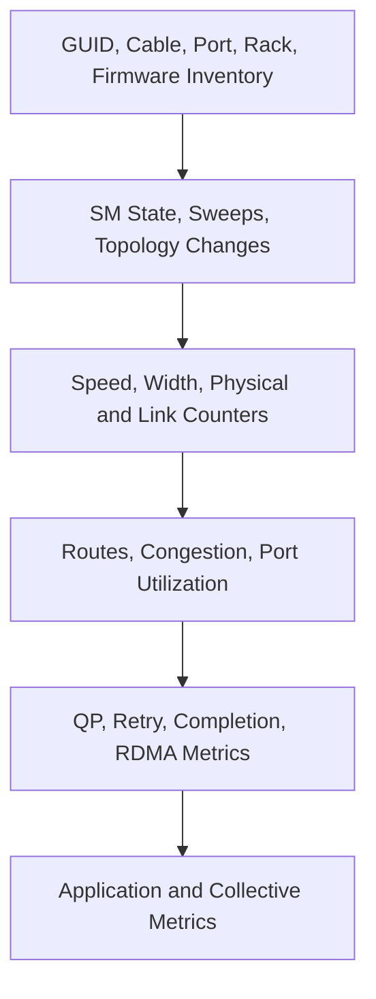
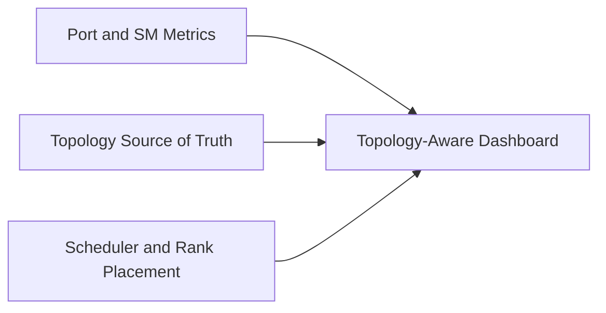

# Fabric Monitoring and Telemetry

## Introduction

An InfiniBand fabric can remain reachable while becoming progressively less useful. A link may negotiate reduced width, retries may increase, one rail may carry disproportionate load, or congestion may spread from a hot destination. None of these conditions is reliably detected by a single “up/down” metric.

Production observability must connect physical state, link counters, routing, subnet management, topology, and workload performance.

| Chapter field | Value |
|---|---|
| Volume | 08 — InfiniBand |
| Difficulty | Advanced |
| Estimated reading time | 50–65 minutes |
| Primary focus | Fabric observability and baselines |
| Previous | HDR, NDR, XDR, and Link Evolution |
| Next | Production Troubleshooting |

## Story: The Fabric Failed Slowly

Training throughput declines over several days. No ports are down. The support dashboard remains green because it checks only port state.

A deeper review reveals steadily increasing receive errors on one switch port, intermittent lane recovery, and growing transmit wait counters on adjacent links. The physical defect and the congestion it created were visible in telemetry, but no alert connected the evidence.

The team replaces the cable, restores expected width, and adds rate-of-change alerts and topology-aware dashboards.

> A healthy fabric is defined by expected behavior, not merely by reachability.

## Learning Objectives

After completing this chapter, you will be able to:

- define telemetry layers for an InfiniBand fabric;
- distinguish state, counters, rates, and derived health indicators;
- build topology-aware dashboards;
- create baselines for link, route, and application behavior;
- identify useful alert conditions;
- design evidence retention for incidents;
- correlate fabric and workload timelines;
- avoid common observability mistakes.

## Observability Layers

**Figure 8.9.1 — Useful diagnosis requires evidence from multiple layers.** Application symptoms should be traceable down to a physical path and control-plane state.

## State Versus Counters

### State

State describes a current condition:

- port physical state;
- logical port state;
- negotiated speed;
- negotiated width;
- current LID;
- SM master identity;
- route or partition state.

### Counters

Counters accumulate events:

- symbol or physical errors;
- link recovery;
- receive errors;
- transmit discards;
- retry indicators;
- transmit wait;
- congestion notifications;
- data and packet totals.

### Rates and deltas

A cumulative counter value is often less useful than its rate of increase. Alert on:

- new errors during a workload window;
- acceleration in error rate;
- deviation from baseline;
- concentration on one path;
- correlation with application slowdown.

## Inventory Is Telemetry Context

Every metric should be resolvable to:

- node and port GUID;
- host or switch name;
- rack and position;
- cable identity;
- peer port;
- rail;
- firmware and driver version;
- expected speed and width;
- tenant or workload ownership where appropriate.

Without this context, an alert such as “port 17 errors” creates manual discovery work during an incident.

## Baseline Design

Establish baselines at several levels:

| Baseline | Example evidence |
|---|---|
| Physical | expected speed, width, zero or stable error rate |
| Pairwise | latency and bandwidth by message size |
| Topology | discovered GUID and link map |
| Routing | path distribution and hot-link profile |
| Collective | AllReduce bandwidth by node count |
| Failure mode | behavior after one link or switch loss |
| Control plane | sweep duration and master failover time |

Baselines should record software, firmware, topology, and workload versions. A number without environment context is not reproducible.

## Key Metric Families

### Port health

- physical and logical state;
- speed and width;
- link recovery frequency;
- physical error rate;
- receive and transmit error changes.

### Capacity and utilization

- transmit and receive data rate;
- packets per second;
- utilization percentage;
- rail balance;
- rack-to-rack load.

### Congestion

- transmit wait;
- credit starvation;
- congestion markings or notifications;
- virtual-lane behavior;
- queue occupancy where supported.

### Subnet management

- active master identity;
- standby state;
- sweep count and duration;
- topology changes;
- programming failures;
- discovered object count.

### Application correlation

- training step time;
- collective duration;
- per-rank stragglers;
- GPU utilization;
- CPU progress-thread load;
- job placement and node set.

## Topology-Aware Dashboards

A flat list of port metrics is insufficient for a large fabric. Useful views include:

- rack and rail maps;
- leaf-spine topology overlays;
- per-link utilization heat maps;
- error-rate heat maps;
- congestion-tree views;
- route-balance summaries;
- current versus expected topology;
- job placement over physical paths.

**Figure 8.9.2 — Telemetry becomes actionable when joined with inventory and workload placement.**

## Alert Philosophy

Avoid alerts that fire merely because a counter is nonzero. Better alerts use:

- rate of change;
- sustained duration;
- expected-state comparison;
- peer or rail asymmetry;
- application impact;
- topology criticality.

Examples:

- link negotiated below expected width;
- physical error rate increases during workload;
- transmit wait remains above baseline for five minutes;
- one rail carries more than a defined share of aggregate traffic;
- active SM changes unexpectedly;
- topology object count differs from source of truth;
- collective duration degrades while fabric counters change.

## Telemetry Collection Architecture

A production pipeline may include:

1. endpoint and switch collectors;
2. fabric-management APIs or command outputs;
3. periodic topology snapshots;
4. metrics storage;
5. log storage;
6. inventory enrichment;
7. dashboards and alerts;
8. incident evidence export.

Collection must not overload the management plane. Polling frequency should match counter behavior and incident-detection goals.

## Counter Semantics

Before alerting on a counter, document:

- whether it is cumulative;
- whether it resets on reboot, port reset, or query;
- units and scaling;
- whether it is per-port, per-lane, or per-virtual-lane;
- wraparound behavior;
- platform and firmware differences.

Misinterpreting counter semantics creates false incidents.

## Production Troubleshooting

### Scenario 1 — Counter is high but no longer increasing

**Interpretation**

The value may reflect an old event. Compare timestamps and deltas before declaring an active fault.

**Action**

Retain the history, verify current rate, and correlate with the last maintenance or failure window.

### Scenario 2 — Application slows with clean physical counters

**Diagnosis**

Inspect utilization, congestion, routing, rail balance, QP retries, CPU progress, and placement. Clean physical telemetry does not rule out contention.

### Scenario 3 — One rail appears idle

**Diagnosis**

Verify collector coverage, interface selection, route state, GPU-to-HCA mapping, and actual job use. An idle rail may be unused, misconfigured, or simply unmonitored.

### Scenario 4 — Frequent SM sweep alerts

**Diagnosis**

Correlate sweeps with link-state traps, cable errors, switch events, and maintenance automation. Find the unstable source rather than suppressing the alert.

## Incident Evidence Bundle

Automate collection of:

- timestamp and timezone;
- affected job and node list;
- topology snapshot;
- port state, speed, and width;
- relevant counter deltas;
- SM state and recent logs;
- route/path information;
- HCA and switch firmware;
- benchmark result;
- application collective logs;
- recent changes.

A reproducible bundle shortens escalation and prevents evidence loss after resets.

## Customer Scenario

A customer asks for a “fabric health dashboard.” The architect defines health as a hierarchy:

- expected inventory present;
- links at expected state, speed, and width;
- no abnormal error growth;
- balanced utilization;
- congestion within service objectives;
- stable control plane;
- application collectives within baseline.

The dashboard is therefore designed around service outcomes rather than decorative green icons.

## Interview Preparation

1. Why are cumulative counters easy to misinterpret?
2. Which metrics distinguish congestion from physical failure?
3. How would you detect a reduced-width link?
4. What belongs in an incident evidence bundle?
5. Why should job placement be joined with fabric telemetry?

## Summary

InfiniBand observability must connect inventory, subnet management, link state, counters, routing, congestion, transport behavior, and application performance.

State proves current configuration. Counter deltas reveal change. Baselines define expected behavior. Topology and workload context turn raw metrics into operational evidence.

## Key Takeaways

- Up/down monitoring is insufficient.
- Alert on change and deviation, not raw cumulative values alone.
- Inventory is required to interpret metrics.
- Topology-aware views reveal hot paths and rail imbalance.
- Fabric and application timelines must be correlated.
- Evidence collection should be automated before incidents occur.

## Cross References

- Previous: [HDR, NDR, XDR, and Link Evolution](./chapter-08-hdr-ndr-xdr-and-link-evolution)
- Next: [Production Troubleshooting](./chapter-10-production-troubleshooting)
- Related lab: [Inspect Subnet Routing and Counters](./labs/lab-03-inspect-subnet-routing-and-counters)

## Further Reading

Use the counter definitions and telemetry interfaces for the exact HCA, switch, and management software versions deployed. Validate reset behavior and units in a lab before creating alerts.