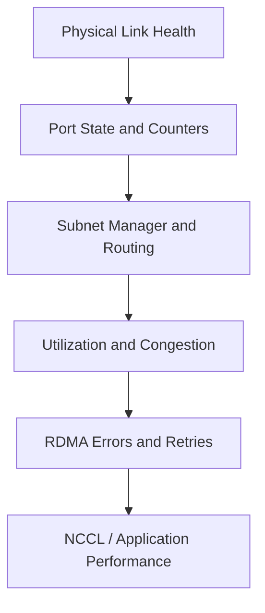

# Fabric Monitoring and Telemetry

An InfiniBand incident often begins as a performance complaint rather than a down link. Monitoring must therefore cover physical errors, negotiated state, congestion, routing, subnet management, and workload-level communication.

## Learning Objectives

Classify fabric metrics, design alerts, preserve topology context, and distinguish symptoms from root causes.

## Observability Layers

## Metric Categories

| Category | Examples |
|---|---|
| Physical | link recovery, symbol or lane errors, negotiated width/rate |
| Link | transmit/receive bytes, discarded packets, buffer waits |
| Control plane | master identity, sweep failures, topology changes |
| Congestion | port wait, hot egresses, congestion notification |
| Endpoint | HCA health, QP errors, memory-registration failures |
| Workload | collective bandwidth, latency, straggler ranks |

Counters need rates and context. A large cumulative value may reflect old history; a rapidly increasing delta during a job is more actionable. Resetting counters destroys evidence, so export before clearing.

## Topology Context

Telemetry should map GUID, LID, switch port, cable, rack, node, HCA port, and workload. Without this mapping, operators see an error but cannot identify the affected service or physical path.

Maintain snapshots of `ibnetdiscover`, `iblinkinfo`, subnet-manager state, and switch inventory. Diff them after maintenance.

## Alert Design

Alert on sustained counter growth, unexpected negotiated rate, manager loss, topology changes outside maintenance, and performance deviations. Avoid paging on every transient event. Use severity based on customer impact and redundancy.

## Troubleshooting

When a workload slows, correlate job timing with per-port counters and route. A physical error on one uplink may cause rerouting and congestion elsewhere. The first visible hotspot is not always the failed component.

## Customer Perspective

A monitoring proposal should include ownership and response. Metrics without runbooks, retention, and escalation produce dashboards rather than operations.

## Interview Preparation

**Question:** Which single InfiniBand metric proves the fabric is healthy?

None. Health requires evidence across link, control plane, congestion, endpoint, and workload layers.

## Key Takeaways

- Monitor change rates, not only cumulative counters.
- Preserve GUID-to-physical and workload mappings.
- Correlate fabric and application telemetry.
- Alerts need ownership and runbooks.

## Cross References

- [Link Evolution](./chapter-08-hdr-ndr-xdr-and-link-evolution)
- [Next: Troubleshooting](./chapter-10-production-troubleshooting)
