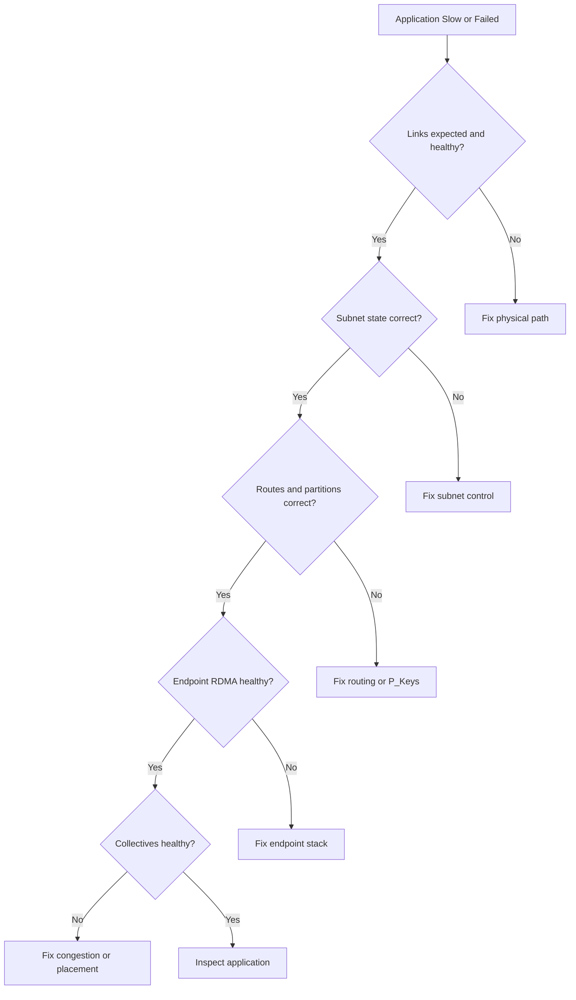

# Production InfiniBand Troubleshooting

Restarting the subnet manager or replacing a cable without evidence can hide the original failure. Production troubleshooting should move from physical state upward while preserving timestamps, counters, topology, and workload context.

## Learning Objectives

Use a layered decision tree, interpret common symptoms, and build a support-ready evidence package.

## Incident Flow

## Common Playbooks

### Port Down or Initializing

Check cable and optic qualification, both endpoint states, switch port configuration, firmware, and subnet-manager logs. A physical link can be up while the port remains outside Active because subnet configuration is incomplete.

### Reduced Width or Rate

Compare negotiated state with expected bill of materials. Inspect physical error counters, cable length/type, breakout settings, and both endpoint capabilities.

### RDMA Timeout

Inspect QP completion status, destination identity, P_Key membership, GID/LID selection, route, MTU, retry settings, and receiver readiness. Do not assume timeout means packet loss.

### Uneven Performance

Map source-destination paths, switch counters, job placement, service levels, and adapter locality. Reproduce across several pairs to identify whether the issue follows a node, port, path, or workload.

### Subnet Manager Failover Failure

Verify standby priority, election logs, configuration parity, and management reachability. Test failover during planned maintenance rather than first discovering it during an outage.

## Evidence Package

- incident timeline and affected jobs;
- topology and cable map;
- switch and HCA inventory;
- negotiated link state;
- error-counter deltas;
- subnet-manager logs and configuration;
- route and partition evidence;
- endpoint driver/firmware versions;
- minimal RDMA and collective reproducer.

## Prevention

Use preflight validation after maintenance, continuous topology diffing, qualified software matrices, spare cables and adapters, and documented ownership across server, network, and application teams.

## Customer Perspective

Support escalation improves when the customer can identify the first failing layer. “NCCL is slow” is not enough; provide the node pair, route, counters, topology, software versions, and controlled reproduction.

## Interview Preparation

**Question:** A port is Active. What do you check next?

Negotiated width/rate, errors, path and partition state, RDMA tests, route balance, congestion, and application transport selection.

## Key Takeaways

- Preserve evidence before intervention.
- Troubleshoot from physical layer to application.
- Timeouts and low performance have many nonphysical causes.
- A minimal reproducer accelerates ownership and resolution.

## Cross References

- [Fabric Monitoring](./chapter-09-fabric-monitoring-and-telemetry)
- [Next: Production Design Scenarios](./chapter-11-production-design-scenarios)
