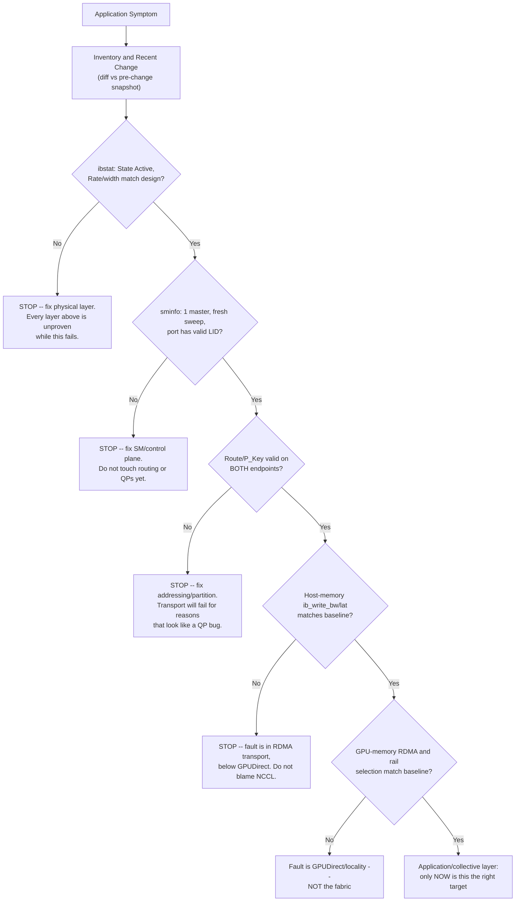
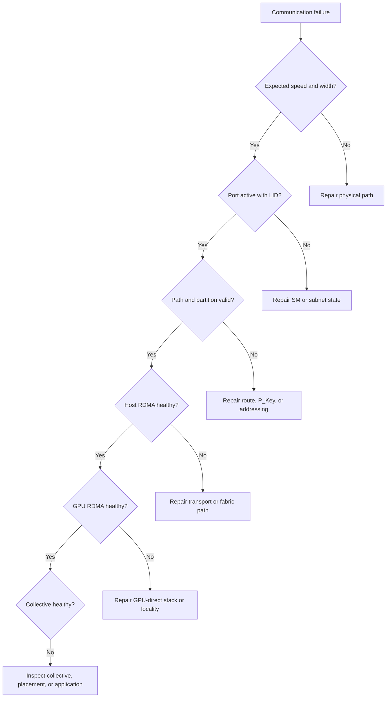

# Production Troubleshooting

## Introduction

InfiniBand incidents often arrive as vague application symptoms:

- training jobs hang;
- one rank is slow;
- bandwidth drops after maintenance;
- a node is reachable but cannot join a collective;
- performance degrades only under concurrency.

The fastest troubleshooting method is not to change many settings. It is to move through the stack in a fixed order and stop at the first layer that diverges from a known-good baseline.

| Chapter field | Value |
|---|---|
| Volume | 08 — InfiniBand |
| Difficulty | Expert |
| Estimated reading time | 70–90 minutes |
| Primary focus | Layered incident response |
| Previous | Fabric Monitoring and Telemetry |
| Next | Production Design Scenarios |

## Story: The NCCL Timeout That Was Not an NCCL Problem

A distributed training job reports a communication timeout. The application team changes NCCL timeouts and retries. The job runs longer but still fails.

A layered investigation shows:

1. one HCA port is `Active`;
2. negotiated width is lower than expected;
3. physical error counters increase during load;
4. pairwise RDMA bandwidth through that port is unstable;
5. collectives fail only when ranks use the affected path.

The root cause is a damaged cable. Application-level tuning hid the symptom without repairing the path.

> Troubleshooting should locate the first broken layer, not the last layer that reports an error.

## Learning Objectives

After completing this chapter, you will be able to:

- apply a layered InfiniBand troubleshooting workflow;
- collect a production-safe evidence bundle;
- distinguish physical, control-plane, routing, transport, and application failures;
- interpret common port and counter symptoms;
- isolate a failing path with pairwise tests;
- troubleshoot congestion separately from link faults;
- verify recovery against a baseline;
- prevent recurrence through monitoring and change control.

## The Layered Method



**Figure 8.10.1 — Diagnose from the bottom up, and each gate is a specific, checkable pass/fail condition, not a vague 'check this layer' instruction.** The `STOP` boxes are the point: this chapter's opening story is exactly what happens when someone skips past an unproven gate — the team tuned NCCL timeouts (layer G/A) while the physical-layer gate (P) was already failing, and no amount of application-layer tuning could fix a damaged cable.

## Step 1: Define the Symptom Precisely

Record:

- start time and timezone;
- affected jobs and users;
- node, GPU, HCA, and rail list;
- whether failure is constant or intermittent;
- same-node versus cross-node behavior;
- same-rack versus cross-rack behavior;
- message-size sensitivity;
- concurrency sensitivity;
- recent maintenance or configuration changes.

A statement such as “InfiniBand is slow” is not actionable. A useful statement is:

> Cross-rack AllReduce bandwidth on rail 1 fell by 35% after switch maintenance, while same-rack traffic and rail 0 remain within baseline.

## Step 2: Verify Inventory and Topology

Confirm the intended path:

- source GPU and NUMA domain;
- source HCA and port;
- cable and switch port;
- leaf and spine path;
- destination switch port and HCA;
- destination GPU;
- partition and rail.

Compare discovered topology with the source of truth. Wrong cabling can preserve reachability while changing locality and route balance.

## Step 3: Verify Physical and Logical Port State

Check:

- physical state;
- logical state;
- negotiated speed;
- negotiated width;
- link recovery history;
- physical and receive error deltas;
- cable and transceiver health.

Healthy output is platform-specific, but the essential expectation is that the port is operational at the designed rate and width without increasing fault counters.

## Step 4: Verify Subnet Management

Confirm:

- active SM exists;
- expected master is authoritative;
- affected ports have valid LIDs;
- recent sweeps completed;
- topology object counts are expected;
- partition policy includes both endpoints;
- no competing or stale SM configuration exists.

A port stuck in `Initializing` often points to control-plane or reachability problems rather than application software.

## Step 5: Verify Routing and Path Records

Check whether:

- a valid route exists;
- route uses intended rail and switch tier;
- path MTU and service level match policy;
- P_Key membership is compatible;
- path changed after a sweep or failure;
- traffic is concentrated on unexpected links.

Use endpoint and SM views. One side alone may hide stale or inconsistent state.

## Step 6: Test Host-Memory RDMA

Run a minimal, supported point-to-point test before involving GPU memory or collectives.

Test:

- latency across message sizes;
- unidirectional bandwidth;
- bidirectional bandwidth;
- same-rack and cross-rack pairs;
- each rail;
- repeated runs for variance.

If host-memory RDMA is unhealthy, the fault is below the GPU-direct layer.

### Annotated `ib_write_lat`: reading a latency test against a baseline, not in isolation

```text
$ ib_write_lat -d mlx5_0 -i 1 --report_gbits -F <server>
---------------------------------------------------------------------------------------
                    RDMA_Write Latency Test
Connection type : RC          Using SRQ      : OFF
---------------------------------------------------------------------------------------
 #bytes #iterations    t_min[usec]    t_max[usec]  t_typical[usec]    t_avg[usec]    99% percentile[usec]   99.9% percentile[usec]
 2       1000           1.42           6.81         1.58              1.61            2.90                    5.77
---------------------------------------------------------------------------------------

# Baseline captured during Lab 02, same node pair, same parameters:
 2       1000           1.41           2.03         1.55              1.56            1.71                    1.98
```

`t_typical` (1.58 vs 1.55us) and `t_avg` are nearly identical to baseline — a quick glance at averages alone would call this healthy. The `99% percentile` (2.90 vs 1.71us) and especially `99.9% percentile` (5.77 vs 1.98us) tell a different story: a small fraction of operations are taking roughly 3x longer than baseline. This is the exact "healthy `ib_write_bw` test does not prove a healthy GPU-direct path" caution generalized one layer down — a healthy-looking average does not prove a healthy tail, and tail latency is what synchronized collectives actually pay for (Chapter 1, Figure 8.1.2).

## Step 7: Test GPU-Memory and Collective Paths

Only after host RDMA is healthy, validate:

- GPU-memory registration;
- GPUDirect path selection;
- GPU-to-HCA locality;
- multi-rail use;
- NCCL or framework transport logs;
- collective bandwidth and tail behavior.

A healthy `ib_write_bw` test does not prove a healthy GPU-direct path.

## Decision Tree



## Common Incident 1: Port Down

**Symptoms**

- no physical link;
- port reports down or disabled;
- peer not discovered.

**Diagnosis**

Inspect cable seating, supported cable type, switch port state, HCA state, firmware, and power.

**Root causes**

- disconnected or failed cable;
- disabled switch port;
- unsupported cable or reach;
- failed adapter or switch port;
- firmware incompatibility.

**Resolution**

Repair or replace the failed component, then verify expected speed, width, and clean error rate.

## Common Incident 2: Port `Initializing`

**Symptoms**

- physical link is present;
- no usable LID;
- applications cannot communicate.

**Diagnosis**

Check SM availability, SM binding, topology reachability, logs, partition state, and competing SMs.

**Root cause**

The physical link exists, but subnet programming is incomplete.

**Evidence.** `ibstat` shows `Physical state: LinkUp` with `State: Initializing` and `Base lid: 0` (full annotated example in Chapter 2), and `sminfo` against the expected master either times out or shows a stale `activity count` (Chapter 5's annotated example) — the pairing confirms the fault is control-plane, not physical.

## Common Incident 3: Reduced Width or Speed

**Symptoms**

- port is active;
- throughput is below baseline;
- negotiated state differs from design.

**Diagnosis**

Compare both endpoints and physical counters. Isolate cable, port, and adapter through controlled substitution.

**Prevention**

Alert whenever negotiated speed or width differs from inventory.

## Common Incident 4: Rising Physical Errors

**Symptoms**

- intermittent performance;
- retries or recovery events;
- error rate rises under load.

**Diagnosis**

Determine whether the errors follow the cable, switch port, or HCA port. Check temperature and recent handling.

**Resolution**

Replace or repair the defective physical component. Do not mask the issue with larger application timeouts.

## Common Incident 5: Host RDMA Fails, Port Looks Healthy

**Possible causes**

- wrong P_Key;
- invalid path record;
- incorrect GID or port selection;
- queue-pair state failure;
- memory registration failure;
- firewall or namespace issue in mixed environments;
- software or firmware incompatibility.

Inspect completion status and transport logs. A timeout alone is not a root cause.

## Common Incident 6: Host RDMA Healthy, GPU RDMA Slow

**Possible causes**

- GPU and HCA on distant PCIe roots;
- GPUDirect support missing or incompatible;
- container devices or permissions incomplete;
- host-staged fallback;
- registration failures;
- wrong rail selected.

Compare CPU utilization and communication-library logs with a known-good node.

## Common Incident 7: Pairwise Tests Pass, Collectives Are Slow

**Possible causes**

- oversubscription;
- route imbalance;
- one slow rank;
- synchronized congestion;
- collective algorithm mismatch;
- rail imbalance;
- concurrent job interference;
- CPU or GPU scheduling noise.

Run collectives at increasing scale and correlate per-link telemetry with rank placement.

## Common Incident 8: Intermittent Hangs

Intermittent hangs require timeline correlation. Collect:

- QP completion errors;
- retries and timeouts;
- SM sweep events;
- link-state changes;
- GPU XID events;
- process exits;
- scheduler evictions;
- switch congestion;
- application logs.

A hang may be caused by a failed rank rather than the fabric itself.

## Common Incident 9: Congestion Without Errors

**Symptoms**

- physical counters are clean;
- throughput falls under concurrent load;
- transmit wait rises;
- one destination or cut is saturated.

**Resolution options**

- change placement;
- rebalance routes;
- enable or tune supported adaptive routing;
- apply admission control;
- separate traffic classes;
- add capacity.

**Evidence.** `ibqueryerrors -s XmtWait,SymbolErrorCounter` on the suspect tier (full annotated example in Chapter 7) is the confirming read: `XmtWait` elevated with `SymbolErrorCounter` and `LinkDownedCounter` flat is the specific signature that separates this incident class from Common Incident 4 above — same "throughput falls" symptom, opposite root cause and opposite fix.

## Common Incident 10: Post-Maintenance Topology Drift

**Symptoms**

- links are active;
- route balance changes;
- rail mapping differs;
- performance varies by rack.

**Diagnosis**

Compare discovered topology, cable records, GUID mappings, and forwarding state with the pre-maintenance snapshot.

## Safe Command Practice

Every diagnostic command should document:

- purpose;
- scope;
- privilege required;
- whether it changes state;
- expected healthy output;
- expected broken output;
- cleanup or reset implications.

Prefer read-only inspection before resets. Resetting ports or clearing counters can destroy evidence.

## Evidence Bundle

Capture:

```text
incident-id/
  timeline.txt
  affected-nodes.txt
  topology/
  port-state/
  counters-before/
  counters-after/
  sm-logs/
  routes/
  host-rdma/
  gpu-rdma/
  collectives/
  versions/
  recent-changes/
```

## Verification After Resolution

A repair is complete only when:

- intended topology is restored;
- port speed and width match design;
- error rate remains stable;
- SM state is healthy;
- path and partition state are correct;
- host RDMA matches baseline;
- GPU RDMA matches baseline;
- collective performance matches baseline;
- alerts and documentation are updated.

## Prevention

Prevent recurrence through:

- expected-state monitoring;
- cable and port inventory;
- pre/post-maintenance snapshots;
- firmware qualification;
- canary upgrades;
- automated pairwise and collective tests;
- SM failover exercises;
- runbooks and evidence automation.

## Customer Scenario

A customer asks why a support case requires so much evidence when “the network is clearly down.”

The architect explains that the same symptom can originate from physical media, subnet management, partitions, routing, RDMA resources, GPU locality, collective scheduling, or a failed process. A layered evidence set prevents random changes and shortens time to root cause.

## Interview Preparation

1. A port is `LinkUp` but not `Active`. What does that suggest?
   **Model answer:** "The physical layer negotiated fine, but the subnet manager hasn't admitted this port into the operational subnet — usually a missing or unauthoritative SM, an isolated topology segment, or a partition/policy rejection. I'd check `sminfo` for exactly one healthy master before touching anything physical, since the physical layer already proved itself."

2. Host RDMA passes but GPU RDMA fails. Where do you look?
   **Model answer:** "The layer between them — GPUDirect. Specifically GPU-to-HCA PCIe locality and NUMA placement, whether GPUDirect support is actually enabled and compatible on this node, container device permissions if it's containerized, and whether the path silently fell back to host-staged copies. Host RDMA passing rules out the fabric and basic transport entirely, so I wouldn't waste time re-checking cables or the SM."

3. Pairwise tests pass but AllReduce is slow. What changes at scale?
   **Model answer:** "Pairwise tests validate one link in isolation; a collective exercises the whole topology simultaneously, so oversubscription, route concentration, and synchronized congestion only appear under that combined load. I'd run collectives at increasing node counts and correlate per-link telemetry with rank placement, because the failure mode that only exists 'at scale' is specifically the interaction between many flows, which a two-node pairwise test structurally cannot reproduce."

4. How do you distinguish congestion from a bad cable?
   **Model answer:** "Pull both counter families together: `XmtWait` up with `SymbolErrorCounter`/`LinkDownedCounter` flat is congestion — queueing, no physical fault. Errors and recovery events climbing, regardless of wait counters, is a physical fault. I would never replace a cable because utilization looks high, and I would never tune congestion settings while a link is actively producing physical errors — the two require completely different fixes and mixing them up wastes a maintenance window."

5. Why should counters be collected before resetting a port?
   **Model answer:** "Because resetting a port or clearing its counters destroys the exact evidence — accumulated error counts, wait history — that would otherwise prove what was actually wrong. I've seen a 'quick reset to see if it helps' erase the only proof that a link had been silently degrading for days, turning a diagnosable incident into a mystery that recurs a week later."

## Summary

InfiniBand troubleshooting is fastest when it follows the data path from physical link to application. Validate expected state, compare against baseline, isolate with minimal tests, and preserve evidence before changing the system.

## Key Takeaways

- Start at the lowest unproven layer.
- Reachability is not a performance test.
- Host RDMA and GPU RDMA validate different paths.
- Counter deltas and topology context matter.
- Congestion and physical faults require different remedies.
- Recovery must be verified end to end.

## Cross References

- Previous: [Fabric Monitoring and Telemetry](./chapter-09-fabric-monitoring-and-telemetry)
- Next: [Production Design Scenarios](./chapter-11-production-design-scenarios)
- Related lab: [Troubleshoot an InfiniBand Path](./labs/lab-04-troubleshoot-an-infiniband-path)

## Further Reading

Use the operational guides for the exact fabric-management suite, switch OS, HCA firmware, RDMA stack, CUDA stack, and collective library deployed in the environment.