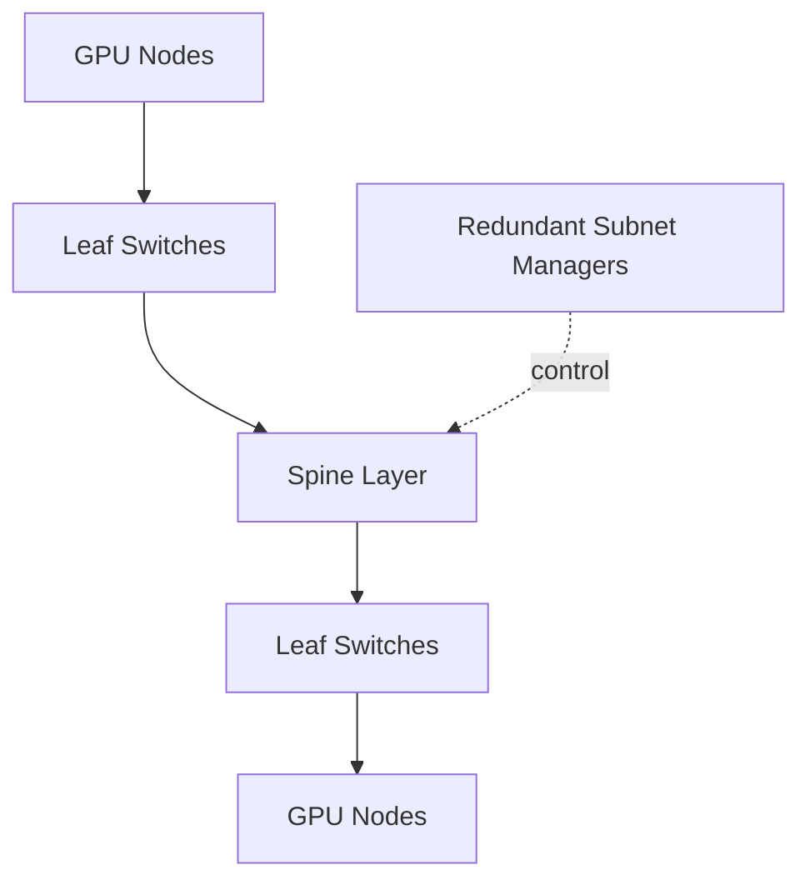

# Production InfiniBand Design Scenarios

## Scenario 1: Large Training Fabric

A synchronized training cluster needs predictable all-reduce performance. Design from the communication matrix: endpoint count, per-node rails, job size, rack locality, expected simultaneous jobs, and failure-state capacity.

Use symmetric cabling, deliberate routing, known oversubscription, topology-aware scheduling, and collective baselines.

## Scenario 2: Shared Storage and Compute Fabric

Combining storage and training traffic reduces switch count but creates interference. Separate service levels or virtual lanes only when the complete QoS policy is qualified. Otherwise use independent fabrics or capacity headroom. Test synchronized checkpoint bursts, not average storage traffic.

## Scenario 3: Multi-Tenant Research Cluster

Use P_Keys and scheduler policy to create controlled communication domains. Fabric partitions do not replace host identity, workload authorization, or quota. Monitor noisy-neighbor behavior and provide topology-sensitive queues for large distributed jobs.

## Scenario 4: Fabric Expansion

Adding racks changes routing, bisection bandwidth, cable reach, subnet-manager scale, and failure domains. Validate the future topology before purchasing only endpoint adapters. Reserve switch ports, management capacity, and spares.

## Decision Matrix

| Constraint | Design response |
|---|---|
| Tight all-to-all communication | High bisection bandwidth and balanced routing |
| Cost-sensitive batch jobs | Measured oversubscription |
| Tenant isolation | P_Keys plus host and scheduler controls |
| Storage bursts | Separate fabric or tested QoS/capacity |
| Rapid expansion | Modular tiers and reserved radix |
| Strict availability | Redundant managers, paths, and tested failover |

## Operational Architecture

Every design should include firmware qualification, topology source of truth, cable labeling, baseline tests, telemetry retention, runbooks, replacement workflow, and change control. The network is not finished when the last cable is installed.

## Customer Workshop Questions

- What collective sizes and patterns dominate?
- How many jobs communicate simultaneously?
- Which traffic remains within a rack?
- What performance is required during one-link or one-switch failure?
- Who owns subnet management and routing policy?
- How will the fabric be expanded and upgraded?

## Interview Preparation

**Question:** Design an InfiniBand fabric for 1,024 GPUs.

A strong answer covers node rail mapping, leaf/spine topology, radix, oversubscription, routing, adaptive routing, subnet management, partitions, telemetry, cabling, storage traffic, failure states, validation, and operations.

## Key Takeaways

- Fabric design begins with traffic and failure models.
- Shared traffic needs capacity or proven isolation.
- Expansion changes routing and operations, not only port count.
- A production design includes lifecycle and ownership.

## Cross References

- [Production Troubleshooting](./chapter-10-production-troubleshooting)
- [Next: Volume 08 Summary](./chapter-12-volume-08-summary)
