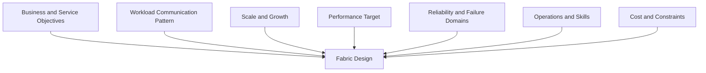
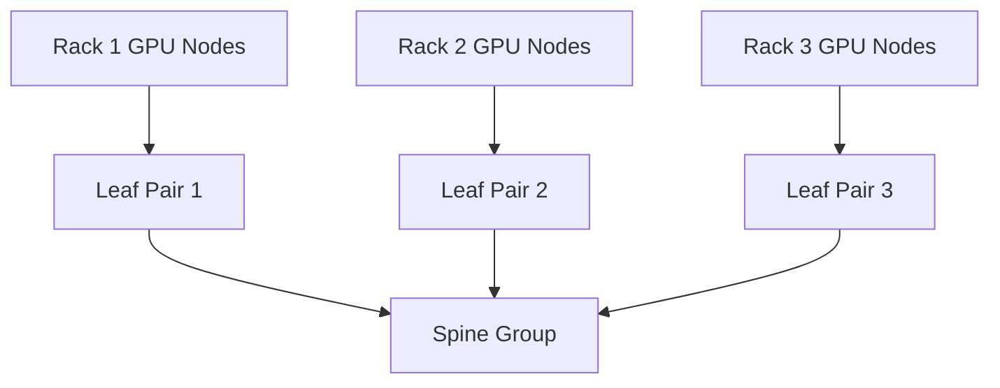

# Production Design Scenarios

## Introduction

InfiniBand architecture is not a checklist of switch features. It is a constraint-solving exercise.

The architect must translate workload behavior, GPU count, rack limits, service objectives, budget, growth, operational skill, and failure tolerance into a fabric design. The same switch generation can support several valid architectures, each with different trade-offs.

| Chapter field | Value |
|---|---|
| Volume | 08 — InfiniBand |
| Difficulty | Architect |
| Estimated reading time | 65–80 minutes |
| Primary focus | Enterprise architecture decisions |
| Previous | Production Troubleshooting |
| Next | Volume 08 Summary |

## Architecture Decision Framework

Technology selection comes after these questions are answered.

## Scenario 1: Eight DGX Systems for a Private LLM

### Customer goal

Deploy an initial private training and inference platform with eight multi-GPU systems, then grow to 32 systems.

### Discovery questions

- Are the eight systems one distributed training domain or independent jobs?
- What model sizes and parallelism strategies are planned?
- Is storage traffic on the same fabric?
- What scaling efficiency is required?
- Is near-term growth already funded?
- What maintenance windows are available?

### Recommended approach

Design the first phase as a repeatable building block rather than a temporary flat network. Preserve:

- consistent GPU-to-HCA mapping;
- enough leaf uplinks for the expected collective pattern;
- a clear path to additional leaf blocks;
- independent out-of-band management;
- primary and standby subnet management;
- telemetry from day one.

### Trade-offs

A fully nonblocking design may cost more initially, but an aggressively oversubscribed starter fabric may require disruptive replacement during expansion. The right answer depends on whether distributed jobs commonly span all eight systems.

## Scenario 2: 256-GPU Training Cluster

### Workload

Large synchronous jobs with frequent AllReduce and occasional all-to-all phases.

### Architecture priorities

1. high bisection bandwidth;
2. predictable path length;
3. topology-aware rank placement;
4. multi-rail use;
5. low failure blast radius;
6. fast fault isolation;
7. expansion without recabling the entire fabric.

### Design pattern

A two-tier folded Clos with sufficient uplinks to meet the scaling target is a common pattern. Rail-optimized attachment can preserve parallel injection paths.

### Validation

- pairwise host RDMA;
- GPU-buffer RDMA;
- rail balance;
- same-rack and cross-rack collectives;
- all-node collective scaling;
- concurrent-job congestion;
- one-link and one-switch failure behavior.

## Scenario 3: Shared Training and Inference

### Problem

Training creates large synchronized bursts. Inference requires predictable tail latency. Both use the same physical fabric.

### Risks

- training congestion increases inference latency;
- logical partitions do not guarantee bandwidth;
- storage or checkpoint traffic adds interference;
- one tenant can create a congestion tree.

### Design options

| Option | Benefit | Cost |
|---|---|---|
| Separate physical fabrics | Strongest isolation | Highest cost and complexity |
| Separate rails | Good path separation | Requires endpoint and software support |
| Service levels and virtual lanes | Traffic-class control | Requires careful tuning and validation |
| Scheduler placement and admission control | Reduces overlapping demand | Limits flexibility and needs orchestration integration |
| Capacity headroom | Absorbs bursts | Expensive idle capacity |

Use several controls together. Do not treat P_Keys as performance isolation.

## Scenario 4: InfiniBand for Compute and Storage

### Customer goal

Use one high-performance fabric for GPU communication and parallel storage.

### Advantages

- fewer adapters and cables;
- shared high-bandwidth infrastructure;
- GPUDirect Storage opportunities;
- simpler rack attachment in some designs.

### Risks

- checkpoint bursts interfere with collectives;
- storage failure can affect compute traffic;
- traffic-class policy becomes critical;
- capacity planning must include both domains;
- troubleshooting ownership may be split across teams.

### Architecture guidance

Model simultaneous worst-case demand. Validate service levels, virtual lanes, routing, and congestion behavior with training and storage active together.

## Scenario 5: Multi-Tenant Research Cluster

### Requirements

- many independent teams;
- a mix of short and long jobs;
- resource accounting;
- limited trust between tenants;
- high utilization target.

### Fabric controls

- P_Key partitions for membership boundaries;
- scheduler-controlled node allocation;
- namespace and host security;
- service-level policy where justified;
- per-tenant telemetry and chargeback;
- admission control for disruptive tests.

### Operational warning

Tenant isolation is an end-to-end property. Fabric partitions alone do not protect host memory, credentials, storage, or scheduler policy.

## Scenario 6: Expansion from 128 to 512 GPUs

### Common failure

The original design consumes all spine ports and rack power. Expansion requires a disruptive topology replacement.

### Better planning

Document:

- port-growth increments;
- reserved spine capacity;
- rack and cable pathways;
- SM scale and sweep behavior;
- management IP capacity;
- telemetry scale;
- firmware-generation compatibility;
- mixed-generation transition plan.

### Expansion decision

Compare:

- extending the existing fabric;
- adding a second independent fabric domain;
- introducing a new generation and migrating in phases;
- federating workload placement across clusters.

One larger subnet simplifies some scheduling but increases control-plane and failure-domain scale. Multiple subnets reduce blast radius but complicate cross-domain jobs.

## Scenario 7: Strict Availability Requirement

### Requirement

The cluster must continue selected workloads after one link, switch, or SM-host failure.

### Design implications

- path diversity;
- redundant leaf or rail attachment where supported;
- standby SM in a separate failure domain;
- independent management network;
- spare cables, adapters, and switches;
- degraded-mode capacity validation;
- maintenance procedures that preserve service.

Availability must be measured at the workload level. A fabric that remains reachable but loses half its bandwidth may not meet the service objective.

## Scenario 8: Cloud or Hosted Environment

### Constraint

The customer does not control switch configuration or physical topology.

### Architecture response

Focus on what is observable and contractual:

- instance placement options;
- advertised HCA and link capability;
- topology exposure;
- network performance guarantees;
- maintenance behavior;
- support escalation data;
- pairwise and collective baselines.

Avoid assuming bare-metal operational controls exist in a hosted service.

## Scenario 9: Security-Sensitive Enterprise

### Requirements

- tenant separation;
- controlled firmware lifecycle;
- audited configuration;
- least privilege;
- secure management plane;
- evidence retention.

### Controls

- restricted SM and switch-management access;
- version-controlled partition configuration;
- signed or approved firmware process;
- out-of-band network segmentation;
- audit logging;
- support-bundle data handling;
- break-glass procedures.

Do not disable IOMMU or other protection mechanisms solely to improve a benchmark unless the platform explicitly requires and supports the configuration within the customer’s risk model.

## Scenario 10: Budget-Constrained AI Factory

### Problem

The customer cannot fund a fully nonblocking fabric for peak all-node communication.

### Architecture response

Use evidence to decide where compromise is acceptable:

- confine common jobs within rack-local blocks;
- schedule large jobs during controlled windows;
- adopt measured oversubscription;
- reserve high-bandwidth partitions for critical workloads;
- expand capacity in modular increments;
- expose expected degraded performance to users.

A transparent, measured compromise is better than an undocumented bottleneck.

## Customer Workshop Template

A productive workshop should capture:

### Business

- use cases;
- growth timeline;
- service objectives;
- budget and procurement constraints.

### Workload

- model size;
- parallelism strategy;
- communication-to-compute ratio;
- checkpoint behavior;
- concurrency;
- latency and throughput targets.

### Infrastructure

- GPU node type;
- HCA count and placement;
- rack power and cooling;
- storage design;
- cable constraints;
- management network.

### Operations

- ownership;
- monitoring stack;
- firmware policy;
- maintenance windows;
- incident response;
- support model.

### Decision record

For every major choice, document:

- requirement;
- assumption;
- selected design;
- rejected alternative;
- trade-off;
- validation plan;
- future trigger for reconsideration.

## Interview Preparation

### Architecture Questions

1. Design an InfiniBand fabric for 512 GPUs with one-switch failure tolerance.
2. Decide whether compute and storage should share the fabric.
3. Design multi-tenancy for training and inference.
4. Plan expansion from HDR to NDR or a later generation.

### Customer Questions

1. Why not use Ethernet?
2. How much oversubscription is acceptable?
3. Do we need redundant subnet managers?
4. Can partitions guarantee tenant performance?
5. What should we benchmark before purchase?

### Whiteboard Exercise

Draw a two-tier multi-rail fabric for four racks. Label endpoint injection, uplink capacity, oversubscription, SM placement, management network, and failure domains.

## Summary

Production InfiniBand design begins with workload and business constraints. Topology, routing, congestion policy, partitions, telemetry, and high availability are consequences of those requirements.

There is no universally best fabric. There is only a design whose assumptions, trade-offs, and validation evidence match the customer’s goals.

## Key Takeaways

- Workload communication patterns drive fabric architecture.
- Isolation, availability, and performance require multiple controls.
- Expansion must be designed before ports and rack capacity are exhausted.
- Hosted environments change operational responsibility.
- Cost compromises should be explicit and measurable.
- Every recommendation needs a validation and rollback plan.

## Cross References

- Previous: [Production Troubleshooting](./chapter-10-production-troubleshooting)
- Next: [Volume 08 Summary](./chapter-12-volume-08-summary)
- Related lab: [Troubleshoot an InfiniBand Path](./labs/lab-04-troubleshoot-an-infiniband-path)

## Further Reading

Use current validated reference architectures, switch and HCA design guides, fabric-management documentation, and workload-specific benchmark results. Product generations change; the decision framework remains applicable.