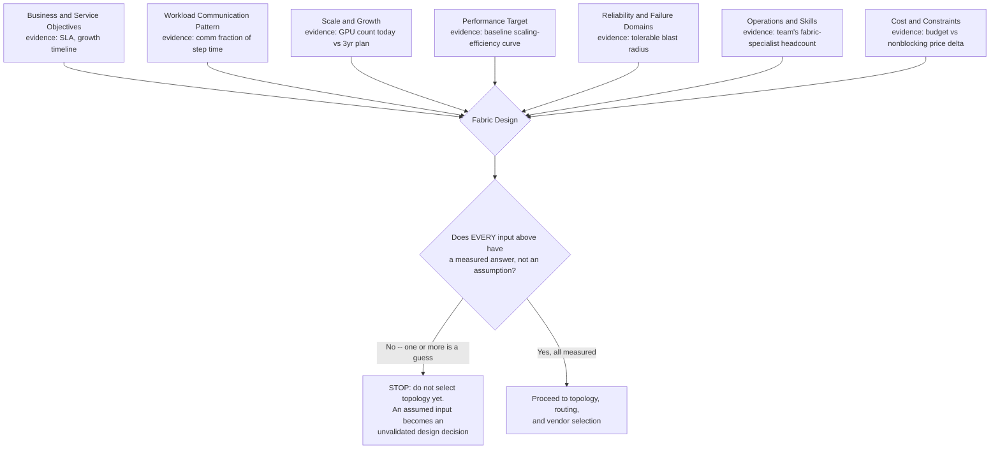
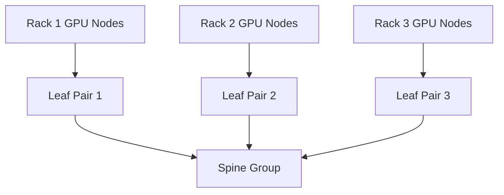

# Production Design Scenarios

## Introduction

InfiniBand architecture is not a checklist of switch features. It is a constraint-solving exercise.

The architect must translate workload behavior, GPU count, rack limits, service objectives, budget, growth, operational skill, and failure tolerance into a fabric design. The same switch generation can support several valid architectures, each with different trade-offs.

| Chapter field | Value |
|---|---|
| Volume | 08 — InfiniBand |
| Difficulty | Architect |
| Estimated reading time | 65–80 minutes |
| Primary focus | Enterprise architecture decisions |
| Previous | Production Troubleshooting |
| Next | Volume 08 Summary |

## Architecture Decision Framework

**Figure 8.11.0 — Technology selection comes after these seven questions are answered with evidence, not opinions, and the gate at the bottom is the actual discipline this chapter is teaching.** Every scenario below is an instance of one or more of these seven inputs being under-specified in the customer's original ask — Scenario 1's "eight systems now, thirty-two later" only becomes a real design once "Scale and Growth" has a funded, dated answer instead of a vague intention.

## Scenario 1: Eight DGX Systems for a Private LLM

### Customer goal

Deploy an initial private training and inference platform with eight multi-GPU systems, then grow to 32 systems.

### Discovery questions

- Are the eight systems one distributed training domain or independent jobs?
- What model sizes and parallelism strategies are planned?
- Is storage traffic on the same fabric?
- What scaling efficiency is required?
- Is near-term growth already funded?
- What maintenance windows are available?

### Recommended approach

Design the first phase as a repeatable building block rather than a temporary flat network. Preserve:

- consistent GPU-to-HCA mapping;
- enough leaf uplinks for the expected collective pattern;
- a clear path to additional leaf blocks;
- independent out-of-band management;
- primary and standby subnet management;
- telemetry from day one.

### Trade-offs

A fully nonblocking design may cost more initially, but an aggressively oversubscribed starter fabric may require disruptive replacement during expansion. The right answer depends on whether distributed jobs commonly span all eight systems.

## Scenario 2: 256-GPU Training Cluster

### Workload

Large synchronous jobs with frequent AllReduce and occasional all-to-all phases.

### Architecture priorities

1. high bisection bandwidth;
2. predictable path length;
3. topology-aware rank placement;
4. multi-rail use;
5. low failure blast radius;
6. fast fault isolation;
7. expansion without recabling the entire fabric.

### Design pattern

A two-tier folded Clos with sufficient uplinks to meet the scaling target is a common pattern. Rail-optimized attachment can preserve parallel injection paths.

### Validation

- pairwise host RDMA;
- GPU-buffer RDMA;
- rail balance;
- same-rack and cross-rack collectives;
- all-node collective scaling;
- concurrent-job congestion;
- one-link and one-switch failure behavior.

### Worked sizing: leaf uplinks for a nonblocking 256-GPU design

If each of 16 racks holds 16 GPU nodes (256 total), each with one 400Gb/s-class rail, a leaf serving one rack needs 16 × 400 = 6,400Gb/s of downlink capacity. For a fully nonblocking leaf (1:1), that leaf also needs 6,400Gb/s of uplink capacity — at 400Gb/s per uplink port, that is 16 uplink ports per leaf, meaning the leaf switch needs a 32-port radix just to break even (16 down, 16 up), before accounting for a second rail or redundancy. If the budget only supports a 24-port leaf, the arithmetic forces a choice: either reduce to 8 uplinks (16 down : 8 up = 2:1 oversubscribed, per Chapter 6's formula) or reduce endpoint density per leaf. This is the concrete version of "avoid selecting switch count before calculating communication requirements" — the port-count math, not a vendor's marketing sheet, determines whether "nonblocking" is actually true for this design.

## Scenario 3: Shared Training and Inference

### Problem

Training creates large synchronized bursts. Inference requires predictable tail latency. Both use the same physical fabric.

### Risks

- training congestion increases inference latency;
- logical partitions do not guarantee bandwidth;
- storage or checkpoint traffic adds interference;
- one tenant can create a congestion tree.

### Design options

| Option | Benefit | Cost |
|---|---|---|
| Separate physical fabrics | Strongest isolation | Highest cost and complexity |
| Separate rails | Good path separation | Requires endpoint and software support |
| Service levels and virtual lanes | Traffic-class control | Requires careful tuning and validation |
| Scheduler placement and admission control | Reduces overlapping demand | Limits flexibility and needs orchestration integration |
| Capacity headroom | Absorbs bursts | Expensive idle capacity |

Use several controls together. Do not treat P_Keys as performance isolation.

**Evidence for the table above.** The "Service levels and virtual lanes" row's claimed benefit is measurable, not assumed: run a synthetic inference-latency client continuously while a training job saturates the shared fabric, first with all traffic on one default SL/VL, then with training and inference mapped to separate SLs/VLs end to end. A representative before/after on p99 inference latency: **1.8ms (isolated baseline) -> 14.2ms (shared VL, training active) -> 3.1ms (separated VL, training active)**. Separation recovers most, not all, of the regression — the residual 3.1ms versus 1.8ms gap is exactly why the row also says "requires careful tuning and validation": VL separation reduces interference, it does not eliminate shared physical-link capacity.

## Scenario 4: InfiniBand for Compute and Storage

### Customer goal

Use one high-performance fabric for GPU communication and parallel storage.

### Advantages

- fewer adapters and cables;
- shared high-bandwidth infrastructure;
- GPUDirect Storage opportunities;
- simpler rack attachment in some designs.

### Risks

- checkpoint bursts interfere with collectives;
- storage failure can affect compute traffic;
- traffic-class policy becomes critical;
- capacity planning must include both domains;
- troubleshooting ownership may be split across teams.

### Architecture guidance

Model simultaneous worst-case demand. Validate service levels, virtual lanes, routing, and congestion behavior with training and storage active together.

## Scenario 5: Multi-Tenant Research Cluster

### Requirements

- many independent teams;
- a mix of short and long jobs;
- resource accounting;
- limited trust between tenants;
- high utilization target.

### Fabric controls

- P_Key partitions for membership boundaries;
- scheduler-controlled node allocation;
- namespace and host security;
- service-level policy where justified;
- per-tenant telemetry and chargeback;
- admission control for disruptive tests.

### Operational warning

Tenant isolation is an end-to-end property. Fabric partitions alone do not protect host memory, credentials, storage, or scheduler policy.

## Scenario 6: Expansion from 128 to 512 GPUs

### Common failure

The original design consumes all spine ports and rack power. Expansion requires a disruptive topology replacement.

### Better planning

Document:

- port-growth increments;
- reserved spine capacity;
- rack and cable pathways;
- SM scale and sweep behavior;
- management IP capacity;
- telemetry scale;
- firmware-generation compatibility;
- mixed-generation transition plan.

### Expansion decision

Compare:

- extending the existing fabric;
- adding a second independent fabric domain;
- introducing a new generation and migrating in phases;
- federating workload placement across clusters.

One larger subnet simplifies some scheduling but increases control-plane and failure-domain scale. Multiple subnets reduce blast radius but complicate cross-domain jobs.

## Scenario 7: Strict Availability Requirement

### Requirement

The cluster must continue selected workloads after one link, switch, or SM-host failure.

### Design implications

- path diversity;
- redundant leaf or rail attachment where supported;
- standby SM in a separate failure domain;
- independent management network;
- spare cables, adapters, and switches;
- degraded-mode capacity validation;
- maintenance procedures that preserve service.

Availability must be measured at the workload level. A fabric that remains reachable but loses half its bandwidth may not meet the service objective.

## Scenario 8: Cloud or Hosted Environment

### Constraint

The customer does not control switch configuration or physical topology.

### Architecture response

Focus on what is observable and contractual:

- instance placement options;
- advertised HCA and link capability;
- topology exposure;
- network performance guarantees;
- maintenance behavior;
- support escalation data;
- pairwise and collective baselines.

Avoid assuming bare-metal operational controls exist in a hosted service.

## Scenario 9: Security-Sensitive Enterprise

### Requirements

- tenant separation;
- controlled firmware lifecycle;
- audited configuration;
- least privilege;
- secure management plane;
- evidence retention.

### Controls

- restricted SM and switch-management access;
- version-controlled partition configuration;
- signed or approved firmware process;
- out-of-band network segmentation;
- audit logging;
- support-bundle data handling;
- break-glass procedures.

Do not disable IOMMU or other protection mechanisms solely to improve a benchmark unless the platform explicitly requires and supports the configuration within the customer’s risk model.

## Scenario 10: Budget-Constrained AI Factory

### Problem

The customer cannot fund a fully nonblocking fabric for peak all-node communication.

### Architecture response

Use evidence to decide where compromise is acceptable:

- confine common jobs within rack-local blocks;
- schedule large jobs during controlled windows;
- adopt measured oversubscription;
- reserve high-bandwidth partitions for critical workloads;
- expand capacity in modular increments;
- expose expected degraded performance to users.

A transparent, measured compromise is better than an undocumented bottleneck.

## Customer Workshop Template

A productive workshop should capture:

### Business

- use cases;
- growth timeline;
- service objectives;
- budget and procurement constraints.

### Workload

- model size;
- parallelism strategy;
- communication-to-compute ratio;
- checkpoint behavior;
- concurrency;
- latency and throughput targets.

### Infrastructure

- GPU node type;
- HCA count and placement;
- rack power and cooling;
- storage design;
- cable constraints;
- management network.

### Operations

- ownership;
- monitoring stack;
- firmware policy;
- maintenance windows;
- incident response;
- support model.

### Decision record

For every major choice, document:

- requirement;
- assumption;
- selected design;
- rejected alternative;
- trade-off;
- validation plan;
- future trigger for reconsideration.

## Interview Preparation

### Architecture Questions

1. Design an InfiniBand fabric for 512 GPUs with one-switch failure tolerance.
   **Model answer:** "One-switch failure tolerance means at least two independent spine switches with the workload's required bandwidth still available after either one fails — so I'd size uplinks assuming N-1 spines, not N. Concretely: if two spines together need to deliver X aggregate bandwidth, each spine alone needs to carry X, not X/2, or losing one spine drops delivered bandwidth by half instead of just losing redundancy headroom. I'd also make sure the standby SM sits in a failure domain independent of either spine's power and management path."

2. Decide whether compute and storage should share the fabric.
   **Model answer:** "I'd model simultaneous worst-case demand first — what does checkpoint traffic look like at its peak burst, and does that overlap in time with peak collective communication. If checkpoint bursts are large and can land mid-training-step, sharing the fabric risks exactly the interference this chapter's Scenario 4 describes. If the organization can't yet answer that overlap question with data, I'd lean toward separate physical fabrics or at minimum enforced service-level separation, and revisit once real utilization data exists."

3. Design multi-tenancy for training and inference.
   **Model answer:** "Layer multiple controls, because none of them alone is sufficient: P_Key partitions for membership boundaries, scheduler-controlled placement to reduce overlapping demand, service-level mapping if training and inference share links, and per-tenant telemetry so I can actually prove isolation held under load rather than assume it. I'd explicitly test the denied path, not just the allowed one — proving tenant B genuinely can't reach tenant A is as important as proving tenant A can reach itself."

4. Plan expansion from HDR to NDR or a later generation.
   **Model answer:** "Baseline current application performance first, then verify the full compatibility set — HCA, switch, cable, firmware — before assuming a mixed-generation fabric interoperates cleanly. I'd pilot on a representative but limited path, measure host-injection and topology bottlenecks before assuming the new generation's link speed is the thing that will actually move the needle, and roll out in controlled phases with rollback defined up front, exactly as Chapter 8's upgrade-planning sequence lays out."

### Customer Questions

1. Why not use Ethernet?
   **Model answer:** "It's a legitimate option, not a wrong one — the answer depends on your workload's communication fraction and how much operational specialization you're willing to take on for predictability under synchronized load. I'd rather walk through that trade-off with actual numbers from your workload than assert InfiniBand is categorically better."

2. How much oversubscription is acceptable?
   **Model answer:** "There's no universal number — it's a function of how often your jobs actually span the oversubscribed cut simultaneously and at what intensity. I'd want to run the leaf-uplink arithmetic against your specific rack/leaf design and your specific collective pattern before giving you a ratio, rather than quoting an industry rule of thumb that may not fit your topology."

3. Do we need redundant subnet managers?
   **Model answer:** "For anything beyond a small lab or pilot, yes — a single SM host is a single point of control-plane failure for the whole fabric. The redundancy only counts if it's tested under real traffic, though; an untested standby is a false sense of security, not actual availability."

4. Can partitions guarantee tenant performance?
   **Model answer:** "No — P_Keys guarantee membership, not bandwidth. Two tenants in separate, correctly configured partitions can still contend for the same physical uplinks. If performance guarantees matter to you contractually, that needs capacity planning, scheduling policy, or physical separation on top of partitions, and I'd want that in writing as a design requirement, not an assumption."

5. What should we benchmark before purchase?
   **Model answer:** "Your actual workload's collective pattern at representative scale, if you can get access to a proof-of-concept environment — not just vendor-published point-to-point numbers. Point-to-point bandwidth tells you the link is fast; it doesn't tell you how your specific AllReduce or all-to-all pattern behaves under your topology's oversubscription and your team's routing configuration."

### Whiteboard Exercise

Draw a two-tier multi-rail fabric for four racks. Label endpoint injection, uplink capacity, oversubscription, SM placement, management network, and failure domains.

**What I'd actually say while drawing:** "Four racks, each with its own leaf pair for two-rail redundancy — I'll label each leaf's downlink count and uplink count so the oversubscription ratio is visible right on the diagram, not left implicit. Spine layer above, at least two spines so losing one doesn't disconnect anyone, and I'd write the failure-domain note right there: 'each spine sized to carry full load alone, not half.' SM boxes off to the side, primary near rack 1's management infrastructure, standby physically in rack 3's — different power, different failure domain, and I'd draw the out-of-band management network as a separate plane entirely, not routed through the data fabric it manages. The one thing I'd emphasize while drawing: every box on this diagram should trace back to one of the seven inputs from the decision framework — if I can't say which requirement drove a specific uplink count, that number is a guess, not a design."

## Summary

Production InfiniBand design begins with workload and business constraints. Topology, routing, congestion policy, partitions, telemetry, and high availability are consequences of those requirements.

There is no universally best fabric. There is only a design whose assumptions, trade-offs, and validation evidence match the customer’s goals.

## Key Takeaways

- Workload communication patterns drive fabric architecture.
- Isolation, availability, and performance require multiple controls.
- Expansion must be designed before ports and rack capacity are exhausted.
- Hosted environments change operational responsibility.
- Cost compromises should be explicit and measurable.
- Every recommendation needs a validation and rollback plan.

## Cross References

- Previous: [Production Troubleshooting](./chapter-10-production-troubleshooting)
- Next: [Volume 08 Summary](./chapter-12-volume-08-summary)
- Related lab: [Troubleshoot an InfiniBand Path](./labs/lab-04-troubleshoot-an-infiniband-path)

## Further Reading

Use current validated reference architectures, switch and HCA design guides, fabric-management documentation, and workload-specific benchmark results. Product generations change; the decision framework remains applicable.