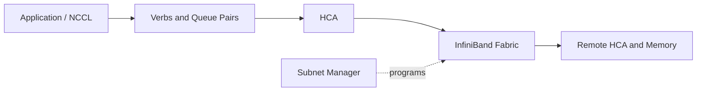

# Volume 08 Summary

InfiniBand is a complete RDMA fabric architecture. HCAs expose registered memory and queue-based transports. Switches forward traffic. The Subnet Manager discovers the topology and programs routes, partitions, and service attributes. Production performance depends on capacity, routing, congestion behavior, endpoint placement, and operations.

## Architecture Summary

## Quick Revision

| Concept | Meaning |
|---|---|
| QP | Send and receive work queues |
| CQ | Completion results |
| MR | Registered DMA-accessible memory |
| LID | Subnet-local forwarding identity |
| GID | Global-style port identity |
| P_Key | Partition membership |
| OpenSM | Subnet-manager implementation |
| Oversubscription | Endpoint demand sharing limited uplinks |
| Adaptive routing | Dynamic path selection among eligible routes |

## Production Principles

- Validate negotiated link state, not only installed hardware.
- Preserve GUID-to-port, cable, rack, and workload mappings.
- Run redundant, controlled subnet managers.
- Treat routing and partition changes as production changes.
- Model capacity during failures and maintenance.
- Correlate physical, control-plane, congestion, endpoint, and workload telemetry.
- Troubleshoot from the first diverging layer.

## Troubleshooting Checklist

1. Link state, width, rate, and physical errors.
2. Subnet-manager master, logs, and topology.
3. LID/GID/P_Key and path records.
4. Routing balance and congestion counters.
5. HCA, QP, memory-registration, and completion errors.
6. Host and GPU RDMA benchmarks.
7. NCCL collectives and application behavior.

## Interview Notes

Avoid describing InfiniBand as simply “faster Ethernet.” Explain its queue-based RDMA model, managed subnet, lossless link behavior, routing, congestion controls, and operational trade-offs.

## Lab Checklist

- Inventory ports and topology.
- Run point-to-point bandwidth and latency tests.
- Inspect subnet-manager, routes, and counters.
- Inject and diagnose a safe link or path degradation.

## Next Volume

[Volume 09 — Ethernet for AI](../volume-09/index) examines how Ethernet is engineered for RDMA and AI traffic using RoCE, priority flow control, ECN, congestion control, Spectrum switches, ConnectX adapters, and BlueField DPUs.
