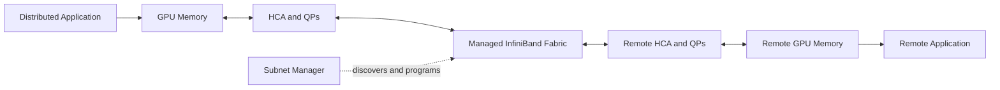
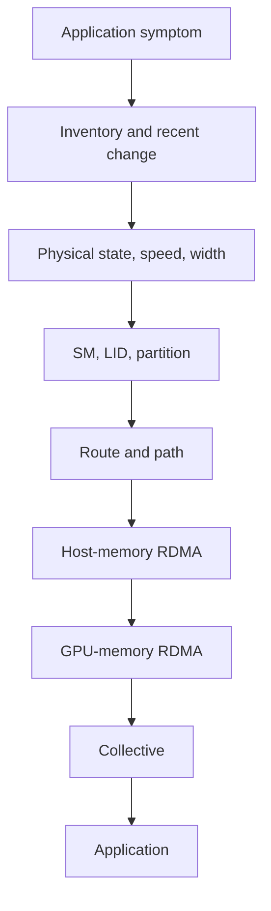

# Volume 08 Summary

## The Big Picture

InfiniBand is a managed, queue-based RDMA fabric for systems in which communication is part of computation. It combines:

- HCAs that execute memory-aware transport operations;
- registered memory and protection domains;
- queue pairs and completion queues;
- switches and credit-based links;
- LIDs, GIDs, and P_Keys;
- a Subnet Manager that discovers and programs the fabric;
- routing and path-selection policy;
- congestion and adaptive-routing mechanisms;
- telemetry and operational tooling.

## Learning Journey Recap

### Why InfiniBand exists

Synchronized AI and HPC workloads expose the cost of CPU-mediated copies, kernel transitions, variable latency, and weak path predictability. InfiniBand addresses these problems with RDMA, queue-based execution, managed routing, and high-throughput switched fabrics.

### Architecture and layers

Physical signaling, link flow control, routing, transport, and verbs are distinct layers. A port can be physically healthy while logical subnet state is broken. Troubleshooting must identify the first layer that diverges from expected behavior.

### Verbs and execution

Applications register memory, create protection domains, configure queue pairs, post work requests, and consume completion entries. Direct access reduces selected copies but still requires permission, ordering, resource management, and cleanup.

### Addressing and isolation

- GUIDs provide stable object identity.
- LIDs support forwarding within a subnet.
- GIDs provide globally structured identities.
- P_Keys define partition membership.

These identities serve different purposes and must not be treated as interchangeable.

### Subnet management

The SM discovers topology, assigns LIDs, computes routes, programs forwarding tables, distributes policy, and reacts to change. High availability requires consistent primary and standby configuration, tested failover, and independent management access.

### Routing and topology

Topology determines available paths; routing determines which are used. Oversubscription, bisection bandwidth, rail alignment, and collective schedules jointly determine delivered performance.

### Congestion

Lossless links still queue. Credit exhaustion creates backpressure, and backpressure can form congestion trees. Adaptive routing, congestion control, placement, admission control, and capacity expansion address different parts of the problem.

### Link generations

HDR, NDR, XDR, and later generations increase link capability, but speed labels alone do not predict application improvement. Width, encoding, PCIe attachment, cabling, topology, and workload communication fraction remain decisive.

### Observability

Production health requires expected-state comparison and counter deltas across inventory, SM state, links, routes, congestion, transport, and applications.

## Architecture Summary Table

| Layer | Primary objects | Healthy evidence | Common failure |
|---|---|---|---|
| Physical | cable, lane, port | expected speed and width, stable error rate | bad cable, degraded lane |
| Link | virtual lanes, credits | stable flow, low abnormal wait | backpressure, head-of-line blocking |
| Subnet | SM, LID, partitions | active master, valid LIDs, completed sweeps | missing SM, stale policy |
| Routing | forwarding tables, paths | balanced expected routes | hot links, unreachable destination |
| Transport | QP, CQ, MR, keys | successful completions | invalid key, retry, timeout |
| GPU direct | GPU-HCA peer path | direct registration and locality | host staging, remote NUMA path |
| Collective | rings, trees, ranks | scaling within baseline | slow rank, route imbalance |
| Application | training or inference | service objective met | upstream bottleneck or software failure |

## Production Design Principles

1. Understand the workload before choosing topology.
2. Preserve GPU-to-HCA locality.
3. Size for the communication cut, not only aggregate port count.
4. Make oversubscription explicit.
5. Separate data, subnet-management, and out-of-band management planes.
6. Design and test SM high availability.
7. Standardize firmware and configuration.
8. Monitor expected speed, width, route balance, and congestion.
9. Validate component, pairwise, collective, and application layers.
10. Design upgrades and rollback before production deployment.

## Troubleshooting Sequence

Stop at the first failed layer. Preserve evidence before resets or counter clearing.

## Customer Conversation Guide

When discussing InfiniBand with a customer, ask:

- What workloads synchronize across nodes?
- What fraction of runtime is communication?
- How many GPUs participate per job?
- What scaling efficiency is required?
- Which failures must the service tolerate?
- Will storage share the fabric?
- Is multi-tenancy required?
- What operational team will own the fabric?
- What growth is expected?
- What evidence will prove business value?

Do not recommend InfiniBand merely because GPUs are present. Recommend it when workload and service requirements justify the performance and operational model.

## Quick Revision Sheet

| Concept | One-sentence memory aid |
|---|---|
| HCA | Adapter that owns RDMA resources and moves data |
| Memory region | Registered and authorized DMA buffer |
| QP | Send and receive work queues for a transport endpoint |
| CQ | Reports completed or failed work |
| LID | Local forwarding identity assigned by the SM |
| GID | Globally structured port identity |
| P_Key | Partition membership control |
| SM | Discovers, addresses, routes, and programs the subnet |
| Sweep | Reconciles topology and fabric state |
| Oversubscription | Edge demand exceeds upstream capacity |
| Adaptive routing | Uses eligible alternate paths based on conditions |
| Backpressure | Credit shortage propagates upstream |
| Rail | Independent endpoint and fabric path |

## Interview Master Questions

### Conceptual

1. Why does InfiniBand use a Subnet Manager?
2. Why is RDMA not CPU-free?
3. What is the difference between a LID and a GUID?
4. Why can a lossless network still have high latency?
5. Why does `Active` not prove link health?

### Architecture

1. Design a 512-GPU nonblocking fabric.
2. Design SM high availability.
3. Decide whether storage and compute should share the fabric.
4. Design multi-tenant isolation and fairness.
5. Plan an HDR-to-NDR migration.

### Troubleshooting

1. A port is `LinkUp` but remains `Initializing`.
2. Host RDMA passes but GPU RDMA fails.
3. Pairwise bandwidth is healthy but collectives are slow.
4. One rail is idle.
5. Physical counters are clean but transmit wait is high.

## Lab Completion Checklist

You should be able to:

- inventory HCAs, GUIDs, ports, LIDs, GIDs, and P_Keys;
- map switches and physical links;
- verify speed and width;
- identify the active SM;
- inspect routing and counters;
- run latency and bandwidth benchmarks;
- compare host and GPU-memory paths;
- inject a safe, reversible placement or path fault;
- collect an incident evidence bundle;
- verify recovery against baseline.

## Final Takeaways

- InfiniBand is a complete fabric architecture, not only a fast link.
- RDMA performance depends on memory, queues, topology, and software.
- The SM is a production control-plane dependency.
- Routing determines whether physical capacity is usable.
- Losslessness does not remove congestion.
- Link generation upgrades must be evaluated end to end.
- Observability and runbooks are part of the architecture.
- The strongest troubleshooting method is to follow the data path layer by layer.

## Cross References

- [Volume 08 Introduction](./index)
- [Chapter 01 — Why InfiniBand Exists](./chapter-01-why-infiniband-exists)
- [Chapter 05 — Subnet Management and OpenSM](./chapter-05-subnet-management-and-opensm)
- [Chapter 10 — Production Troubleshooting](./chapter-10-production-troubleshooting)
- [Lab 04 — Troubleshoot an InfiniBand Path](./labs/lab-04-troubleshoot-an-infiniband-path)

## Further Reading

Continue with the project’s Ethernet-for-AI material after it is published. For production implementation, use current specifications, validated reference architectures, and documentation for the exact switch, HCA, firmware, driver, fabric-management, CUDA, and collective-library versions deployed.