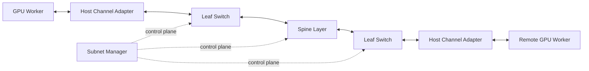

# Volume 08 — InfiniBand

Distributed training turns network behavior into application behavior. A collective operation that waits on one slow path can delay every accelerator participating in the job. Traditional network thinking focused on moving packets reliably between applications. Large GPU clusters also require predictable latency, direct memory access, efficient collectives, congestion control, and operational visibility at fabric scale.

This volume develops InfiniBand from first principles. It explains the transport model, queue-based communication, subnet management, routing, congestion behavior, link generations, and the operational methods used to validate production fabrics.

| Volume field | Value |
|---|---|
| Difficulty | Advanced |
| Estimated reading time | 16–20 hours |
| Prerequisites | Volume 07 — GPU Networking |
| Primary focus | RDMA fabric architecture and operations |
| Outcome | Design, validate, and troubleshoot InfiniBand for GPU clusters |

## The Big Picture

**Figure 8.0.1 — InfiniBand separates high-speed data movement from fabric control.** Endpoints exchange data through HCAs and switches while subnet management establishes addressing, paths, and fabric state.

## Planned Chapter Sequence

1. Why InfiniBand Exists
2. RDMA and the InfiniBand Transport Model
3. Host Channel Adapters and Switches
4. Queue Pairs, Completion Queues, and Verbs
5. LIDs, GIDs, Partitions, and Addressing
6. Subnet Management and OpenSM
7. Routing and Adaptive Routing
8. Congestion Control
9. HDR, NDR, and XDR Generations
10. Fabric Design for GPU Clusters
11. Production Troubleshooting
12. Volume 08 Summary

## Planned Labs

- Inspect an InfiniBand endpoint
- Map the fabric with operational tools
- Benchmark send and write bandwidth
- Diagnose a degraded link or route

PR creation is intentionally deferred until the complete volume is written and validated.
