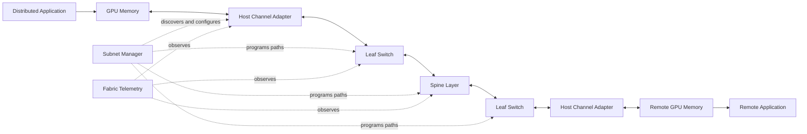
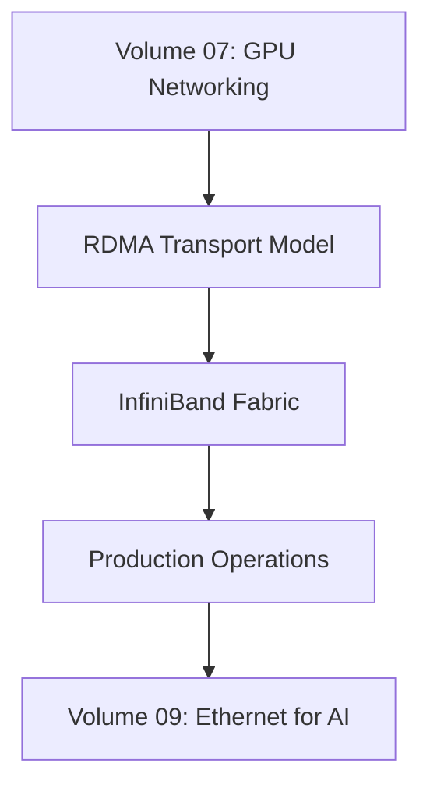

# Volume 08 — InfiniBand

A distributed GPU cluster is a parallel computer assembled from many independent systems. The GPUs execute kernels locally, but training and large-scale inference depend on tensors crossing node boundaries repeatedly. Once communication enters the critical path, network behavior becomes application behavior.

A fabric may report every link as active and still deliver poor training efficiency. One rail may be oversubscribed. One cable may negotiate at reduced width. One switch path may carry disproportionate traffic. One subnet manager may calculate valid but operationally undesirable routes. One rank may use an HCA on the wrong NUMA domain. The cluster remains reachable, yet synchronized workloads spend increasing time waiting.

InfiniBand was created for environments where communication is not background infrastructure. It is part of the computation itself.

This volume develops InfiniBand from first principles. It begins with the workload problem, then builds the transport, addressing, management, routing, congestion, telemetry, and troubleshooting model required to operate production AI fabrics.

| Volume field | Value |
|---|---|
| Difficulty | Advanced |
| Estimated reading time | 18–24 hours |
| Prerequisites | Volume 07 — GPU Networking |
| Primary focus | RDMA fabric architecture, operations, and troubleshooting |
| Target environment | Multi-node GPU and HPC clusters |
| Outcome | Design, validate, benchmark, and troubleshoot an InfiniBand fabric |

## Production Story

A customer deploys 128 GPU nodes connected through a non-blocking fabric. Initial acceptance testing looks successful: every node can communicate, every switch is reachable, and basic bandwidth tests pass.

During distributed training, however, step time varies by more than 20 percent. Jobs using one subset of nodes perform consistently, while jobs spanning another rack show periodic stalls. The software team blames the collective library. The network team points to healthy links.

A structured investigation reveals three interacting issues:

1. one group of links negotiated below the intended width after a cable replacement;
2. adaptive routing was not behaving as expected under the current traffic pattern;
3. several GPU ranks were paired with remote HCAs across NUMA boundaries.

No single component was completely broken. The architecture was functioning below its intended operating point.

This is the operational reality of large AI fabrics: **reachability is only the beginning of validation**.

## Learning Objectives

After completing this volume, you will be able to:

- explain why synchronized AI workloads need a specialized fabric model;
- distinguish InfiniBand link, transport, subnet, and application layers;
- explain verbs, queue pairs, work requests, and completion queues;
- interpret LIDs, GIDs, P_Keys, service levels, and path records;
- explain the role and failure modes of the subnet manager;
- reason about fat-tree, leaf-spine, rail, and oversubscribed topologies;
- explain adaptive routing and congestion control without marketing language;
- compare HDR, NDR, and XDR generations architecturally;
- build a production telemetry and baseline strategy;
- troubleshoot link, route, congestion, and transport failures;
- discuss InfiniBand design trade-offs with enterprise customers.

## The Big Picture

**Figure 8.0.1 — InfiniBand is a managed RDMA fabric.** Applications submit work through HCAs, switches forward traffic through configured paths, and the subnet manager establishes operational fabric state.

## How This Volume Fits the Bootcamp

Volume 07 explained the complete GPU data path: PCIe, NUMA, NVLink, DMA, RDMA, GPUDirect, adapter locality, and collective placement. Volume 08 narrows the focus to the scale-out fabric used between nodes.

The intent is not to memorize command output. It is to build a mental model that remains useful across adapter generations, switch platforms, and software releases.

## Learning Path

| Chapter | Engineering question |
|---|---|
| 01 — Why InfiniBand Exists | Why do synchronized workloads need a different communication model? |
| 02 — Architecture and Link Layers | How does traffic move from application memory to the physical link? |
| 03 — Verbs, Queue Pairs, and Completions | How is communication submitted, executed, and completed? |
| 04 — LIDs, GIDs, P_Keys, and Addressing | How are endpoints identified, reached, and isolated? |
| 05 — Subnet Management and OpenSM | Who discovers the fabric and programs paths? |
| 06 — Routing, Topologies, and Oversubscription | How does physical design shape delivered bandwidth? |
| 07 — Adaptive Routing and Congestion Control | How does the fabric respond to uneven traffic and contention? |
| 08 — HDR, NDR, XDR, and Link Evolution | What changes across generations, and what does not? |
| 09 — Fabric Monitoring and Telemetry | What evidence proves the fabric is healthy? |
| 10 — Production Troubleshooting | How do operators isolate link, route, and transport faults? |
| 11 — Production Design Scenarios | How should architectures change for customer constraints? |
| 12 — Volume Summary | How do all layers form one operational model? |

## Hands-on Labs

| Lab | Outcome |
|---|---|
| Lab 01 — Inventory an InfiniBand Fabric | Build a support-ready endpoint, port, switch, and topology inventory |
| Lab 02 — Benchmark Bandwidth and Latency | Establish repeatable host and GPU communication baselines |
| Lab 03 — Inspect Subnet Routing and Counters | Correlate paths, service levels, and port counters |
| Lab 04 — Troubleshoot an InfiniBand Path | Diagnose a deliberately degraded or misrouted path |

Each lab follows the full bootcamp standard: objective, architecture, prerequisites, environment, deployment, validation, observability, performance measurement, failure injection, troubleshooting, cleanup, and production relevance.

## Architecture Questions Used Throughout the Volume

Every design will be evaluated against the same questions:

- What workload communication pattern must the fabric support?
- What is the required bisection bandwidth?
- Where are the oversubscription boundaries?
- Which failures must be tolerated without job-wide interruption?
- How are routes calculated and validated?
- How is congestion detected before users report it?
- Which telemetry is retained as a baseline?
- How are firmware, topology, and subnet-manager changes rolled out safely?
- What skills and operational tooling does the customer need?
- When would Ethernet be the more appropriate choice?

## Production Mindset

This volume assumes production conditions:

- hundreds or thousands of endpoints;
- multiple switch tiers and rails;
- concurrent training and storage traffic;
- maintenance windows and rolling changes;
- failed cables, ports, adapters, and switches;
- mixed firmware or software during upgrades;
- tenant isolation requirements;
- capacity growth without full fabric replacement;
- application teams that report symptoms rather than root causes.

The goal is not merely to make a port reach `Active`. The goal is to operate a predictable distributed-computing fabric.

## Completion Criteria

You are ready to leave this volume when you can:

- draw the end-to-end InfiniBand data and control planes;
- explain how a work request becomes a packet and then a completion;
- identify the difference between physical link state and usable subnet state;
- calculate where topology creates oversubscription;
- explain why one slow path affects synchronized jobs;
- inspect routes, counters, errors, and congestion evidence;
- design a layered troubleshooting workflow;
- defend an InfiniBand recommendation—or explain why not to use it.

## Cross References

- Previous volume: [Volume 07 — GPU Networking](pathname://../volume-07/index)
- Related foundation: [DMA, RDMA, and Peer-to-Peer](pathname://../volume-07/chapter-04-dma-rdma-and-peer-to-peer)
- Related lab: [Benchmark RDMA and GPUDirect Paths](pathname://../volume-07/labs/lab-03-benchmark-rdma-and-gpudirect-paths)
- First chapter: [Why InfiniBand Exists](./chapter-01-why-infiniband-exists)

## Further Reading

Use the current InfiniBand Architecture Specification, NVIDIA networking documentation, adapter and switch release notes, OpenSM documentation, and the support matrix for the exact operating system, firmware, OFED, CUDA, NCCL, and GPU platform in use. Version-specific values should always be validated against the deployed environment.