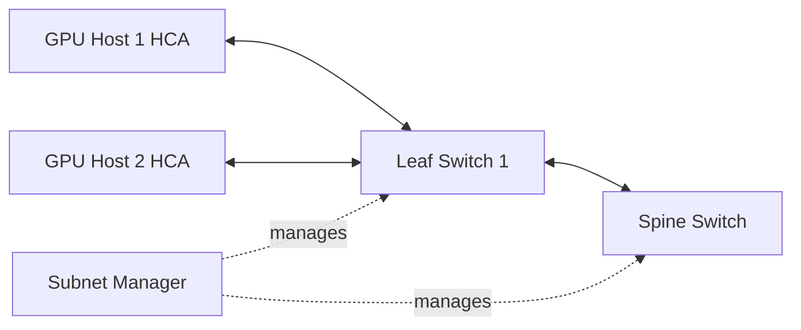

# Lab 01 — Inventory an InfiniBand Fabric

| Field | Value |
|---|---|
| Volume | 08 — InfiniBand |
| Difficulty | Intermediate |
| Estimated time | 75 minutes |
| Target platform | Linux hosts with InfiniBand HCAs |
| Lab type | L1 Exploration |

## 1. Objective

Create a support-ready inventory of InfiniBand adapters, ports, GUIDs, LIDs, GIDs, P_Keys, negotiated link state, peer switch ports, and subnet-manager identity.

## 2. Background

Troubleshooting becomes slow when operators must first discover what is connected to what. A reliable source of truth should combine stable identities such as GUIDs with mutable runtime state such as LIDs, speed, width, and port state.

## 3. Learning Outcomes

After completing this lab, you will be able to:

- identify local HCAs and ports;
- distinguish GUIDs, LIDs, and GIDs;
- record expected and actual speed and width;
- identify the active subnet manager;
- map endpoint ports to switch ports;
- produce a machine-readable evidence bundle;
- recognize missing or degraded inventory entries.

## 4. Architecture



## 5. Prerequisites

- nonproduction or approved read-only access;
- Linux shell access;
- InfiniBand utilities installed;
- NVIDIA or supported HCA driver stack loaded;
- permission to query fabric state;
- known maintenance and escalation contacts.

## 6. Environment

Create an environment record:

```bash
mkdir -p volume08-lab01/{host,fabric,versions}
date --iso-8601=seconds | tee volume08-lab01/timestamp.txt
uname -a | tee volume08-lab01/versions/kernel.txt
```

Record host model, OS, HCA model, driver, firmware, switch generation, and fabric-management version.

## 7. Components

- HCA and HCA ports;
- host driver and RDMA core;
- InfiniBand switches;
- cables and transceivers;
- Subnet Manager;
- GUID, LID, GID, and P_Key tables;
- topology and inventory source of truth.

## 8. Deployment Steps

### Step 1 — Discover local RDMA devices

**Purpose:** enumerate RDMA devices and ports.

```bash
ibv_devices | tee volume08-lab01/host/ibv-devices.txt
ibv_devinfo -v | tee volume08-lab01/host/ibv-devinfo.txt
```

**Expected healthy output:** at least one device and one port with valid firmware and transport information.

**Realistic example output:**

```text
$ ibv_devices
    mlx5_0
    mlx5_1

$ ibv_devinfo -v -d mlx5_0 | head -20
hca_id: mlx5_0
    transport:                  InfiniBand (0)
    fw_ver:                     28.39.2048
    node_guid:                  08c0:eb03:00f1:a2c3
    vendor_id:                  0x02c9
    vendor_part_id:             4129
    max_mr_size:                0xffffffffffffffff
    max_qp:                     262144
    max_qp_wr:                  32768
    max_sge:                    30
```

**Reading it:** Two HCAs on this host. `max_qp: 262144` is important for scaling studies — the maximum queue pairs available will constrain any design that assumes "one QP per peer." `fw_ver: 28.39.2048` is the exact firmware level and will matter for version troubleshooting. Two HCAs means this host likely has two independent network rails.

**Common errors:** command missing (driver not installed), driver not loaded (modprobe mlx5 needed), device hidden by container or VM policy (device passthrough or CDI not configured).

### Step 2 — Inspect port state

```bash
ibstat | tee volume08-lab01/host/ibstat.txt
```

Record:

- CA name;
- port GUID;
- state and physical state;
- rate;
- base LID;
- SM LID.

A healthy production port is normally expected to be logically active at the designed rate. Exact output varies by platform.

**Realistic example output:**

```text
$ ibstat
CA 'mlx5_0'
    CA type: MT4129
    Number of ports: 1
    Port 1:
        State: Active
        Physical state: LinkUp
        Rate: 400
        Base lid: 12
        LMC: 0
        SM lid: 1
        Capability mask: 0x2651e848
        Port GUID: 0x08c0eb0300f1a2c3
        Link layer: InfiniBand
```

**Reading it:** `State: Active` and `Physical state: LinkUp` are the two checkpoints (Chapter 2). `Rate: 400` is the negotiated Gb/s. `Base lid: 12` means the SM assigned this port local ID 12 (mutable, not for durable inventory). `SM lid: 1` tells you which switch is running the SM. If any of these fields is wrong (state not Active, rate below design, base LID = 0), that's the failure point to investigate before anything above.

### Step 3 — Inspect GIDs and P_Keys

```bash
show_gids 2>/dev/null | tee volume08-lab01/host/gids.txt || true
```

Use the supported platform method to capture P_Key tables. Do not assume a GID index from another host is correct.

### Step 4 — Record PCIe and NUMA locality

```bash
lspci -nn | grep -i -E 'infiniband|network' | tee volume08-lab01/host/pci-devices.txt
numactl --hardware | tee volume08-lab01/host/numa.txt
```

Map each HCA to NUMA and, where relevant, nearby GPUs.

### Step 5 — Map fabric links

On an authorized management host, use supported tools such as:

```bash
iblinkinfo | tee volume08-lab01/fabric/iblinkinfo.txt
```

Capture switch GUIDs, port numbers, peer GUIDs, speed, and width.

### Step 6 — Identify subnet-manager state

Use the supported management interface to record:

- current master SM;
- standby SMs;
- priority;
- last sweep time;
- discovered object count.

## 9. Validation

Confirm:

- every expected HCA appears;
- every expected port has a stable GUID;
- active ports have LIDs;
- speed and width match design;
- peer switch port is known;
- SM identity is recorded;
- no unexpected devices or links appear.

## 10. Verification

Create a table:

| Host | HCA | Port GUID | LID | GID index | Switch/port | Rate | Width | NUMA | Status |
|---|---|---|---|---|---|---|---|---|---|

Mark every deviation from the bill of materials.

## 11. Observability

Capture a baseline of physical and link counters with the platform-supported query tool. Do not clear counters during collection.

Record whether counters are cumulative and when they reset.

## 12. Performance Measurements

This lab is primarily inventory-focused. Optionally run a read-only local device query and record command latency. Do not interpret it as fabric performance.

## 13. Failure Injection

Use a safe logical exercise rather than changing the fabric:

- remove one expected device from a copy of the inventory;
- alter one expected speed or width;
- ask another engineer to identify the discrepancy.

This validates the review process without disrupting hardware.

## 14. Troubleshooting

### Device missing

Check driver loading, PCIe enumeration, container exposure, VM passthrough, firmware, and host logs.

### Port `LinkUp` but not `Active`

Check subnet-manager reachability, LID assignment, partition policy, and SM logs.

### Rate lower than expected

Compare both endpoints, cable support, port configuration, and physical counters.

### GUID-to-host mismatch

Correct the source of truth before using mutable LIDs for diagnosis.

## 15. Cleanup

The lab is read-only. Compress the evidence bundle if policy permits:

```bash
tar -czf volume08-lab01-evidence.tar.gz volume08-lab01
```

Store it in the approved location or delete it if it contains restricted infrastructure data.

## 16. Summary

You created a reproducible inventory that links host identities, fabric identities, physical topology, negotiated state, and subnet-management context.

## 17. Challenge Exercises

- Convert the inventory into JSON or YAML.
- Join HCA ports with GPU and NUMA topology.
- Compare two snapshots and report topology drift.
- Add cable serial numbers and rack positions.
- Build an alert when negotiated width differs from expected state.

## 18. Further Reading

- [InfiniBand Architecture and Link Layers](../chapter-02-infiniband-architecture-and-link-layers)
- [LIDs, GIDs, P_Keys, and Addressing](../chapter-04-lids-gids-pkeys-and-addressing)
- [Fabric Monitoring and Telemetry](../chapter-09-fabric-monitoring-and-telemetry)

## Production Relevance

Run inventory collection after installation, firmware upgrades, switch maintenance, recabling, and major topology changes. Historical snapshots provide the fastest way to prove what changed.