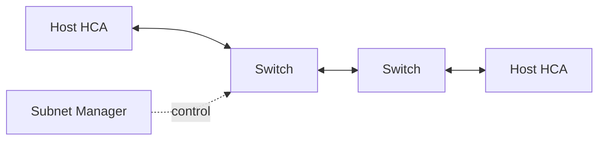

# Lab 01 — Inventory an InfiniBand Fabric

| Field | Value |
|---|---|
| Difficulty | Intermediate |
| Estimated time | 60 minutes |
| Platform | InfiniBand subnet |
| Lab type | Exploration |

## 1. Objective

Create a support-ready source of truth for HCAs, switches, GUIDs, LIDs, links, rates, widths, and cable paths.

## 2. Background

Without a baseline, operators cannot distinguish topology change from normal state.

## 3. Learning Outcomes

You will discover the subnet, map identities, verify negotiated state, and archive evidence.

## 4. Architecture



## 5. Prerequisites

Read access to fabric tools, an active subnet manager, and permission to query switches/endpoints.

## 6. Environment

Record tool versions, manager identity, firmware, and timestamp.

## 7. Components

HCAs, switch ports, GUIDs, LIDs, GIDs, P_Keys, cables, and routing state.

## 8. Deployment Steps

```bash
ibstat
ibv_devinfo
iblinkinfo
ibnetdiscover
```

Use platform-supported equivalents where tooling differs. Save raw output.

## 9. Validation

Confirm expected nodes and switches appear once and all production links are Active at expected width/rate.

## 10. Verification

Map each host HCA port to a switch port, cable label, rack, and fabric role.

## 11. Observability

Capture error counters and subnet-manager logs without resetting them.

## 12. Performance Measurements

No load test is required; record negotiated capability and utilization snapshot.

## 13. Failure Injection

Compare current topology to a deliberately edited offline copy to practice diff detection. Do not disturb the live fabric.

## 14. Troubleshooting

Missing endpoints require checks of physical link, HCA driver, subnet-manager discovery, and partition state.

## 15. Cleanup

Protect the baseline in versioned storage and remove sensitive identifiers from public reports.

## 16. Summary

You created the inventory required for operations, monitoring, and support.

## 17. Challenge Exercises

Generate a Mermaid topology from the discovery output.

## 18. Further Reading

- [InfiniBand Architecture](../chapter-02-infiniband-architecture-and-link-layers)
- [Fabric Monitoring](../chapter-09-fabric-monitoring-and-telemetry)
