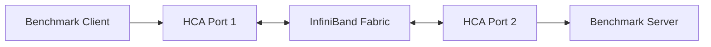

# Lab 02 — Benchmark InfiniBand Bandwidth and Latency

| Field | Value |
|---|---|
| Volume | 08 — InfiniBand |
| Difficulty | Advanced |
| Estimated time | 90 minutes |
| Target platform | Two or more Linux hosts with working InfiniBand |
| Lab type | L3 Configuration and performance validation |

## 1. Objective

Measure latency and bandwidth using a controlled host-memory RDMA benchmark and produce a baseline that can distinguish local, cross-rack, rail, message-size, and directional behavior.

## 2. Background

One benchmark number does not characterize a fabric. Small messages expose latency and message rate. Large messages expose sustained bandwidth. Bidirectional traffic stresses both directions. Different node pairs reveal topology and route effects.

## 3. Learning Outcomes

You will be able to:

- validate endpoint readiness before benchmarking;
- select device, port, and addressing explicitly;
- measure latency across message sizes;
- measure unidirectional and bidirectional bandwidth;
- repeat tests and report variation;
- correlate results with counters and topology;
- recognize invalid or misleading benchmark methods.

## 4. Architecture



## 5. Prerequisites

- completed Lab 01 inventory;
- two approved test hosts;
- working subnet management and partition membership;
- supported `perftest` or equivalent tools;
- synchronized clocks for evidence correlation;
- no unauthorized production load generation.

## 6. Environment

Create a results directory on both hosts and record:

```bash
mkdir -p volume08-lab02/{environment,latency,bandwidth,counters}
date --iso-8601=seconds | tee volume08-lab02/environment/timestamp.txt
ibstat | tee volume08-lab02/environment/ibstat.txt
ibv_devinfo -v | tee volume08-lab02/environment/ibv-devinfo.txt
```

Record host, HCA, port, NUMA node, firmware, driver, tool version, switch path, and expected speed/width.

## 7. Components

- benchmark client and server;
- registered host-memory buffers;
- queue pairs and completion queues;
- selected HCA and port;
- InfiniBand path and MTU;
- fabric counters and telemetry.

## 8. Deployment Steps

### Step 1 — Verify the path before load

```bash
ibstat
```

Confirm both ports are active at expected rate and width. Capture counter snapshots using the supported environment tool.

### Step 2 — Pin the benchmark to the intended NUMA domain

Use the platform’s topology map and bind CPU and memory locally where appropriate:

```bash
numactl --cpunodebind=<node> --membind=<node> <benchmark-command>
```

Record the exact binding. Do not compare a local run with a remote-NUMA run as if they were equivalent.

### Step 3 — Run latency tests

Start the server on the selected device and port using the appropriate `ib_send_lat`, `ib_write_lat`, or supported equivalent command.

Example pattern:

```bash
ib_write_lat -d <device> -i <port> --report_gbits
```

On the client, connect to the server and test a range of message sizes. Use the exact syntax supported by the installed tool version.

**Purpose:** characterize small-message and operation latency.

**Expected output:** successful connection, completed iterations, and stable percentile or average latency values appropriate to the environment.

### Step 4 — Run unidirectional bandwidth tests

```bash
ib_write_bw -d <device> -i <port> --report_gbits
```

Run the matching client with a defined duration, queue depth, and message-size sweep.

### Step 5 — Run bidirectional bandwidth tests

Use the supported bidirectional option and document that the reported aggregate may represent both directions.

### Step 6 — Repeat across topology locations

Test:

- same leaf;
- different leaf, same spine domain;
- cross-rack;
- each rail;
- one known-good reference pair.

### Step 7 — Capture post-test counters

Collect the same counters and calculate deltas. Do not clear counters between runs unless the environment and evidence plan explicitly require it.

## 9. Validation

A valid run must have:

- explicit endpoint and device selection;
- expected speed and width;
- no increasing physical error rate;
- documented NUMA binding;
- successful completion without transport errors;
- identical parameters across compared runs.

## 10. Verification

Build a result table:

| Pair | Path | Rail | Message size | Direction | Median | Variation | Counter delta | Result |
|---|---|---|---:|---|---:|---:|---|---|

Compare with the local baseline and expected topology behavior. Do not invent universal thresholds.

## 11. Observability

During the test, monitor:

- link utilization;
- physical and receive errors;
- transmit wait;
- CPU utilization;
- NUMA placement;
- HCA temperature where available;
- route and rail selection.

## 12. Performance Measurements

Use:

- warm-up iterations;
- fixed test duration;
- at least three measured runs;
- median and range or standard deviation;
- several message sizes;
- both latency and throughput views.

Explain whether results are payload throughput or wire-rate estimates.

## 13. Failure Injection

Use a reversible process-level fault:

- bind the client to a remote NUMA node; or
- select a nonpreferred rail; or
- reduce queue depth.

Do not alter shared switch configuration or disable production links.

Record the expected symptom and restore the healthy binding afterward.

## 14. Troubleshooting

### Connection fails

Check port state, LID/GID selection, P_Key, server listening state, route, and tool compatibility.

### Latency high but bandwidth healthy

Inspect CPU binding, polling mode, interrupt behavior, and small-message configuration.

### Bandwidth low across all message sizes

Check speed, width, PCIe attachment, NUMA locality, HCA capability, and path congestion.

### Variance high only under concurrency

Inspect congestion, route balance, and competing workloads.

### One rail underperforms

Compare physical counters, topology, route, firmware, and HCA placement.

## 15. Cleanup

Stop benchmark servers, remove temporary process bindings, and archive or delete results according to policy.

```bash
pkill -f 'ib_.*_(lat|bw)' || true
```

Use a more targeted process stop in shared environments.

## 16. Summary

You established a layered host-memory RDMA baseline across message sizes, directions, rails, and topology locations.

## 17. Challenge Exercises

- Compare send and RDMA write semantics.
- Test several queue depths.
- Build a latency-versus-message-size chart.
- Compare same-rack and cross-rack distributions.
- Correlate benchmark throughput with per-port utilization.
- Automate nightly canary tests between selected node pairs.

## 18. Further Reading

- [Verbs, Queue Pairs, and Completion Queues](../chapter-03-verbs-queue-pairs-and-completion-queues)
- [Routing, Topologies, and Oversubscription](../chapter-06-routing-topologies-and-oversubscription)
- [HDR, NDR, XDR, and Link Evolution](../chapter-08-hdr-ndr-xdr-and-link-evolution)

## Production Relevance

Retain results by hardware, firmware, topology, and tool version. Use the baseline after maintenance, upgrades, or incidents, but do not run disruptive saturation tests on shared production paths without approval.