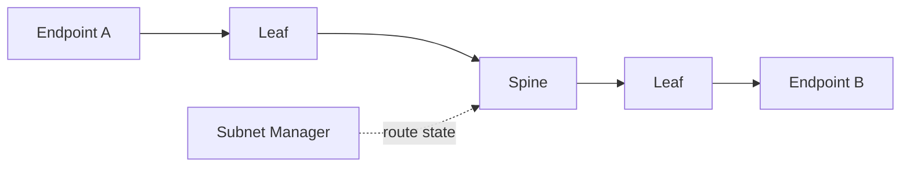

# Lab 03 — Inspect Subnet Routing and Counters

| Field | Value |
|---|---|
| Difficulty | Advanced |
| Estimated time | 75 minutes |
| Platform | Managed InfiniBand subnet |
| Lab type | Operations |

## 1. Objective

Prove how selected endpoint pairs are addressed and routed, then correlate their traffic with port counters.

## 2. Background

A topology map shows connectivity; route and counter evidence shows the path actually used.

## 3. Learning Outcomes

You will identify the active subnet manager, inspect partitions and path state, and locate hot or unhealthy ports.

## 4. Architecture

## 5. Prerequisites

Read-only access to subnet-manager logs/configuration and supported fabric query tools.

## 6. Environment

Record manager version, routing engine, partition file checksum, and current master identity.

## 7. Components

LIDs, GIDs, P_Keys, service levels, forwarding tables, and port counters.

## 8. Deployment Steps

Query endpoint identities and path records. Inspect manager logs and configuration. Run a controlled transfer while sampling counters on expected switch ports.

## 9. Validation

Confirm both endpoints share the intended partition and path attributes.

## 10. Verification

Traffic counters should rise on the expected route during the controlled test.

## 11. Observability

Capture utilization, physical errors, wait/congestion indicators, and topology-change events.

## 12. Performance Measurements

Compare one same-leaf and one cross-leaf path with identical test parameters.

## 13. Failure Injection

Use an offline configuration copy with an intentionally incorrect P_Key or route assumption and explain the expected failure. Do not alter production policy.

## 14. Troubleshooting

If counters rise on an unexpected path, inspect routing engine, topology, and source-destination identity selection.

## 15. Cleanup

Stop test traffic and archive the route/counter evidence.

## 16. Summary

You connected control-plane state to observable data-plane traffic.

## 17. Challenge Exercises

Create a route-validation script for a list of critical endpoint pairs.

## 18. Further Reading

- [Subnet Management](../chapter-05-subnet-management-and-opensm)
- [Fabric Monitoring](../chapter-09-fabric-monitoring-and-telemetry)
