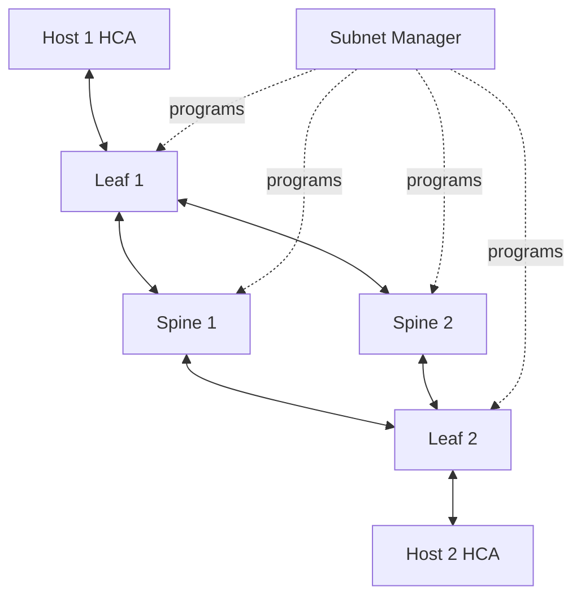

# Lab 03 — Inspect Subnet Routing and Counters

| Field | Value |
|---|---|
| Volume | 08 — InfiniBand |
| Difficulty | Advanced |
| Estimated time | 90 minutes |
| Target platform | Authorized InfiniBand management host |
| Lab type | L3 Configuration and observability |

## 1. Objective

Build an evidence chain from Subnet Manager state to endpoint LIDs, switch forwarding paths, negotiated links, and counter deltas during a controlled workload.

## 2. Background

Reachability proves that some path exists. It does not prove that the intended path exists, that routes are balanced, or that the path remains free from errors and congestion under load.

## 3. Learning Outcomes

You will be able to:

- identify the current master SM;
- capture a topology snapshot;
- inspect LID and GUID mappings;
- trace selected endpoint paths;
- compare route distribution with topology;
- calculate counter deltas;
- distinguish physical errors from congestion indicators;
- create a topology-aware incident bundle.

## 4. Architecture



## 5. Prerequisites

- completed Labs 01 and 02;
- authorized management access;
- supported fabric tools such as `iblinkinfo`, `ibroute`, `ibqueryerrors`, or management-suite equivalents;
- a known endpoint pair;
- approval for a controlled benchmark;
- current source-of-truth topology.

## 6. Environment

```bash
mkdir -p volume08-lab03/{sm,topology,routes,counters,workload}
date --iso-8601=seconds | tee volume08-lab03/timestamp.txt
```

Record fabric-management version, switch firmware, routing engine, partition configuration version, and expected master SM.

## 7. Components

- primary and standby Subnet Managers;
- endpoint GUIDs and LIDs;
- switch GUIDs and ports;
- forwarding tables;
- physical and link counters;
- congestion indicators;
- benchmark endpoint pair.

## 8. Deployment Steps

### Step 1 — Record SM identity and state

Use the supported platform interface to record:

- current master;
- standby instances;
- priority;
- last sweep time;
- topology object count;
- recent topology changes.

**Expected healthy output:** one authoritative master and expected standby state.

### Step 2 — Capture topology

```bash
iblinkinfo | tee volume08-lab03/topology/iblinkinfo.txt
```

Where supported, export a machine-readable topology or fabric report.

Compare discovered GUIDs and links with Lab 01.

### Step 3 — Record endpoint identities

```bash
ibstat | tee volume08-lab03/topology/local-ibstat.txt
```

Collect the remote endpoint’s HCA, port GUID, and LID through the approved method.

### Step 4 — Inspect forwarding state

Use the supported route-inspection tool for relevant switches. Example pattern:

```bash
ibroute <switch-lid-or-guid> | tee volume08-lab03/routes/switch-route.txt
```

Interpret output according to the installed tool version. Confirm that the destination LID maps to the expected egress port.

### Step 5 — Trace or infer the path

Use supported fabric tools or management APIs to determine the path between the selected endpoints. Record each switch and port.

Do not rely solely on IP-layer tools; InfiniBand forwarding state is its own evidence source.

### Step 6 — Capture counter baseline

```bash
ibqueryerrors | tee volume08-lab03/counters/before.txt
```

Use filters carefully. Preserve raw output and document counter semantics.

### Step 7 — Run a controlled workload

Run the approved bandwidth test from Lab 02 for a fixed duration and message size. Save exact commands and results.

### Step 8 — Capture counter deltas

```bash
ibqueryerrors | tee volume08-lab03/counters/after.txt
```

Calculate which counters changed and where they appear in the topology.

### Step 9 — Compare route balance

If multiple endpoint pairs or LIDs are available, inspect whether traffic is distributed across expected spine paths. Correlate with per-port utilization.

## 9. Validation

Confirm:

- master SM matches design;
- topology matches source of truth;
- endpoint LIDs map to correct GUIDs;
- forwarding entries use valid ports;
- all links on the path have expected speed and width;
- physical error rates remain stable;
- utilization appears on the expected route.

## 10. Verification

Create a path table:

| Hop | Device GUID/name | Ingress port | Egress port | Rate/width | Utilization | Error delta | Congestion delta |
|---:|---|---:|---:|---|---:|---:|---:|

Mark the first unexpected observation.

## 11. Observability

Correlate:

- workload start and stop;
- link utilization;
- transmit wait;
- physical errors;
- SM sweeps;
- topology events;
- application throughput.

Use synchronized timestamps.

## 12. Performance Measurements

Compare:

- measured throughput;
- expected path capacity;
- per-link utilization;
- route sharing with other workloads;
- same-rack and cross-rack results.

Do not infer oversubscription from one endpoint pair alone.

## 13. Failure Injection

Use a non-disruptive simulated exercise:

- select an endpoint pair known to traverse a busier path; or
- run two approved benchmark pairs concurrently; or
- analyze a saved topology snapshot with one route removed.

Do not change forwarding tables or disable production links unless a formal maintenance experiment is approved.

## 14. Troubleshooting

### Destination route missing

Check LID assignment, recent sweep completion, switch discovery, and SM programming logs.

### Route exists but no traffic appears

Verify selected HCA port, partition, path record, benchmark device, and actual destination.

### Physical errors increase

Isolate cable, transceiver, switch port, or HCA port before tuning routing.

### Transmit wait increases with clean physical counters

Trace congestion toward the destination and compare concurrent traffic.

### Route imbalance

Review routing engine, LID distribution, rail selection, and workload placement.

## 15. Cleanup

Stop workload processes, archive raw evidence, and restore any temporary process bindings. Do not clear counters unless a separate approved procedure requires it.

## 16. Summary

You connected SM state, topology, forwarding entries, counter deltas, and workload behavior into one diagnostic view.

## 17. Challenge Exercises

- Generate a graph from `iblinkinfo` output.
- Compare route tables before and after an SM sweep in a lab.
- Build a script that highlights reduced-width links.
- Create a congestion heat map.
- Detect when the active SM differs from the expected master.

## 18. Further Reading

- [Subnet Management and OpenSM](../chapter-05-subnet-management-and-opensm)
- [Routing, Topologies, and Oversubscription](../chapter-06-routing-topologies-and-oversubscription)
- [Fabric Monitoring and Telemetry](../chapter-09-fabric-monitoring-and-telemetry)

## Production Relevance

This workflow should be automated as a read-only diagnostic bundle. Run it after recabling, switch replacement, routing-policy changes, SM failover, and performance incidents.