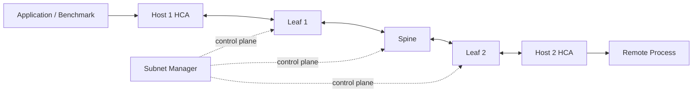

# Lab 04 — Troubleshoot an InfiniBand Path

| Field | Value |
|---|---|
| Volume | 08 — InfiniBand |
| Difficulty | Expert |
| Estimated time | 100 minutes |
| Target platform | Nonproduction two-node or multi-node InfiniBand lab |
| Lab type | L5 Failure and troubleshooting |

## 1. Objective

Use a repeatable incident workflow to identify, correct, and verify a degraded InfiniBand data path without making random configuration changes.

## 2. Background

Application errors often appear far above the actual fault. A communication timeout may originate from physical degradation, missing subnet state, wrong partition membership, poor route selection, transport-resource failure, or an inefficient host binding.

This lab teaches the discipline of proving each layer in order.

## 3. Learning Outcomes

After completing this lab, you will be able to:

- define a precise incident symptom;
- collect evidence before changing state;
- validate physical and logical port state;
- verify SM, addressing, partition, and route state;
- compare host-memory and higher-level paths;
- inject a safe reversible fault;
- identify the first failed layer;
- verify recovery against a known baseline;
- write prevention and monitoring actions.

## 4. Architecture



## 5. Prerequisites

- completed Labs 01–03;
- nonproduction environment or formal maintenance approval;
- known-good baseline result;
- permission to change process affinity or select alternate interfaces;
- access to endpoint and fabric telemetry;
- rollback owner identified.

## 6. Environment

Create the incident workspace:

```bash
mkdir -p volume08-lab04/{baseline,broken,repaired,logs,counters,topology}
date --iso-8601=seconds | tee volume08-lab04/start-time.txt
```

Record exact node pair, HCA device, port, rail, LID/GID, path, firmware, driver, benchmark version, and maintenance approval.

## 7. Components

- benchmark client and server;
- HCA ports and PCIe/NUMA topology;
- switch path;
- active Subnet Manager;
- route and partition state;
- physical and congestion counters;
- evidence bundle and decision tree.

## 8. Deployment Steps

### Step 1 — Establish the healthy baseline

Run the approved latency and bandwidth commands from Lab 02 using the intended device, port, NUMA binding, message size, queue depth, and duration.

Save:

- exact commands;
- result output;
- port state;
- topology;
- counter before/after snapshots;
- CPU binding;
- route selection.

### Step 2 — Write the diagnosis decision tree

Use this order:

1. inventory and recent change;
2. physical state, speed, and width;
3. SM and LID state;
4. P_Key and route state;
5. host-memory RDMA;
6. GPU-memory or collective path where available;
7. application.

### Step 3 — Inject one reversible fault

Choose one safe option:

#### Option A — Remote NUMA binding

Bind the benchmark process to a CPU and memory domain remote from the selected HCA.

```bash
numactl --cpunodebind=<remote-node> --membind=<remote-node> <benchmark-command>
```

#### Option B — Nonpreferred rail

Select a healthy but topologically weaker HCA port or rail for the test process.

#### Option C — Partition simulation

In an isolated lab only, use an approved temporary P_Key configuration change with documented rollback. Do not perform this option on a shared production fabric.

Option A or B is preferred because it is process-scoped.

### Step 4 — Confirm the fault is active

Verify the process binding or selected device. Do not infer failure injection from slower performance alone.

### Step 5 — Reproduce the symptom

Run the same benchmark parameters as the healthy baseline. Save output in `broken/`.

### Step 6 — Diagnose from the bottom up

#### Physical layer

```bash
ibstat
```

Confirm state, rate, width, and physical counters.

#### Control plane

Confirm active SM, LID assignment, and recent sweep state.

#### Addressing and route

Confirm selected port, P_Key, path, and expected switch route.

#### Transport

Review benchmark completion or connection errors and compare host-memory RDMA behavior.

#### Host locality

Confirm CPU, memory, HCA, and GPU placement.

### Step 7 — State the root cause

Write a one-sentence root-cause statement supported by evidence.

Example:

> The test process was bound to NUMA node 1 while the selected HCA was local to NUMA node 0, increasing cross-socket memory traffic and reducing large-message bandwidth; physical, subnet, route, and RDMA transport state remained healthy.

### Step 8 — Repair the path

Restore the original process binding, device selection, or approved partition configuration.

### Step 9 — Rerun the baseline

Repeat the identical benchmark and collect evidence in `repaired/`.

## 9. Validation

The failure injection is valid only if:

- it is documented and reversible;
- it affects only the intended test scope;
- the intended path change is proven;
- unrelated fabric state remains healthy;
- the symptom is reproducible.

## 10. Verification

Compare three states:

| Metric | Healthy | Broken | Repaired |
|---|---:|---:|---:|
| Port speed/width | | | |
| Physical error delta | | | |
| Latency | | | |
| Bandwidth | | | |
| CPU utilization | | | |
| NUMA/rail selection | | | |
| Transmit wait | | | |

The repaired state should return to the healthy range, not merely improve relative to the broken state.

## 11. Observability

Collect synchronized evidence from:

- endpoint port state;
- physical and congestion counters;
- CPU and NUMA binding;
- link utilization;
- SM events;
- route state;
- benchmark output;
- application or collective logs if included.

## 12. Performance Measurements

Use identical parameters for all three states. Report:

- median of repeated runs;
- range or standard deviation;
- message-size sensitivity;
- CPU use;
- counter deltas;
- topology path.

Do not mix warm-up and measured results.

## 13. Failure Injection

Document:

- selected fault;
- exact command or configuration;
- expected symptom;
- blast radius;
- rollback command;
- owner and approval;
- maximum experiment duration.

Stop the experiment if physical errors, unrelated workload impact, or unexpected topology changes occur.

## 14. Troubleshooting

### No performance difference after remote binding

The workload may not be memory-path limited, the HCA may be local to both domains through platform architecture, or the binding may not have applied. Verify with `numactl`, process affinity, and topology.

### Benchmark fails completely

Check server state, selected device and port, P_Key, route, and exact command compatibility before attributing failure to the injected condition.

### Repaired result does not return to baseline

Confirm cleanup, background traffic, route changes, counter errors, thermal state, and benchmark parameters. The experiment may have uncovered a separate issue.

### Physical errors appear during the experiment

Stop. Preserve evidence and treat the event as a real physical-layer incident rather than continuing the planned exercise.

### SM sweep occurs unexpectedly

Correlate with topology events and ensure the lab did not alter shared fabric state.

## 15. Cleanup

- restore process affinity;
- restore selected HCA or rail;
- restore approved partition configuration if used;
- stop benchmark servers;
- verify expected SM and port state;
- rerun a short healthy test;
- archive or securely remove evidence.

## 16. Summary

You diagnosed a controlled InfiniBand path degradation by proving each layer, identifying the first divergence from baseline, repairing the cause, and verifying end-to-end recovery.

## 17. Challenge Exercises

- Write an automated preflight check for NUMA and HCA locality.
- Create a runbook for `LinkUp` but `Initializing`.
- Compare a physical-error incident with a congestion incident.
- Add a GPU-memory RDMA or NCCL test after host RDMA.
- Build a script that packages the complete evidence directory.
- Conduct an approved standby-SM failover exercise in a dedicated lab.

## 18. Further Reading

- [Production Troubleshooting](../chapter-10-production-troubleshooting)
- [Fabric Monitoring and Telemetry](../chapter-09-fabric-monitoring-and-telemetry)
- [Volume 08 Summary](../chapter-12-volume-08-summary)

## Production Relevance

The exact decision tree and evidence bundle should become part of the operations runbook. Production incident response should favor read-only collection, minimal reproduction, controlled repair, and proof of recovery.