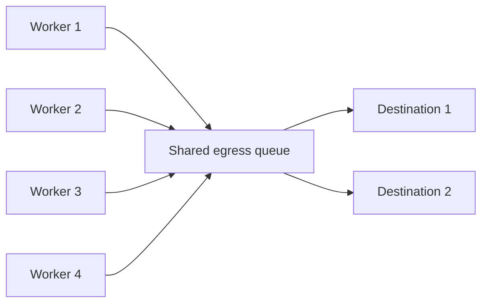
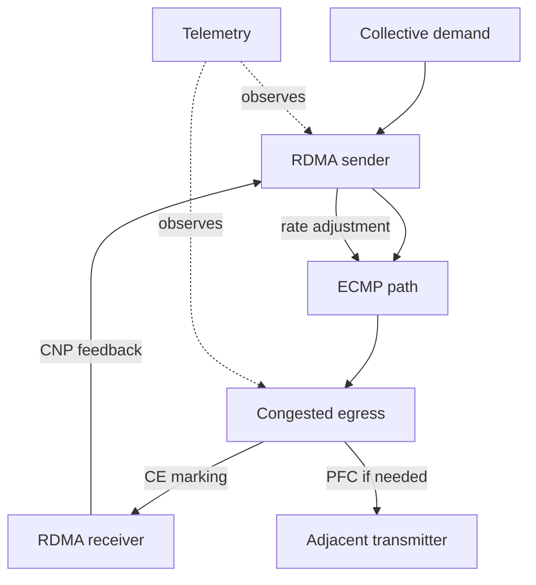
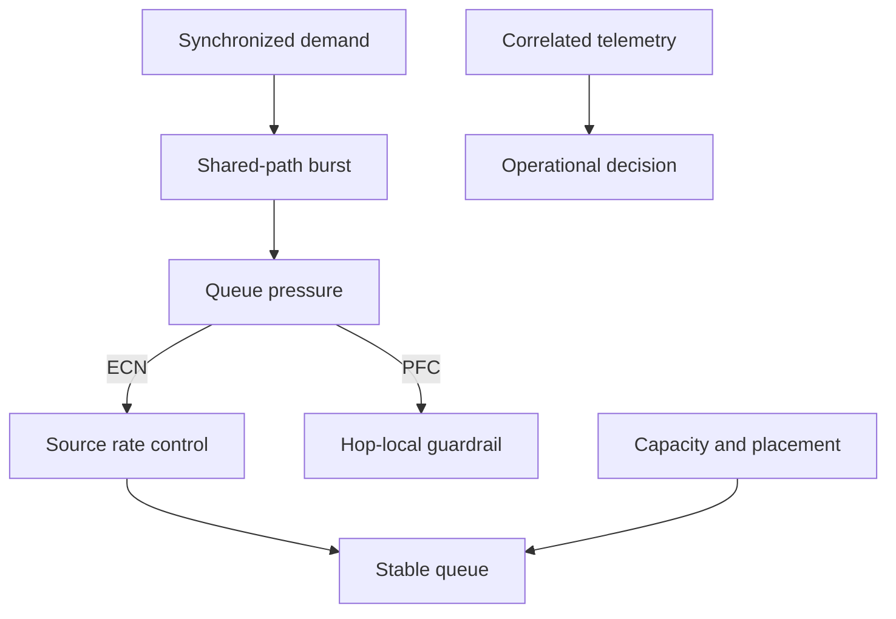

# Why Ethernet for AI Is Different

A network team upgrades a leaf-spine fabric, verifies every optic, and records low average utilization. A platform team then scales a training job from one rack to four. Communication time becomes erratic, GPUs wait at collective boundaries, and the larger job delivers less useful work per accelerator.

Nothing in that incident requires a broken link. AI traffic changed the network’s operating problem.

## Chapter Metadata

| Field | Value |
|---|---|
| Difficulty | Advanced |
| Estimated reading time | 55–70 minutes |
| Prerequisites | Ethernet switching and routing; basic distributed-training concepts |
| Scope | Workload behavior and the end-to-end control problem |
| Out of scope | Packet-header details, PFC threshold calculation, and DCQCN tuning |

## Learning Objectives

After completing this chapter, you will be able to:

- connect collective synchronization to tail-sensitive job completion;
- explain incast, queue buildup, loss, and head-of-line blocking from first principles;
- distinguish nominal bandwidth from delivered collective performance;
- identify the roles of routing, QoS, PFC, ECN, endpoint rate control, and telemetry;
- decide when an existing Ethernet fabric is a credible starting point;
- build an evidence-driven investigation for scale-only performance failures.

## From Independent Requests to Coordinated Bursts

Many enterprise services generate flows whose start times and completion times are only loosely related. Distributed AI uses collective operations in which workers exchange gradients, parameters, activations, or other tensors. The exact pattern varies, but synchronization creates a common property: progress can depend on the slowest participant.

**Figure 9.1.1 — Coordinated senders can converge on a shared egress faster than it can drain.** The queue sees the instantaneous arrival rate, not a dashboard’s five-minute average.

If four inputs each arrive at line rate and share one slower output, buffering can absorb only a transient. The durable choices are to reduce offered load, distribute it over other paths, or provide more capacity. A deeper queue delays overflow but adds latency. It does not remove the bottleneck.

## Why the Slowest Flow Matters

Imagine a collective phase completing in 20 ms for most ranks and 80 ms for one rank. The application does not average those values into a 25 ms phase. Peers that need the final contribution wait. Repeated across thousands of iterations, rare network tails become sustained accelerator idle time.

This changes the optimization target:

| Conventional network view | AI application view |
|---|---|
| Average port utilization | Collective completion distribution |
| Aggregate bytes delivered | Useful work per accelerator |
| Link availability | End-to-end path consistency |
| Mean latency | Tail latency and stragglers |
| Isolated flow benchmark | Concurrent workload behavior |

The network still needs throughput, but predictable coordination becomes equally important.

## First Principles of Queue Pressure

A queue grows whenever arrivals temporarily exceed departures:

\[
\Delta Q = (R_{in} - R_{out}) \times \Delta t
\]

This relation is a reasoning tool, not a switch configuration formula. Real systems have multiple ingress ports, shared buffers, packet scheduling, control-loop delay, and discrete thresholds. It nevertheless exposes three facts:

1. microbursts can build queues while average utilization remains low;
2. a persistent rate mismatch cannot be solved by buffering;
3. feedback must arrive and change sender behavior before protection thresholds are exhausted.

### Incast

Incast occurs when many senders converge on a destination or shared egress over a short interval. Distributed collectives, checkpoint activity, and storage fan-in can create it. The risk depends on timing, path overlap, message sizes, and available buffering—not merely on the number of nodes.

### Head-of-Line Blocking

When several flows share a queue, one blocked destination can delay packets for uncongested destinations behind it. PFC can widen this effect because it pauses a priority on a link rather than one application flow. Classification determines which traffic shares that fate.

### Packet Loss

Loss is a symptom with context. An overflowing queue, physical corruption, an MTU problem, policy, or resource exhaustion can all discard packets. ECN can signal incipient congestion without dropping an ECN-capable packet, but a full queue can still drop. “ECN enabled” is not a guarantee of zero loss.

## The End-to-End Control System

**Figure 9.1.2 — ECN/DCQCN controls source rate end to end; PFC protects a selected class hop by hop.**

The responsibilities are different:

| Mechanism | Question it answers | What it cannot do alone |
|---|---|---|
| ECMP | Which equal-cost path carries a flow? | Guarantee even utilization for every workload |
| QoS classification | Which queue and policy apply? | Create capacity or enforce tenant identity by itself |
| ECN | Is an ECN-capable packet encountering congestion? | Change sender rate without transport response |
| DCQCN | How should a RoCEv2 sender react and recover? | Fix chronic oversubscription |
| PFC | Should an adjacent transmitter pause this priority? | Provide per-flow fairness or end-to-end rate control |
| Telemetry | What evidence exists across time and layers? | Correct a bad design without an operational action |

## Why “Lossless Ethernet” Is a Dangerous Shorthand

The phrase suggests an absolute property. Production fabrics instead combine mechanisms that reduce congestion loss for selected traffic under qualified conditions. PFC can prevent buffer overflow while the upstream device reacts, but it requires enough headroom for traffic already in flight. It can also spread congestion. ECN asks senders to slow down, but it needs correct marking and endpoint behavior. Severe congestion, faults, and misconfiguration can still produce loss.

A better design statement is:

> The selected RoCE traffic class has validated queue protection and end-to-end congestion response within the approved topology, workload envelope, and failure states.

That statement is measurable.

## Why Fast Links Are Not Sufficient

Nominal speed does not describe:

- oversubscription in normal or failed topology;
- short-lived queue occupancy;
- ECMP polarization;
- GPU-to-NIC PCIe or NUMA locality;
- incorrect MTU or traffic marking;
- PFC or ECN configuration drift;
- adapter firmware, driver, and congestion profile compatibility;
- application transport fallback;
- collective scheduling and placement.

Each can reduce delivered performance without causing a link-down alarm.

## When Ethernet Is the Right Foundation

Ethernet is compelling when the organization already operates routed leaf-spine fabrics, needs integration with IP services, values broad automation, and can qualify the complete RoCE stack. It is not “free” simply because switches exist.

### Decision Table

| Condition | Favors Ethernet | Raises risk |
|---|---|---|
| Operations | Strong routing, QoS, automation, and telemetry practice | Separate teams with no end-to-end owner |
| Workload | Known communication matrix and validated RoCE support | Unknown concurrency and frequent scale changes |
| Fabric | Capacity and failure-state model meet demand | Existing oversubscription is assumed acceptable |
| Change control | Qualified profiles and drift detection | Ad hoc per-device tuning |
| Multi-tenancy | Enforced edge policy and tested isolation | Tenants can influence shared lossless queues |
| Validation | Representative collectives under contention | Two-host throughput is the sole acceptance test |

An alternative fabric may reduce some Ethernet-specific configuration burdens, but it does not remove topology, capacity, endpoint, telemetry, or operational requirements. The comparison must cover lifecycle cost and failure behavior, not only link speed.

## Production Design Dimensions

### Performance and Scalability

Model communication at the largest approved job size and with expected concurrency. Include bisection demand, ECMP entropy, and failure-state oversubscription. Scaling endpoints without scaling shared capacity increases the number of ways synchronized traffic can collide.

### Availability and Reliability

Redundant paths help only if applications and transports recover as expected and surviving paths have enough capacity. Test link and switch maintenance with live representative jobs. Define whether the objective is job survival, automatic retry, or bounded restart time.

### Security

Treat markings from workloads as untrusted until classified at a controlled edge. Restrict RDMA device access and virtual-function assignment. Separate management and break-glass paths from a paused compute class.

### Observability

Collect queue occupancy or congestion indicators, ECN marks, PFC transmit/receive events and duration, discards, link errors, endpoint CNP/rate evidence, RDMA errors, and collective timing. Preserve topology and configuration versions with the event.

### Cost and Operational Complexity

Shared Ethernet can reduce separate-fabric cost, but convergence couples capacity and incidents. More traffic classes, custom thresholds, and heterogeneous versions increase qualification and support cost. Simplicity is an availability feature.

## Production Pattern: A Bounded Compute Class

A sustainable design commonly:

1. separates management/control from the RoCE compute class;
2. applies trusted classification consistently at host and switch edges;
3. enables ECN for the intended queue with a qualified endpoint profile;
4. uses PFC only where the validated design requires it;
5. reserves capacity for failure states;
6. admits workloads within the tested concurrency envelope;
7. alerts on sustained pause, drops, and deviation from collective baselines.

The exact priority, thresholds, and queue allocation are platform-specific. Copying values between switch generations is unsafe because buffer architecture and software behavior vary.

## Troubleshooting Scenario 1: Scale Cliff

**Symptom:** Two-node RDMA tests pass, but a multi-rack all-reduce shows unstable iteration time.

**Diagnosis and evidence**

1. Confirm the application is using the expected RDMA devices and interfaces.
2. Compare GPU/NIC locality and route selection across fast and slow ranks.
3. Correlate collective stalls with per-queue occupancy, ECN, PFC, and discard counters.
4. Increase concurrency in controlled steps and record the first point of divergence.
5. Repeat with alternate placement to determine whether the failure follows a path or an endpoint.

**Likely root causes:** incast at shared egress, ECMP polarization, failure-state oversubscription, marking drift, or a slow endpoint.

**Resolution:** correct the localized cause—capacity, placement, path selection, classification, or endpoint qualification. Do not start by increasing every buffer.

**Verification:** repeat the same workload matrix and confirm both collective distribution and control-loop counters return to the approved envelope.

**Prevention:** retain a scale-and-contention acceptance test as a release gate.

## Troubleshooting Scenario 2: Pause Without Drops

**Symptom:** Throughput collapses, discard counters remain flat, and PFC pause duration rises upstream.

**Diagnosis and evidence**

1. Locate the earliest congested egress, not merely the loudest upstream pause counter.
2. Trace the paused priority hop by hop toward the source.
3. Identify the destination, link, or receiver that is failing to drain.
4. Check whether unrelated flows share the paused priority.
5. Compare ECN marks and sender response before and during the pause episode.

**Likely root cause:** persistent congestion or receiver slowdown caused backpressure to propagate; classification widened the affected set.

**Resolution:** restore drain capacity or remove the persistent overload, then correct isolation or ECN response. Disabling PFC during the incident may convert the stall into loss.

**Verification:** confirm pause duration decays, sender rates recover, unrelated flows remain stable, and the original workload completes within baseline.

**Prevention:** alert on sustained pause duration and test receiver-slowdown failure injection safely.

## Customer Architecture Discussion

When a customer asks, “Can our Ethernet network support this GPU cluster?”, ask for:

- job sizes, collective patterns, and concurrency;
- topology, oversubscription, and maintenance states;
- GPU/NIC locality and endpoint software matrix;
- marking, queue, PFC, and ECN ownership;
- telemetry resolution and retention;
- tenant isolation and workload admission model;
- acceptance criteria tied to application outcomes.

A responsible answer describes the evidence needed to qualify the design. A simple yes based on port speed transfers technical risk into production.

## Interview Preparation

### Knowledge

**Why can low average utilization coexist with congestion?**  
Queues respond to instantaneous arrival and departure rates. Synchronized microbursts can fill a shared queue inside a monitoring interval.

### Architecture

**Why is PFC alone insufficient?**  
PFC pauses a priority on one link after buffer pressure appears. It does not provide end-to-end per-flow rate control, fairness, capacity, or safe workload admission.

### Scenario

**A benchmark passes between two hosts but training fails at scale. What changes?**  
Investigate concurrency, incast, shared paths, ECMP, queue policy, PFC propagation, ECN/CNP response, placement, and collective timing.

### Customer

**How would you explain “lossless” without overpromising?**  
Describe the validated traffic class, mechanisms, topology, workload envelope, and failure states; state that faults and severe overload can still drop traffic.

### Whiteboard

Draw the workload-to-sender-to-queue-to-receiver path. Add the ECN/CNP feedback loop, then add the hop-local PFC path. Explain which evidence proves each arrow.

## Architecture Summary

## Quick Revision Sheet

| Concept | Remember |
|---|---|
| AI traffic | Synchronized, bursty, and tail-sensitive |
| Queue | Grows when arrivals exceed departures |
| Incast | Many senders converge on shared drain capacity |
| ECN/DCQCN | End-to-end signal and sender-rate response |
| PFC | Per-priority, hop-local pause guardrail |
| Acceptance | Representative collectives under contention and failure |
| Root cause | Must connect workload, path, queue, endpoint, and time |

## Interview Notes

- Lead with synchronization and the slowest participant.
- Separate capacity, routing, congestion control, and loss protection.
- Never call PFC a complete congestion-control solution.
- Explain how you would verify a claim with counters and application timing.
- State trade-offs: convergence increases utilization efficiency but also blast radius.

## Lab Checklist

- [ ] Record topology, endpoint, firmware, and driver inventory.
- [ ] Confirm expected RDMA device and interface selection.
- [ ] Validate MTU and classification end to end.
- [ ] Capture ECN, CNP, PFC, discard, and RDMA evidence.
- [ ] Compare single-flow, incast, all-to-all, and concurrent-job behavior.
- [ ] Correlate network evidence with collective timing.
- [ ] Restore all settings after controlled failure injection.

## Key Takeaways

- A healthy general-purpose network is not automatically a validated AI fabric.
- Collective synchronization converts rare flow tails into accelerator idle time.
- Buffering absorbs transients; it cannot repair persistent oversubscription.
- ECN/DCQCN should control routine congestion; PFC is a bounded guardrail.
- Production readiness is demonstrated with representative workload, contention, failure, and telemetry.

## Cross References

- [Volume 09 Introduction](./index)
- [Next: Ethernet Architecture for AI](./chapter-02-ethernet-architecture-for-ai)
- [Volume 08 — InfiniBand](pathname:///nvidia-zero-to-hero/volume-08/index)
- [Volume 07 — GPU Networking](pathname:///nvidia-zero-to-hero/volume-07/index)

## Further Reading

- [NVIDIA Cumulus Linux: RDMA over Converged Ethernet](https://docs.nvidia.com/networking-ethernet-software/cumulus-linux-518/Layer-1-and-Switch-Ports/Quality-of-Service/RDMA-over-Converged-Ethernet-RoCE/)
- [NVIDIA: Flow Control](https://docs.nvidia.com/networking/display/MLNXOFEDv590590/Flow+Control)
- [RFC 3168: Explicit Congestion Notification](https://www.rfc-editor.org/rfc/rfc3168.html)
- [Zhu et al.: Congestion Control for Large-Scale RDMA Deployments](https://conferences.sigcomm.org/sigcomm/2015/pdf/papers/p523.pdf)
