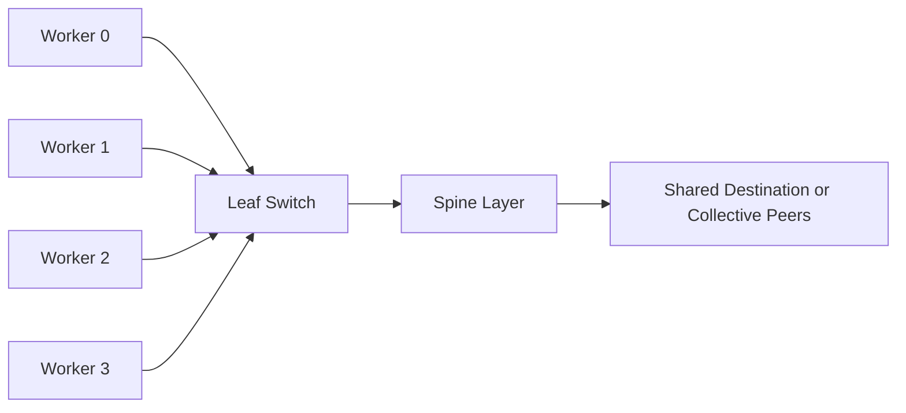
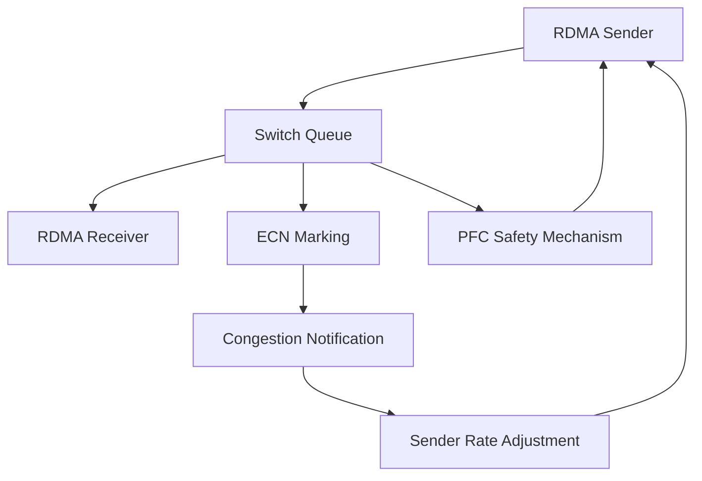

# Why Ethernet for AI Is Different

A data center already has a high-speed Ethernet fabric. Links report healthy state, ordinary applications perform well, and network teams understand the operational model. The AI platform team therefore assumes the same network can carry distributed training traffic without modification.

The first large job proves otherwise. Throughput fluctuates, some iterations pause unexpectedly, and adding nodes reduces efficiency. The network is not necessarily slow. The traffic pattern is different.

## Learning Objectives

After completing this chapter, you will be able to:

- explain why AI communication stresses Ethernet differently from conventional application traffic;
- describe incast, queue buildup, packet loss, and head-of-line blocking;
- explain why RDMA over Ethernet requires an end-to-end design;
- distinguish lossless behavior from uncontrolled pause propagation;
- identify the roles of PFC, ECN, DCQCN, adapters, switches, and telemetry;
- explain when Ethernet is a strong AI-fabric choice and when operational risk is underestimated.

## The Traffic Pattern Changed

Many enterprise applications exchange relatively independent request and response flows. Distributed training frequently creates synchronized many-to-many communication. Large numbers of workers may transmit at the same time toward a smaller set of destinations or across shared links.

**Figure 9.1.1 — Synchronized workers can create bursty incast and shared-queue pressure.** Average link utilization can look acceptable while short-lived congestion disrupts collective completion time.

A distributed job often waits for its slowest communication participant. Small variations therefore become application-visible.

## Why Ordinary Loss Recovery Can Be Expensive

Conventional Ethernet assumes that packet loss can be recovered by transport protocols. For many applications, retransmission is acceptable. RDMA transports are more sensitive because packet loss can interrupt direct-memory operations and reduce predictability.

RoCE brings RDMA semantics to Ethernet, but it does not transform any Ethernet network into an AI fabric automatically. The complete path must control congestion, classify traffic, maintain correct MTU and QoS behavior, expose telemetry, and avoid pause storms or queue starvation.

## The End-to-End Control Loop

**Figure 9.1.2 — AI Ethernet needs both congestion avoidance and bounded loss protection.** ECN-based feedback should reduce offered load before queues require sustained pause behavior.

Priority Flow Control can pause a traffic class when buffer pressure crosses a threshold. It is a safety mechanism, not a complete congestion-control strategy. Poorly designed PFC can spread backpressure across the fabric and create head-of-line blocking.

Explicit Congestion Notification marks packets before queues overflow. Endpoint congestion-control algorithms such as DCQCN use those signals to reduce sending rates. The design objective is to keep queues shallow enough for predictable latency while sustaining high throughput.

## Why Link Speed Is Not Enough

A fabric can contain fast links and still perform poorly because of:

- uneven hashing across equal-cost paths;
- oversubscribed uplinks;
- incorrect traffic-class mapping;
- inconsistent MTU;
- PFC enabled on the wrong priorities;
- ECN thresholds that react too late or too aggressively;
- adapter firmware or driver mismatch;
- microbursts invisible to coarse monitoring;
- topology that does not align with workload placement.

The relevant metric is delivered application communication under realistic concurrency, not nominal port speed.

## Ethernet as an AI-Fabric Choice

Ethernet offers important strengths:

- broad operational familiarity;
- established automation and observability ecosystems;
- compatibility with existing data-center designs;
- flexible routing and multi-tenant integration;
- a large choice of adapters, switches, optics, and management tools;
- the ability to converge service, storage, and compute traffic when carefully engineered.

Those advantages are real, but convergence also increases blast radius. A shared design must isolate traffic classes, capacity, failure domains, and change control. “It is all Ethernet” does not mean every workload should share every queue and link.

## When AI Ethernet Becomes Appropriate

Ethernet is a strong choice when:

- the organization has mature Ethernet operations and automation;
- the application stack supports RoCE effectively;
- the fabric can provide sufficient bandwidth and path diversity;
- teams can engineer and validate QoS and congestion behavior;
- multi-tenancy or integration with existing network services is important;
- operational standardization outweighs the value of a separate fabric technology.

It becomes risky when teams enable PFC without understanding queue dependencies, assume line rate proves readiness, or lack telemetry for microbursts, pause events, ECN marks, drops, and adapter behavior.

## Production Scenario

A cluster uses a loss-sensitive traffic class for RDMA. Initial benchmarks pass with one job. Under two concurrent jobs, pause counters rise across several switches and unrelated flows slow down. The root cause is not insufficient aggregate capacity. A shared queue and aggressive pause thresholds allow one congested destination to propagate backpressure.

The remediation combines traffic-class isolation, revised buffer and ECN thresholds, adapter validation, and concurrency testing. The incident demonstrates that a fabric is not production-ready until it has been tested under contention and failure.

## Troubleshooting Framework

**Symptoms**

- distributed throughput collapses only under concurrency;
- PFC pause counters increase rapidly;
- ECN marks remain zero until drops occur;
- one traffic class blocks unrelated flows;
- latency becomes unstable despite low average utilization;
- different nodes report different RDMA behavior.

**Diagnosis**

1. Confirm end-to-end MTU and traffic-class mapping.
2. Inspect switch queue occupancy, drops, pause, and ECN counters.
3. Validate adapter firmware, driver, and congestion-control settings.
4. Reproduce with endpoint benchmarks under increasing concurrency.
5. Map oversubscription and equal-cost paths.
6. Correlate network events with collective stalls.

**Root cause pattern**

The network was validated as a collection of links rather than as a congestion-control system.

## Customer Perspective

When a customer asks whether Ethernet can support a large GPU cluster, the answer should not be a simple yes or no. The architect should examine scale, traffic pattern, synchronization, oversubscription, operational skill, multi-tenancy, telemetry, and failure requirements.

A credible recommendation explains the control loop: how congestion is detected, how senders react, how loss is bounded, how traffic is isolated, and how operators know the design is working.

## Interview Preparation

### Architecture question

Why is PFC alone insufficient for an AI Ethernet fabric?

A strong answer explains that PFC reacts to buffer pressure by pausing a priority, can propagate congestion and cause head-of-line blocking, and should be paired with proactive ECN-based congestion control, correct QoS, capacity planning, and telemetry.

### Scenario question

A RoCE benchmark passes between two nodes but distributed training fails at scale. What changes in your investigation?

Discuss concurrency, incast, oversubscription, ECMP behavior, queue thresholds, pause propagation, ECN marks, adapter settings, workload placement, and application collectives.

## Key Takeaways

- AI workloads create synchronized, bursty, and communication-sensitive Ethernet traffic.
- RoCE requires an engineered end-to-end fabric, not merely RDMA-capable adapters.
- PFC is a safety mechanism; congestion avoidance must happen earlier.
- Average utilization can hide microbursts and queue pressure.
- Production validation must include concurrency, contention, failure, and telemetry.

## Cross References

- [Volume 09 Introduction](./index)
- [Volume 08 — InfiniBand](../volume-08/index)
- [Volume 07 — GPU Networking](../volume-07/index)
