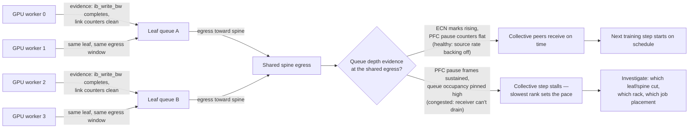
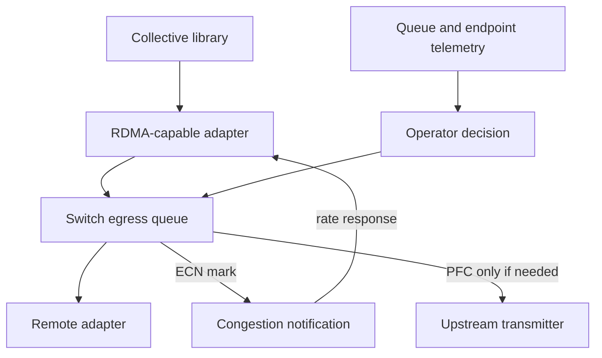

# Why Ethernet for AI Is Different

## Introduction

An organization can have a healthy high-speed Ethernet network and still have an unhealthy AI fabric. Links are up, ping works, and single-stream tests reach an impressive rate. Then a distributed training run starts: workers reach a collective at nearly the same time, queues form on a few shared egresses, and one delayed participant holds up the entire step.

The distinction is not that Ethernet is unsuitable for AI. It is that AI exposes the fabric as part of the application’s critical path. A design must be evaluated as an end-to-end congestion-control and operations system, not as independent port-speed tests.

| Chapter field | Value |
|---|---|
| Difficulty | Advanced |
| Estimated reading time | 45–60 minutes |
| Prerequisites | Volumes 07 and 08; basic IP routing and QoS |
| Focus | Workload behavior, queues, and the AI-Ethernet design problem |
| Next | Ethernet Architecture for AI |

## A Production Story: The Fabric That Passed Every Link Test

A platform team adds GPU servers to an existing leaf-spine fabric. A two-node RDMA test succeeds, and the links have no errors. With one training job, results look reasonable. With two jobs, collective time becomes erratic. Pause counters rise at several leaves, while average utilization remains modest.

The incident is not solved by declaring the network “too slow.” Several senders are converging on the same egress queues in short bursts. Backpressure protects one loss-sensitive class, but the control loop reacts after queues are already stressed. The useful investigation asks where congestion begins, what traffic class it affects, how sources learn about it, and whether the topology and workload placement create avoidable contention.

## Learning Objectives

After this chapter, you can:

- explain why synchronized collective communication makes tail behavior application-visible;
- distinguish capacity, queueing, packet loss, and congestion-control problems;
- describe the respective purposes of RoCE, PFC, ECN, endpoint rate control, and telemetry;
- identify when a shared Ethernet fabric is a sound architectural choice;
- frame a production validation plan that tests contention rather than links in isolation.

## Why: Collective Communication Changes the Traffic Shape

In request-response services, independent flows can often tolerate an occasional delayed request. Distributed training has synchronization points. In an all-reduce, for example, participants exchange data and progress is constrained by the slowest required contribution. The precise collective algorithm depends on the library, message size, and topology, but the operational consequence is stable: a short queueing event can delay a whole group.



**Figure 9.1.1 — Many senders can create brief, concentrated pressure on shared queues, and the diagram now shows how to tell the healthy case from the congested one.** The link-level evidence (`ib_write_bw` completing, clean error counters) only proves the point-to-point path works — it says nothing about the shared egress. The decision point is queue-level evidence: rising ECN marks with flat PFC is the control loop working as intended (senders back off before the queue fills); sustained PFC pause with pinned-high occupancy is the queue losing that race, which is what stalls the collective. Average utilization would look identical in both branches — this is why per-queue, per-priority counters are the ones worth alerting on, not interface throughput.

### Incast, elephant flows, and imbalance

AI traffic commonly combines large transfers with synchronized phases. Multiple senders can target a receiver, a leaf uplink, or a subset of equal-cost paths at once. ECMP path selection distributes eligible flows; it does not guarantee that a particular workload’s flows will balance perfectly. Oversubscription, rail placement, or a failed link can further concentrate traffic.

Do not infer a cause from a traffic label. “Incast” describes convergence; it does not prove that the receiver, route, buffer policy, hashing, or offered load is at fault. Evidence must come from endpoint, queue, and topology data captured in the same time window.

**What that endpoint/queue/topology evidence actually looks like — illustrative counter deltas from the fabric-that-passed-every-link-test story:**

```text
# Two-node baseline (Job 1 only) — leaf-facing switch port, per-priority counters, 10s window
$ watch -n2 'ethtool -S swp12 | egrep "pfc_prio3|rx_ecn|tx_ecn"'
     rx_pfc_prio3:            0
     tx_pfc_prio3:            0
     rx_ecn_marked_prio3:     412        <- baseline: some marking, expected under load
     tx_ecn_marked_prio3:     0

# Same port, ~90s after Job 2 starts on the same leaf
$ watch -n2 'ethtool -S swp12 | egrep "pfc_prio3|rx_ecn|tx_ecn"'
     rx_pfc_prio3:            118344     <- climbing every sample: sustained pause, not a blip
     tx_pfc_prio3:            0
     rx_ecn_marked_prio3:     198220     <- ECN marking rose too, but PFC still climbed after it
     tx_ecn_marked_prio3:     0
```

Reading this pair the way the story's incident team eventually did: `rx_ecn_marked_prio3` climbing on its own (baseline) is the control loop doing its job — sources see marks and back off before the queue fills. The second capture shows `rx_pfc_prio3` climbing *in addition to* rising ECN marks, which means marking alone was not enough to keep the queue under control once a second job started converging on the same leaf egress — the queue filled faster than senders could react, and PFC engaged as the backstop. `tx_pfc_prio3` staying at `0` on this port confirms the pause is arriving here (this switch is the receiver being protected), not being generated here. This is the concrete version of the chapter's claim that average utilization hides the event: neither counter shows up in a five-minute interface-utilization graph, only in per-priority queue counters sampled at the timescale of the collective.

## What: The End-to-End Control System

RoCE gives an RDMA-capable endpoint a way to carry RDMA traffic over Ethernet. It does not by itself reserve capacity, select the correct priority, or keep queues shallow. The fabric needs a coordinated design across hosts, adapters, switches, routing, and operations.



**Figure 9.1.2 — Congestion avoidance, bounded loss protection, and observability are separate functions.** A pause mechanism cannot substitute for capacity planning or sender rate response.

| Function | Question it answers | Design responsibility |
|---|---|---|
| Topology and capacity | Can the intended concurrency fit? | Network and platform architecture |
| QoS classification | Which packets share a queue? | Host and switch policy |
| ECN and endpoint response | Can sources reduce load before overflow? | Switch and adapter configuration |
| PFC | How is a selected priority protected during acute buffer pressure? | Link-level safety mechanism |
| Telemetry | Can operators see queue pressure and its effect? | Switch, adapter, and application observability |

### Loss-sensitive does not mean “make everything lossless”

Priority Flow Control (PFC) can pause one Ethernet priority when downstream buffer pressure reaches a configured threshold. That can protect a RoCE class from immediate loss, but sustained pause may propagate upstream. If unrelated flows share that priority, they can be blocked as well. Enabling PFC broadly creates a larger failure domain, not a stronger design.

Explicit Congestion Notification (ECN) marks eligible IP packets instead of dropping them when a queue becomes congested. A RoCEv2 endpoint can use congestion notification to adjust its sending behavior. This feedback loop aims to reduce offered load before a queue needs persistent pause. Chapters 04 and 05 examine PFC and ECN/DCQCN in detail; this chapter establishes the architectural rule: use proactive congestion control and reserve PFC for narrowly scoped protection.

## How: Design from the Workload Backward

Start with the communication matrix, not a generic diagram. Identify job size, collective patterns, expected concurrent jobs, storage overlap, fault cases, and the placement rules that associate GPUs with NICs and rails. Volume 07 explains why host and GPU locality matter; a fast fabric cannot erase a poor PCIe or NUMA path.

### A layered validation model

| Layer | Validate | Evidence |
|---|---|---|
| Physical | Optics, cables, link state, errors | Port state and error counters |
| Host | Driver/firmware qualification, PCIe locality | Inventory and topology output |
| IP and QoS | Routes, MTU, VLAN/DSCP/PCP mapping | Host and switch configuration |
| RDMA | Device selection, GID context, queue-pair operation | RDMA tools and completion errors |
| Congestion | ECN marks, pause frames, queue occupancy, drops | Switch and adapter counters |
| Application | Collective time, stragglers, retries | Framework telemetry and job logs |

Each layer can pass while a later layer fails. Ping tests IP reachability, not RDMA memory registration, priority mapping, or congestion behavior. A host-memory RDMA test narrows the problem, but it does not validate GPU placement or a distributed collective.

### Baselines must include contention

Record a healthy baseline for a defined software and topology state. Include a small endpoint test, an increasing-concurrency test, a representative collective, and a failure or degraded-path test. Capture time-aligned counters before, during, and after the workload. The result is a reference for change review, not a universal performance promise.

## When: Choosing Ethernet for AI

Ethernet is compelling when an organization can apply mature routing, automation, and operational practices to a fabric with sufficient path diversity and validated QoS behavior. It can also simplify integration with existing data-center services and multi-tenant designs. These are advantages only when the operating model accounts for the extra coupling introduced by convergence.

| Fit signal | Warning signal |
|---|---|
| Controlled host, switch, and NIC qualification | Mixed, untracked endpoint software and firmware |
| Capacity model for normal and failure states | Reliance on aggregate link speed alone |
| Queue, ECN, PFC, and endpoint telemetry | Only coarse interface utilization monitoring |
| Explicit isolation and change control | PFC enabled on all priorities “just in case” |
| Contention testing with real collectives | Validation limited to ping and a single flow |

## Trade-Offs and Production Boundaries

Converging compute, storage, and service traffic can reduce infrastructure duplication, but it raises the importance of classification, capacity, and blast-radius analysis. Physical separation is not automatically safer; logical separation is not automatically sufficient. The deciding question is whether sharing has a verified queue, capacity, and failure-domain model.

### What the fabric cannot solve alone

| Concern | Why the network cannot solve it alone | Required partner control |
|---|---|---|
| Slow ranks | A straggler may be compute-, storage-, or host-local | Scheduler, host telemetry, application profiling |
| Uneven collectives | A library can select algorithms and paths differently by message size | Communication-library qualification |
| Excess demand | Queues cannot create bisection bandwidth | Admission control and capacity planning |
| Tenant boundaries | Priority separation is not workload authorization | Device policy, identity, and scheduler isolation |

This boundary keeps incident response honest. Network evidence can establish whether the fabric contributed to a slowdown; it should not be used to assign every distributed-systems symptom to Ethernet.

Security follows the same principle. RoCE access is not a substitute for tenant isolation, host authorization, or management-plane controls. Treat device access, memory-registration policy, automation credentials, and telemetry data as parts of the platform security architecture.

Operational complexity is a real cost. An AI Ethernet fabric requires version-qualified endpoint stacks, controlled QoS policy, evidence collection, and change windows that test congestion behavior. These requirements are often less visible than ports and optics, but they determine whether the system remains supportable.

## Production Troubleshooting

### Scenario 1 — Throughput collapses only with concurrent jobs

**Symptoms:** a two-node test is healthy; collective duration rises sharply when a second job begins; average utilization looks low.

**Diagnosis:** correlate application step time with egress queue occupancy, ECN marks, pause frames, drops, and active paths. Compare workload placement and oversubscribed links. Verify that all hosts classify the RoCE flow into the intended queue.

**Likely root causes:** transient incast, path imbalance, a shared constrained egress, or a QoS mapping drift.

**Evidence in practice — the counter pair from the "What" section above is exactly this scenario's diagnosis:** the two-node baseline shows `rx_pfc_prio3=0` with modest `rx_ecn_marked_prio3` (control loop absorbing normal bursts). Once Job 2 starts, `rx_pfc_prio3` climbs from `0` to `118344` in ~90 seconds while ECN marks roughly doubled — the queue crossed from "ECN keeps it shallow" to "PFC has to intervene." Correlating this specific leaf-facing port (`swp12`) with the job scheduler's placement record confirms both jobs were landing on the same leaf uplink, which is the shared constrained egress named in the root-cause list, not a link fault (physical error counters on the same port stayed at `0` throughout).

**Resolution and verification:** correct the topology, placement, or policy that creates the hotspot; repeat the same concurrency profile and confirm that queue pressure and job tail time improve together — concretely, `rx_pfc_prio3` should stop incrementing under the same two-job load, and `rx_ecn_marked_prio3` should return to a rate comparable to the single-job baseline rather than to zero (some marking under real concurrency is expected and healthy).

**Prevention:** make contention benchmarks and time-aligned counter capture release gates for network changes.

### Scenario 2 — No drops, but unrelated traffic stalls

**Symptoms:** selected interfaces show sustained PFC activity; an unrelated workload sharing the priority slows; packet-drop counters remain low.

**Diagnosis:** find the first congested downstream egress, then trace the affected priority upstream. Inspect classification and determine which flows share the paused class.

**Likely root cause:** PFC is masking persistent congestion or an overly broad traffic class.

**Evidence in practice:**

```text
# Compare the paused priority's traffic-class membership on the affected leaf
$ mlnx_qos -i swp12
DCBX mode: OS controlled
Priority trust state: pcp
PFC configuration:
        priority    0   1   2   3   4   5   6   7
        enabled     0   0   0   1   0   0   1   0   <- prio3 (RoCE, expected) AND prio6 (unexpected) both PFC-enabled
tc: 0 ratelimit: unlimited, tsa: strict
         priority:  0
tc: 1 ratelimit: unlimited, tsa: strict
         priority:  3
tc: 2 ratelimit: unlimited, tsa: strict
         priority:  1  2  4  5  6  7          <- best-effort/management sharing tc2 with prio6
```

The `enabled` row is the smoking gun: priority 6 has PFC turned on alongside priority 3, and the scheduler config below shows several unrelated priorities — including the one an SSH/monitoring session was marked into — mapped into the same traffic class as prio6. When prio3 (RoCE) backs up and prio6 shares a queue mapping with it, pausing prio3 traffic upstream can stall anything else riding tc2's queue behind it, which is exactly the "unrelated traffic stalls" symptom. A clean fabric config should show PFC `enabled` on only the one intended priority.

**Resolution and verification:** restore a narrow RoCE class, address the congestion source, and verify that ECN-based feedback occurs before prolonged pause. Do not disable PFC blindly; that can turn a pause symptom into packet loss. After the fix, re-running `mlnx_qos -i swp12` should show `enabled` set on exactly one priority, and a repeat of the same load test should show management-plane latency unaffected by the RoCE class's pause activity.

**Prevention:** alert on sustained pause duration and review queue policies whenever new traffic is admitted.

## Customer Architecture Conversation

For a customer considering Ethernet for a GPU cluster, begin with workload concurrency, job completion objectives, topology, operational ownership, and required isolation. Then describe the control loop in concrete terms: where packets queue, how congestion is signaled, how endpoints respond, what priority can pause, and how operators prove the behavior.

Avoid a binary recommendation. The architecture can be sound for an organization with disciplined qualification and telemetry, or fragile when it relies on undocumented defaults and isolated benchmark results. Require concrete acceptance artifacts: a contention baseline with queue and endpoint counters, proof of the approved traffic-class mapping, and a representative degraded-path result with documented capacity and recovery behavior.

## Interview Preparation

### Knowledge questions

**1. Why can low average utilization coexist with high collective latency?**

"Because a five-minute average smooths out exactly the event that hurts a synchronized job. An all-reduce doesn't care about the average — it cares about the slowest participant in a burst that might last a few hundred microseconds. If four workers converge on the same leaf egress for that window, the queue can fill and trigger PFC even though the port's traffic over the full minute looks like it's running at 20% utilization. I've seen this literally: two-node tests were clean, and only under two concurrent jobs did `rx_pfc_prio3` start climbing on one leaf port while the interface-utilization graph stayed unremarkable. The lesson is you have to sample at the timescale of the collective, not the timescale of the dashboard."

**2. What is the difference between ECN marking and PFC pause?**

"ECN is proactive and end-to-end — the switch marks a packet's CE bit when a queue is building, the receiver reflects that back to the sender as a CNP, and the sender turns its injection rate down before anything is lost. PFC is reactive and hop-local — it's a MAC control frame that says 'stop sending this priority on this link right now,' issued only after a receiver's buffer is already under real pressure. If the system's working the way it's supposed to, ECN does almost all the work and PFC rarely fires. If I see sustained PFC with no corresponding ECN activity beforehand, that tells me the marking threshold or the endpoint's rate response isn't doing its job, and PFC is quietly becoming the primary congestion control instead of the safety net it's meant to be."

**3. Why is a successful ping test insufficient for an AI Ethernet fabric?**

"Ping only proves ICMP round-trips over whatever route the kernel picked — it says nothing about which RDMA device and GID the application will actually select, whether that path's MTU is consistent hop to hop, whether the flow lands in the RoCE priority class, or how the fabric behaves once four other jobs are contending for the same egress. I've watched a routing change pass every ping and TCP check while a distributed job's RDMA setup failed outright, because the fault was in GID selection — a layer ping never touches. My baseline test for 'is this fabric ready' is always host-memory RDMA under contention, not ICMP."

### Architecture questions

**1. Design a validation plan for a new 256-GPU Ethernet cluster.**

"I'd build it as a ladder, not a single benchmark. Start at physical — optics, FEC, lane state, clean error counters. Then IP — routes, MTU consistent across every hop, VLAN/DSCP mapping verified, not just configured. Then a host-memory RDMA test between a couple of node pairs to prove the RoCE path itself works before GPUs are involved. Then a GPU-buffer test to bring GPUDirect into the picture. Then representative collectives at realistic message sizes. And critically, I wouldn't stop there — I'd repeat the collective step with two or three jobs running concurrently, because that's the only way to see contention behavior, and I'd pull one uplink to prove the degraded-state capacity claim actually holds. Every stage gets its raw counters and topology recorded as the acceptance baseline, not just a pass/fail."

**2. Which traffic should share a physical fabric, and what evidence would justify the choice?**

"My default is that sharing is fine as long as I can answer three things concretely for each traffic type: what priority and queue does it land in, what happens to it when the RoCE class is under pressure, and what capacity is left for it in a degraded state. I'd want a machine-readable mapping table — not a diagram — showing marking, trust boundary, queue, and PFC/ECN treatment per role, and I'd want it validated with actual concurrent traffic, not just configuration review. If I can't produce that evidence, I default to physical separation for management traffic specifically, because losing the control plane during an incident is the worst failure mode."

### Scenario question

**Two jobs contend on a fabric with no visible drops. Explain how you distinguish queueing, PFC propagation, path imbalance, and endpoint configuration drift.**

"First I'd pull time-aligned per-priority counters — ECN marks, PFC pause frames and duration, queue occupancy if the platform exposes it — on every leaf port both jobs touch, and correlate that with the scheduler's placement record. If ECN marks are climbing but PFC stays flat, that's the control loop working as designed — I'd look at whether the *application* is actually slow or just running at expected contention-adjusted speed. If PFC is climbing on a specific leaf and I can trace pause propagating upstream from one congested egress, that's queueing plus PFC doing its job — the fix is placement or capacity, not a PFC setting. If I see the same leaf pattern but the two jobs shouldn't even be sharing that leaf according to the topology map, I'd suspect ECMP hashing put them on the same path anyway — path imbalance, not a queue problem. And if pause frames are showing up on priorities that shouldn't have PFC enabled at all, that's config drift — I'd pull `mlnx_qos` output from that switch and diff it against the source of truth before touching anything else. The key discipline is: gather all four evidence types in the same time window before I form a hypothesis, because the symptom — 'jobs are slow, no drops' — is identical across all four causes."

## Architecture Summary

AI makes Ethernet performance depend on coordinated behavior across topology, endpoint locality, queues, congestion feedback, and operations. The network must be evaluated under the synchronized workload it will carry, including contention and degraded paths.

## Key Takeaways

- Collective communication makes short queueing events visible at application level.
- RoCE is an endpoint transport capability, not a complete fabric design.
- ECN-based feedback, scoped PFC, capacity, and telemetry have distinct roles.
- A healthy AI fabric is proven with concurrency and failure tests, not link tests alone.

## Quick Revision Sheet

| Term | Remember |
|---|---|
| Incast | Multiple senders converge on a shared resource |
| ECN | Marks congestion before a drop, when configured end to end |
| PFC | Per-priority pause used as bounded loss protection |
| Tail behavior | Slowest participant can delay a synchronized step |
| Baseline | Reproducible evidence for a defined topology and software state |

## Lab Checklist

Before moving on, confirm that you can:

- identify a workload’s likely shared egresses and failure domains;
- map RoCE traffic to its intended priority on host and switch;
- collect queue, ECN, PFC, drop, and application evidence in one time window;
- explain why a contention test is required before production admission.

## Cross References

- [Volume 07 — GPU Networking](../volume-07/index)
- [Volume 08 — InfiniBand](../volume-08/index)
- [Ethernet Architecture for AI](./chapter-02-ethernet-architecture-for-ai)
- [Priority Flow Control](./chapter-04-priority-flow-control)
- [ECN and DCQCN](./chapter-05-ecn-and-dcqcn)

## Further Reading

- [NVIDIA: RDMA over Converged Ethernet (RoCE)](https://docs.nvidia.com/networking/display/mlnxofedv23100540/rdma%2Bover%2Bconverged%2Bethernet%2B%28roce%29)
- [NVIDIA: RoCE configuration with PFC and ECN](https://docs.nvidia.com/networking-ethernet-software/cumulus-linux-57/Layer-1-and-Switch-Ports/Quality-of-Service/RDMA-over-Converged-Ethernet-RoCE/)
