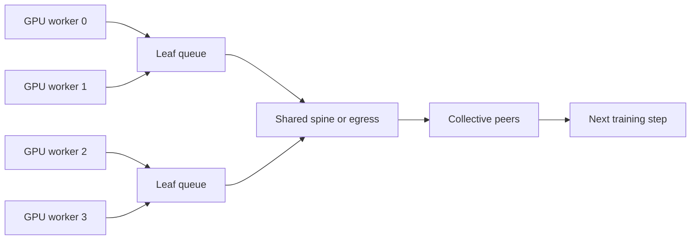
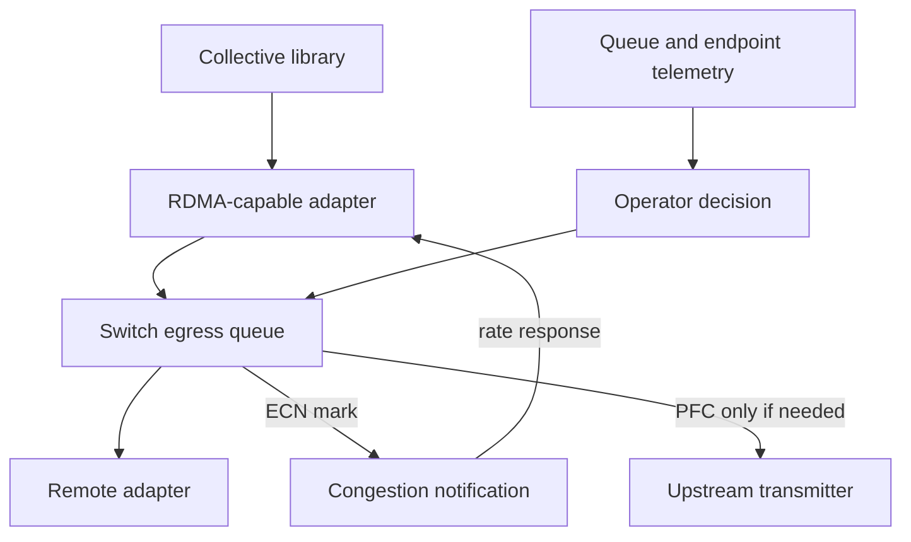

# Why Ethernet for AI Is Different

## Introduction

An organization can have a healthy high-speed Ethernet network and still have an unhealthy AI fabric. Links are up, ping works, and single-stream tests reach an impressive rate. Then a distributed training run starts: workers reach a collective at nearly the same time, queues form on a few shared egresses, and one delayed participant holds up the entire step.

The distinction is not that Ethernet is unsuitable for AI. It is that AI exposes the fabric as part of the application’s critical path. A design must be evaluated as an end-to-end congestion-control and operations system, not as independent port-speed tests.

| Chapter field | Value |
|---|---|
| Difficulty | Advanced |
| Estimated reading time | 45–60 minutes |
| Prerequisites | Volumes 07 and 08; basic IP routing and QoS |
| Focus | Workload behavior, queues, and the AI-Ethernet design problem |
| Next | Ethernet Architecture for AI |

## A Production Story: The Fabric That Passed Every Link Test

A platform team adds GPU servers to an existing leaf-spine fabric. A two-node RDMA test succeeds, and the links have no errors. With one training job, results look reasonable. With two jobs, collective time becomes erratic. Pause counters rise at several leaves, while average utilization remains modest.

The incident is not solved by declaring the network “too slow.” Several senders are converging on the same egress queues in short bursts. Backpressure protects one loss-sensitive class, but the control loop reacts after queues are already stressed. The useful investigation asks where congestion begins, what traffic class it affects, how sources learn about it, and whether the topology and workload placement create avoidable contention.

## Learning Objectives

After this chapter, you can:

- explain why synchronized collective communication makes tail behavior application-visible;
- distinguish capacity, queueing, packet loss, and congestion-control problems;
- describe the respective purposes of RoCE, PFC, ECN, endpoint rate control, and telemetry;
- identify when a shared Ethernet fabric is a sound architectural choice;
- frame a production validation plan that tests contention rather than links in isolation.

## Why: Collective Communication Changes the Traffic Shape

In request-response services, independent flows can often tolerate an occasional delayed request. Distributed training has synchronization points. In an all-reduce, for example, participants exchange data and progress is constrained by the slowest required contribution. The precise collective algorithm depends on the library, message size, and topology, but the operational consequence is stable: a short queueing event can delay a whole group.

**Figure 9.1.1 — Many senders can create brief, concentrated pressure on shared queues.** Average utilization does not reveal the instantaneous queue depth that affects a synchronized job.

### Incast, elephant flows, and imbalance

AI traffic commonly combines large transfers with synchronized phases. Multiple senders can target a receiver, a leaf uplink, or a subset of equal-cost paths at once. ECMP path selection distributes eligible flows; it does not guarantee that a particular workload’s flows will balance perfectly. Oversubscription, rail placement, or a failed link can further concentrate traffic.

Do not infer a cause from a traffic label. “Incast” describes convergence; it does not prove that the receiver, route, buffer policy, hashing, or offered load is at fault. Evidence must come from endpoint, queue, and topology data captured in the same time window.

## What: The End-to-End Control System

RoCE gives an RDMA-capable endpoint a way to carry RDMA traffic over Ethernet. It does not by itself reserve capacity, select the correct priority, or keep queues shallow. The fabric needs a coordinated design across hosts, adapters, switches, routing, and operations.

**Figure 9.1.2 — Congestion avoidance, bounded loss protection, and observability are separate functions.** A pause mechanism cannot substitute for capacity planning or sender rate response.

| Function | Question it answers | Design responsibility |
|---|---|---|
| Topology and capacity | Can the intended concurrency fit? | Network and platform architecture |
| QoS classification | Which packets share a queue? | Host and switch policy |
| ECN and endpoint response | Can sources reduce load before overflow? | Switch and adapter configuration |
| PFC | How is a selected priority protected during acute buffer pressure? | Link-level safety mechanism |
| Telemetry | Can operators see queue pressure and its effect? | Switch, adapter, and application observability |

### Loss-sensitive does not mean “make everything lossless”

Priority Flow Control (PFC) can pause one Ethernet priority when downstream buffer pressure reaches a configured threshold. That can protect a RoCE class from immediate loss, but sustained pause may propagate upstream. If unrelated flows share that priority, they can be blocked as well. Enabling PFC broadly creates a larger failure domain, not a stronger design.

Explicit Congestion Notification (ECN) marks eligible IP packets instead of dropping them when a queue becomes congested. A RoCEv2 endpoint can use congestion notification to adjust its sending behavior. This feedback loop aims to reduce offered load before a queue needs persistent pause. Chapters 04 and 05 examine PFC and ECN/DCQCN in detail; this chapter establishes the architectural rule: use proactive congestion control and reserve PFC for narrowly scoped protection.

## How: Design from the Workload Backward

Start with the communication matrix, not a generic diagram. Identify job size, collective patterns, expected concurrent jobs, storage overlap, fault cases, and the placement rules that associate GPUs with NICs and rails. Volume 07 explains why host and GPU locality matter; a fast fabric cannot erase a poor PCIe or NUMA path.

### A layered validation model

| Layer | Validate | Evidence |
|---|---|---|
| Physical | Optics, cables, link state, errors | Port state and error counters |
| Host | Driver/firmware qualification, PCIe locality | Inventory and topology output |
| IP and QoS | Routes, MTU, VLAN/DSCP/PCP mapping | Host and switch configuration |
| RDMA | Device selection, GID context, queue-pair operation | RDMA tools and completion errors |
| Congestion | ECN marks, pause frames, queue occupancy, drops | Switch and adapter counters |
| Application | Collective time, stragglers, retries | Framework telemetry and job logs |

Each layer can pass while a later layer fails. Ping tests IP reachability, not RDMA memory registration, priority mapping, or congestion behavior. A host-memory RDMA test narrows the problem, but it does not validate GPU placement or a distributed collective.

### Baselines must include contention

Record a healthy baseline for a defined software and topology state. Include a small endpoint test, an increasing-concurrency test, a representative collective, and a failure or degraded-path test. Capture time-aligned counters before, during, and after the workload. The result is a reference for change review, not a universal performance promise.

## When: Choosing Ethernet for AI

Ethernet is compelling when an organization can apply mature routing, automation, and operational practices to a fabric with sufficient path diversity and validated QoS behavior. It can also simplify integration with existing data-center services and multi-tenant designs. These are advantages only when the operating model accounts for the extra coupling introduced by convergence.

| Fit signal | Warning signal |
|---|---|
| Controlled host, switch, and NIC qualification | Mixed, untracked endpoint software and firmware |
| Capacity model for normal and failure states | Reliance on aggregate link speed alone |
| Queue, ECN, PFC, and endpoint telemetry | Only coarse interface utilization monitoring |
| Explicit isolation and change control | PFC enabled on all priorities “just in case” |
| Contention testing with real collectives | Validation limited to ping and a single flow |

## Trade-Offs and Production Boundaries

Converging compute, storage, and service traffic can reduce infrastructure duplication, but it raises the importance of classification, capacity, and blast-radius analysis. Physical separation is not automatically safer; logical separation is not automatically sufficient. The deciding question is whether sharing has a verified queue, capacity, and failure-domain model.

### What the fabric cannot solve alone

| Concern | Why the network cannot solve it alone | Required partner control |
|---|---|---|
| Slow ranks | A straggler may be compute-, storage-, or host-local | Scheduler, host telemetry, application profiling |
| Uneven collectives | A library can select algorithms and paths differently by message size | Communication-library qualification |
| Excess demand | Queues cannot create bisection bandwidth | Admission control and capacity planning |
| Tenant boundaries | Priority separation is not workload authorization | Device policy, identity, and scheduler isolation |

This boundary keeps incident response honest. Network evidence can establish whether the fabric contributed to a slowdown; it should not be used to assign every distributed-systems symptom to Ethernet.

Security follows the same principle. RoCE access is not a substitute for tenant isolation, host authorization, or management-plane controls. Treat device access, memory-registration policy, automation credentials, and telemetry data as parts of the platform security architecture.

Operational complexity is a real cost. An AI Ethernet fabric requires version-qualified endpoint stacks, controlled QoS policy, evidence collection, and change windows that test congestion behavior. These requirements are often less visible than ports and optics, but they determine whether the system remains supportable.

## Production Troubleshooting

### Scenario 1 — Throughput collapses only with concurrent jobs

**Symptoms:** a two-node test is healthy; collective duration rises sharply when a second job begins; average utilization looks low.

**Diagnosis:** correlate application step time with egress queue occupancy, ECN marks, pause frames, drops, and active paths. Compare workload placement and oversubscribed links. Verify that all hosts classify the RoCE flow into the intended queue.

**Likely root causes:** transient incast, path imbalance, a shared constrained egress, or a QoS mapping drift.

**Resolution and verification:** correct the topology, placement, or policy that creates the hotspot; repeat the same concurrency profile and confirm that queue pressure and job tail time improve together.

**Prevention:** make contention benchmarks and time-aligned counter capture release gates for network changes.

### Scenario 2 — No drops, but unrelated traffic stalls

**Symptoms:** selected interfaces show sustained PFC activity; an unrelated workload sharing the priority slows; packet-drop counters remain low.

**Diagnosis:** find the first congested downstream egress, then trace the affected priority upstream. Inspect classification and determine which flows share the paused class.

**Likely root cause:** PFC is masking persistent congestion or an overly broad traffic class.

**Resolution and verification:** restore a narrow RoCE class, address the congestion source, and verify that ECN-based feedback occurs before prolonged pause. Do not disable PFC blindly; that can turn a pause symptom into packet loss.

**Prevention:** alert on sustained pause duration and review queue policies whenever new traffic is admitted.

## Customer Architecture Conversation

For a customer considering Ethernet for a GPU cluster, begin with workload concurrency, job completion objectives, topology, operational ownership, and required isolation. Then describe the control loop in concrete terms: where packets queue, how congestion is signaled, how endpoints respond, what priority can pause, and how operators prove the behavior.

Avoid a binary recommendation. The architecture can be sound for an organization with disciplined qualification and telemetry, or fragile when it relies on undocumented defaults and isolated benchmark results. The differentiator is operational evidence.

## Interview Preparation

### Knowledge questions

1. Why can low average utilization coexist with high collective latency?
2. What is the difference between ECN marking and PFC pause?
3. Why is a successful ping test insufficient for an AI Ethernet fabric?

### Architecture questions

1. Design a validation plan for a new 256-GPU Ethernet cluster.
2. Which traffic should share a physical fabric, and what evidence would justify the choice?

### Scenario question

Two jobs contend on a fabric with no visible drops. Explain how you distinguish queueing, PFC propagation, path imbalance, and endpoint configuration drift.

## Architecture Summary

AI makes Ethernet performance depend on coordinated behavior across topology, endpoint locality, queues, congestion feedback, and operations. The network must be evaluated under the synchronized workload it will carry, including contention and degraded paths.

## Key Takeaways

- Collective communication makes short queueing events visible at application level.
- RoCE is an endpoint transport capability, not a complete fabric design.
- ECN-based feedback, scoped PFC, capacity, and telemetry have distinct roles.
- A healthy AI fabric is proven with concurrency and failure tests, not link tests alone.

## Quick Revision Sheet

| Term | Remember |
|---|---|
| Incast | Multiple senders converge on a shared resource |
| ECN | Marks congestion before a drop, when configured end to end |
| PFC | Per-priority pause used as bounded loss protection |
| Tail behavior | Slowest participant can delay a synchronized step |
| Baseline | Reproducible evidence for a defined topology and software state |

## Lab Checklist

Before moving on, confirm that you can:

- identify a workload’s likely shared egresses and failure domains;
- map RoCE traffic to its intended priority on host and switch;
- collect queue, ECN, PFC, drop, and application evidence in one time window;
- explain why a contention test is required before production admission.

## Cross References

- [Volume 07 — GPU Networking](../volume-07/index)
- [Volume 08 — InfiniBand](../volume-08/index)
- [Ethernet Architecture for AI](./chapter-02-ethernet-architecture-for-ai)
- [Priority Flow Control](./chapter-04-priority-flow-control)
- [ECN and DCQCN](./chapter-05-ecn-and-dcqcn)

## Further Reading

- [NVIDIA: RDMA over Converged Ethernet (RoCE)](https://docs.nvidia.com/networking/display/mlnxofedv23100540/rdma%2Bover%2Bconverged%2Bethernet%2B%28roce%29)
- [NVIDIA: RoCE configuration with PFC and ECN](https://docs.nvidia.com/networking-ethernet-software/cumulus-linux-57/Layer-1-and-Switch-Ports/Quality-of-Service/RDMA-over-Converged-Ethernet-RoCE/)
