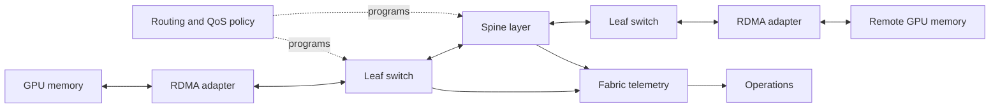
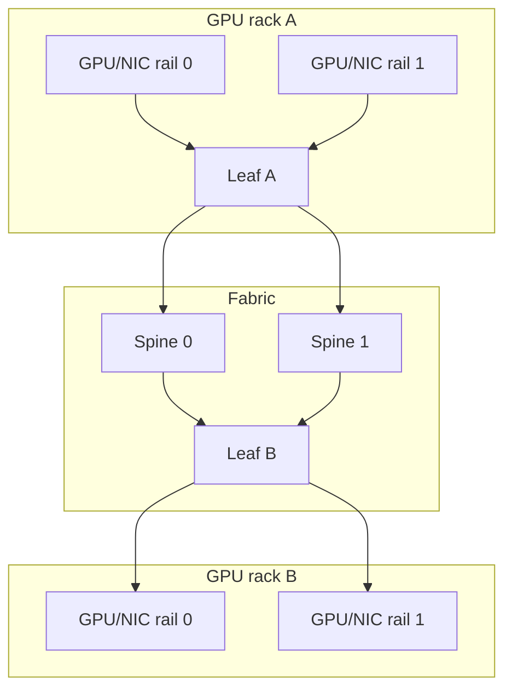

# Ethernet Architecture for AI

## Introduction

The phrase “AI Ethernet fabric” describes a system, not a box or a port speed. Its data path starts near GPU memory, crosses the host PCIe topology and RDMA adapter, traverses routed Ethernet queues, and terminates at another adapter and memory domain. Its control path includes address selection, routing, QoS policy, congestion feedback, firmware and driver qualification, and observability.

This chapter turns the workload problem from Chapter 01 into an architectural model. It intentionally leaves the detailed RoCE packet and memory path to Chapter 03, PFC to Chapter 04, and ECN/DCQCN to Chapter 05.

| Chapter field | Value |
|---|---|
| Difficulty | Advanced |
| Estimated reading time | 50–65 minutes |
| Prerequisites | Chapter 01; PCIe/NUMA concepts from Volume 07 |
| Focus | Fabric roles, traffic separation, topology, and validation layers |
| Next | RoCEv2 and RDMA over Ethernet |

## Production Story: One Fabric, Four Very Different Traffic Classes

A cluster uses the same physical switches for management, service APIs, storage, and GPU communication. The design is economical and initially simple. During checkpoint activity, storage traffic shares constrained uplinks with a training job. The training team sees collective stalls, while the network dashboard reports that no individual port is saturated over a five-minute average.

The lesson is not that these traffic types must always be physically separate. It is that a shared fabric needs an explicit admission decision: which traffic can share capacity and queues, what QoS policy applies, which failures can cross the boundary, and which measurements prove the decision remains safe as workloads change.

## Learning Objectives

After this chapter, you can:

- map the endpoint-to-endpoint AI data path and its control dependencies;
- separate management, service, storage, and compute design concerns;
- explain how leaf-spine topology, ECMP, oversubscription, and rails influence AI traffic;
- define a qualification and validation architecture for a production fabric;
- identify availability, security, observability, and lifecycle decisions that belong in the design.

## Big Picture Architecture

**Figure 9.2.1 — The data path is only useful when its routing, QoS, endpoint, and telemetry dependencies are compatible.**

### Data path versus control path

The data path transports application traffic. The adapter performs RDMA work and DMA; switches forward packets and schedule egress queues. The control path determines how that traffic is addressed, classified, routed, and observed. A server can have a valid IP address while its selected RoCE GID context, priority mapping, or endpoint congestion settings are incompatible with the path.

| Plane | Typical responsibilities | Failure signature |
|---|---|---|
| Data | DMA, packet forwarding, queues, receive resources | Throughput collapse, retries, drops, stalls |
| Control | Addressing, routes, QoS policy, ECMP, provisioning | Wrong path, wrong priority, inconsistent behavior |
| Management | Inventory, credentials, software lifecycle, telemetry | Slow diagnosis, configuration drift, unsafe changes |

## Network Roles and Isolation

| Network role | Typical traffic | Primary design concern |
|---|---|---|
| Management | BMC, provisioning, SSH, monitoring | Reachability, access control, recovery |
| Service | APIs, ingress, control planes | Availability and isolation |
| Compute | Collectives and RDMA | Path diversity, queues, congestion behavior |
| Storage | Dataset access and checkpoints | Sustained throughput and burst interaction |

These are roles, not mandatory physical networks. A role can be physically separate, logically separated, or admitted to a shared fabric. Logical segmentation still requires correct classification at every boundary. A VLAN alone does not guarantee queue isolation; a DSCP marking alone does not prove that a switch maps it to the intended class.

### A practical isolation decision

For each role, document:

1. peak and burst characteristics;
2. allowed shared links and queues;
3. QoS classification and trust boundaries;
4. capacity in normal and failure states;
5. expected telemetry and alert thresholds;
6. change owner and rollback plan.

This turns “convergence” from an assumption into a reviewable architecture decision.

## Topology, Rails, and Capacity

A leaf-spine design offers multiple equal-cost paths between leaves. The useful question is not whether the diagram is nonblocking in the abstract, but whether the deployed uplinks, routing policy, job placement, and failure cases provide the intended paths for the workload.

**Figure 9.2.2 — Rails and path diversity need consistent host placement, cabling, and routing policy.** A single broken or congested rail can make a nominally symmetric design asymmetric.

### Oversubscription is a workload decision

Oversubscription compares potential downlink demand to uplink capacity. It is not automatically unacceptable, but it must be evaluated against concurrency and communication phases. Calculate both expected and degraded states: a failed uplink, drained spine, maintenance condition, or an admitted storage burst can turn an acceptable normal-state ratio into a bottleneck.

Do not publish generic throughput claims from a topology ratio. Measure the target workload and retain the configuration, placement, and software state with the result.

### Endpoint locality belongs in the fabric model

On a multi-GPU host, the selected NIC and GPU may be connected through different PCIe or NUMA paths. Rail-aware placement should use the actual host topology, not names such as `eth0` or a presumed PCIe ordering. See Volume 07 for the host-side mechanisms; the network design needs to consume that topology information when assigning ports, ranks, and failure domains.

## Production Deployment Pattern

### 1. Establish a source of truth

Record server, rack, rail, switch port, optic or cable, NIC port, intended IP/VLAN context, firmware, driver, and software image. Use it to detect drift rather than relying on manually maintained diagrams.

### 2. Qualify a configuration set

Treat switch software, adapter firmware, host driver, operating system, and communication library as a tested combination. Configuration recipes are product and release dependent; use the vendor documentation for the exact supported commands and compatibility requirements in the deployment.

### 3. Apply policy consistently

Define MTU, routing, QoS classification, congestion behavior, and monitoring for the compute role. Verify the effective state at endpoints and switches. A policy rendered in automation is not proof that it is active on every relevant port.

### 4. Validate in increasing scope

Start with physical and IP checks, then host-memory RDMA, then GPU-aware communication, then representative collectives. Add concurrency and a failure-state test before declaring the cluster ready. Record evidence rather than treating one successful benchmark as permanent certification.

## Observability and Operational Readiness

An operator needs signals at more than the interface layer:

| Domain | Examples of useful evidence |
|---|---|
| Ports | Link transitions, FEC/error counters, discards |
| Queues | Occupancy, ECN marks, PFC frames/duration, drops |
| Endpoints | RDMA errors, selected device/GID, retransmission-related counters where exposed |
| Topology | Active paths, rail membership, drained or failed links |
| Application | Collective duration, stragglers, retries, job placement |

Time alignment matters. A queue counter gathered hours after a job failure rarely establishes causality. Collect timestamped support bundles and retain a known-good baseline per hardware and software profile.

### Availability and change management

The fabric should be designed for maintenance and failure, not only steady state. Document how a switch, rail, link, or adapter is drained; which jobs can be moved or restarted; what reduced capacity is acceptable; and how rollback works. Maintenance tooling and telemetry require their own access controls because they can alter forwarding and QoS behavior at scale.

## Production Troubleshooting

### Scenario 1 — IP works but NCCL selects an unexpected transport

**Symptoms:** ping and route checks succeed; the application reports a fallback transport or poor performance.

**Diagnosis:** inspect the application’s transport logs, the RDMA device and port state, selected GID context, host topology, and library environment. Confirm that the job sees the intended devices and that the tested software stack is installed.

**Root cause examples:** a missing or inaccessible RDMA device, incorrect device selection, incompatible endpoint configuration, or host-locality mismatch.

**Resolution and verification:** correct selection or qualification drift, then re-run a minimal RDMA test followed by the same collective test. Record both layers of evidence.

**Prevention:** make device inventory and a small transport validation part of node provisioning.

### Scenario 2 — A maintenance event creates job-wide slowdown

**Symptoms:** after one uplink or spine is removed, no links are down at hosts but collective duration rises and a subset of leaves shows queue pressure.

**Diagnosis:** compare active paths and available capacity before and after the event. Review ECMP behavior, remaining oversubscription, and rail placement. Correlate the affected queues with jobs using those racks.

**Root cause:** the design was validated only in the normal topology or its failure-state capacity was insufficient for admitted workload concurrency.

**Resolution and verification:** reduce concurrency, restore path diversity, or revise capacity and placement rules. Re-run the documented degraded-state test before closing the change.

**Prevention:** include planned maintenance and single-failure cases in admission and release reviews.

## Customer Architecture Discussion

When assessing an existing Ethernet estate for GPU workloads, ask for the physical topology, current traffic roles, endpoint inventory, failure procedures, and telemetry—not merely port speeds. A credible proposal describes what will share infrastructure, how it is isolated, how capacity is modeled under failure, and how the operator will diagnose a collective slowdown.

The goal is an architecture that can evolve. That means reproducible configuration, qualified upgrades, inventory-backed cabling and rail records, and a clear boundary between generic service traffic and the loss-sensitive compute class.

## Interview Preparation

### Knowledge questions

1. Why is a VLAN not equivalent to queue isolation?
2. What belongs to the AI fabric control path?
3. Why should endpoint PCIe locality influence network placement?

### Architecture questions

1. Draw a two-rail leaf-spine fabric and identify normal and failure-state bottlenecks.
2. Propose an isolation model for management, storage, and RoCE compute traffic.

### Scenario question

A fabric meets its capacity target normally but slows after a spine drain. What data proves whether the issue is topology, ECMP behavior, QoS, or workload placement?

## Architecture Summary

An AI Ethernet architecture joins a host-local data path to a routed, queueing fabric and a managed control plane. Topology, traffic roles, rails, endpoint qualification, and observability are all design inputs. None can be inferred from link state alone.

## Key Takeaways

- A production AI fabric contains data, control, and management dependencies.
- Network roles can share infrastructure only with explicit queue, capacity, and failure-domain decisions.
- Leaf-spine path diversity must be evaluated with workload placement and failures.
- Qualification and layered validation turn a design into an operable platform.

## Quick Revision Sheet

| Concept | Remember |
|---|---|
| Data path | DMA, packets, links, and queues that carry workload traffic |
| Control path | Addressing, routing, QoS, congestion, and configuration decisions |
| Rail | A deliberate, repeatable endpoint-to-fabric connectivity domain |
| Failure-state capacity | Capacity after a planned or unplanned component loss |
| Qualification set | Tested combination of software, firmware, and configuration |

## Lab Checklist

Before moving on, confirm that you can:

- draw the deployed path between two GPU-attached NICs;
- identify the compute traffic class and its queue policy;
- calculate and document normal and degraded capacity assumptions;
- collect endpoint, switch, and application evidence for a validation run.

## Cross References

- Previous: [Why Ethernet for AI Is Different](./chapter-01-why-ethernet-for-ai-is-different)
- Next: [RoCEv2 and RDMA over Ethernet](./chapter-03-rocev2-and-rdma-over-ethernet)
- Related: [Topology-Aware Placement](../volume-07/chapter-08-topology-aware-placement)
- Related: [Multi-Node Collectives and NCCL Paths](../volume-07/chapter-09-multi-node-collectives-and-nccl-paths)

## Further Reading

- [NVIDIA: RDMA over Converged Ethernet (RoCE)](https://docs.nvidia.com/networking/display/mlnxofedv23100540/rdma%2Bover%2Bconverged%2Bethernet%2B%28roce%29)
- [NVIDIA: RoCE with PFC and ECN](https://docs.nvidia.com/networking-ethernet-software/cumulus-linux-57/Layer-1-and-Switch-Ports/Quality-of-Service/RDMA-over-Converged-Ethernet-RoCE/)
