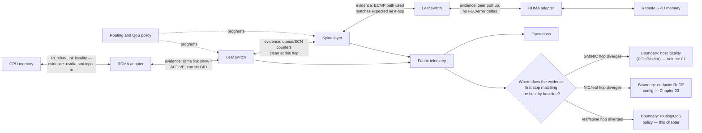
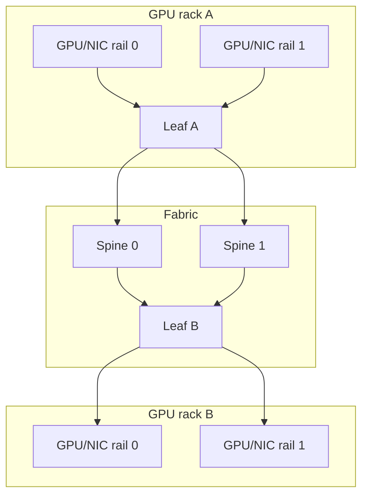

# Ethernet Architecture for AI

## Introduction

The phrase “AI Ethernet fabric” describes a system, not a box or a port speed. Its data path starts near GPU memory, crosses the host PCIe topology and RDMA adapter, traverses routed Ethernet queues, and terminates at another adapter and memory domain. Its control path includes address selection, routing, QoS policy, congestion feedback, firmware and driver qualification, and observability.

This chapter turns the workload problem from Chapter 01 into an architectural model. It intentionally leaves the detailed RoCE packet and memory path to Chapter 03, PFC to Chapter 04, and ECN/DCQCN to Chapter 05.

| Chapter field | Value |
|---|---|
| Difficulty | Advanced |
| Estimated reading time | 50–65 minutes |
| Prerequisites | Chapter 01; PCIe/NUMA concepts from Volume 07 |
| Focus | Fabric roles, traffic separation, topology, and validation layers |
| Next | RoCEv2 and RDMA over Ethernet |

## Production Story: One Fabric, Four Very Different Traffic Classes

A cluster uses the same physical switches for management, service APIs, storage, and GPU communication. The design is economical and initially simple. During checkpoint activity, storage traffic shares constrained uplinks with a training job. The training team sees collective stalls, while the network dashboard reports that no individual port is saturated over a five-minute average.

The lesson is not that these traffic types must always be physically separate. It is that a shared fabric needs an explicit admission decision: which traffic can share capacity and queues, what QoS policy applies, which failures can cross the boundary, and which measurements prove the decision remains safe as workloads change.

## Learning Objectives

After this chapter, you can:

- map the endpoint-to-endpoint AI data path and its control dependencies;
- separate management, service, storage, and compute design concerns;
- explain how leaf-spine topology, ECMP, oversubscription, and rails influence AI traffic;
- define a qualification and validation architecture for a production fabric;
- identify availability, security, observability, and lifecycle decisions that belong in the design.

## Big Picture Architecture



**Figure 9.2.1 — The data path is only useful when its routing, QoS, endpoint, and telemetry dependencies are compatible, and each hop now carries the evidence that proves it, not just its name.** The decision node is the actual troubleshooting move: telemetry doesn't just observe the path, it tells you which of the three ownership boundaries — host locality, endpoint RoCE configuration, or fabric routing/QoS policy — to investigate first, because each one needs a different team and a different fix.

### Data path versus control path

The data path transports application traffic. The adapter performs RDMA work and DMA; switches forward packets and schedule egress queues. The control path determines how that traffic is addressed, classified, routed, and observed. A server can have a valid IP address while its selected RoCE GID context, priority mapping, or endpoint congestion settings are incompatible with the path.

| Plane | Typical responsibilities | Failure signature |
|---|---|---|
| Data | DMA, packet forwarding, queues, receive resources | Throughput collapse, retries, drops, stalls |
| Control | Addressing, routes, QoS policy, ECMP, provisioning | Wrong path, wrong priority, inconsistent behavior |
| Management | Inventory, credentials, software lifecycle, telemetry | Slow diagnosis, configuration drift, unsafe changes |

## Network Roles and Isolation

| Network role | Typical traffic | Primary design concern |
|---|---|---|
| Management | BMC, provisioning, SSH, monitoring | Reachability, access control, recovery |
| Service | APIs, ingress, control planes | Availability and isolation |
| Compute | Collectives and RDMA | Path diversity, queues, congestion behavior |
| Storage | Dataset access and checkpoints | Sustained throughput and burst interaction |

These are roles, not mandatory physical networks. A role can be physically separate, logically separated, or admitted to a shared fabric. Logical segmentation still requires correct classification at every boundary. A VLAN alone does not guarantee queue isolation; a DSCP marking alone does not prove that a switch maps it to the intended class.

### A practical isolation decision

For each role, document:

1. peak and burst characteristics;
2. allowed shared links and queues;
3. QoS classification and trust boundaries;
4. capacity in normal and failure states;
5. expected telemetry and alert thresholds;
6. change owner and rollback plan.

This turns “convergence” from an assumption into a reviewable architecture decision.

## Topology, Rails, and Capacity

A leaf-spine design offers multiple equal-cost paths between leaves. The useful question is not whether the diagram is nonblocking in the abstract, but whether the deployed uplinks, routing policy, job placement, and failure cases provide the intended paths for the workload.



**Figure 9.2.2 — Rails and path diversity need consistent host placement, cabling, and routing policy.** A single broken or congested rail can make a nominally symmetric design asymmetric.

### Oversubscription is a workload decision

Oversubscription compares potential downlink demand to uplink capacity. It is not automatically unacceptable, but it must be evaluated against concurrency and communication phases. Calculate both expected and degraded states: a failed uplink, drained spine, maintenance condition, or an admitted storage burst can turn an acceptable normal-state ratio into a bottleneck.

Do not publish generic throughput claims from a topology ratio. Measure the target workload and retain the configuration, placement, and software state with the result.

### Endpoint locality belongs in the fabric model

On a multi-GPU host, the selected NIC and GPU may be connected through different PCIe or NUMA paths. Rail-aware placement should use the actual host topology, not names such as `eth0` or a presumed PCIe ordering. See Volume 07 for the host-side mechanisms; the network design needs to consume that topology information when assigning ports, ranks, and failure domains.

**Illustrative annotated output — the topology evidence this section is asking for:**

```text
$ nvidia-smi topo -m
        GPU0    GPU1    NIC0    NIC1    CPU Affinity    NUMA Affinity
GPU0     X      NV18    PIX     SYS     0-31            0
GPU1    NV18     X      SYS     PIX     32-63           1
NIC0    PIX     SYS      X      SYS
NIC1    SYS     PIX     SYS      X

Legend:
  NV18 = NVLink, 18 links       PIX  = same PCIe switch, no CPU hop
  SYS  = crosses CPU/NUMA boundary (PCIe host bridge)
```

The row that actually matters for rail design is `GPU0`/`NIC0`: `PIX` means GPU0 and NIC0 share a PCIe switch with no NUMA crossing — this is the "local" rail. `GPU0`/`NIC1` shows `SYS`, meaning traffic from GPU0 through NIC1 crosses into NUMA node 1's PCIe tree — a real, measurable latency and bandwidth cost that has nothing to do with the network fabric at all. If a job's placement uses `GPU0` with `NIC1` because of a naming assumption (`eth0` "should" be near `GPU0`), the fabric can be flawless and the job still underperforms — the evidence for that failure lives in this table, not in any switch counter. This is the concrete reason Chapter 02 insists rail assignment consume actual topology output instead of interface names.

## Production Deployment Pattern

### 1. Establish a source of truth

Record server, rack, rail, switch port, optic or cable, NIC port, intended IP/VLAN context, firmware, driver, and software image. Use it to detect drift rather than relying on manually maintained diagrams.

### 2. Qualify a configuration set

Treat switch software, adapter firmware, host driver, operating system, and communication library as a tested combination. Configuration recipes are product and release dependent; use the vendor documentation for the exact supported commands and compatibility requirements in the deployment.

### 3. Apply policy consistently

Define MTU, routing, QoS classification, congestion behavior, and monitoring for the compute role. Verify the effective state at endpoints and switches. A policy rendered in automation is not proof that it is active on every relevant port.

### 4. Validate in increasing scope

Start with physical and IP checks, then host-memory RDMA, then GPU-aware communication, then representative collectives. Add concurrency and a failure-state test before declaring the cluster ready. Record evidence rather than treating one successful benchmark as permanent certification.

## Observability and Operational Readiness

An operator needs signals at more than the interface layer:

| Domain | Examples of useful evidence |
|---|---|
| Ports | Link transitions, FEC/error counters, discards |
| Queues | Occupancy, ECN marks, PFC frames/duration, drops |
| Endpoints | RDMA errors, selected device/GID, retransmission-related counters where exposed |
| Topology | Active paths, rail membership, drained or failed links |
| Application | Collective duration, stragglers, retries, job placement |

Time alignment matters. A queue counter gathered hours after a job failure rarely establishes causality. Collect timestamped support bundles and retain a known-good baseline per hardware and software profile.

### Availability and change management

The fabric should be designed for maintenance and failure, not only steady state. Document how a switch, rail, link, or adapter is drained; which jobs can be moved or restarted; what reduced capacity is acceptable; and how rollback works. Maintenance tooling and telemetry require their own access controls because they can alter forwarding and QoS behavior at scale.

## Production Troubleshooting

### Scenario 1 — IP works but NCCL selects an unexpected transport

**Symptoms:** ping and route checks succeed; the application reports a fallback transport or poor performance.

**Diagnosis:** inspect the application’s transport logs, the RDMA device and port state, selected GID context, host topology, and library environment. Confirm that the job sees the intended devices and that the tested software stack is installed.

**Root cause examples:** a missing or inaccessible RDMA device, incorrect device selection, incompatible endpoint configuration, or host-locality mismatch.

**Evidence in practice:**

```text
$ NCCL_DEBUG=INFO NCCL_DEBUG_SUBSYS=NET python train.py 2>&1 | grep -i "net/"
node03:14211 [1] NCCL INFO NET/IB : No device found.
node03:14211 [1] NCCL INFO NET/Socket : Using [0]eth0:10.20.4.15<0>
node03:14211 [1] NCCL INFO Using network Socket
```

This is the fallback the symptom describes: NCCL couldn't find a usable IB/RoCE device and silently dropped to TCP sockets over `eth0` — still "working," just at a fraction of RoCE throughput, and with no error the application layer would surface on its own. Cross-checking the host confirms why:

```text
$ rdma link show
$ echo $?
0          <- command succeeded but printed nothing: no RDMA links registered at all
$ lsmod | grep mlx5
mlx5_core             1234567  0
                                  <- mlx5_core loaded, but no mlx5_ib — RDMA verbs stack never came up
```

`rdma link show` returning cleanly with zero output is the tell: the low-level driver (`mlx5_core`) is present, but the RDMA/IB verbs layer (`mlx5_ib`) never registered a device, which is exactly why NCCL's IB transport reported "No device found" and fell back. This distinguishes a host/driver-stack problem (this case) from a GID/addressing problem, which would instead show a registered device with a completion or connection error.

**Resolution and verification:** correct selection or qualification drift, then re-run a minimal RDMA test followed by the same collective test. Record both layers of evidence — after the fix, `NCCL_DEBUG=INFO` should log `NCCL INFO NET/IB : Using [0]mlx5_0:1/RoCE` instead of the Socket fallback.

**Prevention:** make device inventory and a small transport validation part of node provisioning.

### Scenario 2 — A maintenance event creates job-wide slowdown

**Symptoms:** after one uplink or spine is removed, no links are down at hosts but collective duration rises and a subset of leaves shows queue pressure.

**Diagnosis:** compare active paths and available capacity before and after the event. Review ECMP behavior, remaining oversubscription, and rail placement. Correlate the affected queues with jobs using those racks.

**Root cause:** the design was validated only in the normal topology or its failure-state capacity was insufficient for admitted workload concurrency.

**Evidence in practice:**

```text
# Before spine drain: 2 spines, ECMP across both
$ ip route get 10.20.8.5
10.20.8.5 via 10.20.0.1 dev bond0 src 10.20.4.15
    cache users 1 mtu 9000

$ ss -ti | grep 10.20.8.5 | head -1
        cwnd:64 ... <normal steady-state values>

# Spine 1 drained for maintenance — normal topology now has one fewer path
$ show ip ecmp-groups | grep 10.20.0.0/16      # illustrative NOS query
  nexthop-group 40: 1 active member (was 2)     <- half the ECMP fan-out for this prefix

$ ethtool -S swp30 | egrep "tx_ecn|pfc_prio3"
     tx_ecn_marked_prio3:     88120      <- was ~15000/window before drain: same leaves, less capacity
     rx_pfc_prio3:            0
```

The ECMP group shrinking from 2 active members to 1 is the structural evidence: every flow that used to have two viable next hops now has one, so the same offered load is concentrated on half the uplinks. `tx_ecn_marked_prio3` roughly 6x higher over the same window on the surviving path is the queue-level confirmation — this is capacity, not a routing bug, because the ECMP behavior is doing exactly what it's configured to do with the remaining path.

**Resolution and verification:** reduce concurrency, restore path diversity, or revise capacity and placement rules. Re-run the documented degraded-state test before closing the change — confirm the ECMP group returns to its expected member count and ECN marking rate returns to the pre-drain baseline once the spine rejoins.

**Prevention:** include planned maintenance and single-failure cases in admission and release reviews.

## Customer Architecture Discussion

When assessing an existing Ethernet estate for GPU workloads, ask for the physical topology, current traffic roles, endpoint inventory, failure procedures, and telemetry—not merely port speeds. A credible proposal describes what will share infrastructure, how it is isolated, how capacity is modeled under failure, and how the operator will diagnose a collective slowdown.

The goal is an architecture that can evolve. That means reproducible configuration, qualified upgrades, inventory-backed cabling and rail records, and a clear boundary between generic service traffic and the loss-sensitive compute class.

## Interview Preparation

### Knowledge questions

**1. Why is a VLAN not equivalent to queue isolation?**

"A VLAN is a Layer 2 broadcast-domain and forwarding construct — it controls where a frame is allowed to go, not which queue it lands in once it gets there. Queue isolation happens through DSCP or PCP classification mapped to an internal priority and an egress queue, which is a completely separate policy that has to be configured and verified at every hop. I've seen designs where two VLANs both funnel into the same best-effort queue at a switch because nobody set the classification-to-queue mapping — the VLANs were perfectly isolated for forwarding purposes and completely unisolated for congestion purposes. If someone tells me 'we've isolated that traffic with a VLAN,' my next question is always 'what queue does it land in, and how did you verify that, not just configure it.'"

**2. What belongs to the AI fabric control path?**

"Addressing and route selection, QoS classification policy, ECMP and routing decisions, and the provisioning that pushes all of that to switches and endpoints. It's distinct from the data path — DMA, packet forwarding, the actual queues carrying application bytes — and from the management plane — inventory, credentials, telemetry collection. The reason this split matters operationally is that a server can have a perfectly valid IP address, which is control-path correctness, while its GID selection or priority mapping is wrong, which is also control-path but a different piece of it — and neither of those tells you anything about whether the data path is actually healthy under load."

**3. Why should endpoint PCIe locality influence network placement?**

"Because the network diagram and the actual achievable bandwidth can disagree if you ignore it. I've walked through `nvidia-smi topo -m` output where GPU0 and NIC0 share a PCIe switch — marked `PIX`, no NUMA crossing — while GPU0 to NIC1 crosses into the other NUMA node's PCIe tree, marked `SYS`. If rail assignment is done by interface name instead of that topology table, you can end up routing a GPU's traffic through the 'wrong' NIC for its locality, and the fabric will look completely healthy — clean links, correct QoS, no congestion — while the job still underperforms, because the bottleneck is a PCIe/NUMA hop that has nothing to do with Ethernet at all."

### Architecture questions

**1. Draw a two-rail leaf-spine fabric and identify normal and failure-state bottlenecks.**

"I'd draw two GPU racks, each with two NIC rails going to two different leaf switches, both leaves connected to two spines. In the normal state, the bottleneck to watch is the leaf uplink — that's the cut where downlink demand from all the rack's GPUs converges before it even reaches the spine, so I'd size and monitor that first. In the failure state — say one spine goes down for maintenance — the ECMP fan-out on every leaf drops from two active next-hops to one, so I'd expect roughly double the offered load on the surviving uplinks, and I'd want the design to state explicitly whether that's tolerable or whether it needs admission control during maintenance. The point I'd make out loud while drawing this: the failure-state bottleneck isn't a new location, it's the same leaf uplink cut carrying twice the traffic — which is why 'normal state passed' is not the same claim as 'failure state is acceptable.'"

**2. Propose an isolation model for management, storage, and RoCE compute traffic.**

"I'd start from intents, not physical wires: infrastructure/control traffic gets its own priority with a policy that keeps it reachable even under RoCE-class pressure — that's non-negotiable, because losing management during an incident is the worst failure mode. RoCE compute gets a small, deliberately narrow class with consistent ECN and PFC treatment across every hop. Storage or checkpoint traffic gets its own class because it's long-lived and bursty in a different pattern than RoCE bursts. I'd document, for each of those three, the peak/burst characteristics, what it's allowed to share, and what capacity it gets in a degraded state — and I'd insist all three get validated running concurrently, because a design that's only tested one class at a time hasn't proven isolation, it's proven the classes exist."

### Scenario question

**A fabric meets its capacity target normally but slows after a spine drain. What data proves whether the issue is topology, ECMP behavior, QoS, or workload placement?**

"I'd pull the ECMP next-hop group membership for the affected prefix before and after the drain first — if it dropped from two active members to one, that's expected topology behavior, not a bug, and it tells me the remaining uplinks are now carrying roughly double the load. Then I'd check queue-level counters — ECN marks and PFC pause — on those surviving uplinks; a proportional rise there confirms it's a capacity problem, not a misconfiguration. If ECN/PFC counters are flat but the job is still slow, I'd look at QoS mapping next, in case the drain somehow changed which queue traffic lands in. And I'd check workload placement last — whether the affected racks happen to be the ones now sharing the reduced path. The sequence matters: topology and ECMP evidence is fast to check and rules out or confirms the most likely cause before I go chasing QoS drift or placement issues that may not be the actual story."

### NVIDIA Operational Reference — BGP-EVPN coexistence

The AI-fabric traffic classes described in this chapter — RoCE compute, storage, management — do not run in isolation from the rest of the data center. Most enterprise data-center networks use BGP-EVPN (Border Gateway Protocol with Ethernet VPN) to provide multi-tenant Layer 2/3 segmentation across a conventional leaf-spine fabric, and an AI cluster's Ethernet fabric frequently has to interconnect with, or be built alongside, that same BGP-EVPN environment for management access, storage reachability, or shared services.

This book does not teach BGP-EVPN as a protocol — that is a generic enterprise-networking topic outside this curriculum's scope. What an SA needs is narrower: recognize that BGP-EVPN is the likely control plane on the *conventional* side of the boundary, know that the AI fabric's traffic classes and QoS policy (this chapter) must be deliberately mapped at that boundary rather than assumed to blend automatically, and know that BGP-EVPN design and troubleshooting is a core network-engineering specialty to hand off to, not something to design inline while focused on the GPU fabric.

## Architecture Summary

An AI Ethernet architecture joins a host-local data path to a routed, queueing fabric and a managed control plane. Topology, traffic roles, rails, endpoint qualification, and observability are all design inputs. None can be inferred from link state alone.

## Key Takeaways

- A production AI fabric contains data, control, and management dependencies.
- Network roles can share infrastructure only with explicit queue, capacity, and failure-domain decisions.
- Leaf-spine path diversity must be evaluated with workload placement and failures.
- Qualification and layered validation turn a design into an operable platform.

## Quick Revision Sheet

| Concept | Remember |
|---|---|
| Data path | DMA, packets, links, and queues that carry workload traffic |
| Control path | Addressing, routing, QoS, congestion, and configuration decisions |
| Rail | A deliberate, repeatable endpoint-to-fabric connectivity domain |
| Failure-state capacity | Capacity after a planned or unplanned component loss |
| Qualification set | Tested combination of software, firmware, and configuration |

## Lab Checklist

Before moving on, confirm that you can:

- draw the deployed path between two GPU-attached NICs;
- identify the compute traffic class and its queue policy;
- calculate and document normal and degraded capacity assumptions;
- collect endpoint, switch, and application evidence for a validation run.

## Cross References

- Previous: [Why Ethernet for AI Is Different](./chapter-01-why-ethernet-for-ai-is-different)
- Next: [RoCEv2 and RDMA over Ethernet](./chapter-03-rocev2-and-rdma-over-ethernet)
- Related: [Topology-Aware Placement](../volume-07/chapter-08-topology-aware-placement)
- Related: [Multi-Node Collectives and NCCL Paths](../volume-07/chapter-09-multi-node-collectives-and-nccl-paths)

## Further Reading

- [NVIDIA: RDMA over Converged Ethernet (RoCE)](https://docs.nvidia.com/networking/display/mlnxofedv23100540/rdma%2Bover%2Bconverged%2Bethernet%2B%28roce%29)
- [NVIDIA: RoCE with PFC and ECN](https://docs.nvidia.com/networking-ethernet-software/cumulus-linux-57/Layer-1-and-Switch-Ports/Quality-of-Service/RDMA-over-Converged-Ethernet-RoCE/)
