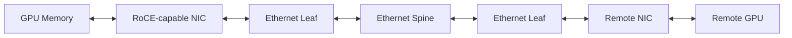

# Ethernet Architecture for AI

Enterprise Ethernet is familiar, routable, and broadly supported. AI workloads, however, create synchronized bursts, elephant flows, and sensitivity to tail latency. Building Ethernet for AI means engineering the complete fabric rather than attaching faster ports to a conventional data-center design.

## Learning Objectives

Explain the endpoint-to-switch path, distinguish service and compute networks, identify loss and congestion controls, and define validation layers.

## Big Picture

The path combines host PCIe, NIC DMA, Ethernet frames, IP routing, switch queues, congestion feedback, and communication-library selection.

## Network Roles

| Network | Traffic | Design emphasis |
|---|---|---|
| Management | BMC, SSH, provisioning | Reachability and security |
| Service | APIs, users, control planes | Availability and load balancing |
| Compute | RDMA and collectives | Latency, loss behavior, path balance |
| Storage | Datasets and checkpoints | Throughput, burst control, isolation |

Roles may share physical infrastructure, but shared queues and uplinks create interference. Separation can be physical or logical only when QoS behavior is tested.

## Fabric Requirements

A production AI Ethernet fabric needs sufficient bisection bandwidth, predictable ECMP path distribution, consistent MTU, qualified optics and cables, queue design, telemetry, and a compatible endpoint stack. RoCE introduces RDMA semantics; priority flow control and ECN-based congestion control manage specific loss and queueing risks.

## Production Design

Start with the communication matrix and job size. Model normal and failure-state oversubscription. Pair GPUs and NICs by locality. Standardize firmware and driver versions. Benchmark host TCP, host RDMA, GPU RDMA, collectives, and applications separately.

## Troubleshooting

**Symptom:** links are up and ping works, but NCCL uses sockets or performs poorly.

Inspect RDMA device state, GID selection, VLAN and priority mapping, MTU, PFC/ECN configuration, routing, GPU/NIC locality, and library transport logs. Basic IP reachability proves only a small part of the path.

## Customer Perspective

Ethernet can align with enterprise standards and shared operations, but AI-grade behavior requires specialized design and validation. Avoid promising that existing campus or general-purpose leaf-spine networks can absorb synchronized GPU traffic without analysis.

## Interview Preparation

**Question:** What makes an Ethernet network an AI fabric?

A strong answer covers RDMA, loss and congestion engineering, high bisection bandwidth, path diversity, endpoint locality, telemetry, qualified software, workload-aware validation, and operations.

## Key Takeaways

- AI Ethernet is an engineered system, not only faster links.
- Compute traffic differs from management and service traffic.
- RDMA, QoS, routing, topology, and endpoint configuration must align.
- Validate from physical link through application collectives.

## Cross References

- [Volume 09 Introduction](./index)
- [Next: RoCEv2](./chapter-03-rocev2-and-rdma-over-ethernet)
