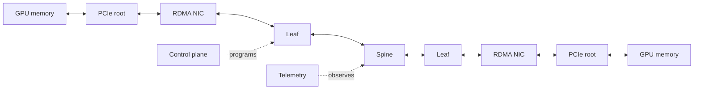
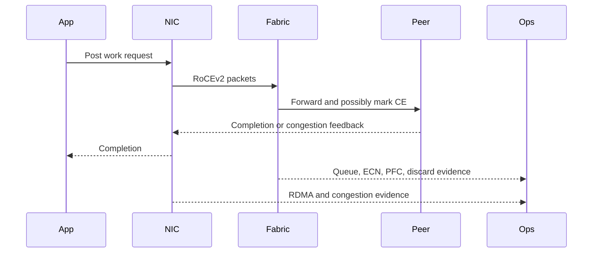
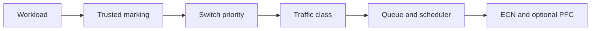
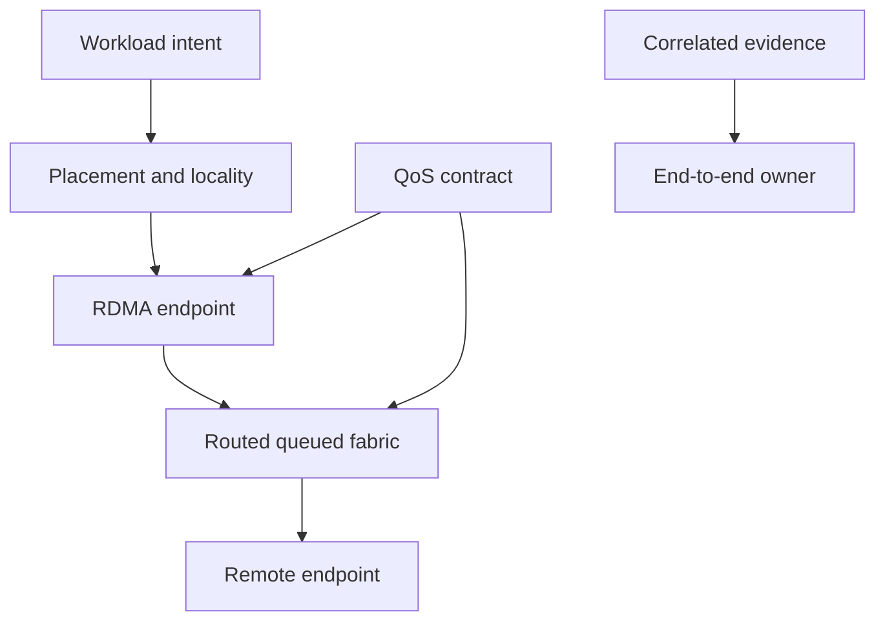

# Ethernet Architecture for AI

A platform team can own GPUs, a network team can own switches, and both can meet their local standards while the application still fails. AI Ethernet crosses ownership domains: GPU placement, PCIe locality, adapter policy, host routing, switch queues, congestion feedback, and collective software must describe the same intended path.

This chapter builds that shared architecture. Chapter 03 will open the RoCEv2 packet and memory path; Chapters 04 and 05 will examine its protection and feedback loops.

## Chapter Metadata

| Field | Value |
|---|---|
| Difficulty | Advanced |
| Estimated reading time | 60–75 minutes |
| Prerequisites | Chapter 01; leaf-spine and IP-routing fundamentals |
| Scope | Planes, components, paths, ownership, and validation boundaries |
| Out of scope | Product-specific switch internals and exact threshold values |

## Learning Objectives

You will be able to:

- separate management, service, storage, and compute network requirements;
- trace data and control responsibilities across host, adapter, and fabric;
- reason about routed Clos, ECMP, locality, and failure-state capacity;
- define an end-to-end QoS contract and trust boundary;
- compare physical separation with controlled convergence;
- design a layered acceptance and troubleshooting process.

## Big-Picture Architecture

**Figure 9.2.1 — The useful path starts in memory and includes host locality, the adapter, routed queues, and the remote endpoint.**

## Four Planes, Four Failure Models

| Plane | Typical traffic | Primary goal | Unsafe coupling |
|---|---|---|---|
| Out-of-band management | BMC, console, recovery | Reachability during failure | Sharing a paused compute path |
| Service/control | API, orchestration, DNS, scheduling | Availability and bounded latency | Competing in the RoCE queue |
| Compute | RDMA collectives | Predictable throughput and tails | Chronic oversubscription or marking drift |
| Storage | Dataset and checkpoint movement | Sustained throughput and burst control | Unbounded fan-in against compute |

Physical separation provides clear capacity and fault boundaries at higher cost. Logical separation can be efficient only when classification, scheduling, buffers, and failure behavior are validated. A VLAN creates a forwarding boundary; it does not automatically create a queue or capacity boundary.

## Component Responsibilities

| Component | Data-plane responsibility | Control/operational responsibility |
|---|---|---|
| Application/collective library | Select communication pattern and buffers | Expose selected transport and timing |
| GPU/host memory subsystem | Supply or consume data | Preserve locality and registration lifecycle |
| RDMA adapter | DMA, QPs, packetization, completion, congestion response | Firmware/profile qualification and counters |
| Host network | Addressing, VLAN, route, MTU, marking | Stable names, policy, device access |
| Leaf/spine fabric | Forward, queue, mark, schedule, pause | Routing, QoS, telemetry, change control |
| Orchestrator | Place workers and assign devices | Respect topology and admission envelope |
| Observability system | Correlate endpoint, fabric, and job signals | Retain baselines, versions, and event time |

An incident becomes slow when each team can prove only its own row.

## The Data and Control Paths

The data path moves payload. The feedback path carries congestion evidence. The management path programs policy. The observability path must remain usable when the data path is unhealthy.

## Routed Clos and ECMP

A routed leaf-spine fabric provides multiple equal-cost paths and limits layer-2 failure domains. RoCEv2 can cross IP routers because it is carried over UDP/IP. Routing does not guarantee balanced use: a hash assigns flows, not bytes, and a small number of large flows can collide on one member.

Design questions include:

- Is there enough ECMP entropy in the workload?
- Does a flow remain on one path, and how is reordering handled?
- What is oversubscription at leaf, spine, and failure state?
- Does losing a spine preserve the workload’s acceptance target?
- Can placement reduce traffic across constrained tiers?

Adaptive routing and product behavior belong to later chapters. Here, retain the invariant: capacity calculations must match the actual forwarding behavior.

## Locality Before the Wire

The fabric cannot repair a slow host path. A GPU and NIC behind different CPU sockets can force data through inter-socket links. A collective may choose an unintended interface. A container may see a virtual function without the expected QoS or NUMA association.

Record:

- GPU, NIC, PCIe switch, and NUMA relationships;
- link width/speed and error state;
- RDMA device and network-interface mapping;
- address and GID entries;
- container/device assignment;
- selected collective interface and transport.

Volume 07 owns the deep host-path treatment; this volume uses that evidence as an input.

## The End-to-End QoS Contract

Every arrow must be explicit. DSCP and VLAN PCP are fields; internal switch priority and traffic class are device concepts. A policy must define where markings are trusted, translated, rewritten, and measured. Allowing tenants to assert a protected priority without edge enforcement creates a noisy-neighbor and availability risk.

## Architecture Trade-Offs

| Choice | Advantage | Cost or risk | Validate |
|---|---|---|---|
| Dedicated compute fabric | Clear capacity and blast radius | More ports, optics, operations | Recovery path and utilization |
| Converged fabric | Shared tooling and capacity | Cross-class interference | Simultaneous workload classes |
| Routed leaf-spine | Scale and path diversity | Hash imbalance and control complexity | Flow distribution and failure capacity |
| More traffic classes | Finer policy | Mapping drift and buffer fragmentation | End-to-end counters per class |
| Deep buffers | Burst absorption | Longer queues and hidden overload | Tail latency and ECN timing |
| Topology-aware placement | Less constrained traffic | Scheduler complexity | Stable device/topology metadata |

## Production Architecture Pattern

A common two-plane production design uses:

1. an independent management/recovery network;
2. a routed compute fabric with redundant leaf/spine paths;
3. a small, documented class model;
4. ECN-capable RoCEv2 endpoints and ECN-enabled queues;
5. PFC only on the qualified priority where required;
6. topology-aware placement and explicit workload admission;
7. streaming fabric telemetry plus endpoint and application evidence;
8. one versioned configuration source for host and switch intent.

The pattern is not universal. Storage can be physically separate, logically isolated, or scheduled away from collective peaks. The choice follows capacity, failure, and organizational requirements.

## Availability, Security, and Operations

### Availability

Model N, N-1, and maintenance capacity. Redundancy without spare bandwidth may preserve reachability while violating job performance. Define whether a failed job retries, resumes, or is rescheduled.

### Security

Restrict RDMA device access, isolate tenants, validate VF policy, and control QoS markings at trusted edges. Protect routing, LLDP/DCBX where used, and management APIs. Keep credentials and recovery services off the affected compute queue.

### Observability

Use a shared clock and topology identity. Port counters alone cannot relate a CE mark to a sender response or collective stall. Retain configuration and firmware versions with baselines.

### Cost and Maintainability

Minimize unique profiles. Heterogeneous adapters and switch generations multiply qualification combinations. Automation should verify intent continuously, not only render configuration.

## Validation Ladder

| Layer | Evidence | What success does not prove |
|---|---|---|
| Physical | Link state, negotiated mode, symbol/FEC evidence | Correct route or RDMA |
| IP | Neighbor, route, VLAN, MTU | Correct QP or queue |
| RDMA host memory | QP completion and errors | GPU path or collectives |
| GPU buffer | Expected direct path | Scale behavior |
| Collective | Bandwidth and tail distribution | Contention/failure behavior |
| Production envelope | Concurrent and failed-state results | Future unqualified changes |

Advance one layer at a time. Preserve the last-known-good evidence.

## Troubleshooting Scenario 1: Socket Fallback

**Symptom:** Links and ping are healthy, but collective logs show sockets or unexpectedly low performance.

**Diagnosis:** verify visible RDMA devices, interface/GID selection, route, MTU, permissions, GPU/NIC locality, and library transport logs. Run a host-memory RDMA test before a GPU-buffer test.

**Root cause examples:** missing device exposure, wrong interface, incompatible endpoint stack, or a policy that prevented RDMA selection.

**Resolution:** correct the first failed layer; do not tune fabric queues for a flow that never used RoCE.

**Verification:** capture the selected transport, successful RDMA completions, expected path, and a repeatable collective baseline.

**Prevention:** make transport/path assertion part of job startup and acceptance tests.

## Troubleshooting Scenario 2: One Rack Is Slow

**Symptom:** The same job is stable in one rack and tail-heavy when workers span a particular rack.

**Diagnosis:** compare locality, leaf uplink capacity, route/ECMP members, per-class mappings, queue/ECN/PFC evidence, errors, and software versions. Swap placements to see whether the symptom follows hosts or paths.

**Root cause examples:** failed spine member reducing capacity, mapping drift on one leaf, bad optic/error recovery, or heterogeneous adapter profile.

**Resolution:** isolate or repair the component, restore consistent intent, then reassess failure-state capacity.

**Verification:** run the identical placement matrix before and after, including concurrency.

**Prevention:** continuously compare intended and observed policy across racks.

## Customer Architecture Discussion

Ask the customer to draw three diagrams: physical topology, queue/class policy, and workload communication. Gaps between them reveal most hidden assumptions. Assign one accountable owner for each cross-domain invariant: MTU, marking, traffic-class mapping, congestion profile, device qualification, telemetry time, and acceptance tests.

## Interview Preparation

**Knowledge:** Why does a VLAN not provide performance isolation?  
Because it separates forwarding domains, not necessarily queues, schedulers, buffers, or uplink capacity.

**Architecture:** When would you physically separate storage and compute?  
When shared failure/capacity risk exceeds the cost of a second plane or QoS cannot prove the required isolation.

**Scenario:** Ping works but RoCE does not. Where do you start?  
At device visibility, GID/interface, route, VLAN, MTU, priority mapping, QP completion, then congestion—not at application tuning.

**Customer:** Who owns end-to-end QoS?  
Individual settings can have team owners, but one cross-functional contract and validation owner must cover the full path.

**Whiteboard:** Draw data, congestion-feedback, management, and telemetry paths. Explain how management survives compute-path failure.

## Architecture Summary

## Quick Revision Sheet

| Topic | Invariant |
|---|---|
| Planes | Management must survive compute failure |
| Routing | Reachability is not balance |
| Locality | Useful path begins before the NIC |
| QoS | Mark → priority → class → queue → policy |
| Capacity | Evaluate normal and failed topology |
| Validation | Physical → IP → RDMA → GPU → collective → contention |

## Interview Notes

- Name component owners and the shared invariants.
- Separate reachability, path selection, queueing, and application transport.
- Explain why logical isolation must be measured.
- Include failure-state capacity in every topology answer.
- Connect architecture to retained evidence.

## Lab Checklist

- [ ] Inventory GPU/NIC/NUMA topology.
- [ ] Record addresses, GIDs, routes, VLANs, and MTU.
- [ ] Trace marking to traffic class at each hop.
- [ ] Test normal and one-failure topology.
- [ ] Verify selected application transport.
- [ ] Retain endpoint, fabric, and application evidence on one timeline.

## Key Takeaways

- AI Ethernet is an end-to-end architecture across organizational boundaries.
- Physical, service, compute, and storage planes have different failure requirements.
- Routed Clos supplies path diversity; it does not guarantee balanced bytes.
- QoS is a contract from trusted marking to queue behavior.
- A layered validation ladder prevents application symptoms from driving random changes.

## Cross References

- [Previous: Why Ethernet for AI Is Different](./chapter-01-why-ethernet-for-ai-is-different)
- [Next: RoCEv2 and RDMA over Ethernet](./chapter-03-rocev2-and-rdma-over-ethernet)
- [Volume 07 — GPU Networking](pathname:///nvidia-zero-to-hero/volume-07/index)
- [Volume 08 — InfiniBand](pathname:///nvidia-zero-to-hero/volume-08/index)

## Further Reading

- [NVIDIA: RDMA over Converged Ethernet](https://docs.nvidia.com/networking/display/mlnxenv23102131201lts/rdma+over+converged+ethernet+(roce))
- [NVIDIA Cumulus Linux: RoCE](https://docs.nvidia.com/networking-ethernet-software/cumulus-linux-518/Layer-1-and-Switch-Ports/Quality-of-Service/RDMA-over-Converged-Ethernet-RoCE/)
- [RFC 3168: Explicit Congestion Notification](https://www.rfc-editor.org/rfc/rfc3168.html)
