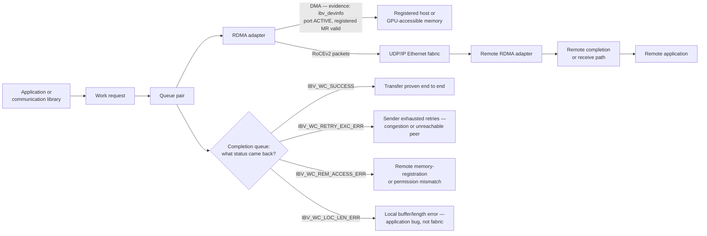
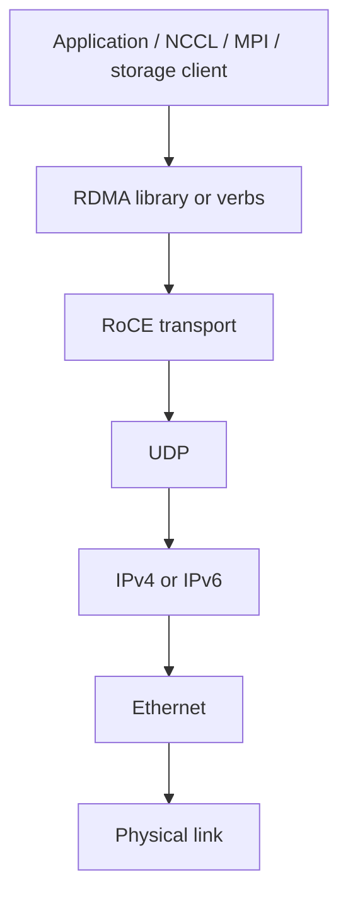
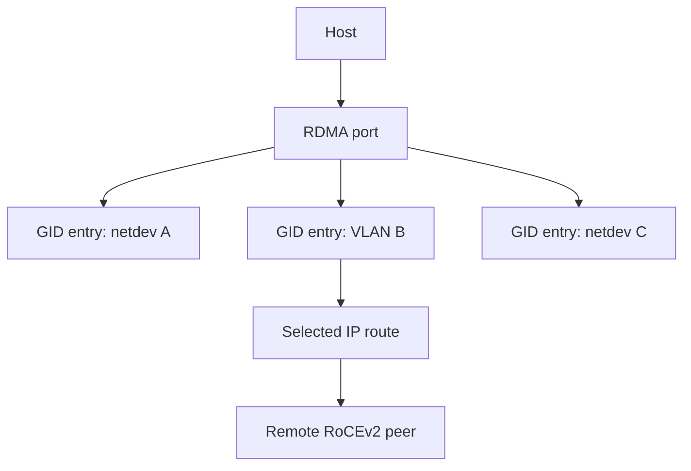

# RoCEv2 and RDMA over Ethernet

## Introduction

RDMA lets an application describe work to an RDMA-capable adapter rather than having the CPU copy each byte through the networking stack. That does not make memory access magical or unbounded: applications must establish the appropriate transport context, register memory, respect protection information, and handle completion and error state.

RoCEv2 carries RoCE traffic in UDP/IP over Ethernet, allowing routed Layer 3 designs. It preserves the need for precise endpoint and fabric configuration. A valid IP route is necessary, but it does not demonstrate that the selected RDMA device, GID context, queue pair, MTU, QoS policy, or congestion behavior is correct.

| Chapter field | Value |
|---|---|
| Difficulty | Advanced |
| Estimated reading time | 55–70 minutes |
| Prerequisites | Chapters 01–02; Volume 08, Chapters 03–04 |
| Focus | RDMA endpoint model, RoCEv2 encapsulation, addressing, and troubleshooting |
| Next | Priority Flow Control |

## Production Story: The Route Was Correct, the RDMA Path Was Not

After a network change, a host can reach its peers with ICMP and ordinary TCP. A distributed job still fails to establish one of its RDMA paths. The incident team focuses on the routing table because that is what ping exercised. The eventual fault is an inconsistent GID selection: one host selects an address context associated with the wrong interface.

The correction is not “use a different GID index everywhere.” GID-table ordering is configuration-dependent. The durable fix is an explicit, inventory-backed selection policy, validated against the actual device, port, network device, address family, and route used by the workload.

## Learning Objectives

After this chapter, you can:

- explain the relationship among memory registration, work queues, queue pairs, completions, and an RDMA adapter;
- describe how RoCEv2 uses UDP/IP over Ethernet and why that permits routed fabrics;
- identify the addressing and MTU facts needed to validate a RoCE path;
- distinguish host reachability from RDMA transport health;
- investigate common connection, performance, and wrong-interface failures without inventing product-specific defaults.

## What RDMA Changes—and What It Does Not

An RDMA application prepares buffers and posts work requests to queues associated with a queue pair (QP). The adapter executes the transfer protocol and DMA operations, while completion queues report completion status. The exact verbs, QP types, and library abstractions vary by workload; Volume 08 provides the detailed queue-pair model.



**Figure 9.3.1 — RDMA transfers are adapter-driven, but applications still own memory, queue, completion, and error semantics, and the completion status is where that ownership becomes diagnosable.** `IBV_WC_SUCCESS` is the only status that proves the transfer happened; every other completion code points at a different owner — `RETRY_EXC_ERR` toward the fabric/congestion, `REM_ACCESS_ERR` toward the remote application's memory registration, `LOC_LEN_ERR` toward the local caller's own buffer setup. Reading the wrong code as "the network is broken" sends the investigation to the wrong team.

RDMA does not remove the need for access control. A remote-memory operation relies on permissions established through memory registration and the application’s connection or control protocol. Protect access to RDMA devices and the control-plane information that distributes connection and memory details.

## How RoCEv2 Fits the Stack

RoCE is an RDMA transport over Ethernet. NVIDIA documentation describes RoCEv2 as IP-routable and using an IP header and UDP encapsulation for the RDMA transport packets. This enables Layer 3 forwarding between subnets when the endpoint and network configuration support the selected path.



**Figure 9.3.2 — RoCEv2 places RDMA transport packets in UDP/IP over Ethernet.** This is an encapsulation and forwarding model, not a promise that any routed Ethernet path has the needed congestion behavior.

### Reliability, loss, and ordering

Avoid the oversimplification that RoCE “has no reliability” or that a fabric can ignore loss because the adapter will solve it. Transport behavior depends on the QP type and implementation. For the reliable connected model commonly discussed for loss-sensitive workloads, loss and congestion can lead to retries, timeouts, or degraded application behavior. Operators should validate the behavior of their exact adapter, driver, library, and workload rather than infer it from a generic command output.

The architectural response is to prevent avoidable queue overflow through capacity, traffic-class design, ECN-based congestion control, and carefully scoped PFC where required by the approved design. Chapter 04 explains the link-level pause mechanism; Chapter 05 explains ECN and DCQCN.

For a deployed RoCE congestion-control profile, a receiver that observes ECN-marked traffic returns the applicable congestion notification packet (CNP) to the sender, which can then adjust injection rate. Exact packet handling, counters, and configuration controls are implementation- and release-specific; validate them as one endpoint-and-fabric profile.

## Addressing: GIDs, Network Devices, and Routes

An RDMA port exposes Global Identifier (GID) entries. For RoCE ports, NVIDIA documents that GID-table entries are associated with IP configuration and expose a GID value, type, and network device. A host with multiple NIC ports, VLANs, addresses, address families, or virtual functions can therefore have multiple usable-looking entries.



**Figure 9.3.3 — The GID index is a local table position, not a portable identity.** Validate the GID value, type, associated network device, and route together.

**Illustrative annotated GID table — the "local table position, not a portable identity" claim, made concrete:**

```text
$ show_gids
DEV     PORT    INDEX   GID                                     IPv4            VER     DEV
------  ----    -----   ---                                     ------------    ---     ---
mlx5_0  1       0       fe80:0000:0000:0000:...                 n/a             v1      eth0
mlx5_0  1       1       0000:0000:0000:0000:0000:ffff:0a14:040f 10.20.4.15      v2      eth0
mlx5_0  1       2       0000:0000:0000:0000:0000:ffff:0a14:040f 10.20.4.15      v2      eth0.100
mlx5_0  1       3       fe80:0000:0000:0000:...                 n/a             v1      eth0.100
```

Reading this the way the chapter's diagnostic-questions list requires: index `0` is a link-local RoCEv1 entry (rarely what a routed RoCEv2 job wants). Index `1` is the RoCEv2 entry on the base interface — `VER v2` and a real IPv4 mapping confirm it's usable for a routed path. Index `2` looks almost identical but is bound to VLAN interface `eth0.100`, not `eth0` — same IP, different L2 context, different QoS trust boundary. An application hard-coding "GID index 1" on this host and "GID index 1" on a peer host with a different interface order would silently select two different network contexts — this is exactly the "wrong GID selection" fault from this chapter's production story, and it produces no error until the two ends' priority mapping or route disagrees.

### The right diagnostic questions

For a failed or unexpected path, record:

- RDMA device and physical port selected by the application;
- GID value, GID type, index, and associated network device;
- source address, destination address, and active route;
- VLAN or other L2 context, plus the intended QoS classification;
- endpoint MTU and the effective MTU across every routed hop;
- adapter, driver, firmware, and library version from the qualified profile.

Do not hard-code an index merely because it worked on another host. Automate a policy that selects a verified semantic context, and test it after provisioning or network changes.

### RoCEv2 design consequences

| Property | Operational consequence |
|---|---|
| UDP/IP encapsulation | Layer 3 routing and address selection become part of transport diagnosis |
| Adapter-managed RDMA | CPU packet-path observations alone can be incomplete |
| Per-port GID table | Inventory must capture the selected context, not just an adapter name |
| Ethernet forwarding | MTU, QoS, queueing, and congestion policy remain end-to-end obligations |

RoCEv2 therefore fits naturally into a routed fabric, but it is not equivalent to ordinary UDP application traffic. The adapter, host policy, and switches must agree on the selected path and its treatment.

## MTU and QoS Are Path Properties

NVIDIA documents that the regular Ethernet MTU applies to the RoCE frame. An interface configured for a large MTU does not prove that the full route supports it. VLAN interfaces, routed links, switch ports, tunnels, and endpoint policies can create an inconsistent path.

QoS is similarly end to end. The host must classify the flow, the network must trust or remark it according to policy, and every switch must map the resulting class into the intended queue. Chapters 04 and 05 cover the detailed mechanisms; this chapter’s operational rule is to validate the effective behavior rather than only configuration snippets.

| Check | Why it matters | Evidence to retain |
|---|---|---|
| Selected device and GID | Avoids wrong interface/address context | Endpoint support bundle |
| Route and peer address | Proves intended Layer 3 path | Route and neighbor state |
| MTU on every hop | Avoids path-specific failures | Host and switch effective configuration |
| QoS class | Determines queue and protection behavior | Host marking plus switch counters |
| RDMA completion status | Identifies transport-level failure | Application/RDMA diagnostic output |

## Production Deployment Pattern

1. Define a dedicated, documented address plan for the compute role.
2. Build inventory that maps node, adapter, port, network device, VLAN/IP context, rail, and switch port.
3. Deploy a qualified firmware, driver, operating-system, and communication-library combination.
4. Standardize MTU and QoS policy across the intended end-to-end path.
5. Validate host-memory RDMA first, then GPU-aware and collective communication.
6. Capture endpoint and fabric counters during a contention test.
7. Revalidate after changes to routing, QoS, firmware, driver, or node image.

Product-specific configuration commands and exact counter names differ by operating system and release. Use current vendor documentation and test in a representative environment; documentation examples are not a substitute for the deployed configuration’s effective state.

## Production Troubleshooting

### Scenario 1 — Ping works, but RDMA connection setup fails

**Symptoms:** ICMP and TCP connectivity are healthy; an RDMA test cannot establish or complete its expected operation.

**Diagnosis:** compare both endpoints’ selected RDMA device, port, GID value/type/index, associated network device, source route, VLAN context, and MTU. Then inspect RDMA completion or connection-manager errors and relevant switch counters.

**Likely root causes:** wrong GID context, incorrect device selection, route mismatch, MTU inconsistency, missing RDMA access, or an unqualified endpoint stack.

**Evidence in practice:**

```text
$ ib_write_bw -d mlx5_0 -x 2 -F --report_gbits <peer-ip>
---------------------------------------------------------------------------------------
                    RDMA_Write BW Test
 Dual-port       : OFF          Device         : mlx5_0
 Number of qps   : 1            Transport type : IB
 Connection type : RC           Using SRQ      : OFF
 CQ Moderation   : 100
 Mtu             : 4096[B]
Local address:  LID 0000 QPN 0x012a PSN 0x8f2c1 GID: fe80::...
Remote address: LID 0000 QPN 0x0000 PSN 0x00000 GID: 0000:0000:0000:0000:0000:ffff:0a14:...
Failed to modify QP to RTR
```

`-x 2` selected GID index 2 explicitly (this host's VLAN-bound entry). `Failed to modify QP to RTR` (Ready-to-Receive) with the remote GID showing all zeros means the connection manager never completed the handshake — the local side prepared a queue pair but never got a usable address back from the peer. Cross-checking the peer's own `show_gids` output revealed its index 2 was a *different* VLAN's entry than this host's — same index number, different semantic context, exactly the "table position, not identity" trap. Switching to the index that both hosts confirmed pointed at the shared RoCEv2 VLAN fixed the handshake immediately.

**Resolution and verification:** correct the specific mismatch, validate a minimal host-memory test, then validate the application path. A successful ping alone is not closure evidence — closure here was `ib_write_bw` completing with a reported bandwidth figure and `RTR`/`RTS` transitions succeeding, not just the process exiting.

**Prevention:** include semantic GID and device validation in provisioning tests and retain it in support bundles.

### Scenario 2 — One rail is slow, but links are healthy

**Symptoms:** performance differs by NIC port or rail; links show no physical errors; some ranks become stragglers.

**Diagnosis:** compare GPU/NIC locality, selected interfaces, routes, MTU, QoS markings, and queue counters by rail. Verify that placement and cabling match the source of truth.

**Likely root causes:** wrong endpoint mapping, asymmetric path capacity, QoS drift, or a host topology mismatch.

**Resolution and verification:** restore the intended rail mapping and policy; repeat the same collective with rail-specific telemetry. Confirm that the straggler pattern disappears rather than relying on aggregate throughput.

**Prevention:** make rail labels, host topology, and interface selection machine-readable and continuously audited.

### Scenario 3 — Low throughput without obvious packet drops

**Symptoms:** RDMA operations complete but a workload is slower than its baseline; interface counters are unremarkable.

**Diagnosis:** inspect queue occupancy, ECN marks, PFC activity, endpoint congestion signals where exposed, active paths, and concurrent workloads. Compare the result with the baseline’s topology and software profile.

**Likely root cause:** congestion or pause propagation is increasing tail latency without a visible interface-level drop.

**Evidence in practice:**

```text
$ ethtool -S mlx5_0 | egrep "out_of_buffer|discard|rx_prio3_bytes"
     rx_prio3_bytes:          482991823104
     out_of_buffer:           0
     rx_discards_phy:         0

$ mlnx_perf -i eth0 -t 1
  rx_bytes: 4.12 Gb/s   tx_bytes: 3.98 Gb/s        <- looks fine at 1-second granularity
  rx_prio3_congestion_events: 118                   <- but congestion events are non-zero every sample
```

Interface counters (`out_of_buffer`, `rx_discards_phy`) staying at `0` confirm the "no obvious packet drops" symptom is accurate — nothing is being lost at this NIC. But `rx_prio3_congestion_events` incrementing every one-second sample means the endpoint is repeatedly hitting its own congestion-notification path even though nothing drops, which matches "workload is slower than baseline with unremarkable interface counters" precisely: the cost is showing up as completion latency and CNP-driven rate throttling, not as any counter a basic link-health dashboard would surface.

**Resolution and verification:** find and correct the first congested resource, then repeat a controlled concurrency test and confirm both application and queue evidence improve — specifically, `rx_prio3_congestion_events` per sampling window should drop toward the idle baseline alongside the application's throughput recovering.

**Prevention:** monitor queue and endpoint signals in addition to port utilization.

## Customer Architecture Discussion

RoCEv2 is attractive when an organization wants RDMA semantics over a routed Ethernet design, but it shifts discipline into endpoint and QoS consistency. A customer should receive an explicit support model: which adapter and software profiles are approved, how address contexts are selected, where PFC and ECN policy applies, what evidence must accompany a change, and how a support engineer collects the relevant path state.

This is also a security discussion. Limit which workloads can access RDMA devices; protect management interfaces and automation credentials; and treat memory-registration and connection setup data as sensitive platform state. Network reachability is not authorization.

## Interview Preparation

### Knowledge questions

**1. Why can one RoCE port expose several GID entries?**

"Because the GID table reflects every IP-bearing context that port can see — the base interface, any VLAN sub-interfaces, multiple address families, and both RoCEv1 and RoCEv2 variants where applicable. I've pulled `show_gids` on a host and seen four entries for one physical port: a link-local v1 entry, a routable v2 entry on the base interface, and two more once a VLAN was added. None of those is 'the' GID for the port — they're all valid table entries for different network contexts, and picking the right one for a given job means matching the entry's `VER` and interface, not just grabbing index 0."

**2. What does RoCEv2 add that enables routed designs?**

"RoCEv1 puts RDMA transport directly in an Ethernet frame — no IP header at all, so it can't cross a router. RoCEv2 wraps the same RDMA transport packets in UDP over IP, which means it inherits normal Layer 3 forwarding — it can be routed across subnets like any other IP traffic. That's the whole value proposition: RoCEv2 turns RDMA from something that only works within one broadcast domain into something that fits a routed leaf-spine fabric, at the cost of now needing IP addressing, routing, and QoS marking to all be correct end to end — none of which RoCEv1 had to worry about."

**3. Why is the GID index alone insufficient for automation?**

"Because the index is a position in a table that gets built in whatever order the kernel discovers interfaces and addresses — it's not a stable identity. I've seen two hosts where index 1 meant completely different things: on one it was the base interface's RoCEv2 entry, on the other it was a VLAN entry that got created first. If automation hard-codes 'use GID index 1' across a fleet, it will work on some hosts by coincidence and silently select the wrong network context on others — no error, just traffic going out over the wrong VLAN or address family. The fix is to select by the semantic fields — VER, interface name, address — and resolve those to whatever index they currently occupy, every time."

### Architecture questions

**1. Draw the endpoint and network layers involved in a GPU-to-GPU RoCEv2 transfer.**

"I'd draw it bottom-up while I talk: GPU memory, then a PCIe hop to the NIC — that hop has its own locality question, is it `PIX` or does it cross NUMA. Then the NIC's queue pair and work-request layer, where the application's request becomes hardware-tracked state. Then RoCEv2 encapsulation — RDMA transport wrapped in UDP wrapped in IP wrapped in an Ethernet frame — crossing the leaf-spine fabric with its own routing and QoS treatment. Then the mirror image on the remote side: NIC, PCIe, remote GPU memory. The point I'd make while drawing it is that 'GPU-to-GPU' is doing a lot of work in that phrase — there are at least six layers between the two GPUs, and a failure at any one of them looks identical from the application's point of view: the transfer just doesn't complete."

**2. Define the source-of-truth fields needed to diagnose a wrong-interface problem.**

"At minimum: the RDMA device and port name, the GID value/type/index and its associated network device, the source and destination IP and the active route, any VLAN or L2 context, the intended QoS classification, and the effective MTU across the path. I'd insist all of that be captured per-host in an inventory system, not reconstructed from memory during an incident — because 'wrong interface' problems are, by definition, cases where the assumption in someone's head didn't match the actual table state, and the only way to catch that fast is to have the actual table state written down beforehand."

### Scenario question

**Ping succeeds after a VLAN change, but a distributed workload fails. Walk through the evidence that separates IP reachability, GID selection, MTU, QoS, RDMA transport, and GPU locality.**

"Ping succeeding tells me ICMP round-trips over whatever route the kernel picked — that's it. So I'd start one layer down: `rdma link show` and `show_gids` on both hosts, comparing which GID index each side is actually using and whether they agree on VER and VLAN context — a VLAN change is exactly the kind of event that reshuffles GID table order, which is my leading hypothesis here. Next I'd check MTU on every hop the VLAN traverses, since a VLAN change can silently introduce a smaller MTU on one segment that ICMP's default small packets never exercise. Then QoS — did the VLAN change move this traffic into a different DSCP/PCP mapping, landing it in an unexpected queue. Then I'd run a host-memory `ib_write_bw` test to isolate RDMA transport health from the application layer entirely — if that fails, it's not a GPU problem. Only if host-memory RDMA succeeds would I look at GPU/NIC locality, because at that point IP, GID, MTU, QoS, and RDMA transport are all already proven healthy, and GPU locality is the remaining unproven layer."

## Architecture Summary

RoCEv2 joins an RDMA endpoint model to routed UDP/IP Ethernet. Its operational correctness depends on the selected endpoint context and the effective end-to-end path. Addressing, MTU, QoS, congestion policy, and qualified software are all part of that path.

## Key Takeaways

- RDMA is adapter-driven, but applications retain memory, queue, completion, and protection responsibilities.
- RoCEv2 uses UDP/IP over Ethernet and can operate in routed Layer 3 designs.
- GID index is local and configuration-dependent; validate its semantic context.
- IP reachability does not prove RDMA, QoS, or collective health.
- Diagnose with endpoint, route, queue, and application evidence captured together.

## Quick Revision Sheet

| Concept | Remember |
|---|---|
| Work request | Application description of adapter work |
| Queue pair | Transport queue context used by RDMA operations |
| Completion queue | Reports completed work and errors |
| RoCEv2 | RoCE carried in UDP/IP over Ethernet |
| GID entry | RDMA port address context with value, type, and network-device association |
| Effective MTU | MTU supported by the complete selected path |

## Lab Checklist

Before moving on, confirm that you can:

- map an application-selected RDMA device and port to its network device;
- inspect GID values, types, and associated devices without assuming index order;
- prove an effective route, MTU, and QoS class for a RoCE path;
- isolate a host-memory RDMA test from GPU and collective layers during diagnosis.

## Cross References

- Previous: [Ethernet Architecture for AI](./chapter-02-ethernet-architecture-for-ai)
- Next: [Priority Flow Control](./chapter-04-priority-flow-control)
- Related: [DMA, RDMA, and Peer-to-Peer](../volume-07/chapter-04-dma-rdma-and-peer-to-peer)
- Related: [Verbs, Queue Pairs, and Completion Queues](../volume-08/chapter-03-verbs-queue-pairs-and-completion-queues)
- Related: [LIDs, GIDs, P_Keys, and Addressing](../volume-08/chapter-04-lids-gids-pkeys-and-addressing)

## Further Reading

- [NVIDIA: RDMA over Converged Ethernet (RoCE)](https://docs.nvidia.com/networking/display/mlnxofedv23100540/rdma%2Bover%2Bconverged%2Bethernet%2B%28roce%29)
- [NVIDIA MLNX_OFED documentation: GID tables and RoCE modes](https://docs.nvidia.com/networking/display/nvidia-mlnx-ofed-documentation-v24-10-2-1-8-0-lts-2024-lts-u2.pdf)
- [RFC 5040: Remote Direct Memory Access Protocol Specification](https://www.rfc-editor.org/rfc/rfc5040.html)
