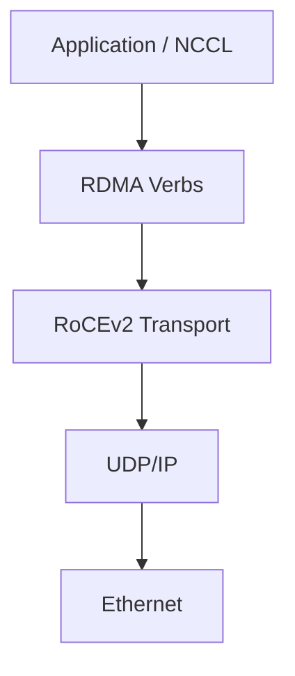

# RoCEv2 and RDMA over Ethernet

RoCE carries RDMA semantics over Ethernet. RoCEv2 encapsulates transport over UDP/IP, enabling routed designs. It preserves the queue-pair and registered-memory model while depending on Ethernet and IP configuration for forwarding and congestion behavior.

## Learning Objectives

Explain the RoCEv2 stack, GID selection, UDP/IP routing, MTU, and why ordinary IP connectivity does not prove RDMA health.

## Stack

Applications post work to queue pairs. The adapter performs DMA and packet processing. The fabric forwards IP packets while QoS and congestion mechanisms preserve acceptable behavior for RDMA traffic.

## Addressing

RoCE endpoints expose GIDs derived from network interfaces and address configuration. Hosts with several VLANs, addresses, or ports can have several GID entries. Selecting the wrong index may send traffic through an unintended interface or fail to match the remote path.

MTU must be consistent across the complete route. A large interface MTU on the host is insufficient if a VLAN, routed hop, or switch port differs.

## Loss and Congestion

RoCE transports are sensitive to packet loss and reordering depending on implementation and workload. AI designs commonly combine priority flow control for a selected traffic class with ECN-based congestion control. These mechanisms require consistent endpoint and switch configuration.

| Layer | Validation |
|---|---|
| IP | Route and neighbor reachability |
| VLAN/priority | Correct traffic-class mapping |
| MTU | End-to-end consistency |
| RDMA | QP operation and completion status |
| Congestion | ECN marks, rate response, queue depth |
| Application | GPU-buffer and collective performance |

## Production Design

Use dedicated address plans and clear interface naming. Preserve GID mappings in support bundles. Avoid enabling PFC on every priority. Qualify NIC firmware, driver, switch software, and congestion profiles together.

## Troubleshooting

**Symptoms:** RDMA connection failures, retries, low throughput, or traffic using the wrong port.

Check GID selection, VLAN membership, routing, MTU, priority marking, PFC/ECN, NIC counters, switch queues, and completion errors. Compare a minimal host-memory RDMA test before adding GPU buffers.

## Customer Perspective

RoCE provides routable RDMA on Ethernet, but the operational burden moves into consistent QoS and congestion engineering. Existing Ethernet skills remain useful, while AI traffic requires additional discipline.

## Interview Preparation

**Question:** Why can ping succeed while RoCE fails?

Ping uses different payloads, queues, MTU behavior, priorities, and transport semantics. It does not validate queue pairs, GID selection, registered memory, or congestion configuration.

## Key Takeaways

- RoCEv2 carries RDMA over UDP/IP and Ethernet.
- GID, route, VLAN, priority, and MTU must align.
- IP reachability is necessary but not sufficient.
- Endpoint and switch congestion settings form one system.

## Cross References

- [Ethernet Architecture for AI](./chapter-02-ethernet-architecture-for-ai)
- [Next: Priority Flow Control](./chapter-04-priority-flow-control)
