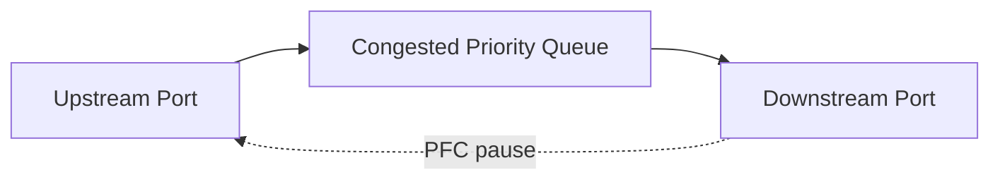

# Priority Flow Control

Priority Flow Control (PFC) pauses a selected Ethernet priority instead of stopping all traffic on a link. It is commonly used to protect a RoCE traffic class from buffer loss. PFC solves a narrow problem: temporary downstream buffer exhaustion. It does not provide bandwidth, fairness, or congestion avoidance.

## Learning Objectives

Explain PFC pause behavior, priority mapping, head-of-line blocking, pause storms, and safe deployment boundaries.

## Pause Flow

When a queue crosses a configured threshold, the receiver asks the upstream transmitter to pause that priority. If congestion persists, pause can propagate hop by hop.

## Why Selective Pause Exists

Classic link-level pause can stop all traffic. PFC separates priorities so RDMA traffic can pause while management or other classes continue. This requires identical classification across hosts and switches.

| Risk | Cause |
|---|---|
| Head-of-line blocking | Unrelated flows share the paused priority |
| Pause propagation | Persistent downstream congestion |
| PFC storm | Misconfiguration or pathological traffic |
| Deadlock | Cyclic buffer dependencies |
| Hidden oversubscription | Pause masks insufficient capacity |

## Production Design

Enable PFC only on the required traffic class. Map DSCP/PCP consistently. Configure headroom based on link speed, cable distance, device reaction time, and switch architecture. Combine PFC with ECN-based congestion control so sources reduce rate before pause becomes sustained.

Monitor pause frames, pause duration, queue occupancy, drops, and affected applications. A small number of transient pause frames may be normal; sustained pause indicates congestion or design failure.

## Troubleshooting

**Symptoms:** unrelated RDMA jobs stall, one switch port reports continuous pause, or throughput collapses without packet loss.

Find the first congested egress, trace pause upstream, inspect priority mapping, and identify the receiver or oversubscribed link. Disabling PFC blindly may convert stalls into packet loss and retries.

## Customer Scenario

A customer enables PFC on every priority to make the fabric “lossless.” A storage burst pauses management and service traffic. The corrected design isolates one RoCE priority, uses ECN, and separates critical control traffic.

## Interview Preparation

**Question:** Why is PFC not congestion control?

It stops transmission after queue pressure appears. Congestion control changes source rate to match capacity and prevent persistent queue buildup.

## Key Takeaways

- PFC is selective link-level pause.
- It protects a traffic class but can spread backpressure.
- Consistent classification and headroom are mandatory.
- ECN and capacity design should minimize sustained pause.

## Cross References

- [RoCEv2](./chapter-03-rocev2-and-rdma-over-ethernet)
- [Next: ECN and DCQCN](./chapter-05-ecn-and-dcqcn)
