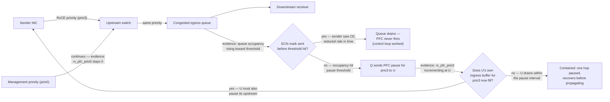
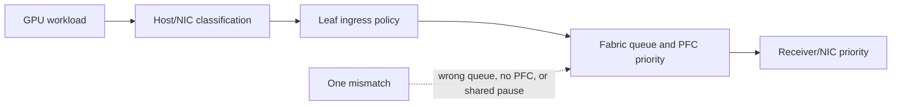

# Priority Flow Control

## Introduction

An all-to-all training run begins to slow down. Link errors and packet-drop counters are quiet, but one receiver-facing port is sending pause frames continuously. Within seconds, upstream ports pause the same priority and unrelated GPU workers wait. The incident is not a link failure; it is backpressure spreading through a fabric.

Priority Flow Control (PFC) is one containment mechanism for this condition. It can stop transmission for one Ethernet priority on a full-duplex link, buying a downstream receiver time to drain its buffer. It is deliberately local and reactive. It does not discover the bottleneck, choose another path, allocate fairness, or add capacity.

| Chapter field | Value |
|---|---|
| Difficulty | Advanced |
| Estimated reading time | 45–55 minutes |
| Prerequisites | [RoCEv2 and RDMA over Ethernet](./chapter-03-rocev2-and-rdma-over-ethernet) |
| Primary focus | Per-priority pause, headroom, and failure containment |
| Next | [ECN and DCQCN](./chapter-05-ecn-and-dcqcn) |

## Learning Objectives

After completing this chapter, you will be able to:

- distinguish PFC from link-wide PAUSE and end-to-end congestion control;
- trace pause propagation to the congested egress queue;
- explain why classification and headroom must be consistent at every hop;
- recognize head-of-line blocking, deadlock, and pause storms;
- deploy PFC as a narrowly scoped safeguard and investigate sustained pause.

## Why Selective Pause Exists

Ordinary Ethernet may drop when a receive queue overflows. A loss-sensitive transport can recover, but the recovery and its application-level effect may be unacceptable for a synchronized workload. IEEE priority-based flow control extends the link-local PAUSE idea so one traffic class can be stopped while other priorities continue. It applies to point-to-point, full-duplex Ethernet links; a pause request has no direct visibility beyond its immediate neighbor.

For a RoCE design, PFC is usually associated with the specifically selected RoCE priority. The word *usually* matters: whether it is needed, the priority used, and the threshold values are qualified properties of the endpoint, switch, topology, and software profile. Do not convert every traffic class into a lossless class merely because it might carry important traffic.



**Figure 9.4.1 — PFC is hop-local, but buffer pressure can move upstream, and the diagram now shows the two branch points that decide whether it stays contained.** The first branch is whether ECN did its job before the queue hit the pause threshold at all — that's the healthy path, and it should be the common case. The second branch, only reached if PFC actually fires, is whether the pause drains within one interval or forces the upstream switch to pause its own upstream neighbor — that's the difference between a contained, forgettable event and a pause tree. `rx_pfc_prio0` staying at zero throughout is the concrete evidence that management traffic's isolation held.

## The Mechanism: A Receiver Protects Its Buffer

PFC controls transmission in the direction opposite the data flow. A receiving port observes pressure for a priority and sends a MAC control frame requesting that priority be paused for a specified interval. Its neighbor stops sending that priority on that link until the interval expires or a subsequent control frame changes the request. The neighbor can continue transmitting other priorities.

The crucial distinction is between **priority** and **flow**. PFC pauses every flow mapped to that priority on that link. A single incast flow can therefore delay a healthy flow that happens to share its class. PFC is selective relative to other priorities, not selective relative to individual applications.

### Pause propagation

If a downstream egress cannot drain, its upstream ingress buffer fills. The upstream device then may pause its own upstream neighbor for the same class. This chain can continue across the fabric.

| Event | Local effect | Fabric risk |
|---|---|---|
| Brief egress burst | One port pauses one priority | Often recoverable transient |
| Persistent destination bottleneck | Queue remains occupied | Pause tree grows upstream |
| Shared priority | Innocent flows are held | Head-of-line blocking |
| Cyclic dependency | Queues wait on one another | Deadlock or prolonged outage |
| PFC everywhere | Broad pause domain | Operational blast radius expands |

PFC has done what it was designed to do when it protects a queue from immediate loss during a short burst. Sustained pause is evidence, not success: it says the fabric is carrying more offered load toward that queue than it can drain.

## Classification Is the Contract

A packet must retain its intended class from source NIC through each switch and into the destination. Deployments may use VLAN PCP, DSCP, or an internal QoS classification policy; the exact mechanism is less important than proving the mapping end to end. A host marking, a NIC trust mode, a switch ingress rewrite, or a routed-hop policy can all change the resulting queue.



Before changing thresholds, verify the contract with packet evidence and counters:

1. identify the workload's ingress marking;
2. document the host priority or traffic-class mapping;
3. verify each switch maps that marking to the intended queue and PFC priority;
4. verify the destination uses a compatible mapping; and
5. confirm management, routing, storage, and best-effort traffic do not accidentally share the RoCE pause class.

This is the foundation for Chapter 06. QoS is not a list of values copied from an example configuration; it is a testable behavioral contract.

## Headroom and Threshold Design

After a port emits a pause request, packets already in flight can still arrive. The receiving device needs enough dedicated headroom to absorb that arrival window, plus implementation-specific reaction time and serialization effects. Link speed, path length, media, queue architecture, and device behavior affect the calculation. The correct values are platform-specific; use a supported switch and adapter profile rather than inventing a universal buffer number.

Thresholds must provide room before loss while avoiding an unnecessarily large pause domain. A threshold that triggers too late risks overflow. One that triggers too early can cause frequent pause and waste usable buffering. Changing a headroom setting without knowing which pool, port group, and traffic class consumes it can shift the problem rather than solve it.

| Design question | Evidence to collect |
|---|---|
| Is PFC enabled only where needed? | Per-port, per-priority configuration export |
| Is the class isolated? | Queue mapping and packet marking captures |
| Is headroom appropriate? | Vendor-qualified profile and queue telemetry |
| Is pause transient? | Pause-frame deltas and duration over workload windows |
| Is there a root bottleneck? | Egress utilization, queue occupancy, route and job placement |

**Illustrative annotated output — headroom and threshold configuration, read the way the design-question table above expects:**

```text
$ mlnx_qos -i swp12
Priority trust state: pcp
Receive buffer size (bytes): 262144, 262144, 262144, ...
PFC configuration:
        priority    0   1   2   3   4   5   6   7
        enabled     0   0   0   1   0   0   0   0
        buffer      0   0   0   1   0   0   0   0

Buffer size assigned to priority 3: 65536 bytes
Xoff threshold: 49152 bytes   (75% of buffer)
Xon threshold:  32768 bytes   (50% of buffer)
```

`enabled` on priority 3 only (matches the design goal: one narrow RoCE class). `Xoff threshold` at 75% of the assigned buffer is where the pause frame fires — that's the "trigger too late" versus "trigger too early" tradeoff from the prose made concrete: at 75%, there's 16384 bytes (25%) of headroom left to absorb packets already in flight when the pause is sent. `Xon threshold` at 50% is where the pause is lifted — the 25-point gap between Xoff and Xon (hysteresis) exists specifically so the queue doesn't oscillate rapidly between paused and unpaused at the same fill level. If this gap were too small, `tx_pfc_prio3` on the switch would show a burst of very short pause/unpause events instead of a small number of longer ones — a distinguishing signature of a threshold set too tight for the workload's actual burst size.

## PFC Is Not Congestion Control

PFC reacts after a local queue is under pressure. It does not ask the original senders to reduce their offered rate, and it does not decide which flow should yield. End-to-end congestion control uses feedback to reduce injection before queue pressure becomes persistent. In an AI Ethernet design, ECN-based feedback and endpoint response should make PFC exceptional rather than routine. Chapter 05 covers that control loop.

| Mechanism | Scope | Primary action | Does not solve |
|---|---|---|---|
| Link-wide PAUSE | Entire link | Stops all eligible traffic | Class isolation or congestion source |
| PFC | One priority on one link | Protects receiver buffer | Fairness, capacity, root cause |
| ECN plus endpoint response | End to end | Reduces offered rate | Physical faults or no available capacity |
| Routing/placement | Multiple paths or jobs | Avoids a hot resource | A hard destination bottleneck |

## Production Deployment Pattern

Treat PFC as a fabric-wide policy with a small blast radius, not an interface toggle.

1. Establish a healthy physical baseline: negotiated speed, errors, MTU, routing, and queue counters.
2. Select the RoCE class and explicitly reserve separate classes for infrastructure and best-effort traffic.
3. Apply a qualified QoS, ECN, and PFC profile consistently to participating endpoints and switches.
4. Validate classification and queue selection with controlled pairwise traffic before scaling.
5. Test incast, all-to-all, concurrent jobs, and recovery after a path failure.
6. Record baseline pause, ECN, occupancy, and application-tail metrics by topology and software version.
7. Alert on sustained or asymmetric pause, then route the alert to the owner of the destination, topology, or QoS policy.

Avoid enabling PFC as a cure for unexplained loss. First determine whether the loss is caused by congestion, a physical defect, a wrong MTU, an ACL, a queue mapping error, or an endpoint problem. PFC cannot correct those failures.

## Observability and Incident Evidence

The useful unit of analysis is a time-correlated path, not an isolated pause counter. Collect per-port and per-priority pause frames, pause duration where exposed, queue occupancy, ECN marks, drops, utilization, physical errors, and the workload/job using the path. Preserve the switch QoS policy and host NIC configuration with the incident record.

### Scenario 1 — One job stalls while errors remain clean

**Symptoms:** collective duration rises, one leaf's receiver-facing port has sustained PFC activity, and upstream ports show the same priority paused.

**Diagnosis:** start at the most downstream saturated egress. Compare its queue occupancy and utilization with peers, then trace the same class upstream. Correlate the destination with job placement, an oversubscribed cut, or a slow receiver. Verify ECN feedback is present rather than assuming PFC alone is a healthy state.

**Evidence in practice:**

```text
# Downstream (most congested) leaf port
$ ethtool -S swp7 | egrep "tx_pfc_prio3|rx_ecn_marked_prio3"
     tx_pfc_prio3:            0            <- this port isn't pausing anyone
     rx_ecn_marked_prio3:     2200

# One hop upstream from swp7
$ ethtool -S swp3 | egrep "tx_pfc_prio3|rx_pfc_prio3|rx_ecn_marked_prio3"
     rx_pfc_prio3:            41823        <- receiving pause FROM downstream
     tx_pfc_prio3:            41810        <- and propagating pause upstream itself
     rx_ecn_marked_prio3:     190          <- far fewer ECN marks than swp7 saw

$ ethtool -S swp3 | grep queue3_occupancy   # illustrative buffer telemetry
     queue3_occupancy:        98%
```

Tracing from the destination backward: `swp7` (closest to the receiver) shows heavy ECN marking but *no* PFC transmit — it's marking, not pausing, meaning its own queue is under control. `swp3`, one hop upstream, is both receiving pause (from something further downstream not shown here) and transmitting it upstream — that's a queue caught in the middle of a pause chain, confirmed by `queue3_occupancy` at 98%. The low ECN count at `swp3` relative to `swp7` is the tell that ECN marking is not reaching enough of the flows converging here to control the queue — the receiver-side congestion the story describes is real, and the destination (not the middle hops) is where the fix belongs.

**Resolution:** relieve the destination bottleneck through placement, path/capacity change, or the validated congestion-control profile. Do not disable PFC blindly; that can trade a visible pause for loss and retransmission.

**Verification and prevention:** pause returns near the workload baseline, queue occupancy drains, ECN response is visible, and the same workload no longer has an elevated tail. Add a topology-aware alert for the egress and document the capacity constraint.

### Scenario 2 — Management traffic becomes unresponsive during training

**Symptoms:** out-of-band or in-band management shares an affected priority, management latency rises, and PFC counters increment on more than the RoCE class.

**Diagnosis:** inspect PCP/DSCP markings and trust/rewrite policy at host and switch ingress. Compare the observed queue with the intended class map. Look for global PAUSE or PFC enabled on unintended priorities.

**Evidence in practice:**

```text
$ mlnx_qos -i swp12 | grep -A2 "enabled"
        priority    0   1   2   3   4   5   6   7
        enabled     1   0   0   1   0   0   0   0    <- prio0 (management, unexpected) also PFC-enabled
```

Priority 0 is conventionally the management/default class, and it should almost never be PFC-enabled. Finding it `enabled` alongside prio3 confirms the symptom's mechanism directly: when the RoCE class backs up, its pause condition can now also stall whatever landed on prio0 sharing the same scheduler/buffer treatment, which is why management SSH sessions became sluggish specifically during training bursts and not otherwise.

**Resolution:** restore class isolation and remove PFC from traffic classes that do not require it. Validate the change under a controlled congestion test — after the fix, `mlnx_qos -i swp12` should show `enabled` set only on priority 3, and a repeat load test should show `rx_pfc_prio0` staying at `0` throughout.

**Verification and prevention:** management packets follow their intended queue while RoCE pressure is injected. Keep a versioned mapping table and automatically compare deployed configuration to it.

### Scenario 3 — Repeated pause after a topology change

**Symptoms:** pause begins after a new rack or routing change, but the NIC and switch configuration appears unchanged.

**Diagnosis:** compare path distribution, uplink utilization, oversubscription, and destination placement before and after the change. PFC may expose a new hot cut rather than a bad PFC setting.

**Resolution:** correct the topology, routing, or capacity plan; retest representative collective traffic. Revisit headroom only after the traffic design is sound.

## Customer Architecture Discussion

For a dedicated small cluster with stable, well-understood traffic, a qualified RoCE class with PFC and ECN may be operationally tractable. A shared, fast-changing multi-tenant fabric has a larger risk of accidental class sharing and pause propagation. In that case, the customer must explicitly decide its isolation model, admission controls, telemetry ownership, and whether the operational team can safely manage loss-sensitive QoS.

The honest design review question is not “can this network be made lossless?” It is “which traffic needs protection, what is the permitted failure domain, and how will the team prove a pause is transient and explainable?”

## Interview Preparation

### Knowledge

**1. What does PFC pause: an application, a flow, a priority, or a whole fabric?**

"A priority, on one link, in one direction. That's a really specific scope and it's the thing people get wrong most often. It doesn't know about applications or individual flows at all — it pauses every frame carrying that priority value on that specific link. So if I've got a lucky, unrelated best-effort flow that got tagged with the same priority as my RoCE traffic, PFC will happily pause it too, even though it has nothing to do with the congestion. That's exactly why classification hygiene — making sure only the traffic that's supposed to be in the RoCE class actually lands there — matters as much as the PFC configuration itself."

**2. Why can PFC protect delivery while making latency worse?**

"Because its entire mechanism is 'stop sending, wait.' It successfully prevents the packet loss that would otherwise happen when a buffer overflows — that's the delivery protection. But every microsecond a sender is paused is a microsecond that data isn't moving, and if that pause propagates upstream through several hops, you can end up with a multi-hop stall that adds far more latency than a single dropped-and-retransmitted packet would have. I've seen incidents where the team's instinct was 'PFC is working, pause counters are up, that's good' — but a synchronized training job doesn't care that data wasn't lost, it cares that its slowest participant took three times as long as normal, and PFC pause time is exactly where that time went."

**3. Why is a PFC frame not proof that the network is healthy?**

"Because PFC firing means a queue already got close enough to its threshold that the reactive, last-resort mechanism had to intervene — that's evidence of pressure, not evidence of a well-functioning system. In a healthy design, ECN marking and endpoint rate response should be absorbing almost all congestion before PFC ever needs to engage. So when I see PFC active, my read isn't 'good, the safety net caught it' — it's 'something upstream of PFC — capacity, placement, or the ECN feedback loop — isn't doing its job, and I need to find out what.'"

### Architecture

**1. Draw the traffic-class and pause domains for a leaf-spine RoCE fabric.**

"I'd draw the leaf-spine topology first, then overlay it with priority classes as colored paths rather than physical links, since PFC domains are per-priority, not per-wire. RoCE gets its own narrow domain — I'd trace it through every leaf and spine hop it touches and mark that as the only place PFC is enabled. Management and best-effort get separate domains that never intersect the RoCE one. Then I'd mark, at each hop in the RoCE domain, where a pause could originate and how far upstream it could realistically propagate before draining — that upstream extent is the actual 'pause domain' I want the interviewer to see, not just the wire diagram."

**2. Which counters would you use to find the root of a pause tree?**

"Per-port, per-priority `rx_pfc` and `tx_pfc` counters at every hop the affected priority touches, read together — `rx_pfc` incrementing without a corresponding `tx_pfc` at the same switch means that's the origin, the queue that's actually congested. Where both increment, that switch is relaying pause upstream, and I keep walking in the `rx_pfc` direction until I find the hop where `tx_pfc` is zero — that's the root. I'd pair that walk with queue occupancy and ECN mark counters at each hop, because the root should also show the highest occupancy and, often, ECN marks that weren't sufficient to prevent the queue from reaching the pause threshold in the first place."

### Scenario

**1. PFC is enabled and RDMA drops continue. What do you check before changing thresholds?**

"First I'd separate physical faults from congestion — PFC protects against buffer overflow, not against a bad optic or a corrupted cable, so I'd check FEC and physical error counters before touching anything QoS-related. Then I'd verify PFC is actually enabled on both the transmit and receive side of the relevant hops, in both directions the specific implementation requires — a one-sided PFC configuration will pause nothing and look identical to 'PFC isn't helping.' Then I'd check whether the drops are happening on the priority I think they are, because a classification mismatch means PFC is faithfully protecting the wrong queue while the real RoCE traffic drops somewhere else entirely. Threshold tuning is the last thing I'd touch, not the first — it only makes sense once I know the drops are genuinely a headroom problem on the correctly classified, correctly configured priority."

**2. How would you introduce PFC into a shared fabric without risking management traffic?**

"I'd start by proving the classification contract before I ever enable PFC — capture actual packet markings end to end and confirm management traffic never lands in the RoCE priority under any config path, including default/untrusted host behavior. Then I'd enable PFC on the RoCE priority only, explicitly verify with `mlnx_qos` or the equivalent that no other priority shows `enabled`, and run a controlled congestion test that saturates the RoCE class specifically while continuously exercising management traffic in parallel — watching that its latency and its `rx_pfc` counter for its own priority both stay flat throughout. Only after that evidence exists would I call the isolation proven, not just configured."

## Key Takeaways

- PFC is hop-local, per-priority backpressure, not end-to-end congestion control.
- It pauses every flow in the selected class, so classification errors have a large blast radius.
- Headroom and thresholds are platform- and topology-dependent.
- Persistent pause points to an offered-load, topology, receiver, or configuration problem.
- ECN-based source reaction, capacity planning, and observability keep PFC from becoming the normal operating mode.

## Architecture Summary

Use a deliberately small loss-sensitive class, isolate it from infrastructure traffic, retain enough validated headroom, and observe it as part of an end-to-end feedback system. When pause occurs, trace downstream to the congested egress and resolve the cause rather than normalizing the symptom.

## Quick Revision Sheet

| Term | Remember |
|---|---|
| PFC | Per-priority, hop-local pause on a full-duplex link |
| Headroom | Buffer space for packets arriving after pause is requested |
| Pause tree | Upstream propagation from a blocked queue |
| HoL blocking | Healthy traffic delayed because it shares a paused class |
| Correct role | Transient loss protection; not the primary congestion policy |

## Lab Checklist

- [ ] Record intended DSCP/PCP, host priority, queue, and PFC-priority mappings.
- [ ] Capture healthy per-priority pause and ECN counter baselines.
- [ ] Create a bounded congestion test and identify its first congested egress.
- [ ] Verify unrelated traffic continues on a separate class.
- [ ] Remove the test load and confirm queues and pauses recover.

## Further Reading

- [IEEE 802.1Qbb Priority-based Flow Control overview](https://1.ieee802.org/dcb/802-1qbb/)
- [NVIDIA Flow Control documentation](https://docs.nvidia.com/networking/display/mlnxofedv461000/flow%2Bcontrol)
- [NVIDIA Cumulus Linux QoS documentation](https://docs.nvidia.com/networking-ethernet-software/cumulus-linux-57/Layer-1-and-Switch-Ports/Quality-of-Service/)

## Cross References

- [RoCEv2 and RDMA over Ethernet](./chapter-03-rocev2-and-rdma-over-ethernet)
- [ECN and DCQCN](./chapter-05-ecn-and-dcqcn)
- [Data Center Bridging and QoS](./chapter-06-data-center-bridging-and-qos)
