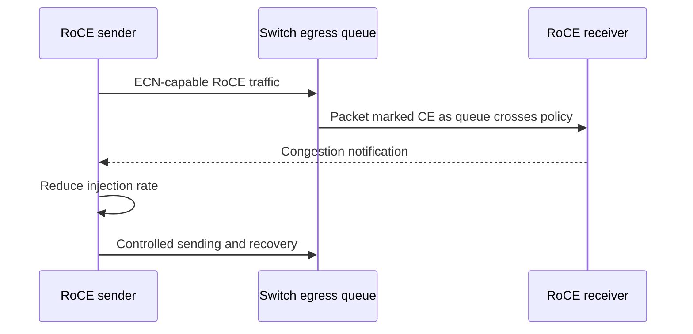
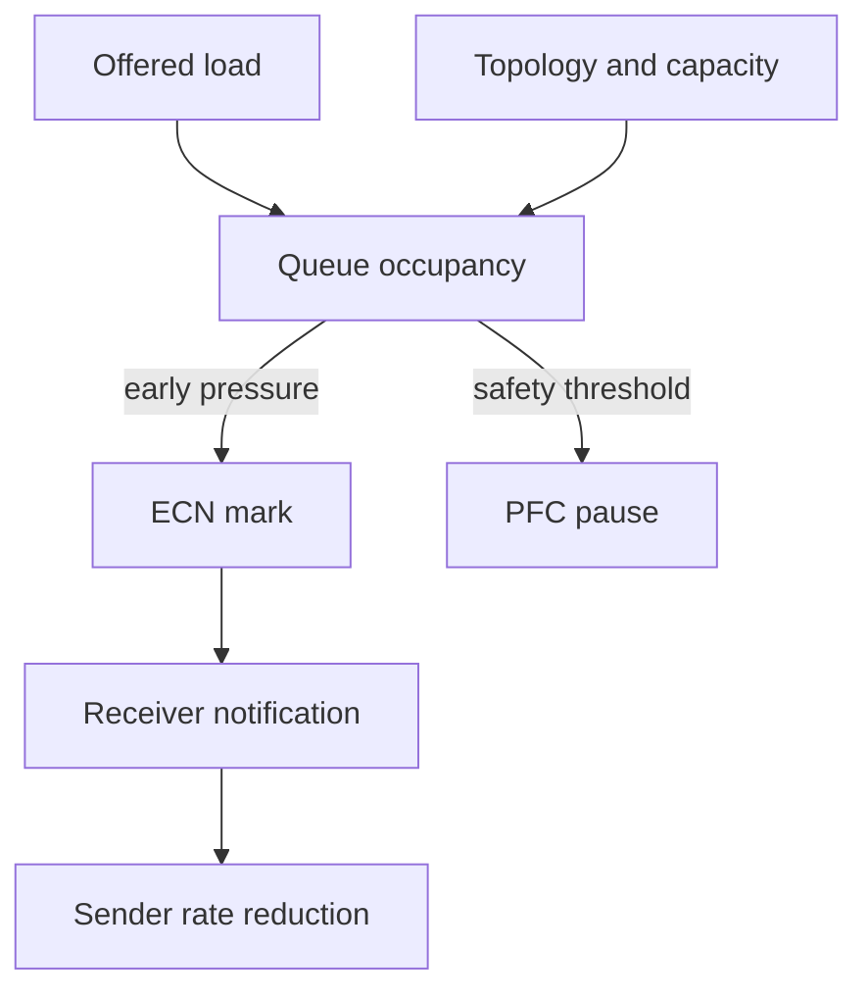

# ECN and DCQCN

A GPU fabric can carry every packet and still waste most of its time in queues. When many senders converge on one egress, waiting for overflow before reacting produces latency, backpressure, and an unstable workload. Explicit Congestion Notification (ECN) provides an earlier signal: a congested network element marks an eligible packet instead of using loss as its first signal. DCQCN is a RoCE-oriented closed loop that uses that feedback to regulate sender injection.

| Chapter field | Value |
|---|---|
| Difficulty | Expert |
| Estimated reading time | 50–60 minutes |
| Prerequisites | [Priority Flow Control](./chapter-04-priority-flow-control) |
| Primary focus | ECN marking, congestion notification, and endpoint rate response |
| Next | [Data Center Bridging and QoS](./chapter-06-data-center-bridging-and-qos) |

## Learning Objectives

After completing this chapter, you will be able to:

- explain the ECN mark-to-feedback-to-rate-response loop;
- distinguish ECN, PFC, and packet loss as congestion signals;
- reason about marking thresholds and recovery as a coupled system;
- validate feedback continuity across the endpoint and fabric;
- diagnose oscillation, persistent throttling, and PFC-heavy operation.

## A Production Story: The Fabric Is Fast Until It Is Shared

Pairwise tests are healthy. A scheduled training window starts three jobs at once, and collective tail time becomes erratic. The team finds no physical errors, but switch queues have repeated ECN marks followed by bursts of PFC. The original profile marked too late for the observed incast and endpoint recovery was not being verified.

The correction is not “turn ECN up.” The team proves the intended priority mapping, validates a vendor-qualified profile across every leaf and endpoint, tests representative concurrency, and records mark, notification, rate, and queue baselines. The result is controlled queueing—not a claim that congestion has disappeared.

## From a Mark to a Slower Sender

RFC 3168 defines ECN as IP-layer congestion signaling: an active queue-management function can set the Congestion Experienced (CE) codepoint for an ECN-capable packet instead of dropping it due to incipient congestion. RoCE congestion-control implementations use compatible packet marking and endpoint notification behavior, but the exact packet formats, controls, counters, and parameter names are implementation-specific. Verify them against the NIC and switch documentation for the deployed release.

**Figure 9.5.1 — ECN turns queue pressure into a feedback signal.** The return path and sender response are as important as the switch marking policy.

DCQCN combines congestion estimation with rate control. Conceptually, the sender reduces its rate after notifications and cautiously recovers when feedback subsides. This avoids making PFC the normal response to congestion. It does not guarantee fairness across all workloads, repair a broken link, or make an oversubscribed destination nonblocking.

## Thresholds Are a Control-System Design

The switch's marking policy determines when a queue begins to communicate congestion. The endpoint profile determines how strongly and how quickly it reacts. These choices must be evaluated together.

| Choice | Too conservative | Too aggressive |
|---|---|---|
| Marking threshold | Deep queues; increased PFC/loss risk | Marks during harmless bursts; lower utilization |
| Decrease response | Slow relief; queue can keep growing | Underutilization and synchronized rate collapse |
| Recovery behavior | Capacity remains unused | Repeated overshoot and oscillation |
| Class scope | Congestion misses intended RoCE traffic | Unrelated traffic receives the policy |

There is no portable threshold value that can be copied into every fabric. Buffer architecture, link rate, topology, traffic pattern, and endpoint implementation all change the loop. A profile that is correct for one switch generation or workload can be harmful elsewhere.

## ECN, PFC, and Capacity Have Different Jobs

**Figure 9.5.2 — The preferred response is source-rate reduction before a queue needs sustained pause.** Capacity and placement determine whether that is possible at all.

| Tool | Detects/acts on | Best use | Limitation |
|---|---|---|---|
| ECN | Incipient queue pressure | Early end-to-end feedback | Requires correct endpoint behavior |
| DCQCN | Congestion notifications | Sender injection control | Cannot exceed a saturated destination's capacity |
| PFC | Immediate local buffer pressure | Short loss-protection window | Can propagate pauses |
| Routing/placement | Path and destination selection | Avoiding available hot spots | Cannot remove demand from a hard bottleneck |
| Capacity | Structural constraint | Sustained demand | Does not replace control-loop validation |

## Qualification Method

Start with a supported profile, then prove behavior with controlled tests. The test matrix should cover pairwise flows, incast, all-to-all, representative collective sizes, multiple jobs, and one relevant failure or reroute condition. Each result needs topology, software/firmware versions, class mapping, workload, and counter deltas.

Observe at least:

- ECN-marked packets or queue marking counters per port and class;
- endpoint congestion notifications and rate-control counters where exposed;
- egress queue occupancy and drain rate;
- PFC frames and duration per priority;
- drops and physical errors, which must not be conflated;
- application latency, collective duration, and per-rank skew;
- path distribution, job placement, and concurrent traffic.

One switch configured for ECN proves nothing about a feedback loop if the receiver cannot return notification or the sender uses a different priority/profile. Treat every endpoint, switch role, and routed boundary as part of the qualification set.

## Production Failure Modes

### Scenario 1 — ECN marks rise, but PFC remains high

**Symptoms:** marked packets and PFC counters rise together; application tail latency is high.

**Diagnosis:** check whether the marks are on the intended queue, notifications reach the original senders, and endpoint rate counters change. Trace the congested egress and determine whether it is a destination or topology cut with insufficient drain capacity.

**Resolution:** repair mapping or profile consistency first. If the feedback loop is healthy, change placement, routing, or capacity to address the structural bottleneck. Tune thresholds only through a documented qualification change.

**Verification:** under the same workload, queue occupancy and PFC are reduced while controlled marks and sender response remain observable.

### Scenario 2 — Throughput pulses in waves

**Symptoms:** utilization alternates between bursts and idle intervals; sender rates repeatedly collapse and recover.

**Diagnosis:** compare time-series marks, notifications, endpoint rate, queue occupancy, and PFC. Look for a response that is too strong, a recovery that overshoots, or many synchronized senders acting on the same signal.

**Resolution:** return to the validated baseline profile or make one controlled, vendor-supported parameter change. Do not tune individual ports ad hoc.

**Prevention:** retain time-series baselines rather than accepting a one-minute average as proof of stability.

### Scenario 3 — A change appears to remove congestion

**Symptoms:** ECN and PFC counters fall, but performance has not improved or drops rise.

**Diagnosis:** verify classification. The traffic may have moved to a lossy or unmonitored queue rather than become healthy. Check RDMA completion errors and all relevant queue/drop counters.

**Resolution:** restore the intended mapping and test from packet marking through endpoint feedback.

## Customer Architecture Discussion

ECN/DCQCN is attractive because it preserves Ethernet routing and signals congestion before a queue must rely on loss or prolonged pause. Its cost is operational precision: a customer needs a supported endpoint/switch combination, versioned profiles, topology-aware telemetry, and a test environment capable of producing the same incast and collective patterns seen in production.

For a small dedicated cluster, a carefully qualified profile may be straightforward. For a shared fleet, capacity admission, tenant placement, and control-traffic isolation matter just as much as rate-control settings. No congestion algorithm turns an ungoverned shared bottleneck into a predictable service.

## Interview Preparation

1. Why is an ECN mark useful before packet loss?
2. Draw the return-feedback path required for a sender to react.
3. Why can a correct marking threshold still produce poor performance?
4. ECN counters are zero after a policy change. What must you prove before calling that improvement?

## Key Takeaways

- ECN exposes incipient congestion by marking eligible packets instead of making loss the first signal.
- DCQCN is an endpoint rate-control loop; switch marking alone is incomplete.
- Thresholds, queue architecture, endpoint response, and workload form one control system.
- PFC remains a local safeguard, not proof that congestion is controlled.
- Validate the full loop with workload-representative, topology-aware telemetry.

## Architecture Summary

Mark pressure early enough to obtain a useful endpoint response, verify that response reaches the original sender, and size the fabric so sources have a feasible rate to converge toward. Use PFC to protect a transient edge case, while ECN/DCQCN, placement, and capacity keep it from becoming the dominant behavior.

## Quick Revision Sheet

| Term | Remember |
|---|---|
| ECN | IP-level congestion marking for eligible packets |
| CE | Congestion Experienced codepoint set by the network |
| DCQCN | RoCE-oriented feedback and sender rate control |
| Marking threshold | Queue point where congestion is signaled |
| Oscillation | Repeated overshoot and correction in the feedback loop |

## Lab Checklist

- [ ] Capture per-priority ECN, PFC, drop, and queue baselines.
- [ ] Verify intended marking and queue selection end to end.
- [ ] Create bounded incast and observe marking, notification, and rate response.
- [ ] Compare pairwise and concurrent collective behavior.
- [ ] Restore baseline and record profile/version evidence.

## Further Reading

- [RFC 3168: Explicit Congestion Notification](https://www.rfc-editor.org/info/rfc3168/)
- [NVIDIA Cumulus Linux RoCE guidance](https://docs.nvidia.com/networking-ethernet-software/cumulus-linux-44/Layer-1-and-Switch-Ports/Quality-of-Service/RDMA-over-Converged-Ethernet-RoCE/)
- [DCQCN research publication](https://conferences.sigcomm.org/sigcomm/2015/pdf/papers/keynote.pdf)

## Cross References

- [Priority Flow Control](./chapter-04-priority-flow-control)
- [Data Center Bridging and QoS](./chapter-06-data-center-bridging-and-qos)
- [Fabric Validation and Capacity Planning](./chapter-10-fabric-validation-and-capacity-planning)
