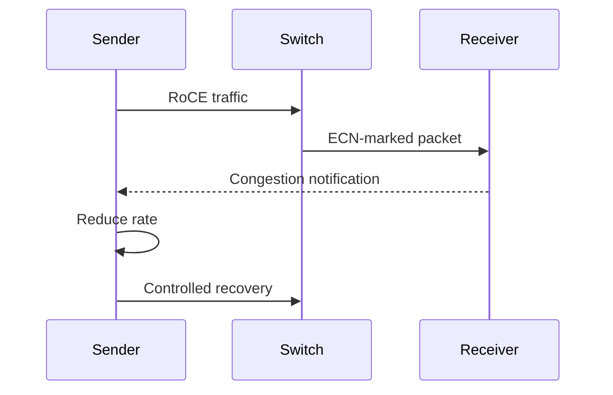

# ECN and DCQCN

Priority Flow Control reacts to queue pressure by pausing traffic. Explicit Congestion Notification (ECN) marks packets before queues overflow. DCQCN uses that feedback to reduce and later recover the sender’s rate. Together they aim to keep queues controlled and make PFC a safety mechanism rather than the normal operating state.

## Learning Objectives

Explain marking, congestion notification, sender response, threshold design, and common tuning failures.

## Feedback Loop

Switches mark packets when queue occupancy crosses configured thresholds. The receiver generates feedback, and the sender adjusts rate according to the congestion-control algorithm and NIC profile.

## Tuning Trade-offs

Mark too late and queues become deep, latency rises, and PFC triggers. Mark too early or react too aggressively and the fabric remains underutilized. Recovery that is too fast causes oscillation; recovery that is too slow wastes capacity.

| Parameter family | Effect |
|---|---|
| ECN threshold | Queue level at which marking begins |
| Rate decrease | How strongly sender reacts |
| Recovery timer | How quickly rate is restored |
| Queue buffer/headroom | Capacity before loss or PFC |
| Traffic classification | Which flows receive the policy |

## Production Method

Use a qualified profile as the starting point. Validate under incast, all-to-all, mixed message size, and failure-state tests. Monitor ECN marks, congestion notifications, sender rate, queue occupancy, PFC frames, drops, and application tail latency.

Do not tune one switch in isolation. NIC firmware, driver, switch silicon, queue architecture, and topology influence the feedback loop.

## Troubleshooting

**Symptoms:** oscillating throughput, persistent low sender rate, excessive PFC, or high queue latency.

Correlate ECN marks with source-rate changes. Check that packets are classified into the intended queue and that receiver feedback reaches the sender. Compare configuration across switches and adapters.

## Customer Perspective

A customer may ask for “lossless Ethernet.” Explain that the goal is controlled queueing and reliable RDMA, not an absolute absence of every drop under every failure. Capacity, ECN, PFC, routing, and workload admission all contribute.

## Interview Preparation

**Question:** Why use ECN if PFC is enabled?

ECN asks sources to slow down before sustained pause. It controls congestion end to end, while PFC protects a local hop during transient pressure.

## Key Takeaways

- ECN marks congestion without dropping packets.
- DCQCN converts feedback into sender rate control.
- Thresholds balance latency, utilization, and PFC risk.
- Endpoint and switch profiles must be validated together.

## Cross References

- [Priority Flow Control](./chapter-04-priority-flow-control)
- [Next: DCB and QoS](./chapter-06-data-center-bridging-and-qos)
