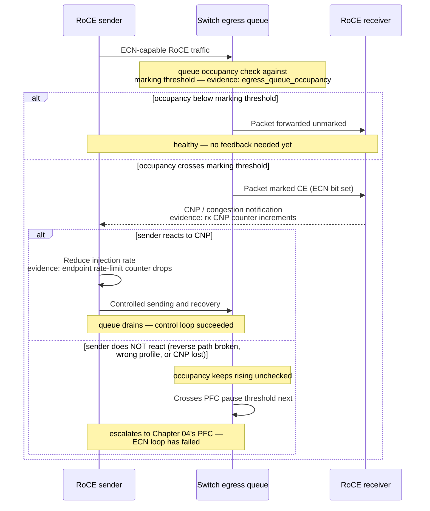
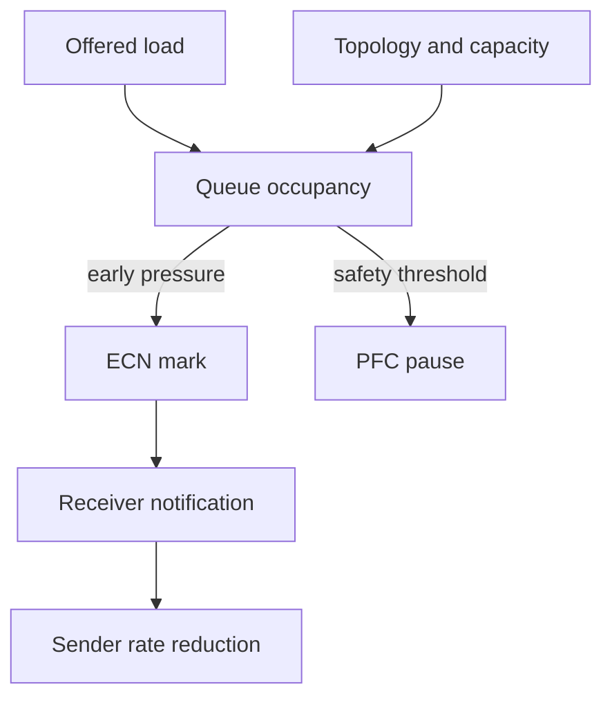

# ECN and DCQCN

A GPU fabric can carry every packet and still waste most of its time in queues. When many senders converge on one egress, waiting for overflow before reacting produces latency, backpressure, and an unstable workload. Explicit Congestion Notification (ECN) provides an earlier signal: a congested network element marks an eligible packet instead of using loss as its first signal. DCQCN is a RoCE-oriented closed loop that uses that feedback to regulate sender injection.

| Chapter field | Value |
|---|---|
| Difficulty | Expert |
| Estimated reading time | 50–60 minutes |
| Prerequisites | [Priority Flow Control](./chapter-04-priority-flow-control) |
| Primary focus | ECN marking, congestion notification, and endpoint rate response |
| Next | [Data Center Bridging and QoS](./chapter-06-data-center-bridging-and-qos) |

## Learning Objectives

After completing this chapter, you will be able to:

- explain the ECN mark-to-feedback-to-rate-response loop;
- distinguish ECN, PFC, and packet loss as congestion signals;
- reason about marking thresholds and recovery as a coupled system;
- validate feedback continuity across the endpoint and fabric;
- diagnose oscillation, persistent throttling, and PFC-heavy operation.

## A Production Story: The Fabric Is Fast Until It Is Shared

Pairwise tests are healthy. A scheduled training window starts three jobs at once, and collective tail time becomes erratic. The team finds no physical errors, but switch queues have repeated ECN marks followed by bursts of PFC. The original profile marked too late for the observed incast and endpoint recovery was not being verified.

The correction is not “turn ECN up.” The team proves the intended priority mapping, validates a vendor-qualified profile across every leaf and endpoint, tests representative concurrency, and records mark, notification, rate, and queue baselines. The result is controlled queueing—not a claim that congestion has disappeared.

## From a Mark to a Slower Sender

RFC 3168 defines ECN as IP-layer congestion signaling: an active queue-management function can set the Congestion Experienced (CE) codepoint for an ECN-capable packet instead of dropping it due to incipient congestion. RoCE congestion-control implementations use compatible packet marking and endpoint notification behavior, but the exact packet formats, controls, counters, and parameter names are implementation-specific. Verify them against the NIC and switch documentation for the deployed release.



**Figure 9.5.1 — ECN turns queue pressure into a feedback signal, and the diagram now shows the two places that loop can actually fail.** The first branch is the switch's own marking decision — evidence is queue occupancy crossing (or not crossing) the configured threshold. The second, nested branch is the one operators miss most often: a CE-marked packet reaching the receiver proves nothing about whether the *sender* ever reduces rate — that requires the CNP to survive the reverse path and the sender's endpoint profile to actually respond to it. A fabric can mark perfectly and still misbehave if either half of that return trip is broken, which is exactly what Scenario 3 in this chapter's troubleshooting section investigates.

For a deployed RoCE congestion-control profile, the receiver returns the applicable congestion notification packet (CNP) after observing ECN-marked traffic. DCQCN combines congestion estimation with rate control. Conceptually, the sender reduces its rate after notifications and cautiously recovers when feedback subsides. Exact CNP handling, counters, and configuration controls are implementation- and release-specific. This avoids making PFC the normal response to congestion. It does not guarantee fairness across all workloads, repair a broken link, or make an oversubscribed destination nonblocking.

## Thresholds Are a Control-System Design

The switch's marking policy determines when a queue begins to communicate congestion. The endpoint profile determines how strongly and how quickly it reacts. These choices must be evaluated together.

| Choice | Too conservative | Too aggressive |
|---|---|---|
| Marking threshold | Deep queues; increased PFC/loss risk | Marks during harmless bursts; lower utilization |
| Decrease response | Slow relief; queue can keep growing | Underutilization and synchronized rate collapse |
| Recovery behavior | Capacity remains unused | Repeated overshoot and oscillation |
| Class scope | Congestion misses intended RoCE traffic | Unrelated traffic receives the policy |

There is no portable threshold value that can be copied into every fabric. Buffer architecture, link rate, topology, traffic pattern, and endpoint implementation all change the loop. A profile that is correct for one switch generation or workload can be harmful elsewhere.

**Illustrative annotated output — reading a marking/response pair off real counters, the way the table above should be interpreted:**

```text
# Switch: ECN marking activity on the RoCE queue, two consecutive 5s windows
$ ethtool -S swp9 | grep rx_ecn_marked_prio3
     rx_ecn_marked_prio3:     84200     (window 1)
     rx_ecn_marked_prio3:     84512     (window 2, delta = 312)

# Endpoint: rate-control state on the sender reacting to those marks
$ mlx5_cnp_stats -d mlx5_0     # illustrative DCQCN endpoint counters
     np_cnp_handled:           298      <- sender processed ~298 CNPs in the same window
     np_ecn_marked_roce_packets: 305
     rp_byte_reset:            1        <- rate-control state reset once (recovery cycle completed)
```

The delta of 312 new marks at the switch against 298 CNPs *handled* at the sender in the same window is the actual evidence of a working loop — they should track closely (a few packets in flight account for the small gap). If the switch counter climbed steadily while `np_cnp_handled` stayed near zero, that would be the "sender does NOT react" branch from Figure 9.5.1 — marking is happening, but the endpoint isn't responding, which is indistinguishable from no ECN at all from the queue's point of view. `rp_byte_reset` incrementing shows the sender completed a full throttle-then-recover cycle — exactly one, meaning this was a contained, brief pressure event rather than a sustained oscillation (see Scenario 2 below for what oscillation looks like in these same counters).

## ECN, PFC, and Capacity Have Different Jobs



**Figure 9.5.2 — The preferred response is source-rate reduction before a queue needs sustained pause.** Capacity and placement determine whether that is possible at all.

| Tool | Detects/acts on | Best use | Limitation |
|---|---|---|---|
| ECN | Incipient queue pressure | Early end-to-end feedback | Requires correct endpoint behavior |
| DCQCN | Congestion notifications | Sender injection control | Cannot exceed a saturated destination's capacity |
| PFC | Immediate local buffer pressure | Short loss-protection window | Can propagate pauses |
| Routing/placement | Path and destination selection | Avoiding available hot spots | Cannot remove demand from a hard bottleneck |
| Capacity | Structural constraint | Sustained demand | Does not replace control-loop validation |

## Qualification Method

Start with a supported profile, then prove behavior with controlled tests. The test matrix should cover pairwise flows, incast, all-to-all, representative collective sizes, multiple jobs, and one relevant failure or reroute condition. Each result needs topology, software/firmware versions, class mapping, workload, and counter deltas.

Observe at least:

- ECN-marked packets or queue marking counters per port and class;
- endpoint congestion notifications and rate-control counters where exposed;
- egress queue occupancy and drain rate;
- PFC frames and duration per priority;
- drops and physical errors, which must not be conflated;
- application latency, collective duration, and per-rank skew;
- path distribution, job placement, and concurrent traffic.

One switch configured for ECN proves nothing about a feedback loop if the receiver cannot return notification or the sender uses a different priority/profile. Treat every endpoint, switch role, and routed boundary as part of the qualification set.

## Production Failure Modes

### Scenario 1 — ECN marks rise, but PFC remains high

**Symptoms:** marked packets and PFC counters rise together; application tail latency is high.

**Diagnosis:** check whether the marks are on the intended queue, notifications reach the original senders, and endpoint rate counters change. Trace the congested egress and determine whether it is a destination or topology cut with insufficient drain capacity.

**Evidence in practice:**

```text
$ ethtool -S swp9 | egrep "rx_ecn_marked_prio3|rx_pfc_prio3"
     rx_ecn_marked_prio3:     412880    <- marking heavily
     rx_pfc_prio3:            93100     <- AND pausing heavily, at the same egress

$ mlx5_cnp_stats -d mlx5_0
     np_cnp_handled:          409500    <- sender is receiving and processing nearly all the marks
     rp_current_rate:         98Gbps    <- but barely throttling — still near line rate
```

The loop here is *responding* — `np_cnp_handled` closely tracks the switch's mark count — but `rp_current_rate` staying near line rate shows the endpoint's reaction is too weak to actually relieve the queue at this offered load, so PFC keeps engaging as the backstop. This is different from Scenario 3's "no response at all": here the feedback loop is intact end to end, it's just insufficient for the demand converging on this specific egress, which points at capacity/placement rather than a broken CNP path.

**Resolution:** repair mapping or profile consistency first. If the feedback loop is healthy, change placement, routing, or capacity to address the structural bottleneck. Tune thresholds only through a documented qualification change.

**Verification:** under the same workload, queue occupancy and PFC are reduced while controlled marks and sender response remain observable.

### Scenario 2 — Throughput pulses in waves

**Symptoms:** utilization alternates between bursts and idle intervals; sender rates repeatedly collapse and recover.

**Diagnosis:** compare time-series marks, notifications, endpoint rate, queue occupancy, and PFC. Look for a response that is too strong, a recovery that overshoots, or many synchronized senders acting on the same signal.

**Evidence in practice:**

```text
$ mlx5_cnp_stats -d mlx5_0 --interval 1     # illustrative, 1s samples
t=0s   np_cnp_handled: 40   rp_current_rate: 100Gbps
t=1s   np_cnp_handled: 380  rp_current_rate: 12Gbps    <- overreacted: dropped to 12% instantly
t=2s   np_cnp_handled: 2    rp_current_rate: 95Gbps    <- recovered almost fully in one step
t=3s   np_cnp_handled: 410  rp_current_rate: 11Gbps    <- overshoots again just as fast
t=4s   np_cnp_handled: 3    rp_current_rate: 96Gbps
```

`rp_current_rate` swinging between ~11% and ~96% of link rate every second, in lockstep with `np_cnp_handled` spiking then dropping to near-zero, is the oscillation this scenario describes made numeric: the rate-decrease response is too aggressive for the marking rate it's reacting to, and recovery is too fast to let the queue actually stabilize before the next mark storm hits. Because every sender sharing this destination sees the same CNP signal at roughly the same time, they cut and recover synchronously — this is the "many synchronized senders acting on the same signal" mechanism, not several independent senders coincidentally misbehaving.

**Resolution:** return to the validated baseline profile or make one controlled, vendor-supported parameter change. Do not tune individual ports ad hoc. After the fix, the same trace should show `rp_current_rate` settling into a narrower band (for example 70-90%) rather than swinging across the full range.

**Prevention:** retain time-series baselines rather than accepting a one-minute average as proof of stability.

### Scenario 3 — ECN marks are visible, but sender response is absent or asymmetric

**Symptoms:** one direction of a workload accumulates ECN marks and queue pressure, while the expected sender-rate response is absent, or only a subset of hosts reacts.

**Diagnosis:** verify that the marked traffic reaches the receiver, that the receiver can return CNPs to the original sender, and that the sender uses the qualified congestion-control profile. Compare endpoint CNP/rate evidence, reverse-path reachability and QoS treatment, and GID/device selection across healthy and unhealthy nodes.

**Resolution:** restore the approved endpoint and reverse-path profile, then repeat the same bounded congestion test. Do not compensate for missing feedback by widening PFC or changing switch thresholds.

**Prevention:** include bidirectional CNP/endpoint response evidence in the validation baseline after routing, QoS, or host-image changes.

### Scenario 4 — A change appears to remove congestion

**Symptoms:** ECN and PFC counters fall, but performance has not improved or drops rise.

**Diagnosis:** verify classification. The traffic may have moved to a lossy or unmonitored queue rather than become healthy. Check RDMA completion errors and all relevant queue/drop counters.

**Resolution:** restore the intended mapping and test from packet marking through endpoint feedback.

## Customer Architecture Discussion

ECN/DCQCN is attractive because it preserves Ethernet routing and signals congestion before a queue must rely on loss or prolonged pause. Its cost is operational precision: a customer needs a supported endpoint/switch combination, versioned profiles, topology-aware telemetry, and a test environment capable of producing the same incast and collective patterns seen in production.

For a small dedicated cluster, a carefully qualified profile may be straightforward. For a shared fleet, capacity admission, tenant placement, and control-traffic isolation matter just as much as rate-control settings. No congestion algorithm turns an ungoverned shared bottleneck into a predictable service.

## Interview Preparation

**1. Why is an ECN mark useful before packet loss?**

"Because loss is an expensive, late signal — by the time a packet actually drops, the queue was already full, and for a reliable RDMA transport that drop usually means a retry or timeout that stalls a synchronized collective. ECN lets the switch say 'you're getting close' while there's still room in the queue, so the sender can back off before anything is lost at all. I think of it as the difference between a smoke detector and a fire — ECN is the smoke detector, and a design that relies on PFC or drops as its primary signal is waiting for the fire."

**2. Draw the return-feedback path required for a sender to react.**

"Sender emits a packet, switch queue marks the CE bit if it's under pressure, that marked packet reaches the receiver unchanged in payload — marking doesn't touch application data. The receiver's RoCE stack recognizes the CE bit and generates a CNP, sends it back to the original sender over the reverse path. The sender's endpoint congestion-control logic — DCQCN in this chapter — receives that CNP and reduces its injection rate. What I'd emphasize while drawing this is that there are two full network traversals in this loop, forward and reverse, plus two pieces of endpoint logic — receiver-side CNP generation and sender-side rate response — and a failure in any one of those four pieces looks identical from the switch's point of view: marks keep happening, nothing changes."

**3. Why can a correct marking threshold still produce poor performance?**

"Because the threshold is only half the control system — it decides *when* to signal, not what happens after. I've seen a textbook-correct marking threshold paired with a rate-decrease response that was either too weak, so the queue kept growing despite marks being sent, or too aggressive, so senders oscillated between near-zero and near-line-rate instead of settling into a stable reduced rate. Both look like 'ECN isn't working' from the outside, but the switch did exactly what it was configured to do — the fix is on the endpoint side, tuning the response curve, not moving the marking threshold."

**4. ECN counters are zero after a policy change. What must you prove before calling that improvement?**

"Zero ECN marks after a change is genuinely ambiguous, and I wouldn't call it a win without checking at least two other things first. One: is the traffic still classified into the same priority and reaching the same queue — a classification bug can silently move RoCE traffic into an unmonitored or lossy queue, which would zero out this counter while making things worse, not better. Two: are RDMA completion errors and drop counters flat or improved — if drops went up while marks went to zero, the traffic didn't get healthier, it just started losing packets instead of getting marked. Only once I've confirmed the traffic is still where it's supposed to be and the workload's actual completion/throughput numbers improved would I accept the zero-marks result as real progress."

## Key Takeaways

- ECN exposes incipient congestion by marking eligible packets instead of making loss the first signal.
- DCQCN is an endpoint rate-control loop; switch marking alone is incomplete.
- Thresholds, queue architecture, endpoint response, and workload form one control system.
- PFC remains a local safeguard, not proof that congestion is controlled.
- Validate the full loop with workload-representative, topology-aware telemetry.

## Architecture Summary

Mark pressure early enough to obtain a useful endpoint response, verify that response reaches the original sender, and size the fabric so sources have a feasible rate to converge toward. Use PFC to protect a transient edge case, while ECN/DCQCN, placement, and capacity keep it from becoming the dominant behavior.

## Quick Revision Sheet

| Term | Remember |
|---|---|
| ECN | IP-level congestion marking for eligible packets |
| CE | Congestion Experienced codepoint set by the network |
| DCQCN | RoCE-oriented feedback and sender rate control |
| Marking threshold | Queue point where congestion is signaled |
| Oscillation | Repeated overshoot and correction in the feedback loop |

## Lab Checklist

- [ ] Capture per-priority ECN, PFC, drop, and queue baselines.
- [ ] Verify intended marking and queue selection end to end.
- [ ] Create bounded incast and observe marking, notification, and rate response.
- [ ] Compare pairwise and concurrent collective behavior.
- [ ] Restore baseline and record profile/version evidence.

## Further Reading

- [RFC 3168: Explicit Congestion Notification](https://www.rfc-editor.org/info/rfc3168/)
- [NVIDIA Cumulus Linux RoCE guidance](https://docs.nvidia.com/networking-ethernet-software/cumulus-linux-44/Layer-1-and-Switch-Ports/Quality-of-Service/RDMA-over-Converged-Ethernet-RoCE/)
- [DCQCN research publication](https://conferences.sigcomm.org/sigcomm/2015/pdf/papers/keynote.pdf)

## Cross References

- [Priority Flow Control](./chapter-04-priority-flow-control)
- [Data Center Bridging and QoS](./chapter-06-data-center-bridging-and-qos)
- [Fabric Validation and Capacity Planning](./chapter-10-fabric-validation-and-capacity-planning)
