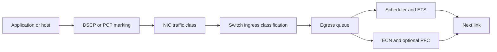
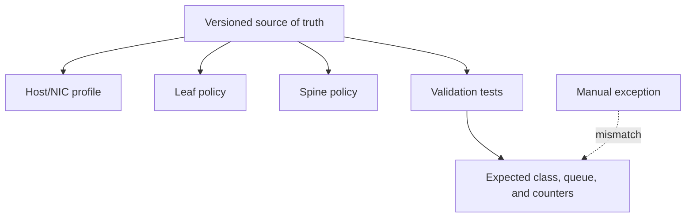

# Data Center Bridging and QoS

An Ethernet fabric is rarely pure RoCE traffic. GPU collectives, storage, Kubernetes control traffic, monitoring, image pulls, and operator access can all share physical links. If the fabric treats them as one undifferentiated stream, a congestion event in one workload becomes an incident for every workload. If it creates too many classes, buffer partitioning, policy drift, and troubleshooting complexity take over.

Data Center Bridging (DCB) and QoS provide the language for making that choice explicit: classify traffic, map it to a priority and queue, allocate service, mark queue pressure, and apply PFC only where the risk warrants it. The objective is controlled sharing with observable behavior—not a promise that every packet class is lossless.

| Chapter field | Value |
|---|---|
| Difficulty | Advanced |
| Estimated reading time | 45–55 minutes |
| Prerequisites | [ECN and DCQCN](./chapter-05-ecn-and-dcqcn) |
| Primary focus | End-to-end classification, queueing, ETS, and policy operations |
| Next | [Spectrum Switches for AI](./chapter-07-spectrum-switches-for-ai) |

## Learning Objectives

After completing this chapter, you will be able to:

- trace a packet from application marking to an egress queue;
- distinguish classification, scheduling, ETS, ECN, and PFC responsibilities;
- design a small, explainable class model for an AI Ethernet fabric;
- detect policy drift and queue-mapping mistakes;
- separate QoS protection from capacity planning and security isolation.

## Architecture Before Configuration

QoS begins with traffic intent. A policy may classify at the host, trust or rewrite at an access port, map to internal priority, select an egress queue, and then apply queue-specific scheduling and congestion policy. The packet can cross L2 and L3 boundaries, and any boundary can alter the marking or mapping.

**Figure 9.6.1 — Classification is an end-to-end contract.** A queue policy is only meaningful if each hop delivers the intended traffic to that queue.

## What Each Control Does

| Control | Purpose | Typical question it answers | What it does not provide |
|---|---|---|---|
| DSCP/PCP marking | Express traffic intent | Which class should this packet use? | Guaranteed end-to-end behavior |
| Classification/mapping | Select internal priority and queue | Where is the packet queued? | Additional bandwidth |
| Scheduling | Choose service order | Which nonempty queue is served next? | Fairness unless configured for it |
| ETS | Allocate bandwidth among traffic classes | What minimum share is available under contention? | A fixed reservation under all conditions |
| ECN | Signal incipient queue pressure | Should endpoints reduce rate? | Local loss protection |
| PFC | Pause one priority at a local link | Can a loss-sensitive queue drain? | Flow-level isolation or capacity |

Enhanced Transmission Selection (ETS) is often described as bandwidth allocation. Treat that description carefully. The exact behavior depends on the device scheduler and configuration; a configured percentage should be validated as a service objective under contention, not presented as an immutable reservation. A high-priority queue also needs a starvation policy that is understood and tested.

## Build a Small Class Model

Start from workloads and failure domains, not from the maximum number of hardware priorities. A common conceptual model distinguishes:

| Intent | Example contents | Design concern |
|---|---|---|
| Infrastructure/control | Routing, cluster control, monitoring | Must remain reachable during data-plane pressure |
| RoCE compute | Qualified RDMA data traffic | Consistent queue, ECN, and narrowly scoped PFC |
| Storage or service data | Checkpoint, data ingestion, platform services | Can create long-lived contention |
| Best effort | Bulk transfer and noncritical traffic | Must not silently occupy the RoCE class |

These are intents, not a universal priority-number prescription. The implementation must record the exact mapping by platform. Fewer classes are easier to observe and operate. More classes are justified only when there is a distinct behavior, owner, failure policy, and validation method for each one.

### Why trust boundaries matter

An endpoint may set DSCP or PCP incorrectly, accidentally or deliberately. Decide where markings are trusted, where they are normalized, and which traffic is allowed to enter a protected class. QoS classification is not an access-control system: it cannot authenticate a workload, prevent lateral movement, or replace network segmentation. It is nevertheless a security-relevant operational boundary because an untrusted workload placed in a protected class can affect shared service.

## Consistency and Drift Control

The fastest way to create a difficult RoCE incident is to change a single mapping in one place. The source marks a packet as intended, an access switch rewrites it, a spine maps it differently, and the destination sees an ordinary lossy queue. Ping and a basic IP test can still work while the RDMA workload suffers.

**Figure 9.6.2 — Configuration generation and continuous verification make QoS observable.** A static design document cannot detect a later per-port exception.

Maintain a machine-readable mapping table containing ingress marking, trust/rewrite behavior, internal priority, queue, PFC state, ECN policy, scheduler treatment, and counter names for every switch role and host profile. Generate configurations from that source where possible; regularly compare running configuration and observed counter behavior against it.

## Production Validation Plan

Validate the policy in layers:

1. **Classification:** send known marked test traffic and confirm the expected priority/queue at ingress and egress.
2. **Isolation:** create bounded RoCE-class congestion and prove that management/control traffic follows its own queue and remains usable.
3. **Service behavior:** run simultaneous classes to observe scheduler/ETS behavior, not just an idle fabric.
4. **Feedback:** confirm ECN marks, endpoint response, and PFC as appropriate to the selected class.
5. **Failure behavior:** test a link/routing change and verify policy persists on the alternate path.
6. **Application behavior:** correlate queue metrics with representative collective and storage load.

Record topology, firmware, software, profile version, workload, duration, and raw counters. A configuration that compiles but has never been tested under contention is not a production QoS policy.

## Operational Troubleshooting

### Scenario 1 — RoCE drops despite PFC being enabled

**Symptoms:** RDMA completion errors or retries rise; PFC appears configured; switches may show drops in a different queue.

**Diagnosis:** trace the packet marking and mapping hop by hop. Verify the selected RoCE priority is actually PFC-enabled in both receive and transmit directions where the implementation requires it. Check MTU, physical errors, ACLs, and endpoint configuration before assuming this is a buffer problem.

**Resolution:** correct the mapping or the independent fault. Re-run a bounded test and collect queue-specific rather than aggregate counters.

**Prevention:** deploy a post-change compliance test that asserts the intended class, queue, and congestion policy on all participating roles.

### Scenario 2 — Management becomes slow during a training burst

**Symptoms:** cluster control plane latency rises with RoCE pause or queue pressure.

**Diagnosis:** inspect markings, queue mapping, scheduler state, and pause counters. Find whether management shares the RoCE priority, is starved by a scheduling rule, or uses a physically saturated cut.

**Resolution:** restore class separation and validate that scheduler policy protects the control class. If the link is structurally full, add capacity or alter placement; QoS cannot make an exhausted link carry unlimited demand.

### Scenario 3 — Storage misses its expected share

**Symptoms:** storage throughput drops when compute begins, although ETS appears configured.

**Diagnosis:** test with simultaneous traffic and inspect the actual egress queue, scheduler, shaping, and any strict-priority classes. Confirm which device-specific semantics apply to the configured values.

**Resolution:** adjust the qualified scheduler policy or redesign workload scheduling. Do not advertise an ETS percentage as a guaranteed application bandwidth without evidence.

## Customer Architecture Discussion

A customer with a dedicated AI fabric can choose a small class model and tightly qualify every participating endpoint. A customer sharing network infrastructure across business units needs an ownership model for marking, exceptions, change review, and incident evidence. The latter may need stronger physical or logical isolation in addition to QoS.

Ask the customer to name the traffic that must remain operational during a worst-case training event, the owner who may request a protected class, and the measurement that proves the policy works. Those answers determine whether the design is supportable long after the original implementation team has moved on.

## Interview Preparation

1. Why can a DSCP value be correct at the host and wrong at the egress queue?
2. What is the difference between ETS and a hard bandwidth reservation?
3. How do you prove PFC is not affecting management traffic?
4. Why is QoS not a substitute for tenant isolation or capacity planning?

## Key Takeaways

- QoS is an end-to-end classification and queueing contract, not a switch-local setting.
- ETS, scheduling, ECN, and PFC have distinct roles; none creates capacity.
- A small class model is easier to validate, operate, and troubleshoot.
- Trust boundaries and configuration drift determine whether a policy works in production.
- Measure simultaneous traffic and workload effects, not just configuration state.

## Architecture Summary

Classify intentionally, map consistently, isolate the small loss-sensitive class, and observe every queue that matters. Use scheduling to express service objectives, ECN/DCQCN to control offered rate, PFC only for the qualified class, and topology/capacity planning to solve the demand that policy alone cannot absorb.

## Quick Revision Sheet

| Term | Remember |
|---|---|
| PCP/DSCP | Packet markings that express class intent |
| Traffic class | Administrative behavior grouping, not an application identity |
| Queue | Device resource where contention is observed and controlled |
| ETS | Configurable sharing objective under contention |
| Drift | Deployed behavior no longer matches the approved mapping |

## Lab Checklist

- [ ] Publish the end-to-end marking-to-queue mapping table.
- [ ] Validate expected queues with known marked traffic.
- [ ] Test control, RoCE, storage, and best-effort traffic concurrently.
- [ ] Confirm ECN/PFC counters increment only on the intended class.
- [ ] Compare running device configuration against source of truth after a change.

## Further Reading

- [IEEE 802.1Qbb PFC overview](https://1.ieee802.org/dcb/802-1qbb/)
- [NVIDIA Cumulus Linux Quality of Service documentation](https://docs.nvidia.com/networking-ethernet-software/cumulus-linux-57/Layer-1-and-Switch-Ports/Quality-of-Service/)
- [RFC 3168: Explicit Congestion Notification](https://www.rfc-editor.org/info/rfc3168/)

## Cross References

- [Priority Flow Control](./chapter-04-priority-flow-control)
- [ECN and DCQCN](./chapter-05-ecn-and-dcqcn)
- [Spectrum Switches for AI](./chapter-07-spectrum-switches-for-ai)
