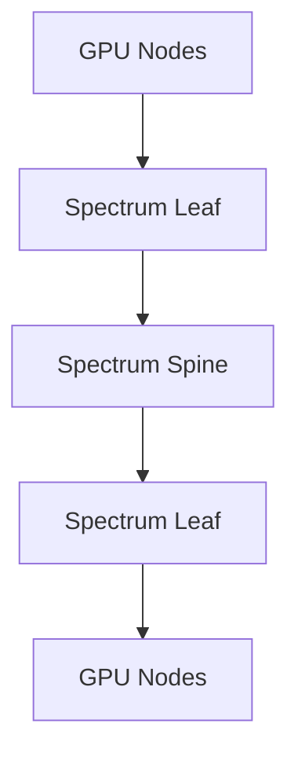

# Spectrum Switches for AI

A switch is not a passive connector. It determines forwarding scale, buffering behavior, telemetry, congestion marking, queue scheduling, breakout options, routing, and failure domains. NVIDIA Spectrum switches are commonly used with ConnectX adapters in Ethernet AI fabrics.

## Learning Objectives

Evaluate switch radix, port speed, buffer behavior, telemetry, routing, and software lifecycle for AI workloads.

## Architecture

## Selection Dimensions

| Dimension | Why it matters |
|---|---|
| Port speed and radix | Determines node density and topology |
| Breakout | Changes port count, cabling, and failure domains |
| Buffer and queue architecture | Influences PFC/ECN behavior |
| Routing features | Determines path diversity and scale |
| Telemetry | Enables queue and congestion diagnosis |
| NOS and automation | Determines operational integration |

A high aggregate switching capacity does not guarantee a nonblocking cluster. The topology and number of uplinks determine bisection bandwidth.

## Production Design

Standardize port profiles, MTU, QoS, ECN, PFC, routing, naming, and telemetry. Generate configuration from a source of truth. Validate cable and optic compatibility and keep spare media for the deployed speed.

Switch software upgrades can change queue behavior, routing, or telemetry. Stage upgrades, run pre/post benchmarks, and define rollback.

## Troubleshooting

**Symptoms:** one rack underperforms, ECN marks concentrate on one uplink, or a port negotiates below expected speed.

Inspect topology, route distribution, per-queue counters, cable state, breakout configuration, and endpoint mappings. Compare with a healthy leaf.

## Customer Perspective

The switch recommendation should include operations: automation, support, spares, telemetry integration, and staff capability. Silicon features that cannot be operated consistently do not deliver production value.

## Interview Preparation

**Question:** What is more important than switch port speed for AI fabrics?

The complete answer includes topology, radix, oversubscription, queue behavior, congestion controls, routing, telemetry, cabling, and operations.

## Key Takeaways

- Switch behavior shapes RDMA performance.
- Radix and topology determine usable fabric capacity.
- Queue telemetry is essential for congestion diagnosis.
- Software lifecycle and automation belong in the design.

## Cross References

- [DCB and QoS](./chapter-06-data-center-bridging-and-qos)
- [Next: ConnectX Ethernet](./chapter-08-connectx-ethernet-adapters)
